# Guía Maestra de Diagramas Corregidos - FinanceFlow

Este documento presenta la versión definitiva y corregida de los diagramas técnicos para el SRS y SAD de FinanceFlow. Cada sección incluye el código Mermaid optimizado, una descripción funcional y la lógica técnica aplicada para su construcción.

---

## S1 — ORGANIGRAMA ORGANIZACIONAL
**Descripción:** Representa la estructura de mando y ejecución de FinanceFlow Solutions S.A.C.
**Lógica aplicada:** Se eliminó el uso de subgraphs aislados que causaban errores de renderizado. Se utilizó una nota técnica conectada mediante una línea punteada (`-.-`) al nodo de Gerencia General para indicar que, aunque existen roles definidos, la ejecución recayó en un único desarrollador full-stack, manteniendo la integridad visual del flujo.

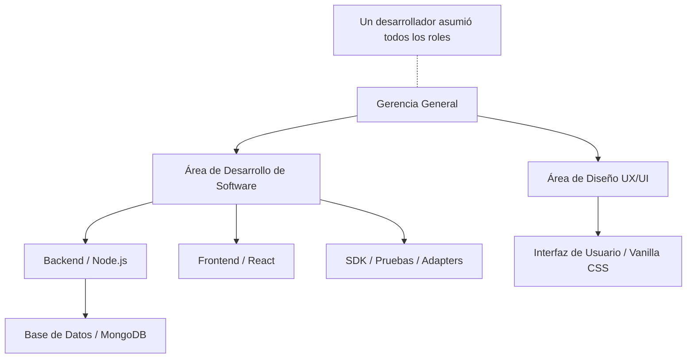

---

## S5 — DIAGRAMA DE CASOS DE USO (ESTÁNDAR UML)
**Descripción:** Mapea las funcionalidades del sistema (CU) frente a los actores externos.
**Lógica aplicada:** Se aplicó estrictamente la notación UML en Mermaid: actores en forma de estadio (`([ ])`) y casos de uso en elipses de doble paréntesis (`(( ))`). Se definió un límite de sistema (`subgraph Sistema`) para separar los procesos internos del sistema de los agentes externos, mejorando la semántica visual.

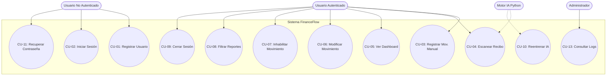

---

## S6 — SECUENCIA DE AUTENTICACIÓN (LOGIN)
**Descripción:** Detalla el flujo de mensajes y validaciones desde la UI hasta la base de datos.
**Lógica aplicada:** Se expandió el bloque `alt` (alternativa) para modelar con precisión las tres respuestas posibles del backend: error por usuario inexistente (404), error por contraseña incorrecta (401) y éxito con generación de JWT. Esto refleja la lógica real implementada en `usuarios.service.js`.

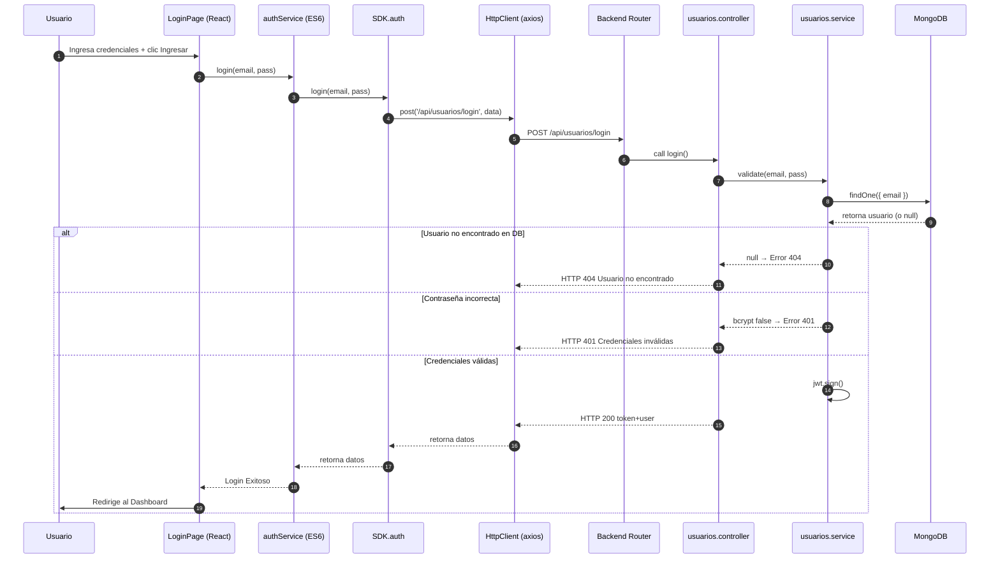

---

## S8 — DIAGRAMA DE CLASES (ESTRUCTURA DEL SDK)
**Descripción:** Define las entidades de datos y los módulos de la capa SDK.
**Lógica aplicada:** Se incluyeron declaraciones explícitas para `AuthModule`, `MovimientosModule` y `ReportesModule` con sus métodos principales. Esto permite que Mermaid renderice correctamente la relación de composición (`*--`), asegurando que todos los tipos referenciados estén definidos en el diagrama.

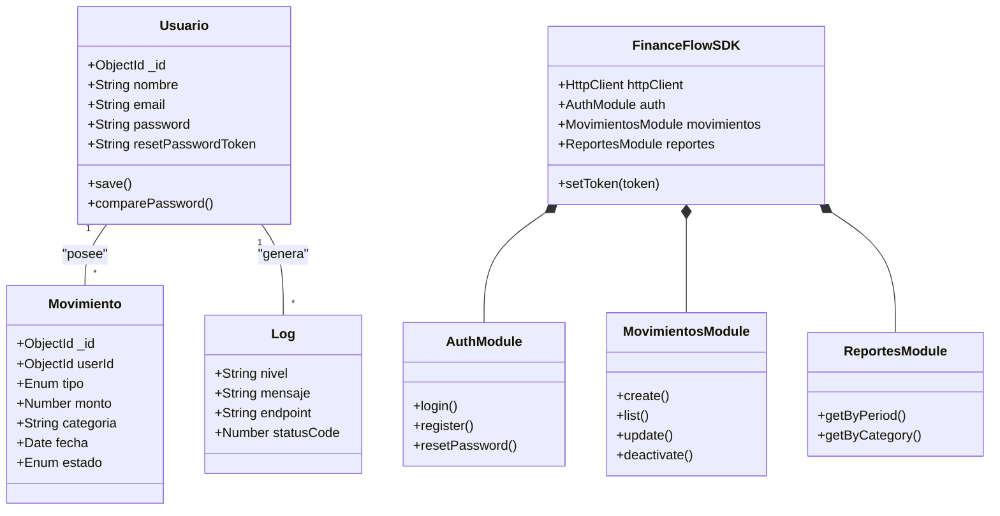

---

## S10 — SECUENCIA DE PROCESAMIENTO OCR
**Descripción:** Flujo de extracción de datos mediante IA y reentrenamiento asíncrono.
**Lógica aplicada:** Se corrigió la sintaxis del bloque `par` (paralelo) para modelar correctamente el "Silent Training". En esta arquitectura, el sistema guarda el movimiento en el hilo principal mientras dispara el reentrenamiento del modelo en segundo plano, optimizando el tiempo de respuesta al usuario.

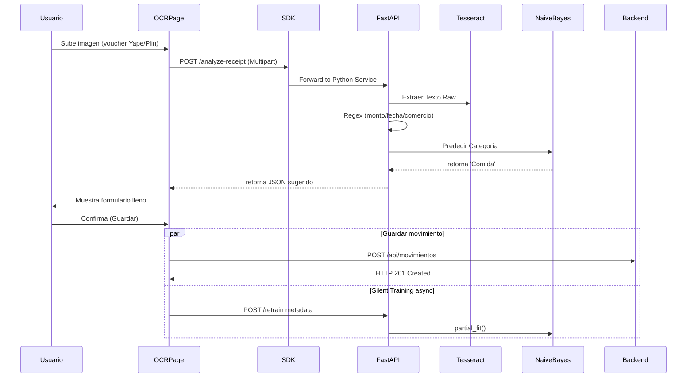

---

## S11 — SECUENCIA DEL DASHBOARD Y ALERTAS
**Descripción:** Proceso de carga de datos financieros y validación de umbrales de gasto.
**Lógica aplicada:** Se integró la lógica de negocio del "Umbral de Alerta". Tras calcular el balance, el sistema evalúa si el gasto supera el límite configurado por el usuario, disparando un evento visual específico en el dashboard, cumpliendo así con los requerimientos de usabilidad del SRS.

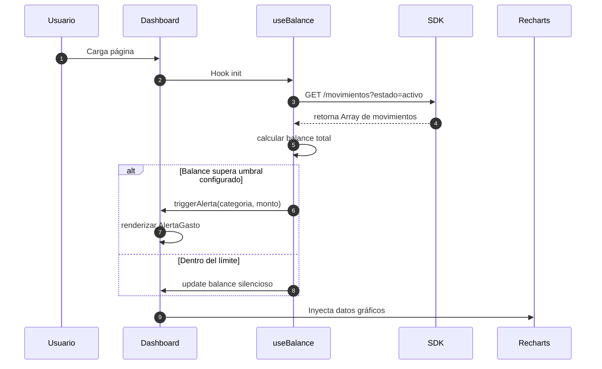

---

## S13 — DIAGRAMA DE OBJETOS (ESTADO EN RUNTIME)
**Descripción:** Representa una instantánea de datos concretos cargados en el sistema.
**Lógica aplicada:** Se utilizó la notación de instancia UML (`nombre:Clase`) mediante etiquetas personalizadas en las clases de Mermaid. Esto permite visualizar el estado real de la aplicación con IDs, montos y estados específicos, transformando un diagrama de clases genérico en uno de objetos de ejecución.

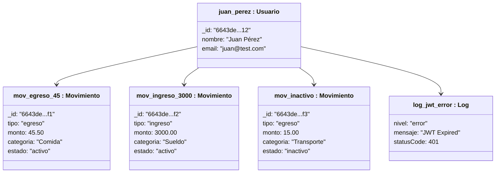

---

## S14 — DIAGRAMA ENTIDAD-RELACIÓN (ERD)
**Descripción:** Esquema físico de la base de datos MongoDB Atlas.
**Lógica aplicada:** Se sincronizaron los campos con el modelo real de Mongoose, añadiendo los tokens de recuperación de contraseña. Se corrigió la cardinalidad de la relación con `LOGS` a opcional (`|o--o{`), reconociendo que el sistema genera logs técnicos que no siempre están vinculados a un usuario autenticado.

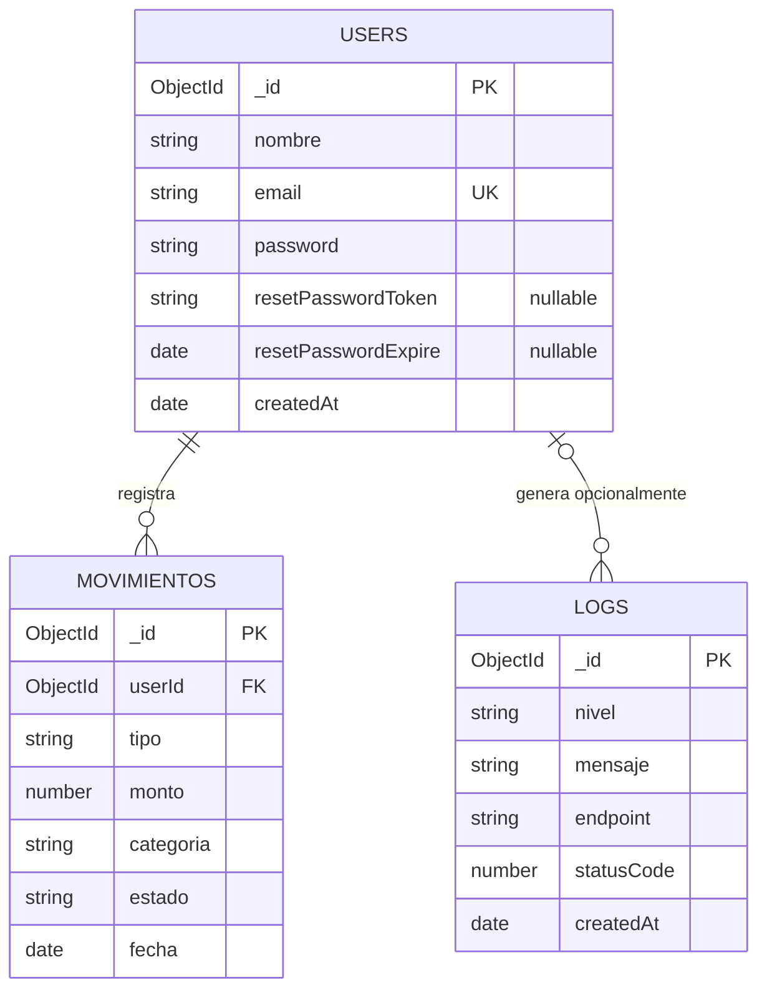

---

## S15 — DIAGRAMA DE COMPONENTES
**Descripción:** Organización lógica de los artefactos de software y sus interfaces.
**Lógica aplicada:** Se encapsuló el archivo de modelo serializado (`ModelPKL`) dentro del nodo de servicio de IA. Esto clarifica que el modelo es una dependencia de datos local del microservicio de Python, evitando nodos huérfanos y mejorando la jerarquía de la vista física.

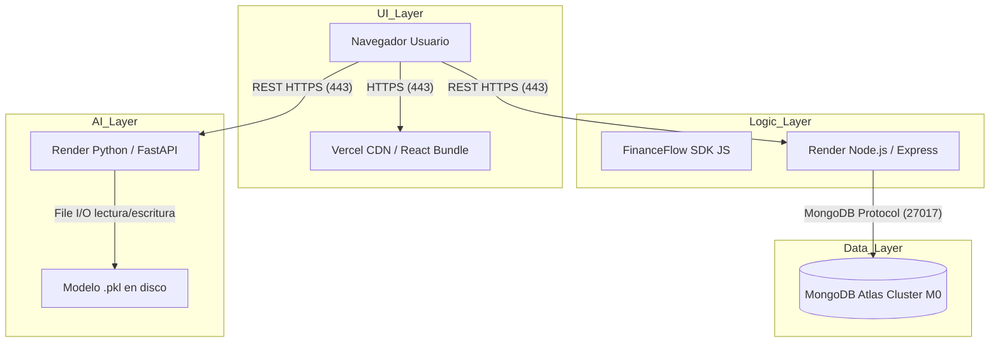

---

## S16 — DIAGRAMA DE ACTIVIDAD (OCR + TRAINING)
**Descripción:** Flujo de procesos desde la carga de imagen hasta la actualización del modelo.
**Lógica aplicada:** Se utilizó un nodo de bifurcación (`FORK`) y líneas punteadas (`-.->`) para modelar la asincronía. El hilo principal garantiza la respuesta al usuario, mientras que el proceso de reentrenamiento se ejecuta de forma no bloqueante, reflejando el diseño de alto rendimiento del sistema.

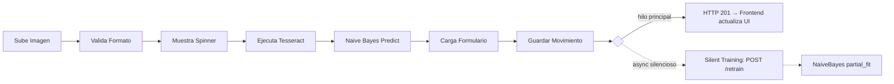

---

## S17 — DIAGRAMA DE DESPLIEGUE (INFRAESTRUCTURA)
**Descripción:** Distribución física de los servicios en proveedores cloud.
**Lógica aplicada:** Se enriquecieron los nodos con metadatos técnicos (stack, dominio, rol). Esto transforma un diagrama de red simple en una hoja de ruta de despliegue real, especificando qué artefacto (SPA, API, Microservicio) corre en cada nodo y bajo qué protocolo se comunican.

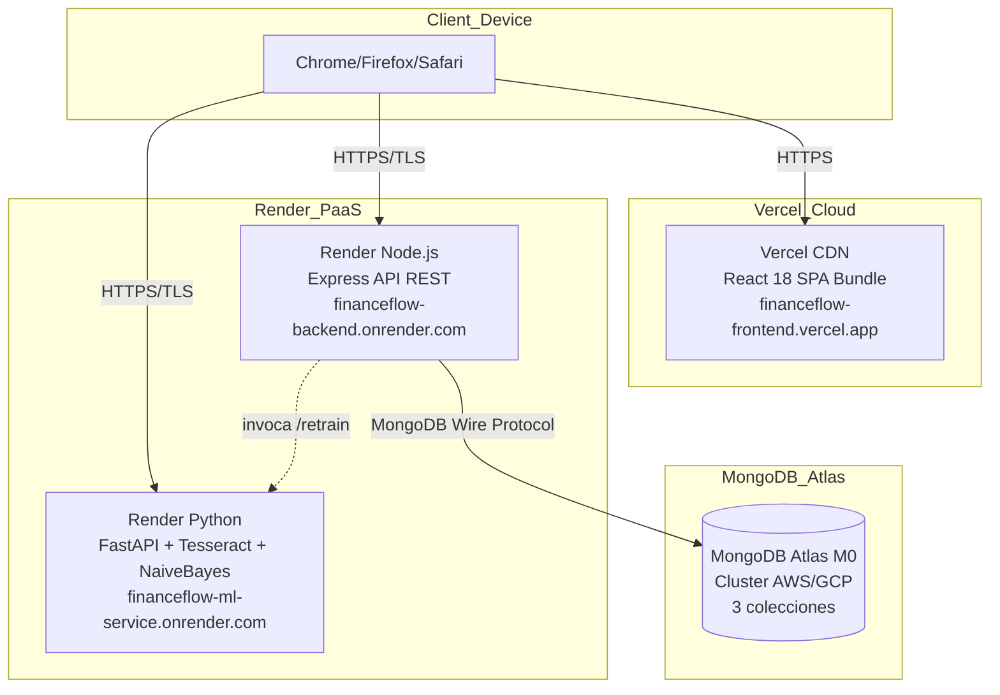
