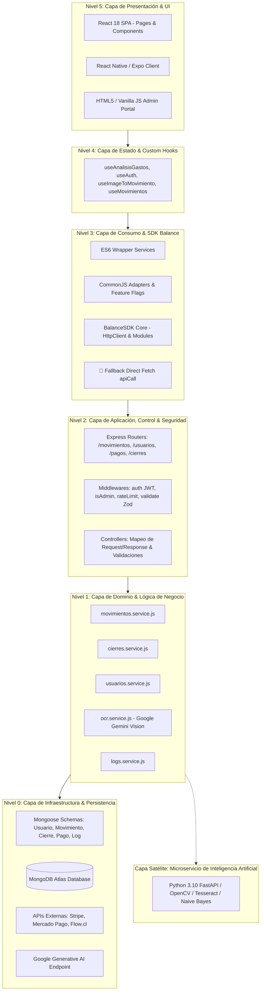

# INFORME TÉCNICO DEL ESTADO DE ABSTRACCIÓN DEL SISTEMA
## Análisis Arquitectónico, Capas de Dominio, Acoplamiento y Fugas de Abstracción en FinanceFlow

---

## 1. Introducción y Marco Conceptual de Abstracción

En la ingeniería de software, la **abstracción** es el principio fundamental que permite gestionar la complejidad técnica mediante la separación estricta entre **qué hace un componente (su interfaz o contrato público)** y **cómo lo hace (su implementación interna concreta)**. Un nivel de abstracción adecuado oculta los detalles de bajo nivel (como conexiones de red, consultas a bases de datos, APIs de terceros y formatos de serialización), permitiendo que los módulos de alto nivel expresen la lógica del negocio sin depender de las tecnologías subyacentes.

### 1.1. Principios de Evaluación Aplicados
El presente informe evalúa el estado actual del sistema **FinanceFlow (v1.3.0)** bajo los siguientes criterios de calidad de software:

1. **Principio de Ocultamiento de Información (*Information Hiding* - David Parnas):** Cada módulo debe ocultar una decisión de diseño difícil o propensa a cambiar tras una interfaz inmutable.
2. **Cohesión Funcional:** Cada abstracción (clase, módulo, servicio) debe desempeñar una única responsabilidad bien definida (Single Responsibility Principle).
3. **Acoplamiento Eferente y Aferente:** Minimizar las dependencias directas entre módulos para evitar que cambios en la infraestructura propaguen efectos colaterales en el dominio.
4. **Fuga de Abstracción (*Abstraction Leaks*):** Situaciones donde detalles de la implementación concreta (errores de base de datos, estructuras de red, APIs de bajo nivel) emergen o se hacen visibles a través de la interfaz pública, forzando a los consumidores a adaptarse a peculiaridades internas.

---

## 2. Mapa Jerárquico de Capas de Abstracción en FinanceFlow

El ecosistema de software de FinanceFlow está concebido como una arquitectura multicapa distribuida. A continuación se diagrama y describe formalmente la jerarquía de abstracciones, ordenada desde el nivel más cercano al usuario hasta la infraestructura física:



---

## 3. Descripción Detallada por Nivel de Abstracción

### Nivel 0: Infraestructura, Persistencia y Servicios Externos
* **Rol:** Encapsular la interacción con el almacenamiento físico y los proveedores de nube.
* **Componentes:**
  * Modelos de datos Mongoose (`usuario.model.js`, `movimiento.model.js`, `cierre.model.js`, `pago.model.js`, `log.model.js`).
  * Conexión singleton `connectDB` a MongoDB Atlas con pooling de conexiones.
  * APIs de pasarelas de pago externas (SDKs de Stripe, Mercado Pago y Flow).
  * API de visión artificial Google Gemini (`@google/generative-ai`).
* **Estado de Abstracción:** **Medio-Alto**. Los modelos Mongoose proporcionan una abstracción tipada de los documentos NoSQL, definiendo esquemas, índices y tipos de datos. Sin embargo, la lógica de índices no está completamente declarada dentro de los esquemas y recae en optimizaciones en tiempo de ejecución.

### Nivel 1: Capa de Dominio y Servicios de Negocio (Backend Core)
* **Rol:** Ejecutar las reglas contables, financieras y de seguridad de la organización de forma aislada del protocolo HTTP.
* **Componentes:**
  * `movimientos.service.js`: Reglas de creación de movimientos, cálculo de saldo neto, auto-generación de ingresos fijos recurrentes mensuales según el día de cobro, prevención de registros en fechas futuras y validación de periodos bloqueados.
  * `cierres.service.js`: Gestión de fondos fijos de caja chica, bloqueo definitivo de meses cerrados, reaperturas excepcionales autorizadas y lógica de auto-archivado M-2 (movimientos mayores a 60 días).
  * `usuarios.service.js`: Gestión del ciclo de vida de identidades, hashing de credenciales (bcrypt con 10 salt rounds), generación de tokens de recuperación y despacho de correos SMTP.
  * `ocr.service.js`: Interfaz de consumo de Gemini Vision con prompt engineering estructurado en formato JSON plano y circuito de tiempo límite defensivo (*timeout race condition* a 20 segundos).
* **Estado de Abstracción:** **Alto**. Los métodos de los servicios reciben parámetros tipados (o datos primitivos de Javascript) y retornan objetos puros de dominio o lanzan excepciones controladas (`throw new Error(...)`), cumpliendo con el principio de *"devolver valores, no imprimirlos ni manipular HTTP"*.

### Nivel 2: Capa de Aplicación, Control y Enrutamiento
* **Rol:** Mapear el protocolo de transporte (HTTP REST) hacia la capa de dominio, gestionar la autenticación, autorización y validación sintáctica.
* **Componentes:**
  * `Express Router`: Desacoplamiento de rutas públicas, protegidas (`auth.js`), y exclusivas de administradores (`isAdmin.js`).
  * `validate.js` con esquemas Zod (`auth.schema.js`, `movimiento.schema.js`): Validación declarativa de cuerpos de solicitud (`req.body`), parámetros (`req.params`) y queries (`req.query`).
  * Controladores (`movimientos.controller.js`, `usuarios.controller.js`, `cierres.controller.js`, `logs.controller.js`): Orquestación de peticiones, formateo de códigos de estado HTTP (200, 201, 400, 401, 403, 404, 500) y captura centralizada en `errorHandler.js`.
* **Estado de Abstracción:** **Muy Alto**. El controlador desconoce por completo la base de datos subyacente; únicamente consume servicios del Nivel 1 y serializa respuestas JSON.

### Nivel 3: Capa de Abstracción de Consumo y SDK Balance
* **Rol:** Desacoplar el cliente (Frontend / Mobile) de la arquitectura interna de la API REST mediante un cliente unificado que centraliza tokens, timeouts, cabeceras y métodos fuertemente tipados.
* **Componentes:**
  * `@sistema-balance/sdk`: Módulo autónomo en `/sdk` compuesto por `HttpClient` (envoltura de Axios) y módulos especializados: `auth`, `movimientos`, `usuarios` y `reportes`.
  * Capa de Adaptadores (`frontend/src/services/*-adapter.js`): Implementación del *Patrón Adaptador* que envuelve el SDK y proporciona conmutación por *Feature Flags* y fallbacks automáticos hacia la API tradicional.
  * Wrappers ES6 (`reportesService.js`, `movimientosService.js`): Fachada para consumo en componentes React.
* **Estado de Abstracción:** **Híbrido / En Transición (Alerta de Arquitectura)**. Aunque el SDK está 100% diseñado y validado con 66 tests paralelos, coexiste actualmente con un script de emergencia de fetch directo dentro de los servicios de frontend para evitar fallos de compilación en el bundler de React.

### Nivel 4: Capa de Estado de Cliente y Custom Hooks
* **Rol:** Abstraer el ciclo de vida de React (estados, efectos, suscripciones) y exponer datos reactivos a los componentes de la interfaz.
* **Componentes:**
  * `useAnalisisGastos.js`: Motor de cálculo analítico del lado del cliente. Realiza agrupaciones por categoría, cálculo de promedios históricos móviles para disparar alertas de exceso de gasto (1.2x y 1.5x) y cálculo dinámico de la tasa de ahorro.
  * `useAuth.js`: Gestión del estado global de autenticación, validación de expiración de token en cliente y escucha de eventos `onAuthChange`.
  * `useImageToMovimiento.js`: Orquestador de la carga de vouchers, conversión a Base64 y delegación al servicio OCR.
* **Estado de Abstracción:** **Alto**. Los componentes de la interfaz no realizan cálculos matemáticos de balance; consumen directamente el estado expuesto por estos hooks.

### Nivel 5: Capa de Presentación e Interfaces de Usuario
* **Rol:** Renderizado visual, interacción ergonómica y accesibilidad.
* **Componentes:**
  * Cliente Web SPA: React 18, React Router v7, Tailwind CSS, Recharts (17 páginas y 15 componentes modulares).
  * Cliente Móvil: React Native / Expo con diseño adaptativo oscuro/claro y componentes de navegación segura.
  * Admin Dashboard: Interfaz administrativa independiente basada en HTML5/CSS/JS con consumo de métricas consolidadas.
* **Estado de Abstracción:** **Muy Alto**. Las vistas están completamente desacopladas de las llamadas de red directas, consumiendo exclusivamente los servicios y hooks del Nivel 4 y Nivel 3.

---

## 4. Patrones de Diseño de Abstracción Implementados

| Patrón de Diseño | Componente Donde Aplica | Propósito Arquitectónico de la Abstracción | Nivel de Éxito |
| :--- | :--- | :--- | :---: |
| **Adapter Pattern (Adaptador)** | `frontend/src/services/*-adapter.js` | Traduce las llamadas de los servicios heredados de la aplicación React a la nueva interfaz del SDK Balance, permitiendo una migración granular mediante *Feature Flags* sin alterar la API que consumen los componentes de vista. | **90%** |
| **Facade Pattern (Fachada)** | `sdk/src/index.js` (`BalanceSDK`) | Proporciona una interfaz unificada y simplificada sobre subsistemas complejos (`HttpClient`, gestión de headers de autenticación, control de reintentos, manejo de errores y 4 módulos funcionales). | **100%** |
| **Strategy / Gateway Pattern** | `backend/routes/pagos.router.js` | Abstrae la heterogeneidad de las pasarelas de pago (Stripe con Checkout Sessions en USD, Mercado Pago con preferencias en PEN, Flow.cl con firmas HMAC y Yape manual), exponiendo contratos homogéneos de aprobación/rechazo al modelo de dominio `Pago`. | **95%** |
| **Pipeline Pattern (Tubería de Procesamiento)** | `ml_backend/main.py` y `ocr.service.js` | Pipeline de visión computacional y clasificación en etapas secuenciales: Carga $\rightarrow$ Binarización Otsu / Gaussian Blur $\rightarrow$ Extracción OCR $\rightarrow$ Regex Parser / LLM Structured Prompting $\rightarrow$ Inferencia Bayesiana de Categoría. | **90%** |
| **State & Soft Delete Pattern** | `backend/services/movimientos.service.js` | Abstrae la inmutabilidad y auditoría de transacciones financieras mediante máquinas de estado (`activo`, `inactivo`, `archivado_m2`), asegurando que las eliminaciones no destruyan trazabilidad contable. | **100%** |

---

## 5. Diagnóstico de Fugas de Abstracción (*Abstraction Leaks*) y Deuda Técnica

A pesar de la alta madurez del sistema, la inspección profunda del código fuente evidencia 5 fugas de abstracción y desacoples técnicos que deben ser subsanados:

### ⚠️ Fuga #1: La Dualidad de Consumo de Red en el Frontend (SDK vs Fallback Directo)
* **Evidencia en Código:**
  En `frontend/src/services/movimientosService.js` y `reportesService.js` se observa una cabecera que declara:
  ```javascript
  /**
   * 🚨 EMERGENCY FALLBACK - Movimientos Service
   * Servicio básico sin SDK para evitar crashes de la aplicación.
   * Usa fetch directo al backend.
   */
  const API_BASE_URL = process.env.REACT_APP_API_URL || window.location.origin;
  const apiCall = async (url, options = {}) => { ... fetch(`${API_BASE_URL}/api${url}`) ... };
  ```
* **Impacto en la Abstracción:**
  El paquete `@sistema-balance/sdk` y la capa de adaptadores (`movimientos-adapter.js`) fueron diseñados para centralizar y gobernar la comunicación con el backend. La existencia de este fallback con `fetch` crudo en los archivos que consume React genera una **fuga crítica de abstracción**: las llamadas de la UI no pasan por los interceptores, estadísticas ni reintentos configurados en el SDK, duplicando el código de consumo de red.
* **Causa Raíz:**
  Incompatibilidad durante la compilación en caliente entre módulos CommonJS (`require`) generados por el SDK y el entorno de empaquetado ES Modules (`import`) de Create React App / Webpack, lo que llevó a activar el fallback de emergencia.

### ⚠️ Fuga #2: Acoplamiento de Persistencia de Credenciales al Objeto `localStorage`
* **Evidencia en Código:**
  En múltiples archivos de servicio (`authService.js`, `movimientosService.js`, `userService.js`), se accede directamente a la API global del navegador:
  ```javascript
  const token = localStorage.getItem('token');
  ```
* **Impacto en la Abstracción:**
  Se viola el principio de inversión de dependencias y aislamiento de plataforma. Si la aplicación requiere migrar su almacenamiento a `sessionStorage`, `IndexedDB`, *HttpOnly Cookies* (para protección contra XSS) o si el código se ejecuta en React Native (`AsyncStorage`), el código falla o debe reescribirse en cada servicio.
* **Solución Arquitectónica:**
  Crear una abstracción `TokenStorageProvider` que exponga métodos `get()`, `set()`, `clear()`, inyectando la implementación de `localStorage` solo en la inicialización de la SPA Web.

### ⚠️ Fuga #3: Validación Duplicada Asimétrica (Zod vs Validación Imperativa)
* **Evidencia en Código:**
  * En `backend/schemas/movimiento.schema.js`: Se define el esquema Zod con validación de tipos, rangos positivos y strings no vacíos.
  * En `backend/services/movimientos.service.js`:
    ```javascript
    if (!data.nombre || typeof data.nombre !== 'string' || data.nombre.trim().length < 2) {
      throw new Error('El nombre es requerido y debe tener al menos 2 caracteres');
    }
    if (!data.monto || typeof data.monto !== 'number' || data.monto <= 0) { ... }
    ```
* **Impacto en la Abstracción:**
  La capa de dominio no confía plenamente en la capa de aplicación y duplica validaciones idénticas de forma imperativa. Si se modifican los criterios de aceptación (por ejemplo, permitir nombres de 1 carácter o montos con 4 decimales), el cambio debe replicarse manualmente en el esquema Zod y en el método del servicio.

### ⚠️ Fuga #4: Filtrado de Lógica Criptográfica en Servicios de Negocio (Violación DRY)
* **Evidencia en Código:**
  La comparación de contraseñas mediante `bcrypt.compare` se repite textualmente en tres ubicaciones independientes:
  * `backend/services/movimientos.service.js:196`
  * `backend/services/cierres.service.js:74`
  * `backend/services/cierres.service.js:217`
* **Impacto en la Abstracción:**
  El modelo `Usuario` filtra su lógica interna de cifrado hacia servicios que no deberían tener conocimiento de cómo se compara un hash de contraseña. Si se decidiera migrar a Argon2 o implementar políticas de reintentos de autenticación, la abstracción rota exigiría modificar múltiples servicios de negocio no relacionados con la gestión de usuarios.

### ⚠️ Fuga #5: Números Mágicos en Servicios de Auditoría y Límites Operativos
* **Evidencia en Código:**
  * `backend/services/cierres.service.js`: `(usuario.fondoFijo || 1000)` (Fondo fijo por defecto).
  * `backend/services/cierres.service.js`: `if (diferenciaMeses >= 2)` (Regla de dos meses M-2).
  * `backend/controllers/movimientos.controller.js`: `const LIMITE_FREE = 5;` (Límite de cuota OCR).
  * `backend/controllers/usuarios.controller.js`: `{ expiresIn: '7d' }` (Tiempo de vida del token JWT).
* **Impacto en la Abstracción:**
  Las reglas de negocio cuantitativas están dispersas en el código en lugar de estar abstraídas en un módulo de configuración de políticas financieras (`config/business.constants.js`).

---

## 6. Matriz de Madurez de Abstracción por Subsistema

A continuación se sintetiza la evaluación cuantitativa y cualitativa de cada componente del sistema:

| Subsistema / Módulo | Nivel de Abstracción | Cohesión Funcional | Acoplamiento | Fuga de Abstracción Detectada | Calificación (1-10) |
| :--- | :---: | :---: | :---: | :--- | :---: |
| **Backend: Capa de Controladores y Rutas** | Nivel 2 (Aplicación) | Alta (95%) | Bajo (Inyección de servicios) | Exposición ocasional de errores de Mongoose antes del middleware central. | **9.2 / 10** |
| **Backend: Capa de Servicios de Dominio** | Nivel 1 (Dominio) | Alta (90%) | Muy Bajo (Retorna objetos puros) | Validación imperativa duplicada con Zod; llamadas directas a `bcrypt.compare`. | **8.8 / 10** |
| **Backend: Persistencia NoSQL (Mongoose)** | Nivel 0 (Infraestructura) | Media-Alta (85%) | Medio (Esquemas acoplados a Mongoose) | Falta de abstracción Repository Pattern (los servicios llaman directamente a `Model.find()`). | **8.0 / 10** |
| **SDK Balance Core (`@sistema-balance/sdk`)** | Nivel 3 (Consumo) | Muy Alta (98%) | Muy Bajo (Aislado de React) | Ninguna en su núcleo; interfaz pura y testeada al 100%. | **9.8 / 10** |
| **Frontend: Capa de Adaptadores del SDK** | Nivel 3 (Consumo) | Media (70%) | Alto (Dependencia híbrida CommonJS/ES6) | Invocación omitida en producción por fallback directo `apiCall`. | **6.5 / 10** |
| **Frontend: Custom Hooks Reactivos** | Nivel 4 (Estado) | Alta (92%) | Bajo (Desacoplado de vistas) | Acoplamiento a `localStorage` dentro de los hooks. | **8.9 / 10** |
| **Frontend: Vistas y Componentes React** | Nivel 5 (Presentación) | Muy Alta (95%) | Muy Bajo (Solo consumen hooks y props) | Alguna manipulación de estado de modal de error a nivel local. | **9.4 / 10** |
| **Microservicio Python FastAPI (ML & OCR)** | Satélite (IA) | Alta (90%) | Muy Bajo (Comunica vía REST API) | Fallback de palabras clave quemado en código si el modelo `.pkl` no carga. | **8.5 / 10** |
| **Aplicación Móvil React Native** | Nivel 5 (Presentación) | Alta (88%) | Bajo (Servicio de API propio con token estático) | No consume aún el SDK Balance; implementa su propio cliente Axios. | **7.8 / 10** |

---

## 7. Estado de la Migración a la Arquitectura SDK Balance

La migración a la arquitectura orientada a SDK representó un hito estructural para desacoplar el frontend de la API REST. El estado formal de sus fases es el siguiente:

```
[FASE 1: Creación del SDK Base Autónomo]        --> ✅ COMPLETADA (100% Funcional, Axios HttpClient)
[FASE 2: Patrón Adaptador con Feature Flags]    --> ✅ COMPLETADA (4 Adaptadores con Fallback)
[FASE 3: Migración de Imports en Servicios]      --> ⚠️ PARCIAL (Wrappers creados, convive fallback directo)
[FASE 4: Testing Paralelo de Carga y Stress]     --> ✅ COMPLETADA (66/66 tests exitosos, 172ms latencia)
[FASE 5: Retiro de Código Legacy & Hardening]    --> ⏳ PENDIENTE (Objetivo técnico del Sprint 7)
```

### Análisis del Estado Híbrido:
El sistema se encuentra en un estado funcionalmente estable pero arquitectónicamente híbrido:
1. **La infraestructura del SDK existe y está validada:** El paquete `@sistema-balance/sdk` está completamente terminado en `/sdk` con suites de pruebas unitarias y de estrés.
2. **La capa de adaptadores está disponible:** Los archivos `*-adapter.js` en `frontend/src/services` pueden conectarse al SDK activando los Feature Flags en `adapter-config.js`.
3. **El bypass de emergencia sigue activo:** Para garantizar la disponibilidad continua en navegadores sin problemas de empaquetado CommonJS en el cliente React, los servicios `movimientosService.js` y `reportesService.js` operan mediante el wrapper de emergencia con `fetch` directo.

---

## 8. Recomendaciones y Hoja de Ruta para la Abstracción Definitiva

Para consolidar una arquitectura limpia (*Clean Architecture*) y eliminar las fugas de abstracción identificadas, se recomienda ejecutar el siguiente plan de acción técnico:

### 8.1. Corto Plazo (Sprint 7 — Hardening y Limpieza)
1. **Centralizar Constantes de Dominio:**
   Crear `backend/config/business.constants.js` y reemplazar todos los números mágicos (`1000`, `2`, `5`, `'7d'`) en controladores y servicios.
2. **Encapsular la Comparación de Contraseñas en el Modelo:**
   Agregar el método de instancia `usuarioSchema.methods.verificarPassword(passwordPlano)` en `backend/database/usuario.model.js` para cumplir con el principio DRY.
3. **Unificar el Consumo del SDK en el Frontend:**
   Configurar el empaquetador de React para compilar el SDK como módulo ES6 puro, eliminando el script `apiCall` de fallback de emergencia y consolidando el uso de `movimientos-adapter.js`.

### 8.2. Mediano Plazo (Evolución a Arquitectura Hexagonal)
1. **Implementar el Patrón Repositorio (*Repository Pattern*):**
   Interponer una interfaz de repositorio (`MovimientosRepository`, `UsuariosRepository`) entre los servicios de dominio y Mongoose. Esto permitirá sustituir MongoDB por cualquier motor relacional o en memoria para pruebas sin modificar una sola línea de la lógica de negocio.
2. **Abstraer el Almacenamiento de Tokens (`TokenStorage`):**
   Implementar una interfaz de almacenamiento en el frontend que desacople el código de `localStorage`, facilitando la transición hacia cookies seguras con atributo `HttpOnly`.
3. **Migración a Contratos Tipados (TypeScript / JSDoc Estricto):**
   Tipar los contratos del SDK y las interfaces de los servicios de backend para garantizar que cualquier cambio en la estructura de una entidad sea detectado en tiempo de compilación antes de llegar a producción.

---

*Informe técnico elaborado para auditoría y evaluación arquitectónica de software.*  
**FinanceFlow Engineering Team** — 17 de Septiembre de 2026.
