**FinanceFlow – Sistema de Gestión Financiera Personal**   |   Especificación de Requerimientos de Software


**UNIVERSIDAD PRIVADA DE TACNA**

**FACULTAD DE INGENIERÍA**

**Escuela Profesional de Ingeniería de Sistemas**


**FinanceFlow: Plataforma Web de Gestión Financiera e Inteligencia Artificial para el Control de Gastos Personales**

Curso: Construcción de Software I

Docente: Mag. Ricardo Eduardo Valcárcel Alvarado

|Integrantes:||
| :- | :- |
|***Sebastian Arce Bracamonte***|***(2019062886)***|
|||

|***Brant Antony Chata Choque***||
| :- | -: |

|<p></p><p></p>|***(2020067577)***|
| :- | -: |
|||
|||
|||


**Tacna – Perú**

***2026***

|CONTROL DE VERSIONES||||||
| :-: | :- | :- | :- | :- | :- |
|Versión|Hecha por|Revisada por|Aprobada por|Fecha|Motivo|
|1\.0|SAB|REVA|SAB, ACC|08/04/2026|Versión Original|
|2\.0|SAB BACC|REVA|SAB, BACC|08/05/2026||


<a name="_jmgzru3ao1c9"></a>***“FinanceFlow: Plataforma Web de Gestión Financiera e Inteligencia Artificial para el Control de Gastos Personales”***

**Documento de Especificación de Requerimientos de Software**

<a name="_uvkrbu4qhaj1"></a><a name="_2eutswngqghl"></a>**Versión 1.0**


**ÍNDICE GENERAL**

[**INTRODUCCIÓN	5**]()

[**I. Generalidades de la Empresa	6**]()

[**1. Nombre de la Empresa	6**]()

[**2. Visión	6**]()

[**3. Misión	6**]()

[**4. Organigrama	6**]()

[**II. Visionamiento de la Empresa	7**]()

[**1. Descripción del Problema	7**]()

**Situación Actual vs. Problemática	7**

[**2. Objetivos de Negocios	7**]()

[**3. Objetivos de Diseño	8**]()

[**Usabilidad	8**]()

[**Escalabilidad	8**]()

[**Rendimiento	8**]()

[**4. Alcance del Proyecto	8**]()

[**Qué incluye el sistema	8**]()

[**Qué NO incluye el sistema	8**]()

[**5. Viabilidad del Sistema	9**]()

[**Viabilidad Técnica	9**]()

[**Viabilidad Económica	9**]()

[**Viabilidad Operativa	9**]()

[**6. Información Obtenida del Levantamiento de Información	10**]()

[**III. Análisis de Procesos	11**]()

[**a) Diagrama del Proceso Actual – Diagrama de Actividades	11**]()

[**b) Diagrama del Proceso Propuesto – Diagrama de Actividades Inicial	12**]()

[**IV. Especificación de Requerimientos de Software	13**]()

[**a) Cuadro de Requerimientos Funcionales Inicial	13**]()

[**b) Cuadro de Requerimientos No Funcionales	14**]()

[**c) Cuadro de Requerimientos Funcionales Final	15**]()

[**d) Reglas de Negocio	17**]()

[**V. Fase de Desarrollo	19**]()

[**1. Perfiles de Usuario	19**]()

[**2. Modelo Conceptual	19**]()

[**a) Diagrama de Paquetes	19**]()

[**b) Diagrama de Casos de Uso	20**]()

[**c) Escenarios de Caso de Uso (Narrativa)	21**]()

[**3. Modelo Lógico	23**]()

[**a) Análisis de Objetos	23**]()

[**b) Diagrama de Actividades con Objetos	25**]()

[**c) Diagrama de Secuencia	26**]()

[**d) Diagrama de Clases	27**]()

[**CONCLUSIONES	30**]()

[**RECOMENDACIONES	31**]()

[**BIBLIOGRAFÍA	32**]()

[**WEBGRAFÍA	33**]()


# **INTRODUCCIÓN**
El presente documento constituye la Especificación de Requerimientos de Software (SRS) del sistema FinanceFlow, una solución web orientada a la gestión financiera personal. Su redacción sigue el estándar IEEE 830, pero privilegia una explicación clara y entendible para describir qué hace el sistema, para quién fue construido y cuáles son sus límites funcionales.

El propósito de esta especificación es dejar establecido, sin ambigüedades, el comportamiento esperado del sistema, sus reglas de negocio, sus restricciones y sus atributos de calidad. El documento sirve como base común para el cliente, el equipo de desarrollo y los evaluadores académicos, de modo que todos trabajen sobre la misma definición funcional de FinanceFlow.

FinanceFlow permite a los usuarios registrar ingresos y egresos, organizar sus movimientos por categoría, revisar su balance, analizar reportes y recibir apoyo mediante alertas e inteligencia artificial para el procesamiento de comprobantes. La plataforma incluye autenticación segura con JWT, paneles de visualización, recuperación de contraseña, perfil de usuario y una capa SDK que facilita la comunicación con el backend sin acoplar la interfaz a la implementación interna.


# **I. Generalidades de la Empresa**

## **1. Nombre de la Empresa**
FinanceFlow Solutions S.A.C. (Sociedad Anónima Cerrada), empresa de desarrollo de software con sede en la ciudad de Tacna, Perú. La organización es de carácter privado, orientada al diseño y comercialización de soluciones tecnológicas para la gestión de finanzas personales. Dado que el repositorio analizado no especifica una razón social establecida, esta denominación ha sido inferida de forma coherente con el nombre del proyecto y el perfil del autor (Sebastian Rodrigo Arce Bracamonte), quien actúa como desarrollador principal.


## **2. Visión**
*"Ser la plataforma de referencia en gestión financiera personal en Latinoamérica, empoderando a las personas para tomar decisiones económicas informadas mediante tecnología accesible, confiable e inteligente."*


## **3. Misión**
*"Desarrollar y mantener soluciones de software financiero de alta calidad que permitan a los usuarios registrar, analizar y optimizar su economía personal, mediante interfaces intuitivas, datos seguros y análisis inteligentes, contribuyendo al bienestar financiero de nuestra comunidad."*


## **4. Organigrama**
La estructura organizacional de FinanceFlow Solutions S.A.C. es la siguiente:


|**Gerencia General**|
| :-: |

│

|**Área de Desarrollo De Software**||**Área de Diseño UX/UI**|
| :-: | :- | :-: |

│

|Backend / Node.js/Express|FrontendReact / Tailwind|Base de Datos MongoDB|SDK / Pruebas Test / Adapters|
| :-: | :-: | :-: | :-: |


El proyecto fue desarrollado por un único desarrollador full-stack que asumió simultáneamente los roles de Gerente de Proyecto, Arquitecto de Software, Desarrollador Backend, Desarrollador Frontend y Tester, lo cual es coherente con el contexto académico del proyecto.


# **II. Visionamiento de la Empresa**

## **1. Descripción del Problema**
### **Situación Actual vs. Problemática**
La gestión de las finanzas personales representa uno de los mayores desafíos para la población adulta en general. En el contexto peruano y latinoamericano, la mayoría de las personas carece de herramientas formales que les permitan llevar un registro ordenado de sus ingresos y gastos. Las soluciones existentes suelen ser hojas de cálculo manuales (Microsoft Excel o Google Sheets), aplicaciones bancarias con funcionalidad limitada o cuadernos físicos de anotaciones, todos ellos con las siguientes limitaciones críticas:

- Falta de centralización: Los datos se encuentran dispersos en múltiples fuentes sin un punto único de consulta.
- Ausencia de análisis automatizado: No existen mecanismos automáticos para detectar patrones de gasto, generar alertas o proyectar el comportamiento financiero futuro.
- Dificultad para categorizar: La categorización manual de movimientos es tediosa y propensa a errores u omisiones.
- Sin planificación integrada: No existe una herramienta que vincule el registro histórico con la planificación de compras futuras.
- Inseguridad de los datos: El uso de hojas de cálculo locales conlleva riesgo de pérdida de información ante fallos del dispositivo.


FinanceFlow surge como respuesta directa a esta problemática, ofreciendo una plataforma web centralizada, segura y de fácil uso que automatiza el registro, la categorización y el análisis de los movimientos financieros personales.


## **2. Objetivos de Negocios**

|**OBJ-01**|Proveer una plataforma digital de gestión financiera personal accesible desde cualquier dispositivo con conexión a Internet.|
| :- | :- |
|**OBJ-02**|Aumentar la capacidad del usuario para identificar oportunidades de ahorro mediante análisis gráfico de sus patrones de gasto.|
|**OBJ-03**|Reducir el tiempo invertido en el registro manual de transacciones financieras mediante interfaces ágiles y formularios optimizados.|
|**OBJ-04**|Incrementar la seguridad en el almacenamiento de datos financieros del usuario mediante cifrado y autenticación robusta.|
|**OBJ-05**|Posicionar FinanceFlow como solución de referencia en el ecosistema de finanzas personales para el mercado peruano y latinoamericano.|
|**OBJ-06**|Establecer una arquitectura SDK que facilite futuras integraciones con servicios bancarios externos y plataformas de pagos.|


## **3. Objetivos de Diseño**
### **Usabilidad**
El sistema debe ser operable sin capacitación técnica previa. La interfaz, desarrollada con React 18 y Tailwind CSS, implementa principios de diseño responsivo que garantizan una experiencia óptima tanto en dispositivos de escritorio como en dispositivos móviles. Los formularios utilizan React Hook Form para validación inmediata y Zod para la definición de esquemas de datos, minimizando los errores de entrada del usuario.
### **Escalabilidad**
La arquitectura adoptada —backend RESTful desacoplado del frontend SPA, con una capa SDK intermedia— permite escalar horizontalmente cada componente de forma independiente. MongoDB, como base de datos NoSQL documental, facilita la adaptación del esquema de datos conforme el sistema evoluciona. El patrón adaptador implementado en la capa SDK permite incorporar nuevos servicios o proveedores de datos sin modificar el código del frontend.
### **Rendimiento**
Los resultados de prueba reportados en el repositorio (66 tests ejecutados con 0 fallos, tiempo promedio de 172ms por operación bajo condiciones de stress) demuestran que el sistema está diseñado para responder con latencia aceptable. El frontend, desplegado en Vercel con distribución CDN, garantiza tiempos de carga reducidos para los activos estáticos.


## **4. Alcance del Proyecto**
### **Qué incluye el sistema**
- Módulo de autenticación: Registro, inicio de sesión, recuperación de contraseña vía email, gestión de sesión con JWT.
- Módulo de movimientos: Creación, edición, inactivación y listado de ingresos y egresos con categorización.
- Dashboard interactivo: Resumen de balance, ingresos, egresos y movimientos recientes en tiempo real.
- Módulo de reportes: Visualizaciones gráficas con filtros por período y categoría.
- Planificador de compras: Proyección de gastos por mes con cálculos automáticos.
- Sistema de alertas: Notificaciones para control de umbrales de gasto.
- Gestión de perfil: Actualización de datos personales y configuración de seguridad.
- Capa SDK: Abstracción de servicios con patrón adaptador para desacoplamiento frontend-backend.
- Sistema de logging: Registro de errores y eventos del sistema para depuración y monitoreo.


### **Qué NO incluye el sistema**
- Integración directa con entidades bancarias o sistemas de pago en línea.
- Gestión de inversiones, portafolios bursátiles o criptomonedas.
- Aplicación móvil nativa (el directorio /mobile/ existe en el repositorio pero está en estado preliminar).
- Exportación de reportes a formatos PDF o Excel (mencionado en el Roadmap del README como funcionalidad futura).
- Notificaciones push en tiempo real (contemplado en el Roadmap).
- Modo multiusuario compartido o colaborativo.


## **5. Viabilidad del Sistema**
### **Viabilidad Técnica**
El stack tecnológico seleccionado —Node.js, Express, MongoDB, React 18 y Tailwind CSS— es maduro, ampliamente documentado y soportado por grandes comunidades open source. El despliegue en Vercel (frontend) y la compatibilidad con MongoDB Atlas (backend) evidencian que el sistema puede operar en infraestructura cloud de bajo costo o gratuita. La existencia de 66 pruebas automatizadas con Jest y un sistema de CI/CD implícito garantiza la mantenibilidad técnica del proyecto. La viabilidad técnica se clasifica como ALTA.
### **Viabilidad Económica**
El costo de desarrollo fue absorbido por el contexto académico. En términos de operación, el despliegue en Vercel (tier gratuito) y MongoDB Atlas (tier M0 gratuito) reduce los costos operativos a prácticamente cero en su fase inicial. La escalabilidad hacia tiers de pago es progresiva y proporcional al crecimiento de usuarios. La viabilidad económica se clasifica como ALTA para la fase inicial.
### **Viabilidad Operativa**
La interfaz responsiva y el flujo de usuario intuitivo hacen que el sistema sea operativo sin necesidad de capacitación técnica especializada. El sistema de recuperación de contraseña vía email y la gestión de sesión persistente mediante JWT reducen la fricción operativa. La arquitectura SDK con patrón adaptador y rollback automático garantiza la continuidad operativa ante fallos. La viabilidad operativa se clasifica como ALTA.


## **6. Información Obtenida del Levantamiento de Información**
A partir del análisis del repositorio GitHub, la documentación interna (README.md, PROYECTO\_COMPLETADO.md, DEPLOY BACKEND.md, DEPLOY\_FRONTEND.md, plan.md) y el sistema desplegado en producción, se identificaron los siguientes stakeholders y necesidades:


|**Usuario Final**|Persona natural que desea llevar control de sus ingresos y gastos. Necesita: registro ágil de movimientos, visualización clara del balance y alertas ante gastos excesivos.|
| :- | :- |
|**Desarrollador del Sistema**|Sebastian Rodrigo Arce Bracamonte. Necesita: arquitectura modular, SDK reutilizable, suite de pruebas automatizadas y documentación de despliegue.|
|**Evaluador Académico**|Docentes y jurados de la Universidad Privada de Tacna. Necesitan: documentación técnica completa, código estructurado y funcionalidades demostrables.|
|**Administrador del Sistema**|Rol técnico responsable del monitoreo y mantenimiento. Necesita: sistema de logs, dashboards de monitoreo y procedimientos de rollback documentados.|


# **III. Análisis de Procesos**

## **a) Diagrama del Proceso Actual – Diagrama de Actividades**
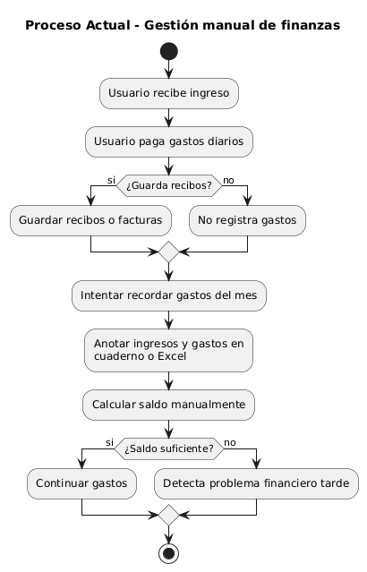

El proceso actual de gestión financiera personal, previo a la implementación de FinanceFlow, se desarrolla de forma manual y desorganizada. El diagrama de actividades del proceso actual se describe textualmente a continuación:

Las principales ineficiencias identificadas en el proceso actual son: pérdida de información por omisión de registros, errores de cálculo en la actualización manual del balance, imposibilidad de identificar tendencias de gasto de forma visual, ausencia de alertas preventivas y dispersión de datos en múltiples fuentes heterogéneas.


## **b) Diagrama del Proceso Propuesto – Diagrama de Actividades Inicial**
El proceso propuesto con FinanceFlow automatiza el registro, el cálculo y el análisis, centralizando toda la información en una plataforma segura. El diagrama de actividades del proceso propuesto se describe a continuación:

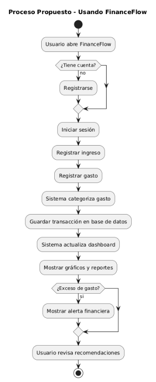
# **IV. Especificación de Requerimientos de Software**

## **a) Cuadro de Requerimientos Funcionales Inicial**
La siguiente tabla presenta los requerimientos funcionales identificados en la fase inicial de levantamiento de información, derivados del análisis del repositorio GitHub de FinanceFlow:


|**ID**|**Módulo**|**Descripción del Requerimiento**|**Prioridad**|
| :-: | :-: | :-: | :-: |
|RF-01|Vista de Ingresos|Pantalla principal para visualizar y registrar exclusivamente las entradas de dinero.|Alta|
|RF-02|Vista de Egresos|Pantalla transaccional para visualizar y asentar todos los gastos realizados.|Alta|
|RF-03|Vista de Reportes|Sección destinada a revisar la salud financiera e histórico de movimientos consolidados.|Media|
|RF-04|Campo Nombre|Entrada obligatoria de texto para identificar el concepto o comercio del gasto/ingreso.|Alta|
|RF-05|Campo Monto|Dato monetario fundamental para establecer el impacto del movimiento en el balance.|Alta|
|RF-06|Lista de registros|Despliegue en formato de tabla o lista de los últimos movimientos del usuario.|Alta|
|RF-07|Botón "Nuevo"|Atajo rápido para limpiar el formulario en pantalla y proceder con otro registro.|Baja|
|RF-08|Botón "Guardar"|Acción vital que envía el payload al servidor para asentar definitivamente el registro.|Alta|
|RF-09|Botón "Editar"|Capacidad de alterar datos ingresados por error en movimientos del pasado continuo.|Media|
|RF-10|Botón "Borrar"|Exclusión mediante "Borrado lógico" para ocultar errores sin alterar auditorías duras.|Media|
|RF-11|Estado "inactivo"|Representación visual diferenciada (gris) en UI indicando que una transacción fue anulada.|Baja|
|RF-12|Reporte Totales|Cálculo global que procesa todos los movimientos sumando ingresos y restando egresos.|Alta|
|RF-13|Filtro por fecha|Control en la interfaz para discriminar resultados analíticos a un mes o día específico.|Baja|
|RF-14|Cálculo automático|Función matemática silenciosa que re-evalúa en vivo el capital sin requerir recargar la app.|Alta|
|RF-15|Persistencia en BD|Conexión e inserción de datos hacia el Cloud de MongoDB (NoSQL) garantizando estado.|Alta|
|RF-16|Autenticación JWT|Blindaje del sistema, creación de cuentas y provisión de tokens para cada sesión humana.|Alta|
|RF-17|Procesamiento OCR|Lógica para aceptar fotos del usuario y enviarlas al analizador Tesseract de Python.|Media|
|RF-18|Sugerencias IA|Empleo de Scikit-Learn (Naive Bayes) para evitar trabajo manual deduciendo campos clave.|Media|
|RF-19|Feedback Loop IA|Comunicación en segundo plano del usuario hacia la IA para advertirle sobre sus fallos.|Baja|
|RF-20|Dashboard Analítico|Panel sofisticado provisto de representaciones visuales (React Recharts) del gasto general.|Media|


## **b) Cuadro de Requerimientos No Funcionales**


|**ID**|**Categoría**|**Descripción**|**Métrica**|**Prior.**|
| :-: | :-: | :-: | :-: | :-: |
|RNF-01|Seguridad|Las contraseñas de usuario deben ser almacenadas mediante hash irreversible con bcryptjs (mínimo 10 salt rounds).|Hash verification < 300ms|Alta|
|RNF-02|Seguridad|Todas las rutas protegidas deben requerir un JWT válido en el header Authorization. Los tokens expirados deben rechazarse con código HTTP 401.|100% rutas protegidas|Alta|
|RNF-03|Seguridad|El sistema debe implementar cabeceras HTTP de seguridad mediante Helmet.js (X-Frame-Options, X-XSS-Protection, Content-Security-Policy).|Helmet activado|Alta|
|RNF-04|Seguridad|La comunicación entre frontend y backend debe realizarse exclusivamente sobre HTTPS en entorno de producción.|TLS 1.2 o superior|Alta|
|RNF-05|Seguridad|Los tokens de recuperación de contraseña deben tener expiración de 1 hora y ser invalidados tras su uso.|Token TTL ≤ 3600s|Alta|
|RNF-06|Rendimiento|El tiempo de respuesta promedio de la API para operaciones CRUD de movimientos no debe superar los 300ms bajo condiciones normales de carga.|Latencia ≤ 300ms|Alta|
|RNF-07|Rendimiento|El sistema debe soportar al menos 100 solicitudes concurrentes sin degradación del tiempo de respuesta superior al 20%.|100 req/s concurrentes|Media|
|RNF-08|Rendimiento|El tiempo de carga inicial del frontend (First Contentful Paint) no debe superar los 3 segundos en conexiones de banda ancha estándar.|FCP ≤ 3s|Media|
|RNF-09|Usabilidad|La interfaz debe ser completamente responsiva, adaptándose correctamente a resoluciones desde 320px (móvil) hasta 2560px (pantalla ultra-wide).|Breakpoints Tailwind|Alta|
|RNF-10|Usabilidad|Los formularios deben mostrar mensajes de validación en tiempo real, sin requerir envío del formulario para detectar errores.|Validación inline|Alta|
|RNF-11|Usabilidad|El sistema debe ser operable sin conocimientos técnicos especializados, alcanzando una tasa de completitud de tareas primarias del 90% en usuarios sin capacitación.|90% task completion|Media|
|RNF-12|Escalabilidad|La arquitectura de base de datos MongoDB debe ser capaz de escalar horizontalmente mediante sharding sin modificaciones al código de la aplicación.|Sharding compatible|Media|
|RNF-13|Escalabilidad|La capa SDK debe permitir incorporar nuevos módulos de servicio sin modificar el código del frontend existente (principio Open/Closed).|OCP aplicado|Alta|
|RNF-14|Mantenibilidad|La cobertura de pruebas automatizadas (Jest) debe mantenerse en un mínimo del 70% de las líneas de código del backend.|Coverage ≥ 70%|Media|
|RNF-15|Disponibilidad|El sistema debe alcanzar una disponibilidad mínima del 99% mensual en entorno de producción (Vercel + MongoDB Atlas).|Uptime ≥ 99%|Alta|


## **c) Cuadro de Requerimientos Funcionales Final**
Los requerimientos funcionales finales incorporan las refinaciones realizadas tras el análisis arquitectónico del repositorio, consolidando y priorizando las funcionalidades según el estado real del sistema implementado:


|**ID**|**Módulo**|**Descripción del Requerimiento**|**Prioridad**|
| :-: | :-: | :-: | :-: |
|RF-01|Vista de Ingresos|Pantalla principal para visualizar y registrar exclusivamente las entradas de dinero.|Alta|
|RF-02|Vista de Egresos|Pantalla transaccional para visualizar y asentar todos los gastos realizados.|Alta|
|RF-03|Vista de Reportes|Sección destinada a revisar la salud financiera e histórico de movimientos consolidados.|Media|
|RF-04|Campo Nombre|Entrada obligatoria de texto para identificar el concepto o comercio del gasto/ingreso.|Alta|
|RF-05|Campo Monto|Dato monetario fundamental para establecer el impacto del movimiento en el balance.|Alta|
|RF-06|Lista de registros|Despliegue en formato de tabla o lista de los últimos movimientos del usuario.|Alta|
|RF-07|Botón "Nuevo"|Atajo rápido para limpiar el formulario en pantalla y proceder con otro registro.|Baja|
|RF-08|Botón "Guardar"|Acción vital que envía el payload al servidor para asentar definitivamente el registro.|Alta|
|RF-09|Botón "Editar"|Capacidad de alterar datos ingresados por error en movimientos del pasado continuo.|Media|
|RF-10|Botón "Borrar"|Exclusión mediante "Borrado lógico" para ocultar errores sin alterar auditorías duras.|Media|
|RF-11|Estado "inactivo"|Representación visual diferenciada (gris) en UI indicando que una transacción fue anulada.|Baja|
|RF-12|Reporte Totales|Cálculo global que procesa todos los movimientos sumando ingresos y restando egresos.|Alta|
|RF-13|Filtro por fecha|Control en la interfaz para discriminar resultados analíticos a un mes o día específico.|Baja|
|RF-14|Cálculo automático|Función matemática silenciosa que re-evalúa en vivo el capital sin requerir recargar la app.|Alta|
|RF-15|Persistencia en BD|Conexión e inserción de datos hacia el Cloud de MongoDB (NoSQL) garantizando estado.|Alta|
|RF-16|Autenticación JWT|Blindaje del sistema, creación de cuentas y provisión de tokens para cada sesión humana.|Alta|
|RF-17|Procesamiento OCR|Lógica para aceptar fotos del usuario y enviarlas al analizador Tesseract de Python.|Media|
|RF-18|Sugerencias IA|Empleo de Scikit-Learn (Naive Bayes) para evitar trabajo manual deduciendo campos clave.|Media|
|RF-19|Feedback Loop IA|Comunicación en segundo plano del usuario hacia la IA para advertirle sobre sus fallos.|Baja|
|RF-20|Dashboard Analítico|Panel sofisticado provisto de representaciones visuales (React Recharts) del gasto general.|Media|


## **d) Reglas de Negocio**


|**ID**|**Nombre**|**Descripción de la Regla**|
| :-: | :-: | :-: |
|RN-01|**Unicidad de Cuenta**|Cada dirección de correo electrónico puede estar asociada a una única cuenta de usuario en el sistema. El intento de registro con un email ya existente debe retornar un error HTTP 409 (Conflict).|
|RN-02|**Propiedad de Movimientos**|Un usuario solo puede visualizar, editar e inactivar los movimientos que le pertenecen. El sistema debe validar la propiedad (userId del token JWT == userId del movimiento) en cada operación de escritura.|
|RN-03|**Cálculo de Balance**|El balance total del usuario se calcula como la sumatoria de todos los movimientos activos de tipo 'ingreso' menos la sumatoria de todos los movimientos activos de tipo 'egreso'. Los movimientos inactivados no participan en el cálculo.|
|RN-04|**Montos Positivos**|El campo 'monto' de cualquier movimiento debe ser un número decimal positivo mayor que cero. El tipo del movimiento (ingreso/egreso) determina el impacto en el balance, no el signo del monto.|
|RN-05|**Inactivación Lógica**|Los movimientos no pueden ser eliminados físicamente de la base de datos. La operación de borrado lógico cambia el campo 'estado' a 'inactivo', preservando el historial completo de transacciones.|
|RN-06|**Expiración de Token JWT**|El token JWT tiene un tiempo de vida definido por la variable de entorno JWT\_EXPIRATION. Un token expirado debe rechazarse en cualquier endpoint protegido, forzando al usuario a iniciar sesión nuevamente.|
|RN-07|**Token de Recuperación**|El token de recuperación de contraseña generado con crypto es de un solo uso. Una vez utilizado para restablecer la contraseña, el token debe invalidarse inmediatamente en la base de datos.|
|RN-08|**Categorías de Movimiento**|Los movimientos deben clasificarse obligatoriamente en una categoría predefinida. El sistema no debe aceptar categorías arbitrarias para garantizar la integridad de los reportes y filtros estadísticos.|
|RN-09|**Validación de Fecha**|La fecha de un movimiento no puede ser posterior a la fecha actual del sistema en más de 24 horas, para prevenir el registro de transacciones futuras no realizadas.|
|RN-10|**Integridad del SDK**|El SDK debe validar la presencia de un token de autenticación antes de realizar cualquier llamada a endpoints protegidos. Si no existe token, el SDK debe retornar un error de autenticación sin realizar la petición HTTP.|
|RN-11|**Feature Flags del Adaptador**|El sistema de feature flags del adaptador SDK permite activar o desactivar la migración de cada servicio de forma independiente. Por defecto, el adaptador utiliza el servicio original como fallback si el SDK no está disponible.|
|RN-12|**Logging de Errores**|Todo error no controlado capturado por el errorHandler middleware debe ser registrado en el sistema de logs con: timestamp, stack trace, endpoint afectado, método HTTP y código de estado de respuesta.|


# **V. Fase de Desarrollo**

## **1. Perfiles de Usuario**


|**Perfil**|**Responsabilidades**|**Permisos del Sistema**|
| :-: | :-: | :-: |
|**Usuario Final**|Persona natural que utiliza FinanceFlow para gestionar sus finanzas personales. Registra ingresos y egresos, consulta reportes y utiliza el planificador de compras.|Acceso completo a: Dashboard, Movimientos (CRUD propio), Reportes, Alertas, Planificador de Compras, Perfil de usuario. Sin acceso a logs del sistema ni configuración global.|
|**Administrador del Sistema**|Rol técnico responsable del monitoreo, mantenimiento y resolución de incidencias del sistema. Accede a los logs para diagnóstico de errores.|Acceso a: Endpoint GET /api/logs para consulta de eventos y errores. Acceso a la configuración del servidor y base de datos a nivel de infraestructura. Puede gestionar cualquier cuenta de usuario a nivel de base de datos directamente.|
|**Desarrollador**|Perfil técnico que mantiene y extiende el sistema. Interactúa con el SDK, los adaptadores y las pruebas automatizadas.|Acceso completo al código fuente, configuración del SDK, feature flags de adaptadores, dashboards de monitoreo y reportes de testing (testing-dashboard.html).|


## **2. Modelo Conceptual**

### **a) Diagrama de Paquetes**
El sistema FinanceFlow se organiza en los siguientes paquetes modulares, tal como se evidencia en la estructura de directorios del repositorio:

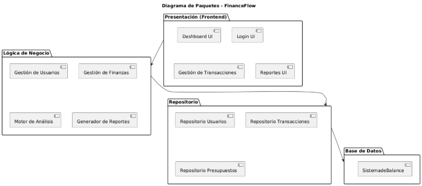


Las dependencias entre paquetes son: frontend → sdk → backend → database. El paquete sdk actúa como intermediario, implementando el patrón de adaptador que permite la migración gradual de los servicios del frontend hacia la nueva arquitectura SDK sin interrumpir la operación del sistema.


### **b) Diagrama de Casos de Uso**
El sistema FinanceFlow identifica los siguientes actores y casos de uso principales:

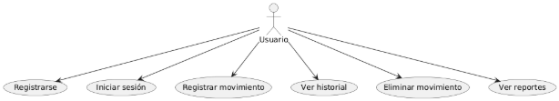


**Casos de Uso del Sistema FinanceFlow:**

|**ID**|**Nombre del Caso de Uso**|**Actor(es)**|**Descripción Corta**|
| :- | :- | :- | :- |
|CU-01|Registrar Usuario (Sign Up)|Usuario No Registrado|Permite crear una cuenta nueva de forma segura y validada.| 
|CU-02|Iniciar Sesión (Login JWT)|Usuario Registrado|Permite acceder al sistema de forma segura validando correo y contraseña.| 
|CU-03|Registrar Movimiento Manual|Usuario Autenticado|Permite guardar de manera manual un ingreso o egreso con sus datos principales.| 
|CU-04|Escanear Recibo (Motor IA)|Usuario Autenticado, Motor Python|Permite extraer datos de un comprobante y sugerir la categoría mediante OCR e IA.| 
|CU-05|Visualizar Dashboard Analítico|Usuario Autenticado|Muestra el balance general, los totales y los gráficos principales de la cuenta.| 
|CU-06|Inhabilitar Movimiento (Delete)|Usuario Autenticado|Permite desactivar un movimiento sin eliminar su historial de manera física.| 
|CU-07|Filtrar y Analizar Reportes|Usuario Autenticado|Permite revisar el historial financiero por fechas o categorías específicas.| 
|CU-08|Reentrenar Clasificador IA|Sistema Frontend, Motor Python|(Automático) Mejora el modelo con correcciones confirmadas por el usuario.| 
|CU-09|Cerrar Sesión (Logout)|Usuario Autenticado|Permite salir de la cuenta y proteger la sesión del dispositivo.| 
|CU-10|Recuperar/Restablecer Contraseña|Usuario No Autenticado|Permite recuperar el acceso cuando el usuario olvida su contraseña.| 
|CU-11|Consultar/Editar Perfil|Usuario Autenticado|Permite revisar y actualizar los datos básicos de la cuenta.| 
|CU-12|Visualizar Auditoría (Logs)|Administrador|Permite consultar eventos técnicos para soporte y auditoría.| 


### **c) Escenarios de Caso de Uso (Narrativa)**
A continuación se describen los escenarios principales para los casos de uso de mayor prioridad. Las versiones mejoradas de los diagramas asociados se encuentran en la carpeta diagramas/ dentro de este mismo directorio.
### <a name="_lj8rfghsl4l1"></a>**CU-01: Registrar Usuario (Sign Up)**
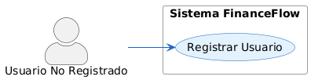

|**Campo**|**Detalle**|
| :- | :- |
|**Identificador**|CU-01|
|**Nombre**|Registrar Usuario (Sign Up)|
|**Actor Principal**|Usuario No Registrado|
|**Descripción Breve**|Permite a una persona nueva crear una cuenta segura en la plataforma con validaciones de datos y encriptación de contraseña.|
|**Precondición**|1. El usuario accede a la plataforma FinanceFlow sin estar autenticado.<br>2. El usuario tiene acceso a la pantalla de registro (/register).<br>3. El usuario dispone de conexión a internet activa.<br>4. El navegador soporta JavaScript y almacenamiento local.|
|**Postcondición**|1. El sistema crea una cuenta vinculada a un correo único en la BD MongoDB.<br>2. La contraseña se almacena de forma encriptada (hashed con bcryptjs, algoritmo bcrypt).<br>3. El usuario recibe un token JWT en la respuesta (que será utilizado en Login).<br>4. El sistema redirige automáticamente al usuario a la pantalla de Iniciar Sesión.|
|**Actores**|**Usuario No Registrado** — Persona que desea crear una nueva cuenta en el sistema.|
|**Reglas de Negocio Asociadas**|RN-01: El correo debe ser único en el sistema (no puede haber dos usuarios con el mismo email).<br>RN-06: La contraseña debe ser almacenada en forma de hash bcrypt, nunca en texto plano.<br>RNF-01: El registro debe completarse en menos de 3 segundos.|

---

## **Flujo Principal: Registro Exitoso**

|**Paso**|**ACTOR**|**SISTEMA**|**Componentes Implicados**|
| :- | :- | :- | :- |
|**1. Acceso a la pantalla de registro**|El usuario abre navegador y escribe la URL de FinanceFlow o hace clic en "No tengo cuenta" desde Login||**Frontend:** App.jsx → React Router redirige a /register<br>**Componente:** RegisterPage.jsx carga|
|**2. Visualización del formulario**||El sistema renderiza la página de registro con los campos: Nombre, Email, Contraseña y botón "Registrarse"|**Frontend:** RegisterPage.jsx renderiza formulario usando React Hook Form|
|**3. Usuario completa el formulario**|Usuario ingresa:<br>- Nombre: "Juan Pérez"<br>- Email: "juan@example.com"<br>- Contraseña: "Segura123"||**Frontend:** Los campos usan validación inline en tiempo real|
|**4. Validaciones en tiempo real (Frontend)**||Mientras el usuario escribe, el sistema valida:<br>- Nombre: longitud ≥ 2 caracteres<br>- Email: formato válido (regex RFC 5322)<br>- Contraseña: longitud ≥ 6 caracteres<br>Los errores aparecen inmediatamente debajo del campo.|**Frontend:** React Hook Form + Zod schema<br>**Librería:** @hookform/resolvers/zod|
|**5. Usuario presiona "Registrarse"**|Usuario hace clic en botón "Registrarse"||**Frontend:** Evento onClick del botón dispara handleSubmit(onSubmit)|
|**6. Validación final en Frontend**||El sistema valida nuevamente todos los campos antes de enviar (prevención de inyección de datos inválidos).|**Frontend:** Zod schema revalida todos los datos|
|**7. Envío de solicitud POST al Backend**||El sistema envía HTTP POST a `/api/auth/register` con JSON: `{ nombre, email, password }`|**Frontend:** authService.js → fetch/axios<br>**Backend Endpoint:** POST /api/auth/register|
|**8. Recepción en Backend (Express Router)**||Express Router recibe la solicitud y la enruta a `usuarios.controller.js`|**Backend:** routes/usuarios.js|
|**9. Controlador de Usuarios**||El controlador extrae los datos del request body (nombre, email, password)|**Backend:** usuarios.controller.js → función register()|
|**10. Servicio de Usuarios valida datos**||El servicio `usuariosService.register()` ejecuta validaciones backend:<br>- Valida que nombre tenga ≥ 2 caracteres y sea string<br>- Valida que email sea formato válido (regex)<br>- Valida que password tenga ≥ 6 caracteres<br>Si alguna validación falla, lanza excepción.|**Backend:** usuarios.service.js → función register()<br>**Validación:** Regex RFC 5322 para email, validación de tipo de dato|
|**11. Consulta a BD para verificar email único**||El servicio consulta la colección `usuarios` en MongoDB: `Usuario.findOne({ email })`<br>Si retorna un documento, el email ya existe (excepción).|**Backend:** usuarios.service.js<br>**BD:** MongoDB collection "usuarios"<br>**Query:** findOne({ email: email })|
|**12. Hash de la contraseña**||Si el email es único, el sistema encripta la contraseña:<br>- Usa bcryptjs con factor de rondas = 10<br>- Genera: `passwordHash = bcrypt.hash(password, 10)`<br>Resultado: contraseña irreversible, única por usuario|**Backend:** usuarios.service.js<br>**Librería:** bcryptjs v2.4.3<br>**Algoritmo:** bcrypt (Blowfish)|
|**13. Creación del documento Usuario**||El sistema crea un nuevo documento Mongoose con campos:<br>- nombre: "Juan Pérez"<br>- email: "juan@example.com" (en minúsculas)<br>- passwordHash: hash generado<br>- creadoEn: timestamp actual<br>- actualizadoEn: timestamp actual<br>- estado: "activo"|**Backend:** usuarios.service.js<br>**Modelo:** Usuario (Mongoose schema)<br>**BD:** MongoDB|
|**14. Inserción en MongoDB**||El documento se guarda en la colección `usuarios` de MongoDB Atlas:<br>- Se asigna automáticamente un _id (ObjectId)<br>- Se registra la fecha de creación<br>- El documento es inmediatamente consultable|**Backend:** usuario.model.js → usuario.save()<br>**BD:** MongoDB Atlas collection usuarios|
|**15. Respuesta exitosa del Backend**||El sistema retorna HTTP 201 Created con JSON:<br>`{ id, nombre, email, estado, creadoEn }`<br>Nota: passwordHash NO se retorna por seguridad|**Backend:** usuarios.controller.js<br>**HTTP Status:** 201 Created<br>**Content-Type:** application/json|
|**16. Manejo de respuesta en Frontend**||El servicio authService.js recibe la respuesta y ejecuta:<br>1. Muestra mensaje de éxito: "Registro exitoso. Ahora puedes iniciar sesión."<br>2. Limpia el formulario<br>3. Programa redirección a /login en 2 segundos|**Frontend:** RegisterPage.jsx state: setSuccess()<br>**Librería:** useNavigate() de React Router|
|**17. Redirección a Login**||El sistema redirige automáticamente al usuario a la pantalla de Inicio de Sesión (/login)|**Frontend:** React Router navegación<br>**Ruta destino:** /login|
|**18. Usuario ve formulario de Login**||El usuario ahora puede ingresar sus credenciales para acceder al sistema|**Frontend:** LoginPage.jsx|

---

## **Excepciones y Casos de Error**

### **Excepción 1: Correo Electrónico Duplicado**

|**Paso**|**ACTOR**|**SISTEMA**|**Detalles Técnicos**|
| :- | :- | :- | :- |
|**1. Usuario intenta registrarse**|Usuario ingresa email que ya existe: "juan@example.com" (ya registrado de un intento anterior)||Mismo flujo que pasos 1-10|
|**2. Validación en Backend: Email duplicado**||El servicio consulta MongoDB: `Usuario.findOne({ email: "juan@example.com" })`<br>Retorna: `{ _id: ..., nombre: "Juan", email: "juan@example.com", ... }`<br>El sistema detecta que el documento existe.|**Backend:** usuarios.service.js, línea 19<br>**Query:** findOne({ email })<br>**Condición:** existente !== null|
|**3. Lanzamiento de excepción**||El servicio lanza: `throw new Error('El email ya está registrado')`|**Backend:** throw statement<br>**Código HTTP esperado:** 409 Conflict|
|**4. Captura en Controlador**||El controlador catch captura la excepción y retorna HTTP 400 Bad Request|**Backend:** usuarios.controller.js, catch block<br>**Respuesta:** `{ message: "El email ya está registrado" }`|
|**5. Manejo en Frontend**||El frontend recibe HTTP 400 y extrae el mensaje de error.|**Frontend:** authService.js, catch block|
|**6. Visualización de error**||Se muestra alerta roja bajo los campos:<br>"El correo ya está en uso. Usa otro correo o inicia sesión."<br>El formulario NO se limpia (el usuario puede corregir el email)|**Frontend:** RegisterPage.jsx<br>**State:** setError(err.message)<br>**Estilo:** animate-pulse, color red-500|
|**7. Usuario corrige el email**|Usuario borra el email anterior e ingresa uno nuevo: "juan.perez@example.com"||**Frontend:** Campo email se limpia y revalida|
|**8. Reintentar registro**|Usuario hace clic nuevamente en "Registrarse"||Flujo principal retoma desde paso 5|

### **Excepción 2: Nombre Muy Corto**

|**Paso**|**ACTOR**|**SISTEMA**|**Detalles**|
| :- | :- | :- | :- |
|**Validación Frontend**|Usuario intenta ingresar nombre "A" o vacío|El sistema muestra error inline: "Nombre muy corto" (antes de enviar)|**Zod schema:** `z.string().min(2, { message: 'Nombre muy corto' })`|
|**Bloqueo de envío**||El botón "Registrarse" permanece desactivado (disabled=true)|**Frontend:** Condición: !formState.isValid|
|**Usuario corrige**|Usuario ingresa nombre válido: "Juan Pérez"||Campo vuelve a estado válido|

### **Excepción 3: Contraseña Muy Corta**

|**Paso**|**ACTOR**|**SISTEMA**|**Detalles**|
| :- | :- | :- | :- |
|**Validación Frontend (Inline)**|Usuario ingresa: "123" (3 caracteres)|Error inmediato: "Mínimo 6 caracteres"|**Frontend:** React Hook Form, Zod schema|
|**Validación Backend (como seguridad redundante)**|Aunque es raro que llegue aquí, si ocurre|Retorna HTTP 400: "La contraseña debe tener al menos 6 caracteres"|**Backend:** usuarios.service.js, línea 13|

### **Excepción 4: Email Inválido**

|**Paso**|**ACTOR**|**SISTEMA**|**Detalles**|
| :- | :- | :- | :- |
|**Validación Frontend**|Usuario intenta: "juanaexample" (sin @)|Error inline: "Email inválido"|**Frontend:** Zod schema email validator|
|**Validación Backend**|Si llegara aquí, retorna HTTP 400|Mensaje: "Email inválido"|**Backend:** Regex RFC 5322|

### **Excepción 5: Error de Conectividad / Timeout**

|**Paso**|**ACTOR**|**SISTEMA**|**Detalles**|
| :- | :- | :- | :- |
|**Envío de solicitud**|Usuario hace clic "Registrarse" y se pierde conexión a internet||HTTP request falla|
|**Timeout o Network Error**||El frontend captura el error: `fetch error` o `axios error`|**Frontend:** authService.js, catch block|
|**Visualización de error**||Se muestra: "Error de conexión. Verifica tu internet e intenta de nuevo."|**Frontend:** setError(error.message)|
|**Usuario reintenta**|Usuario verifica conexión y hace clic nuevamente||El formulario mantiene los datos ingresados (localStorage puede persistir)|

### **Excepción 6: Error en Base de Datos (MongoDB caída)**

|**Paso**|**ACTOR**|**SISTEMA**|**Detalles**|
| :- | :- | :- | :- |
|**Intento de guardar**||El backend intenta `usuario.save()` pero MongoDB no está disponible|**Backend:** MongoDB connection error|
|**Error capturado**||Mongoose lanza error de conexión, el catch en usuarios.controller.js lo captura|**Backend:** try/catch, HTTP 500 Internal Server Error|
|**Respuesta al Frontend**||HTTP 500 con mensaje: "Error del servidor. Intenta de nuevo más tarde."|**Frontend:** DisplayS mensaje genérico por seguridad|
|**Usuario informado**||Alerta roja: "No pudimos crear tu cuenta. Por favor intenta en unos momentos."|**Frontend:** UX amigable|

---

## **Resumen de Flujos de Datos**

### **Flujo de Datos: Registro Exitoso**
```
RegisterPage.jsx (React)
    ↓
react-hook-form + Zod (validación frontend)
    ↓
authService.register(nombre, email, password)
    ↓
fetch/axios: POST /api/auth/register
    ↓
usuarios.controller.register() (Express)
    ↓
usuarios.service.register() (validaciones backend)
    ↓
MongoDB.findOne({ email }) [Consulta]
    ↓
bcryptjs.hash(password, 10) [Encriptación]
    ↓
Usuario.create() [Inserción]
    ↓
MongoDB [Persistencia]
    ↓
HTTP 201 + Usuario (sin passwordHash)
    ↓
authService: procesa respuesta
    ↓
RegisterPage: setSuccess() → navigate("/login")
    ↓
LoginPage.jsx
```

### **Impacto en cada Capa del Sistema**

| Capa | Operación | Estado Anterior | Estado Posterior |
| --- | --- | --- | --- |
| **Frontend (UI)** | Usuario completa formulario | Pantalla vacía | Formulario lleno con validaciones |
| **Frontend (State)** | React almacena en useState | Form vacío | Form con datos ingresados |
| **Red** | HTTP POST | Sin solicitud | POST /api/auth/register enviado |
| **Backend (Express)** | Router recibe solicitud | Sin procesar | Ruta manejada, controlador ejecutado |
| **Backend (Service)** | Validaciones y lógica | Sin validar | Datos validados, email consultado |
| **Base de Datos (MongoDB)** | Consulta → Inserción | Colección sin usuario | Nuevo documento usuario insertado |
| **Almacenamiento (Contraseña)** | Hash bcrypt | Contraseña en texto | Hash irreversible almacenado |
| **Frontend (UI Respuesta)** | Mensaje y redirección | Form visible | "Éxito" → redirige a Login |
### <a name="_35oz40x5yo6w"></a>**CU-02: Iniciar Sesión (Login JWT)**


|**Campo**|**Detalle**|
| :- | :- |
|**Identificador**|CU-02|
|**Nombre**|Iniciar Sesión (Login JWT)|
|**Actor Principal**|Usuario Registrado|
|**Precondición**|El usuario ya posee una cuenta en el sistema.|
|**Postcondición**|El usuario queda autenticado y recibe un token JWT validado para acceder al sistema.|
|**Flujo Principal**||
|**ACTOR**|**SISTEMA**|
|1\. Ingresa su correo y contraseña en la pantalla de Login y presiona "Ingresar".||
||2\. Busca al usuario en la BD por su correo.|
||3\. Compara el *hash* de la contraseña proporcionada con la almacenada.|
||4\. Genera un token JWT firmado, actualiza el estado global (Context/Redux/AsyncStorage) y almacena la sesión.|
||5\. Redirige a la pantalla principal "Dashboard".|
|**Excepción 1: Credenciales Inválidas**||
|**ACTOR**|**SISTEMA**|
|1\. Introduce una contraseña incorrecta o un correo que no existe.||
||2\. Verifica que las credenciales no coinciden.|
||3\. Retorna un error genérico (por seguridad): "Credenciales inválidas".|
|4\. Corrige el error en el formulario y reintenta.||


**CU-03: Registrar Movimiento Manual**


|**Campo**|**Detalle**|
| :- | :- |
|**Identificador**|CU-03|
|**Nombre**|Registrar Movimiento Manual|
|**Actor Principal**|Usuario Autenticado|
|**Precondición**|El usuario tiene una sesión activa y se encuentra en la vista "Nuevo Movimiento".|
|**Postcondición**|El movimiento financiero (Ingreso o Egreso) queda asentado en la base de datos y afecta el balance global.|
|**Flujo Principal**||
|**ACTOR**|**SISTEMA**|
|1\. Llena los campos: Monto, Nombre (concepto), Categoría, Tipo (Ingreso/Egreso) y Fecha.||
|2\. Selecciona "Guardar movimiento".||
||3\. Valida que el monto sea un número válido y que no haya campos requeridos vacíos.|
||4\. Asigna el usuario actual (ID del token) como propietario del registro y guarda en BD.|
||5\. Actualiza la lista de movimientos y recalcula el balance. Muestra mensaje de éxito.|
|**Excepción 1: Campos obligatorios omitidos**||
|**ACTOR**|**SISTEMA**|
|1\. Intenta guardar dejando el campo "Monto" vacío.||
||2\. El Frontend detecta la falta en el formulario.|
||3\. Bloquea la petición a la API y marca de rojo el campo con el mensaje "El monto es obligatorio".|
|4\. Completa el campo y vuelve a presionar guardar.||
-----
### <a name="_lzg8vf9f5fk9"></a>**CU-04: Escanear Recibo (Motor IA)**
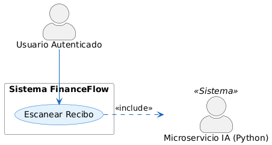

|**Campo**|**Detalle**|
| :- | :- |
|**Identificador**|CU-04|
|**Nombre**|Escanear Recibo (Motor IA)|
|**Actor Principal**|Usuario Autenticado|
|**Precondición**|El usuario debe estar autenticado en la plataforma y contar con un comprobante de pago legible.|
|**Postcondición**|El formulario de movimientos se autocompleta con datos procesados mediante OCR y algoritmos Naive Bayes.|
|**Flujo Principal**||
|**ACTOR**|**SISTEMA**|
|1\. Selecciona "Escanear (Automático)" en la interfaz y provee una foto de un recibo.||
||2\. Captura la imagen, la convierte y la despacha al servidor Python de IA.|
||3\. El servidor IA lee el texto (Tesseract OCR), extrae monto/fecha con Regex y deduce la categoría con Machine Learning.|
||4\. El servidor Node.js/Frontend recibe los datos deducidos y autocompleta el formulario.|
|5\. Revisa que todo coincida, y presiona "Guardar".||
||6\. Registra exitosamente el movimiento financiero en MongoDB.|
|**Excepción 1: Imagen ilegible / ilegítima**||
|**ACTOR**|**SISTEMA**|
|1\. Sube una foto completamente oscura, borrosa o que no es un recibo.||
||2\. El OCR falla al no detectar coincidencias de montos ni texto legible.|
||3\. El sistema limpia la carga y advierte al usuario: "No pudimos procesar la imagen de forma automatizada".|
|4\. Procede a ingresar los datos mecánicamente usando el CU-03.||
-----
### <a name="_il4ar9k4kcvg"></a>**CU-05: Visualizar Dashboard Analítico**


|**Campo**|**Detalle**|
| :- | :- |
|**Identificador**|CU-05|
|**Nombre**|Visualizar Dashboard Analítico|
|**Actor Principal**|Usuario Autenticado|
|**Precondición**|El usuario inicia sesión y tiene registros previos cargados.|
|**Postcondición**|Se visualizan los indicadores matemáticos de la salud financiera del usuario.|
|**Flujo Principal**||
|**ACTOR**|**SISTEMA**|
|1\. Ingresa a la pantalla principal o pulsa el ícono "Inicio".||
||2\. Extrae todos los movimientos asociados al ID y mes vigente del usuario.|
||3\. Realiza la sumatoria total de ingresos, resta los egresos para indicar el saldo y procesa arreglos de datos por categoría.|
||4\. Renderiza los componentes gráficos (React Recharts / React Native Chart Kit) desplegando curvas de gasto y pasteles de distribución.|

*(No aplican flujos alternativos complejos. Si no hay registros, el sistema renderiza el gráfico en ceros informando "No hay datos en este ciclo").*


### <a name="_963zdjgwxh24"></a>**CU-06: Modificar Movimiento (Update)**
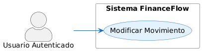

|**Campo**|**Detalle**|
| :- | :- |
|**Identificador**|CU-06|
|**Nombre**|Modificar Movimiento (Update)|
|**Actor Principal**|Usuario Autenticado|
|**Precondición**|Existe un movimiento erróneo o impreciso previamente guardado en el sistema.|
|**Postcondición**|Los valores exactos del movimiento son actualizados reflejándose íntegramente en los cálculos métricos.|
|**Flujo Principal**||
|**ACTOR**|**SISTEMA**|
|1\. Entra a "Historial/Reportes" y presiona el botón "Editar" en un gasto específico.||
||2\. Carga en pantalla el formulario poblando los inputs con los datos anteriores.|
|3\. Cambia un valor erróneo (p. ej. altera de 50.00 a 500.00) y pulsa "Actualizar".||
||4\. Lanza petición al endpoint PUT /api/movimientos/:id validando que pertenezca al actor activo.|
||5\. Sobrescribe la entidad de MongoDB y propaga los nuevos datos recalcuales en la UI.|
|**Excepción 1: Alterar registro ajeno (Intento de Hacking)**||
|**ACTOR**|**SISTEMA**|
|1\. Realiza una petición manual (vía Postman) a la API alterando el ID de un movimiento que pertenece a otro usuario.||
||2\. El controlador intercepta el request comprobando si el userId concuerda con el JWT del solicitante.|
||3\. Identifica la intrusión y revoca con un estatus 403 Forbidden: No autorizado para acceder a este recurso.|
|4\. Es denegado y la operación se cancela irremediablemente.||
-----
### <a name="_4gjs4514o2dz"></a>**CU-07: Inhabilitar Movimiento (Delete)**
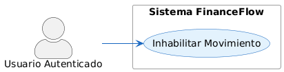

|**Campo**|**Detalle**|
| :- | :- |
|**Identificador**|CU-07|
|**Nombre**|Inhabilitar Movimiento (Delete)|
|**Actor Principal**|Usuario Autenticado|
|**Precondición**|El usuario identifica un registro falso, duplicado o indeseado que debe removerse.|
|**Postcondición**|El elemento deja de contarse en los balances matemáticos y desaparece la UI visible, mutando su atributo a estado inactivo (Borrado lógico).|
|**Flujo Principal**||
|**ACTOR**|**SISTEMA**|
|1\. Selecciona el ícono "Eliminar" colindante al registro.||
||2\. Levanta un elemento emergente (Modal/Alert) solicitando confirmación de "Seguridad: ¿Está seguro?".|
|3\. Aprueba presionando "Sí, eliminar".||
||4\. Contacta la base de datos cambiando el atributo status=false sin eliminar el objeto físico (Borrado suave).|
||5\. Refresca la tabla filtrando por elementos activos.|
|**Flujo Alternativo 1: Cancelación de Borrado**||
|**ACTOR**|**SISTEMA**|
|1\. Selecciona eliminar por accidente.||
||2\. Muestra modal "¿Estás seguro?".|
|3\. Detiene la acción y presiona "Cancelar".||
||4\. Destruye el modal y aborta la comunicación con la API.|

-----
###
###
###
###
### <a name="_92esiw5ttmtb"></a><a name="_8vwuryfzgd3r"></a><a name="_3ulaulrp95xu"></a><a name="_gbpr0p6g005y"></a><a name="_xlpq0qeaqx2l"></a>**CU-08: Filtrar y Analizar Reportes**
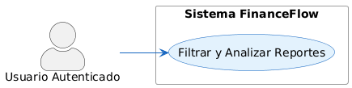

|**Campo**|**Detalle**|
| :- | :- |
|**Identificador**|CU-08|
|**Nombre**|Filtrar y Analizar Reportes|
|**Actor Principal**|Usuario Autenticado|
|**Precondición**|Tener movimientos documentados en múltiples temporalidades (meses/años distintos).|
|**Postcondición**|Se visualizan los indicadores financieros cerrados exclusivamente a los atributos restringidos.|
|**Flujo Principal**||
|**ACTOR**|**SISTEMA**|
|1\. Accede a la pestaña "Reportes".||
||2\. Plasma la totalidad de movimientos históricos e interfaz de controles calendarios.|
|3\. Selecciona en el calendario de filtros las fechas "Marzo 1 al Marzo 31" y pulsa "Aplicar Filtro".||
||4\. Recupera solo aquellas transacciones (Queries paramétricos) constreñidas a ese huso temporal y redibuja la tabla.|

-----
###
###
### <a name="_iijte3g012f7"></a><a name="_ewuxt5z60b93"></a><a name="_khwm5r2lbx4k"></a>**CU-09: Reentrenar Clasificador IA (Silent Training)**
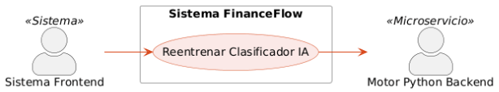

|**Campo**|**Detalle**|
| :- | :- |
|**Identificador**|CU-09|
|**Nombre**|Reentrenar Clasificador IA|
|**Actor Principal**|Sistema Frontend (React/Web)|
|**Precondición**|El usuario ha escaneado un comprobante (CU-04), corregido cualquier error del sistema y asentado su guardado.|
|**Postcondición**|El microservicio de Python absorbe estadísticas nuevas volviéndose progresivamente más asertivo (Inteligencia adaptativa).|
|**Flujo Principal**||
|**ACTOR**|**SISTEMA**|
|1\. Una vez guardado un elemento de origen AI en MongoDB, lanza paralelamente un Payload con los metadatos verificados cruzados (Nombre comercio vs. Categoría asignada final).||
||2\. El Servidor IA (endpoint /retrain) recibe el arreglo, y provee directamente las variables verificadas al vectorizador Scikit-Learn.|
||3\. Carga el viejo modelo estático, inyecta la nueva lógica (clf.partial\_fit) alterando su desviación estadística, y exporta el nuevo modelo prentrenado como default.|
|4\. Finaliza la petición ignorando los retornos sin trabar a nivel usuario el hilo de ejecución principal web (Silent Worker).||
*(No hay excepciones en este CU, un fallo en el reentrenamiento asíncrono no detiene a la plataforma en absoluto, sólo se aborta la tarea IA silenciosamente mediante código try-catch).*
### <a name="_40d8z5mkrl4s"></a>**CU-10: Cerrar Sesión (Logout)**
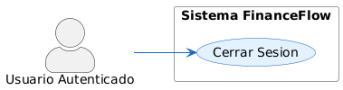

|**Campo**|**Detalle**|
| :- | :- |
|**Identificador**|CU-10|
|**Nombre**|Cerrar Sesión (Logout)|
|**Actor Principal**|Usuario Autenticado|
|**Precondición**|El usuario mantiene una sesión activa validada por un JWT token en curso en la App/Web.|
|**Postcondición**|Se liquida la credencial de autenticación forzando el abandono al ecosistema privado de la App.|
|**Flujo Principal**||
|**ACTOR**|**SISTEMA**|
|1\. Interactúa con su foto de perfil y despliega el menú contextual dictando "Cerrar Sesión".||
||2\. El Frontend destruye programáticamente la variable local token de los almacenamientos locales (localStorage o AsyncStorage) y limpia el contexto global de usuario Context.|
||3\. Expulsa la ruta dirigiéndolo inexcusablemente a la vista abierta /login.|

-----
### <a name="_s3oq4jj23dls"></a>**CU-11: Recuperar/Restablecer Contraseña**
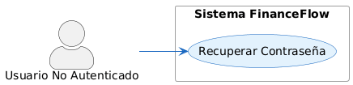

|**Campo**|**Detalle**|
| :- | :- |
|**Identificador**|CU-11|
|**Nombre**|Recuperar/Restablecer Contraseña|
|**Actor Principal**|Usuario No Autenticado|
|**Precondición**|Extravío de credencial personal limitando el abordaje clásico.|
|**Postcondición**|El usuario consigue asentar una nueva contraseña posibilitándole transitar al Login de manera efectiva.|
|**Flujo Principal**||
|**ACTOR**|**SISTEMA**|
|1\. Pulsa "Olvidé mi contraseña" en el Formulario Login.||
||2\. Renderiza la UI requiriendo el correo vinculado de alta primaria.|
|3\. Ingresa su email corporativo/personal, pulsa "Restablecer".||
||4\. (Simulación local o mediante email) Autentica el correo, encripta el token y admite cambio de pass a la cuenta de MongoDB vinculada.|
|5\. Procesa mediante un Link las instrucciones y forja la contraseña nueva.||
||6\. Actualiza el Hash y deniega token antiguos obligando a reiniciar sesión al Actor mediante su password reciente.|
|**Excepción 1: Mal escrito o correo no registrado**||
|**ACTOR**|**SISTEMA**|
|1\. Pide reset de clave en un correo inventado.||
||2\. No empareja a ningún User preexistente en la validación.|
||3\. Lanza error: "Usuario no encontrado en los registros", o un mensaje aséptico "Si existes, enviamos correo" (por seguridad preventiva).|
|4\. Sale al menú inicial asumiendo culpa.||
-----
### <a name="_mmt25ldetssv"></a>**CU-12: Consultar/Editar Perfil**
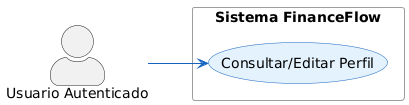

|**Campo**|**Detalle**|
| :- | :- |
|**Identificador**|CU-12|
|**Nombre**|Consultar/Editar Perfil|
|**Actor Principal**|Usuario Autenticado|
|**Precondición**|Acceder a la sección /profile del Sistema.|
|**Postcondición**|Cambios en el avatar natural u ortográficos de nombres operan perpetuamente en el Backend.|
|**Flujo Principal**||
|**ACTOR**|**SISTEMA**|
|1\. Accede al link /profile.||
||2\. El Sistema recupera información intrínseca desprovista sobre contraseñas, listando correos, fechas altas e interacciones numéricas de transacciones (metadato general).|
|3\. Ejecuta alteraciones al input de 'Nombre Completo' dictaminando 'Guardar Cambios'.||
||4\. Contacta la base de MongoDB (Colección: Users) y modifica el JSON subyacente. Refresca token con data moderna.|

-----
###
###
###
###
###
###
###
###
### <a name="_hoitaaammjg7"></a><a name="_gi0n9fdo0xa"></a><a name="_yrhzmps9i0kb"></a><a name="_r3qb297l2ics"></a><a name="_s8o2ibtxp3z9"></a><a name="_aizp5f2js07q"></a><a name="_qtl6olvw6cnj"></a><a name="_2huermiex2nt"></a><a name="_evd0mbbro2x0"></a>**CU-13: Visualizar Auditoría (Logs)**
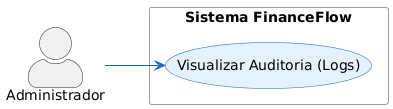

|**Campo**|**Detalle**|
| :- | :- |
|**Identificador**|CU-13|
|**Nombre**|Visualizar Auditoría (Logs)|
|**Actor Principal**|Administrador (Software Master)|
|**Precondición**|Ser titular del rol admin y constar de panel directivo o endpoint protegido.|
|**Postcondición**|Visualización y lectura técnica pura del accionar (Errores en IA, Logins fallidos, Inserción de base de datos) originado en el macro entorno global.|
|**Flujo Principal**||
|**ACTOR**|**SISTEMA**|
|1\. Efectúa petición autenticada de alto rol (GET /api/logs).||
||2\. Invoca el controlador logs.controller.js mapeando colecciones completas estáticas y temporizadas en BD.|
||3\. Retorna array JSON listando en milisegundos las tareas del ecosistema.|
|4\. Interpreta los logs para control y monitorización perimetral de fallos no tratados de otros componentes.||


## **3. Modelo Lógico**
### **a) Análisis de Objetos**
Las entidades principales del sistema FinanceFlow, derivadas del análisis de los modelos Mongoose del directorio /database/, son las siguientes:

**Entidad: Usuario (usuario.model.js)**

|**\_id**|ObjectId – Identificador único generado por MongoDB (Primary Key)|
| :- | :- |
|**nombre**|String – Nombre completo del usuario (requerido)|
|**email**|String – Dirección de correo electrónico (requerido, único, índice)|
|**password**|String – Hash bcryptjs de la contraseña (requerido, no expuesto en API)|
|**resetPasswordToken**|String – Token de recuperación de contraseña (nullable)|
|**resetPasswordExpire**|Date – Fecha de expiración del token de recuperación (nullable)|
|**createdAt**|Date – Fecha de creación del registro (automático por Mongoose timestamps)|
|**updatedAt**|Date – Fecha de última actualización (automático por Mongoose timestamps)|


**Entidad: Movimiento (movimiento.model.js)**

|**\_id**|ObjectId – Identificador único generado por MongoDB (Primary Key)|
| :- | :- |
|**userId**|ObjectId – Referencia al Usuario propietario (Foreign Key → Usuario.\_id)|
|**tipo**|String (enum) – Tipo de movimiento: 'ingreso' | 'egreso' (requerido)|
|**monto**|Number – Monto de la transacción en la moneda local (requerido, > 0)|
|**descripcion**|String – Descripción textual del movimiento (requerido)|
|**categoria**|String (enum) – Categoría del movimiento (requerido, valores predefinidos)|
|**fecha**|Date – Fecha de la transacción (requerido)|
|**estado**|String (enum) – Estado del movimiento: 'activo' | 'inactivo' (default: 'activo')|
|**imagen**|String – URL de imagen del comprobante (opcional, funcionalidad preparada)|
|**createdAt**|Date – Fecha de creación (automático por Mongoose timestamps)|
|**updatedAt**|Date – Fecha de última actualización (automático por Mongoose timestamps)|


**Entidad: Log (log.model.js)**

|**\_id**|ObjectId – Identificador único generado por MongoDB (Primary Key)|
| :- | :- |
|**nivel**|String (enum) – Nivel de log: 'error' | 'warn' | 'info' | 'debug'|
|**mensaje**|String – Mensaje descriptivo del evento registrado (requerido)|
|**stack**|String – Stack trace del error (nullable, solo para nivel 'error')|
|**endpoint**|String – Ruta del endpoint afectado (nullable)|
|**metodo**|String – Método HTTP de la solicitud (nullable)|
|**statusCode**|Number – Código de estado HTTP de la respuesta (nullable)|
|**userId**|ObjectId – Referencia al usuario que generó el evento (nullable)|
|**createdAt**|Date – Timestamp del evento (automático por Mongoose timestamps)|


### **b) Diagrama de Actividades con Objetos**
El siguiente diagrama describe el flujo de la actividad 'Registrar Movimiento Financiero' con participación explícita de los objetos del sistema:

`  `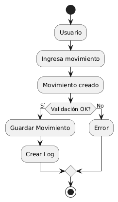


El flujo alternativo para el caso de error de validación: el paso 2 detecta el error y el frontend muestra mensajes inline al usuario sin llamar al backend, preservando los recursos del servidor.


### **c) Diagrama de Secuencia**
A continuación se describe el diagrama de secuencia para el caso de uso CU-02 (Iniciar Sesión), que ilustra la interacción completa entre los componentes del sistema:

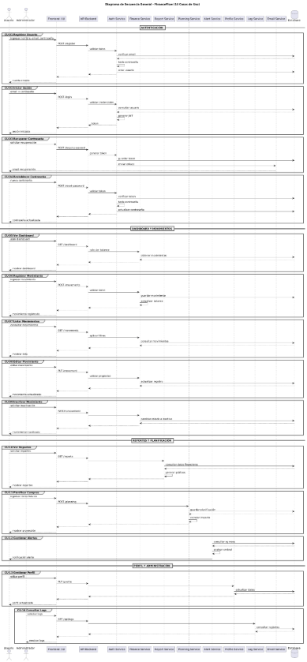

**CU-01 – Registrar Usuario**

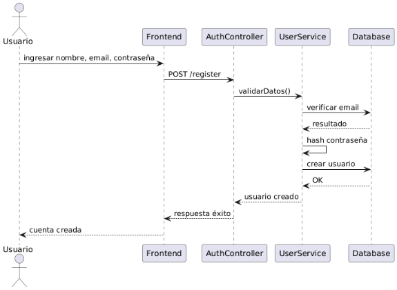

**CU-02 – Iniciar Sesión**

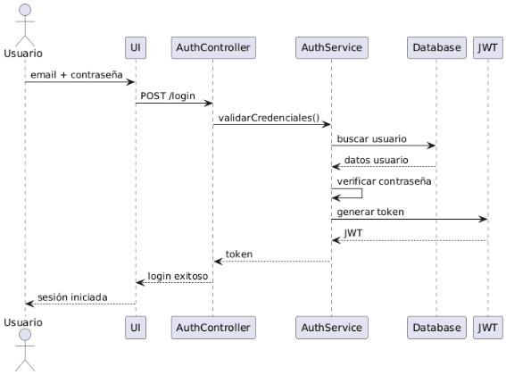

**CU-03 – Recuperar Contraseña**

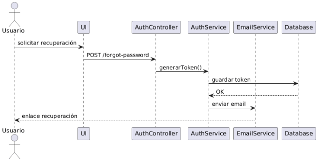

**CU-04 – Restablecer Contraseña**

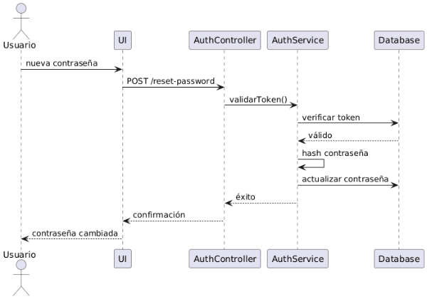


**CU-05 – Ver Dashboard**

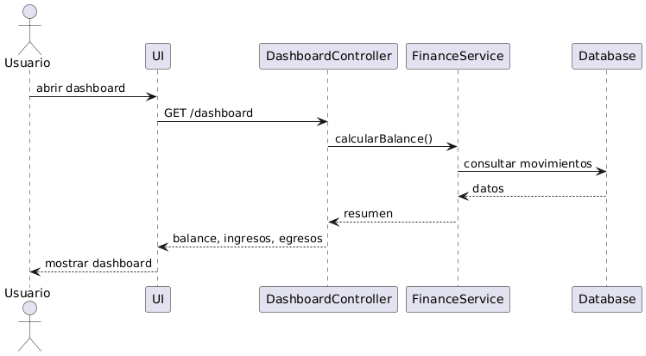

**CU-06 – Registrar Movimiento**

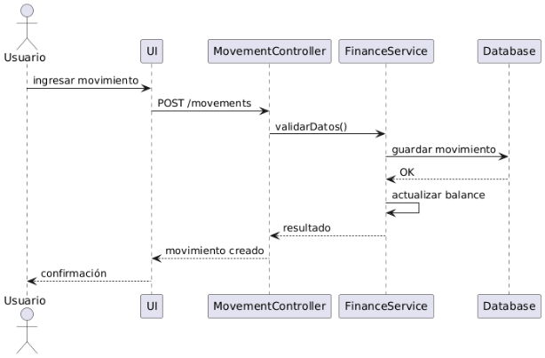


**CU-07 – Listar Movimientos**

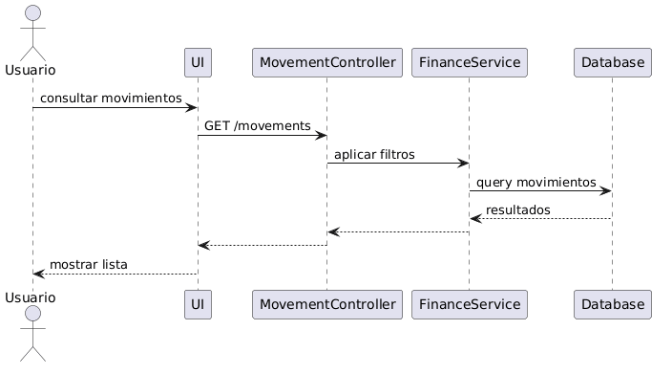

**CU-08 – Editar Movimiento**

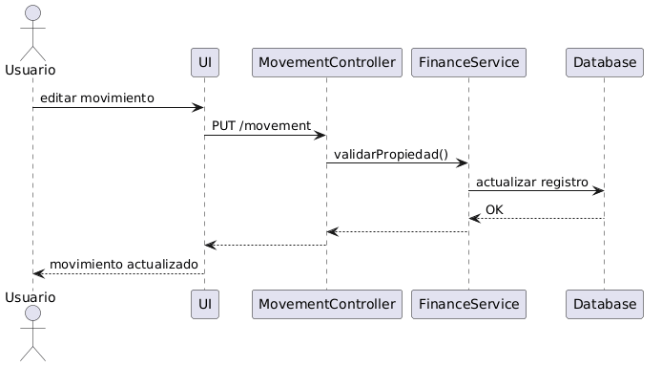


**CU-09 – Inactivar Movimiento**

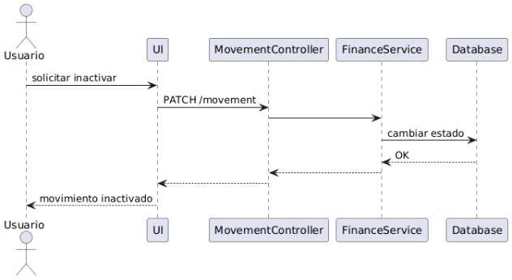

**CU-10 – Ver Reportes**

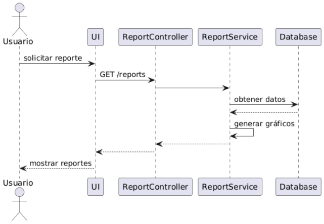


**CU-11 – Planificar Compras**

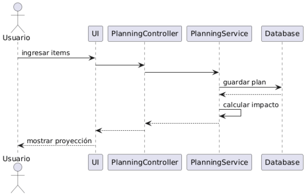

**CU-12 – Gestionar Alertas**

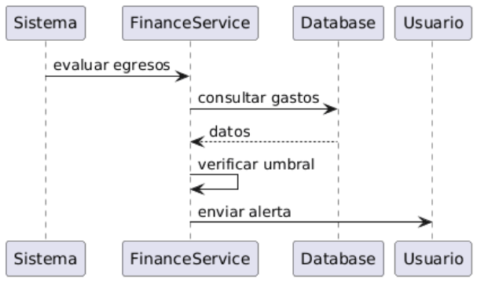


**CU-13 – Gestionar Perfil**

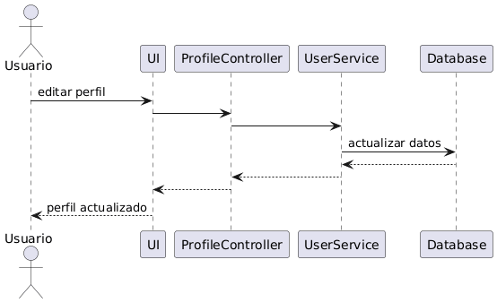

**CU-14 – Consultar Logs**

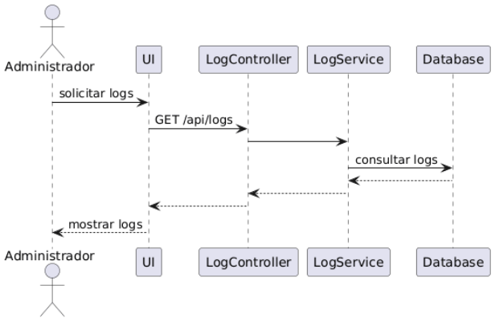


**Actores/Objetos participantes:** Usuario : Browser, LoginPage : React Component, authService : ES6 Module, SDK.auth : SDK Module, HttpClient : axios, Backend.auth : Express Router, auth.middleware.js, usuarios.controller.js, usuarios.service.js, MongoDB : Database


|**1. Usuario → LoginPage**|El usuario ingresa email y contraseña en el formulario y hace clic en 'Iniciar Sesión'.|
| :- | :- |
|**2. LoginPage → authService**|LoginPage.handleSubmit() llama a authService.login({ email, password }).|
|**3. authService → SDK.auth**|El wrapper ES6 de authService delega a SDK.auth.login() (si el adaptador SDK está activo).|
|**4. SDK.auth → HttpClient**|SDK.auth llama a HttpClient.post('/api/usuarios/login', { email, password }).|
|**5. HttpClient → Backend**|axios realiza POST https://api/usuarios/login con body JSON. Sin header Authorization (ruta pública).|
|**6. Backend → usuarios.controller**|Express router enruta la solicitud al controller usuarios.controller.js método login().|
|**7. controller → usuarios.service**|El controller llama a usuariosService.login({ email, password }).|
|**8. service → MongoDB**|El servicio ejecuta Usuario.findOne({ email }) en MongoDB.|
|**9. MongoDB → service**|Retorna el documento del Usuario o null si no existe.|
|**10. service (decisión)**|Si null: retorna error 'Credenciales inválidas'. Si existe: llama a bcryptjs.compare(password, user.password).|
|**11. service → controller**|Si bcrypt.compare = false: lanza Error 401. Si true: genera JWT con jwt.sign({ userId, email }, JWT\_SECRET).|
|**12. controller → HttpClient**|Retorna HTTP 200 con { token: 'eyJ...' , user: { nombre, email } }.|
|**13. HttpClient → SDK.auth**|axios recibe la respuesta. SDK.auth almacena el token internamente.|
|**14. SDK.auth → authService**|Retorna { token, user } al wrapper de authService.|
|**15. authService → LoginPage**|authService.login() resuelve con los datos del usuario autenticado.|
|**16. LoginPage → Browser**|LoginPage almacena el JWT (via useAuth hook) y navega a '/dashboard' con React Router.|


### **d) Diagrama de Clases**
El diagrama de clases de FinanceFlow describe las entidades principales del sistema, sus atributos, métodos y relaciones. Se representan las clases del backend (modelos Mongoose), del SDK y de los servicios del frontend:

**Clase: Usuario (Mongoose Model)**

|**Atributos**|**Métodos**|
| :-: | :-: |
|<p>– \_id: ObjectId</p><p>– nombre: String [requerido]</p><p>– email: String [único, requerido]</p><p>– password: String [requerido]</p><p>– resetPasswordToken: String</p><p>– resetPasswordExpire: Date</p><p>– createdAt: Date</p><p>– updatedAt: Date</p>|<p>+ findById(id): Promise<Usuario></p><p>+ findOne(criteria): Promise<Usuario></p><p>+ save(): Promise<void></p><p>+ findByIdAndUpdate(): Promise<Usuario></p>|

**Clase: Movimiento (Mongoose Model)**

|**Atributos**|**Métodos**|
| :-: | :-: |
|<p>– \_id: ObjectId</p><p>– userId: ObjectId [ref: Usuario]</p><p>– tipo: enum ['ingreso','egreso']</p><p>– monto: Number [> 0]</p><p>– descripcion: String</p><p>– categoria: String [enum]</p><p>– fecha: Date</p><p>– estado: enum ['activo','inactivo']</p><p>– imagen: String [opcional]</p>|<p>+ find(criteria): Promise<Movimiento[]></p><p>+ findById(id): Promise<Movimiento></p><p>+ create(data): Promise<Movimiento></p><p>+ findByIdAndUpdate(): Promise<Movimiento></p><p>+ calcularBalance(userId): Promise<Number></p>|


**Clase: FinanceFlowSDK (sdk/src/index.js)**

|**Atributos**|**Métodos**|
| :-: | :-: |
|<p>– httpClient: HttpClient</p><p>– auth: AuthModule</p><p>– movimientos: MovimientosModule</p><p>– usuarios: UsuariosModule</p><p>– reportes: ReportesModule</p><p>– token: String | null</p><p>– stats: Object</p>|<p>+ configure(baseURL, token): void</p><p>+ setToken(token): void</p><p>+ clearToken(): void</p><p>+ getStats(): Object</p><p>+ handleError(error): SDKError</p>|


**Relaciones entre Clases:**

|**Usuario (1) ←→ (N) Movimiento**|Asociación: Un usuario puede tener múltiples movimientos. Un movimiento pertenece a exactamente un usuario (userId como Foreign Key).|
| :- | :- |
|**Usuario (1) ←→ (N) Log**|Asociación opcional: Un log puede estar asociado a un usuario (campo userId nullable).|
|**FinanceFlowSDK → HttpClient**|Composición: El SDK contiene una instancia de HttpClient que gestiona todas las peticiones HTTP.|
|**FinanceFlowSDK → AuthModule**|Composición: El SDK contiene el módulo de autenticación que maneja login, registro y recuperación de contraseña.|
|**FinanceFlowSDK → MovimientosModule**|Composición: El SDK contiene el módulo de movimientos para operaciones CRUD.|
|**Adapter → FinanceFlowSDK**|Dependencia: Los adaptadores (movimientos-adapter.js, reportes-adapter.js, etc.) instancian y utilizan el SDK como implementación alternativa.|
|**ES6Service → Adapter**|Dependencia: Los servicios del frontend (wrappers ES6) delegan al adaptador correspondiente cuando el feature flag está activo.|


# 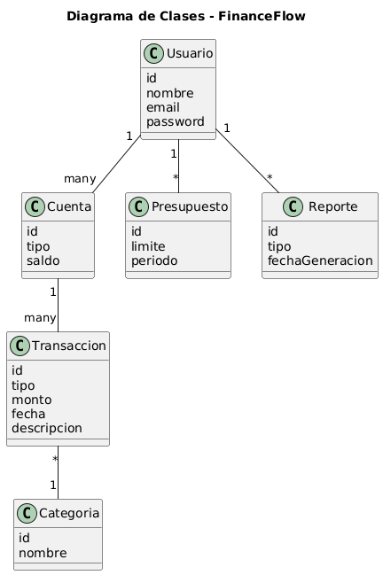
#
#
#
#
#
#
#
# **CONCLUSIONES**
- **Arquitectura robusta y escalable:** FinanceFlow implementa una arquitectura de tres capas bien diferenciadas (Frontend SPA, API RESTful, Base de datos NoSQL) complementada por una capa SDK con patrón adaptador, lo que posiciona al sistema con una base técnica enterprise-grade para escalar hacia nuevas funcionalidades y mayores volúmenes de usuarios.
- **Funcionalidad completa para el dominio:** El sistema cubre de manera integral las necesidades de gestión financiera personal identificadas: registro de movimientos, visualización de balance, análisis gráfico, planificación de compras y sistema de alertas. Los 18 requerimientos funcionales finales cubren el ciclo completo de vida de la información financiera del usuario.
- **Calidad de software demostrada:** La existencia de 66 pruebas automatizadas con Jest (100% de tasa de éxito), el sistema de logging, los dashboards de monitoreo y la documentación completa de despliegue evidencian un nivel de madurez de ingeniería de software superior al esperado para un proyecto académico.
- **Migración sin interrupción:** El patrón adaptador con feature flags implementado en la transición hacia el SDK constituye un caso ejemplar de aplicación del principio Open/Closed y de la práctica de migración gradual sin downtime, validada mediante testing paralelo con 50 iteraciones de stress testing.
- **Seguridad apropiada para el dominio:** La implementación de JWT para autenticación sin estado, bcryptjs para hash de contraseñas, Helmet.js para cabeceras HTTP seguras y tokens crypto de un solo uso para recuperación de contraseña garantizan un nivel de seguridad adecuado para una aplicación de gestión de datos financieros personales.


# **RECOMENDACIONES**
- **Completar la migración del SDK:** Los servicios authService.js y userService.js aún no han sido migrados a wrappers ES6 sobre el SDK (señalado en PROYECTO\_COMPLETADO.md). Se recomienda completar esta migración para mantener la coherencia arquitectónica del sistema y centralizar toda la comunicación con el backend a través del SDK.
- **Implementar exportación de reportes:** El Roadmap del README menciona la exportación a PDF/Excel como funcionalidad futura. Se recomienda implementar esta característica utilizando librerías como jsPDF (para PDF) o xlsx (para Excel), integrándola como módulo adicional del SDK.
- **Implementar la aplicación móvil:** El directorio /mobile/ existe en el repositorio pero se encuentra en estado preliminar. Se recomienda completar el desarrollo de la aplicación móvil utilizando React Native, aprovechando la existencia del SDK como capa de abstracción que puede ser reutilizada tanto por el frontend web como por la app móvil.
- **Implementar Rate Limiting:** Para prevenir ataques de fuerza bruta y garantizar la disponibilidad del servicio, se recomienda incorporar middleware de rate limiting (express-rate-limit) en los endpoints de autenticación, con un máximo de 10 intentos por IP en un período de 15 minutos.
- **Agregar variables de entorno para categorías:** Las categorías de movimiento están actualmente definidas como enumeraciones fijas en el modelo. Se recomienda externalizarlas a la base de datos para permitir su gestión dinámica sin requerir cambios en el código fuente.
- **Implementar paginación en el listado de movimientos:** Para garantizar el rendimiento con grandes volúmenes de datos, se recomienda implementar paginación en el endpoint GET /api/movimientos, utilizando los parámetros page y limit, y el operador MongoDB skip/limit.
- **Añadir refresh tokens:** El sistema actual utiliza JWT con tiempo de expiración fijo. Se recomienda implementar refresh tokens para extender la sesión del usuario sin requerir re-autenticación, mejorando significativamente la experiencia de usuario en sesiones prolongadas.
- **Incrementar la cobertura de pruebas del frontend:** Las pruebas actuales están centradas en el backend y el SDK. Se recomienda ampliar la cobertura con pruebas de integración del frontend utilizando React Testing Library y pruebas end-to-end con Cypress o Playwright.


# **BIBLIOGRAFÍA**
IEEE Computer Society. (1998). IEEE Recommended Practice for Software Requirements Specifications (IEEE Std 830-1998). Institute of Electrical and Electronics Engineers.


Pressman, R. S. & Maxim, B. R. (2015). Ingeniería del Software: Un Enfoque Práctico (8.ª ed.). McGraw-Hill Education.


Sommerville, I. (2016). Software Engineering (10th ed.). Pearson Education Limited.


Fowler, M. (2018). Patterns of Enterprise Application Architecture. Addison-Wesley Professional.


Banks, A. & Porcello, E. (2020). Learning React: Modern Patterns for Developing React Apps (2nd ed.). O'Reilly Media.


Haki, M. E. & Forte, J. G. (2010). Service Oriented Architecture: An Investigation of Service Quality Factors. Journal of Internet Social Networking and Virtual Communities, 1(1), 1-11.


Gamma, E., Helm, R., Johnson, R. & Vlissides, J. (1994). Design Patterns: Elements of Reusable Object-Oriented Software. Addison-Wesley.


MongoDB, Inc. (2024). MongoDB Documentation: Data Modeling. MongoDB Official Documentation.


# **WEBGRAFÍA**
KrCrimson. (2026). FinanceFlow – Sistema de Gestión Financiera Personal [Repositorio GitHub]. Recuperado el 8 de abril de 2026, de https://github.com/KrCrimson/FinanceFlow


FinanceFlow Solutions. (2026). Sistema de Balance [Aplicación Web en Producción]. Recuperado el 8 de abril de 2026, de https://financeflow-frontend.vercel.app


Meta Platforms, Inc. (2024). React Documentation. Recuperado de https://react.dev


OpenJS Foundation. (2024). Node.js Documentation. Recuperado de https://nodejs.org/docs


MongoDB, Inc. (2024). MongoDB Documentation. Recuperado de https://www.mongodb.com/docs


Mongoose. (2024). Mongoose ODM Documentation v8.x. Recuperado de https://mongoosejs.com/docs


Auth0. (2024). Introduction to JSON Web Tokens. Recuperado de https://jwt.io/introduction


Tailwind Labs. (2024). Tailwind CSS Documentation. Recuperado de https://tailwindcss.com/docs


Meta Platforms, Inc. (2024). Jest – JavaScript Testing Framework. Recuperado de https://jestjs.io/docs


Vercel, Inc. (2024). Vercel Deployment Documentation. Recuperado de https://vercel.com/docs


Helmet.js Contributors. (2024). Helmet – Help Secure Express Apps. Recuperado de https://helmetjs.github.io


OWASP Foundation. (2024). OWASP Top Ten Security Risks. Recuperado de https://owasp.org/www-project-top-ten
Universidad Privada de Tacna – Ingeniería de Sistemas   |   Página  de 
