# Diagramas Mejorados SRS

Este archivo contiene 35 diagramas en Mermaid, alineados con la cantidad de imagenes originales ubicadas en la carpeta principal del SRS.

## 01. Visión general de FinanceFlow
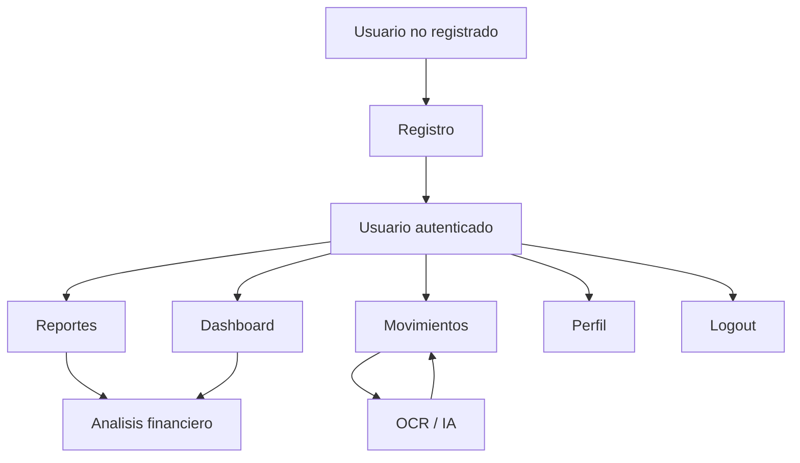

## 02. Proceso actual de finanzas personales
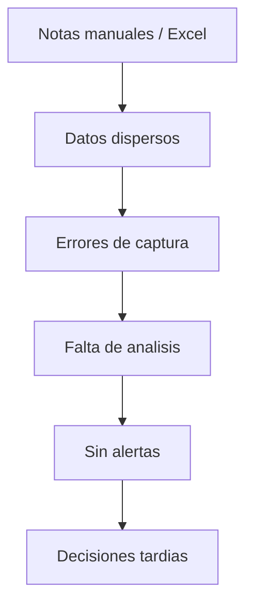

## 03. Proceso propuesto con FinanceFlow
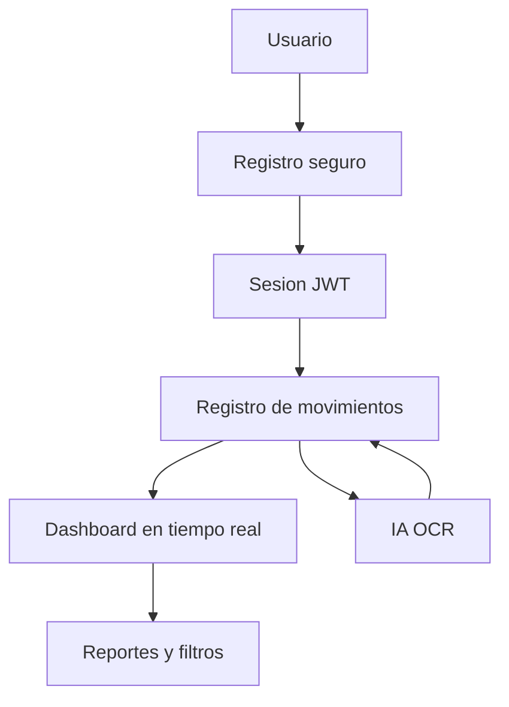

## 04. Flujo de autenticacion
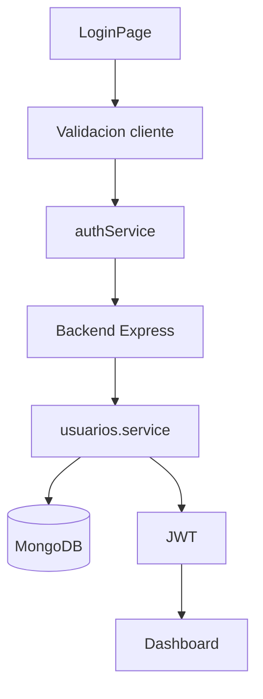

## 05. Flujo de registro de usuario
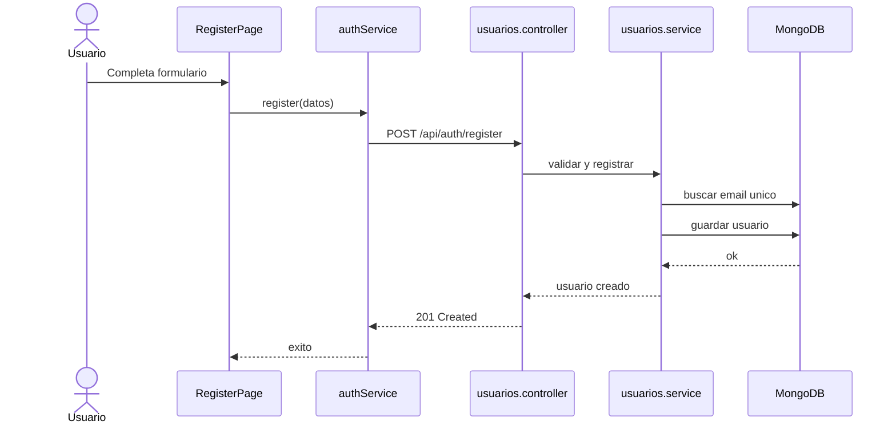

## 06. Flujo de inicio de sesion
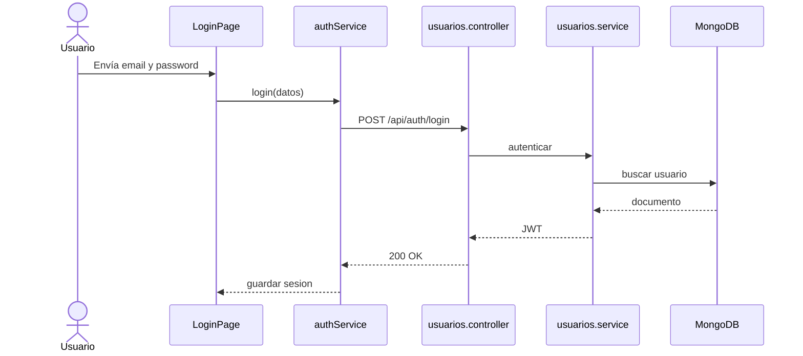

## 07. Recuperacion de contraseña
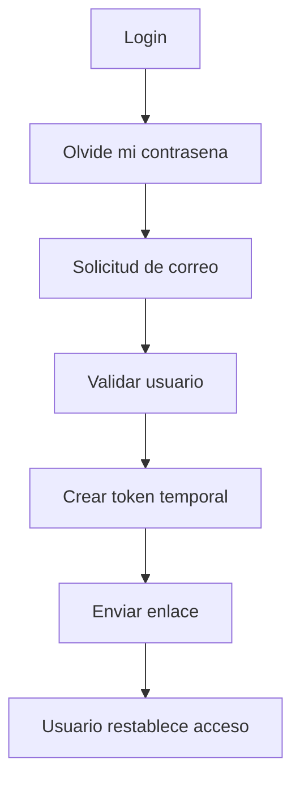

## 08. Restablecimiento de contraseña
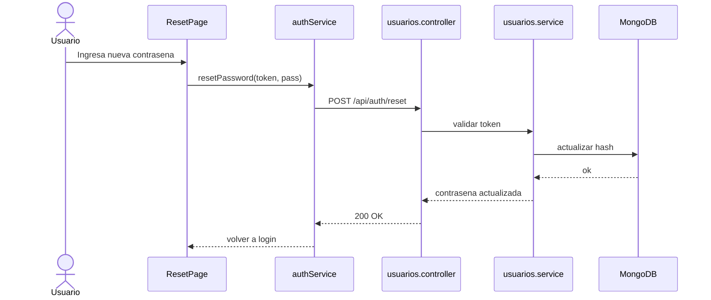

## 09. Registro manual de movimiento
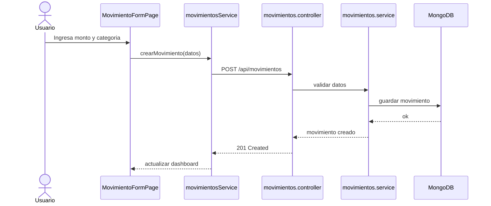

## 10. OCR para comprobantes
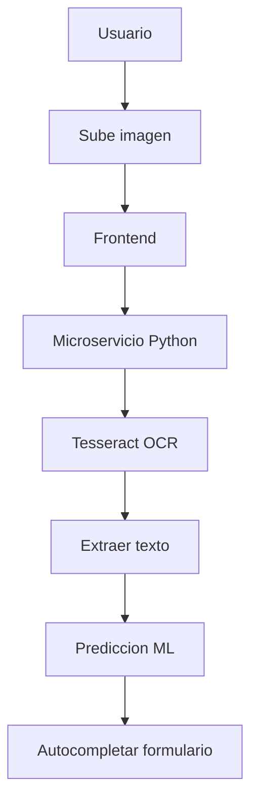

## 11. Visualizacion del dashboard
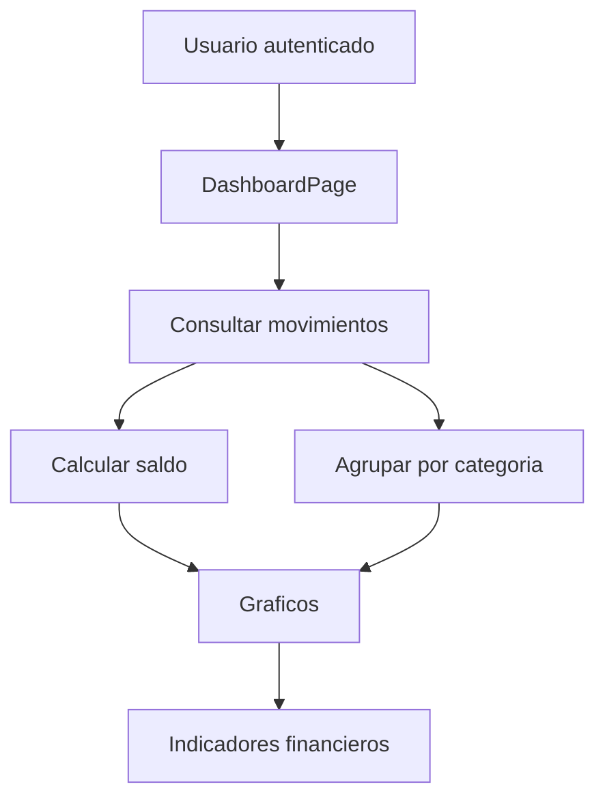

## 12. Edicion de movimiento
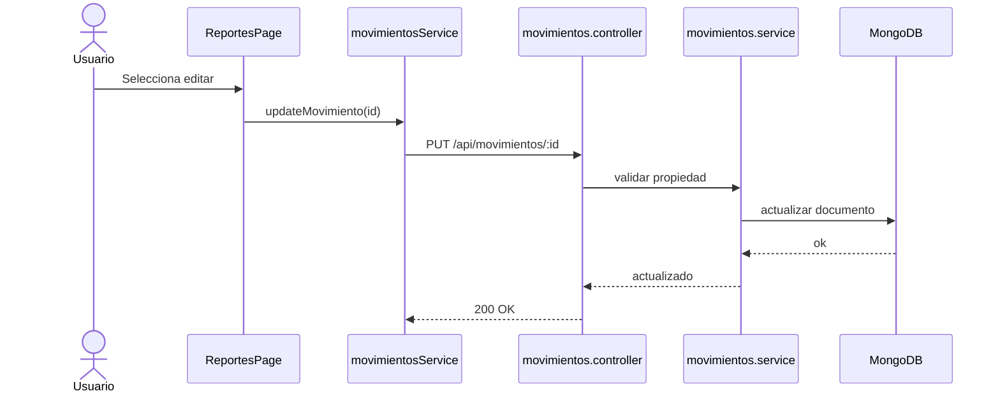

## 13. Inactivacion de movimiento
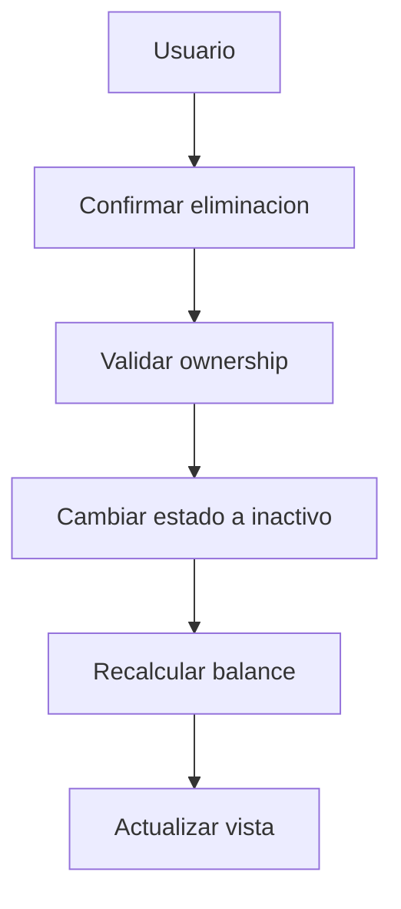

## 14. Filtro de reportes
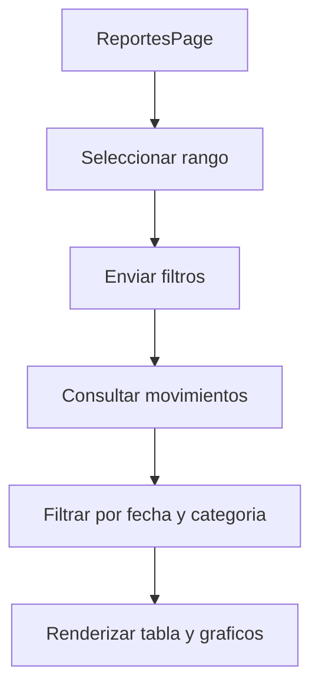

## 15. Reentrenamiento silencioso
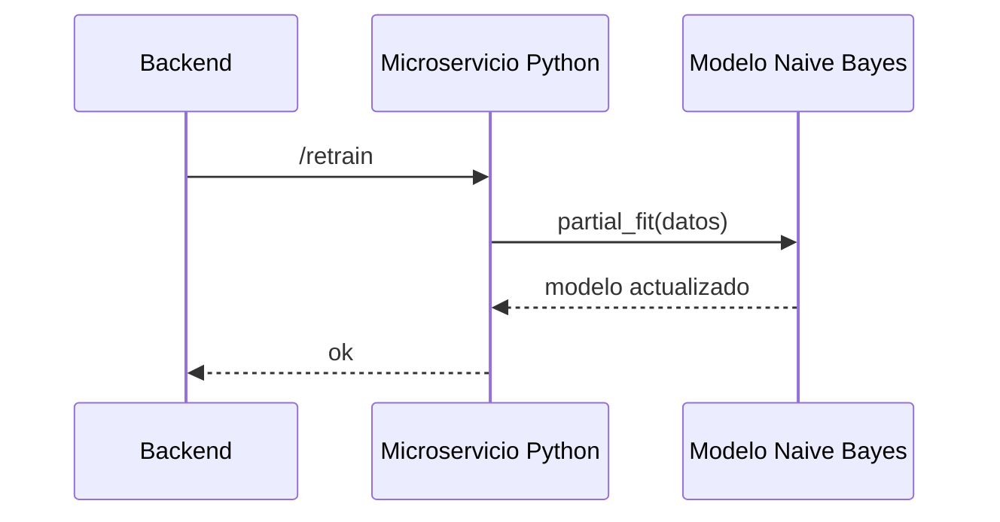

## 16. Cierre de sesion
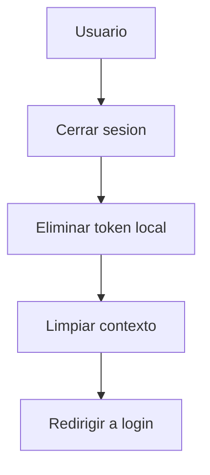

## 17. Perfil de usuario
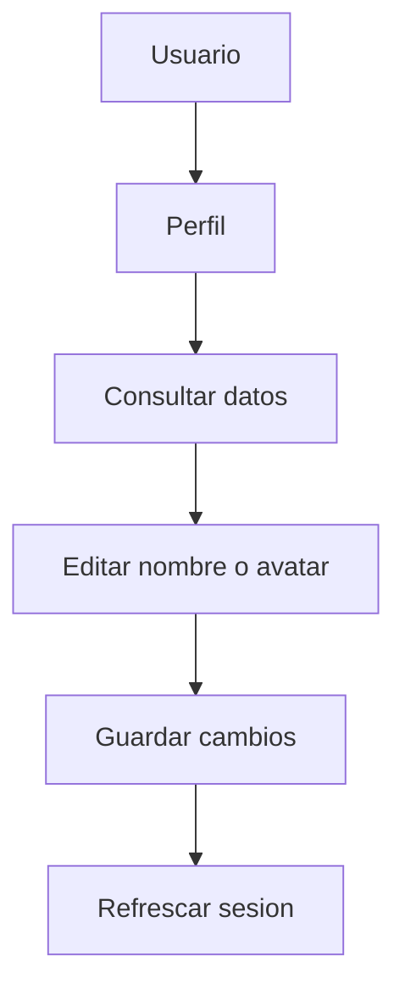

## 18. Auditoria y logs
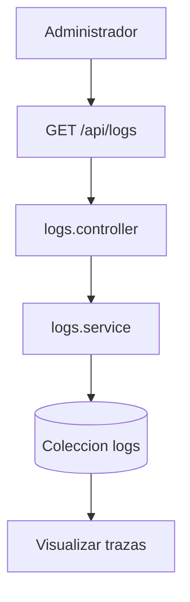

## 19. Modelo de usuario
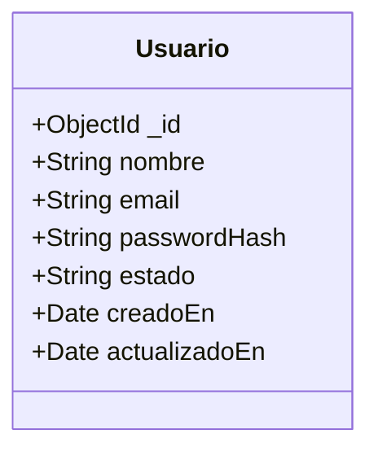

## 20. Modelo de movimiento
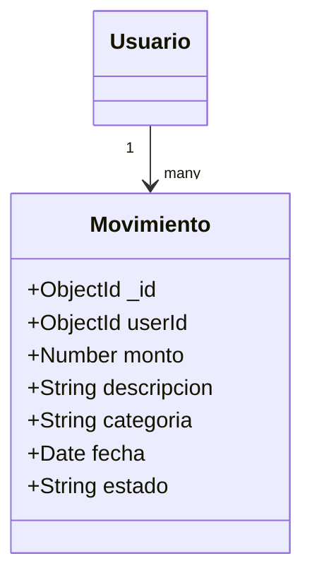

## 21. Modelo de log
```mermaid
classDiagram
    class Log {
      +ObjectId _id
      +String nivel
      +String mensaje
      +String stack
      +String endpoint
      +String metodo
      +Number statusCode
    }
```

## 22. Relacion de entidades
```mermaid
flowchart LR
    U[(Usuario)] --> M[(Movimiento)]
    U --> L[(Log)]
    M --> D[Dashboard]
    M --> R[Reportes]
    L --> A[Auditoria]
```

## 23. Validacion de formulario
```mermaid
flowchart TD
    A[Usuario escribe] --> B[React Hook Form]
    B --> C[Zod schema]
    C -->|Valido| D[Enviar solicitud]
    C -->|Invalido| E[Mostrar error inline]
```

## 24. Secuencia de registro con validacion
```mermaid
sequenceDiagram
    actor U as Usuario
    participant UI as RegisterPage
    participant SDK as authService
    participant API as Backend
    U->>UI: Rellena datos
    UI->>SDK: submit
    SDK->>API: register
    API-->>SDK: response
    SDK-->>UI: mostrar estado
```

## 25. Secuencia de dashboard en tiempo real
```mermaid
sequenceDiagram
    participant UI as DashboardPage
    participant S as movimientosService
    participant API as Backend
    participant DB as MongoDB
    UI->>S: cargarResumen()
    S->>API: GET /dashboard
    API->>DB: consultar datos
    DB-->>API: resumen
    API-->>S: datos
    S-->>UI: renderizar graficos
```

## 26. Secuencia de OCR y autocompletado
```mermaid
sequenceDiagram
    participant UI as MovimientoFormPage
    participant AI as Microservicio Python
    participant ML as Modelo ML
    UI->>AI: enviar imagen
    AI->>ML: extraer categoria
    ML-->>AI: categoria sugerida
    AI-->>UI: autocompletar campos
```

## 27. Secuencia de eliminacion logica
```mermaid
sequenceDiagram
    actor U as Usuario
    participant UI as ReportesPage
    participant API as Backend
    participant DB as MongoDB
    U->>UI: confirma eliminar
    UI->>API: PATCH /movimientos/:id
    API->>DB: estado=inactivo
    DB-->>API: ok
    API-->>UI: actualizar lista
```

## 28. Secuencia de filtros y reportes
```mermaid
sequenceDiagram
    actor U as Usuario
    participant UI as ReportesPage
    participant API as Backend
    participant DB as MongoDB
    U->>UI: aplica filtros
    UI->>API: GET /reportes?filtro
    API->>DB: consultar datos filtrados
    DB-->>API: resultados
    API-->>UI: graficos y tabla
```

## 29. Secuencia de cambio de contrasena
```mermaid
sequenceDiagram
    actor U as Usuario
    participant UI as RecoveryPage
    participant API as Backend
    participant DB as MongoDB
    U->>UI: ingresa nueva clave
    UI->>API: POST /reset-password
    API->>DB: actualizar hash
    DB-->>API: ok
    API-->>UI: acceso renovado
```

## 30. Secuencia de cierre de sesion
```mermaid
sequenceDiagram
    actor U as Usuario
    participant UI as Navbar
    participant SDK as authService
    participant Router as React Router
    U->>UI: clic en cerrar sesion
    UI->>SDK: logout()
    SDK-->>UI: token eliminado
    UI->>Router: navigate('/login')
```

## 31. Secuencia de perfil
```mermaid
sequenceDiagram
    actor U as Usuario
    participant UI as ProfilePage
    participant API as Backend
    participant DB as MongoDB
    U->>UI: cambia nombre o avatar
    UI->>API: PUT /profile
    API->>DB: actualizar usuario
    DB-->>API: ok
    API-->>UI: perfil actualizado
```

## 32. Secuencia de logs
```mermaid
sequenceDiagram
    actor A as Administrador
    participant UI as LogsPage
    participant API as Backend
    participant DB as MongoDB
    A->>UI: abrir auditoria
    UI->>API: GET /logs
    API->>DB: obtener eventos
    DB-->>API: logs
    API-->>UI: mostrar trazas
```

## 33. Ciclo de vida de un movimiento
```mermaid
stateDiagram-v2
    [*] --> Borrador
    Borrador --> Activo: guardar
    Activo --> Inactivo: eliminar logico
    Inactivo --> [*]
```

## 34. Despliegue logico del sistema
```mermaid
flowchart LR
    subgraph Frontend
        A[React SPA]
    end
    subgraph Backend
        B[Express API]
        C[Servicios]
    end
    subgraph Datos
        D[(MongoDB Atlas)]
    end
    subgraph IA
        E[FastAPI OCR]
    end
    A --> B
    B --> C
    C --> D
    A --> E
```

## 35. Resumen de calidad del sistema
```mermaid
mindmap
  root((FinanceFlow))
    Seguridad
      JWT
      bcrypt
      Helmet
    Usabilidad
      Formularios validos
      Interfaz responsiva
    Rendimiento
      172ms promedio
      100 req concurrentes
    Mantenibilidad
      SDK adaptador
      66 tests
```
