

**UNIVERSIDAD PRIVADA DE TACNA**

**FACULTAD DE INGENIERÍA**

**Escuela Profesional de Ingeniería de Sistemas**

**FinanceFlow: Plataforma Web de Gestión Financiera e Inteligencia Artificial para el Control de Gastos Personales**

Curso: Construcción de Software I

Docente: Mag. Ricardo Eduardo Valcárcel Alvarado

|Integrantes:||
| :- | :- |
|***Sebastian Arce Bracamonte***|***(2019062886)***|
|||

|***Brant Antony Chata Choque***||
| :- | -: |

|

|***(2020067577)***|
| :- | -: |
|||
|||
|||

**Tacna – Perú**

***2026***

|CONTROL DE VERSIONES||||||
| :-: | :- | :- | :- | :- | :- |
|Versión|Hecha por|Revisada por|Aprobada por|Fecha|Motivo|
|1\.0|SAB|ACC|SAB, ACC|18/04/2026|Versión Original|

***“FinanceFlow: Plataforma Web de Gestión Financiera e Inteligencia Artificial para el Control de Gastos Personales”***

**Documento de Arquitectura de Software**

**Versión 1.0**

[**1. INTRODUCCIÓN	4**]()

[1.1 Propósito — Modelo de Vistas 4+1	4]()

[1.2 Alcance	5]()

[1.3 Definición, Siglas y Abreviaturas	5]()

[1.4 Organización del Documento	6]()

[**2. OBJETIVOS Y RESTRICCIONES ARQUITECTÓNICAS	7**]()

[2.1 Priorización de Requerimientos	7]()

[2.1.1 Requerimientos Funcionales	7]()

[2.1.2 Requerimientos No Funcionales — Atributos de Calidad	8]()

[2.2 Restricciones	9]()

[**3. REPRESENTACIÓN DE LA ARQUITECTURA DEL SISTEMA	11**]()

[3.1 Vista de Caso de Uso	11]()

[3.1.1 Diagrama de Casos de Uso	11]()

[3.2 Vista Lógica	12]()

[3.2.1 Diagrama de Subsistemas (Paquetes)	12]()

[3.2.2 Diagrama de Secuencia (Vista de Diseño)	12]()

[3.2.3 Diagrama de Colaboración (Vista de Diseño)	14]()

[3.2.4 Diagrama de Objetos	14]()

[3.2.5 Diagrama de Clases	15]()

[3.2.6 Diagrama de Base de Datos	16]()

[3.3 Vista de Implementación (Vista de Desarrollo)	18]()

[3.3.1 Diagrama de Arquitectura Software (Paquetes)	18]()

[3.3.2 Diagrama de Arquitectura del Sistema (Componentes)	18]()

[3.4 Vista de Procesos	20]()

[3.4.1 Diagrama de Procesos del Sistema (Diagrama de Actividad)	20]()

[3.5 Vista de Despliegue (Vista Física)	22]()

[3.5.1 Diagrama de Despliegue	22]()

[**4. ATRIBUTOS DE CALIDAD DEL SOFTWARE	23**]()

[Escenario de Funcionalidad — Registro con OCR	23]()

[Escenario de Usabilidad — Registro Manual sin Capacitación	23]()

[Escenario de Rendimiento — Carga Concurrente	24]()

[Escenario de Mantenibilidad — Incorporación de Nuevo Servicio al SDK	24]()

[Escenario de Rendimiento — Cold Start en Plan Gratuito	25]()

[Escenario de Usabilidad — Alerta de Gasto Elevado	25]()

[Escenario de Funcionalidad — Borrado Lógico y Auditoría	26]()

[Escenario de Mantenibilidad — Logging de Errores del Sistema	26](#_czk2n0s9qqvb)

# **1. INTRODUCCIÓN**
El presente Documento de Arquitectura de Software (SAD) describe de manera formal la arquitectura de FinanceFlow, una plataforma web de gestión financiera personal con apoyo de inteligencia artificial, desarrollada en el marco del curso Construcción de Software I de la Universidad Privada de Tacna.

FinanceFlow permite registrar, consultar, analizar y controlar movimientos financieros desde una interfaz web responsiva. Su arquitectura integra autenticación con JWT, visualizaciones de datos en tiempo real, OCR para comprobantes, un modelo de clasificación de gastos basado en Machine Learning y una capa SDK con patrón adaptador que reduce el acoplamiento entre la interfaz y los servicios del backend.

El documento sigue el modelo de vistas 4+1 de Philippe Kruchten para presentar el sistema desde cinco perspectivas complementarias: casos de uso, vista lógica, vista de implementación, vista de procesos y vista de despliegue. Su objetivo es servir como referencia técnica única para el equipo de desarrollo, los evaluadores y cualquier responsable de mantenimiento o evolución futura.
## **1.1 Propósito — Modelo de Vistas 4+1**
El propósito de este SAD es establecer una referencia arquitectónica única, completa y no ambigua del sistema FinanceFlow, que sirva como guía autoritativa para todas las decisiones de diseño, desarrollo, prueba y mantenimiento del sistema. El documento adopta el modelo 4+1 de Kruchten, representando la arquitectura desde las siguientes perspectivas:

- Vista de Casos de Uso: describe el comportamiento observable del sistema desde la perspectiva del usuario final y los actores externos (Usuario Autenticado, Administrador, Motor Python de IA). Constituye el eje central que justifica y cohesiona las demás vistas.
- Vista Lógica: presenta la descomposición estática del sistema en subsistemas, paquetes, clases y entidades de dominio, con sus atributos, métodos y relaciones estructurales. Incluye los modelos Mongoose (Usuario, Movimiento, Log), el SDK y los adaptadores.
- Vista de Implementación: muestra la organización física del código fuente en el monorepo GitHub (directorios /frontend, /backend, /ml\_backend, /sdk, /database) y la arquitectura de componentes ejecutables con sus interfaces de comunicación.
- Vista de Procesos: describe los flujos de actividad y concurrencia en tiempo de ejecución, incluyendo el proceso de registro con OCR, el Silent Training asíncrono del modelo ML y el flujo de autenticación JWT.
- Vista de Despliegue: representa la asignación de los artefactos de software a los nodos de infraestructura cloud (Vercel para el frontend, Render para el backend Node.js y el microservicio Python, MongoDB Atlas para la base de datos).

## **1.2 Alcance**
Este SAD cubre la arquitectura completa del sistema FinanceFlow en su versión 1.0, compuesta por cuatro servicios principales: (1) Frontend Web SPA desarrollado con React 18, Tailwind CSS, React Hook Form y Recharts, desplegado en Vercel; (2) Backend API RESTful desarrollado con Node.js y Express, conectado a MongoDB Atlas mediante Mongoose, con sistema de logging propio; (3) Microservicio de Inteligencia Artificial desarrollado con Python y FastAPI, que aloja el motor OCR Tesseract y el modelo Naive Bayes de Scikit-Learn; y (4) Capa SDK con patrón adaptador y feature flags que desacopla el frontend del backend.

El sistema está desplegado en producción y cuenta con 66 pruebas automatizadas con Jest (100% de tasa de éxito) y un tiempo de respuesta promedio de 172 ms por operación bajo condiciones de stress. Quedan fuera del alcance de este documento: la aplicación móvil (directorio /mobile en estado preliminar de scaffold), las integraciones con entidades bancarias externas, el procesamiento de pagos en línea y la exportación de reportes a PDF/Excel (funcionalidades del Roadmap).

## **1.3 Definición, Siglas y Abreviaturas**

|**Término / Sigla**|**Definición**|
| :-: | :-: |
|SAD|Software Architecture Document. Documento formal que describe la arquitectura de un sistema desde múltiples vistas.|
|SRS|Software Requirements Specification. Especificación de requerimientos elaborada en paralelo bajo IEEE 830.|
|API|Application Programming Interface. Interfaz de programación que permite la comunicación entre servicios de software.|
|REST|Representational State Transfer. Estilo arquitectónico para diseño de servicios web sobre HTTP.|
|JWT|JSON Web Token. Estándar de autenticación stateless mediante tokens JSON firmados digitalmente (RFC 7519).|
|OCR|Optical Character Recognition. Tecnología para extraer texto legible a partir de imágenes digitales.|
|ML|Machine Learning. Rama de la IA que permite a los sistemas aprender de datos históricos sin programación explícita.|
|CRUD|Create, Read, Update, Delete. Cuatro operaciones básicas sobre datos persistentes.|
|ODM|Object Document Mapper. Capa de abstracción entre código y BD documental. En este proyecto: Mongoose.|
|SPA|Single Page Application. Aplicación web que carga una sola página HTML y actualiza el contenido dinámicamente.|
|SDK|Software Development Kit. Capa de abstracción de servicios implementada con patrón adaptador en /sdk.|
|OCP|Open/Closed Principle. Principio SOLID: abierto para extensión, cerrado para modificación. Aplicado en el SDK.|
|CDN|Content Delivery Network. Red de distribución de contenido para entrega rápida de activos estáticos.|
|PaaS|Platform as a Service. Modelo cloud usado por Render para alojar los servicios de backend.|
|CI/CD|Continuous Integration / Continuous Deployment. Pipeline automatizado de integración y despliegue.|
|NoSQL|Base de datos no relacional orientada a documentos. En este proyecto: MongoDB Atlas.|
|bcrypt|Algoritmo de hashing criptográfico para contraseñas. Implementado con bcryptjs (10 salt rounds).|

## **1.4 Organización del Documento**
El presente documento se organiza en cuatro secciones principales. La sección 1 (Introducción) establece el contexto, propósito, alcance, terminología y estructura del documento. La sección 2 (Objetivos y Restricciones Arquitectónicas) detalla los requerimientos funcionales y no funcionales priorizados, así como las restricciones técnicas, de tiempo, costo y recursos que condicionan las decisiones de diseño. La sección 3 (Representación de la Arquitectura del Sistema) constituye el núcleo del documento y expone las cinco vistas del modelo 4+1, cada una acompañada de su diagrama PlantUML correspondiente. La sección 4 (Atributos de Calidad) presenta ocho escenarios concretos que especifican cómo el sistema satisface sus atributos de calidad bajo condiciones reales de operación.

# **2. OBJETIVOS Y RESTRICCIONES ARQUITECTÓNICAS**
## **2.1 Priorización de Requerimientos**
### **2.1.1 Requerimientos Funcionales**
Los siguientes requerimientos no funcionales fueron identificados en el SRS del proyecto y priorizados según su impacto en la arquitectura del sistema. Se presentan los atributos de calidad definidos en la especificación, organizados por dimensión arquitectónica:

|**ID**|**Módulo**|**Descripción**|**Prioridad**|
| :-: | :-: | :-: | :-: |
|RF-01|Autenticación|Registro de usuario con email único, nombre y contraseña encriptada con bcryptjs.|Alta|
|RF-02|Autenticación|Inicio de sesión con validación de credenciales y emisión de JWT firmado.|Alta|
|RF-03|Autenticación|Recuperación y restablecimiento de contraseña vía token crypto de un solo uso con TTL de 1 hora.|Alta|
|RF-04|Autenticación|Cierre de sesión con destrucción del token en cliente y limpieza del contexto global.|Alta|
|RF-05|Movimientos|Registro manual de movimiento con campos: monto, nombre/concepto, categoría predefinida, tipo (ingreso/egreso) y fecha.|Alta|
|RF-06|Movimientos|Listado de movimientos activos del usuario autenticado con paginación.|Alta|
|RF-07|Movimientos|Edición de movimientos propios previamente registrados con validación de propiedad (userId JWT).|Media|
|RF-08|Movimientos|Inactivación (borrado lógico) de movimientos: campo estado='inactivo', sin eliminación física de BD.|Media|
|RF-09|Movimientos|Filtrado de movimientos por rango de fechas y categoría en la vista de reportes.|Baja|
|RF-10|Dashboard|Panel analítico con balance total (ingresos activos - egresos activos), gráficos de barras y gráfico de pastel por categoría.|Media|
|RF-11|Dashboard|Cálculo automático en tiempo real del balance sin recargar la aplicación.|Alta|
|RF-12|Dashboard|Sistema de alertas visuales cuando un gasto supera el umbral configurado por el usuario.|Media|
|RF-13|OCR / IA|Captura de imagen de comprobante desde el navegador y envío al microservicio Python para extracción OCR.|Media|
|RF-14|OCR / IA|Extracción automática de monto, fecha y comercio del comprobante mediante Tesseract OCR y expresiones regulares.|Media|
|RF-15|OCR / IA|Predicción automática de la categoría del movimiento mediante modelo Naive Bayes de Scikit-Learn (/predict).|Media|
|RF-16|OCR / IA|Reentrenamiento silencioso del modelo ML en segundo plano al confirmar cada movimiento (/retrain, partial\_fit).|Baja|
|RF-17|Perfil|Consulta y edición del perfil de usuario (nombre, avatar). Refresco del token con datos actualizados.|Baja|
|RF-18|Reportes|Vista de reportes con historial consolidado de movimientos y filtros por período.|Media|
|RF-19|SDK|Capa SDK con patrón adaptador y feature flags que permite migración gradual de servicios sin downtime.|Alta|
|RF-20|Logging|Sistema de logging de errores y eventos con campos: nivel, mensaje, stack, endpoint, método, statusCode, userId.|Media|

### **2.1.2 Requerimientos No Funcionales — Atributos de Calidad**
Los siguientes requerimientos funcionales fueron identificados en el SRS del proyecto y priorizados según su impacto en la arquitectura del sistema. Se presentan los 20 RF definidos en la especificación, organizados por módulo funcional:

|**ID**|**Atributo**|**Descripción**|**Métrica Objetivo**|
| :-: | :-: | :-: | :-: |
|RNF-01|Seguridad|Contraseñas almacenadas con hash bcryptjs (mínimo 10 salt rounds). Verificación < 300 ms.|Hash verify < 300 ms|
|RNF-02|Seguridad|Todas las rutas protegidas requieren JWT válido en header Authorization. Tokens expirados → HTTP 401.|100% rutas con JWT|
|RNF-03|Seguridad|Cabeceras HTTP de seguridad implementadas con Helmet.js (CSP, X-Frame-Options, XSS-Protection).|Helmet activo en prod|
|RNF-04|Seguridad|Comunicación frontend-backend exclusivamente sobre HTTPS en producción (TLS 1.2 o superior).|TLS 1.2+|
|RNF-05|Seguridad|Tokens de recuperación de contraseña con TTL de 1 hora, invalidados tras primer uso.|TTL ≤ 3600 s, uso único|
|RNF-06|Rendimiento|Latencia promedio de la API para operaciones CRUD de movimientos ≤ 300 ms en carga normal.|≤ 300 ms (medido: 172 ms)|
|RNF-07|Rendimiento|Soporte de 100 solicitudes concurrentes sin degradación del tiempo de respuesta > 20%.|100 req/s concurrentes|
|RNF-08|Rendimiento|First Contentful Paint del frontend ≤ 3 segundos en conexiones de banda ancha estándar.|FCP ≤ 3 s|
|RNF-09|Usabilidad|Interfaz completamente responsiva desde 320 px (móvil) hasta 2560 px (ultra-wide) con breakpoints Tailwind.|Tailwind breakpoints|
|RNF-10|Usabilidad|Validación inline de formularios en tiempo real sin requerir envío (React Hook Form + Zod).|Validación en cliente|
|RNF-11|Usabilidad|Tasa de completitud de tareas primarias ≥ 90% en usuarios sin capacitación técnica previa.|90% task completion|
|RNF-12|Escalabilidad|Base de datos MongoDB con soporte para sharding horizontal sin modificar el código de la aplicación.|Sharding compatible|
|RNF-13|Escalabilidad|SDK con patrón Open/Closed: nuevos módulos de servicio sin modificar el código del frontend existente.|OCP aplicado|
|RNF-14|Mantenibilidad|Cobertura de pruebas automatizadas Jest ≥ 70% en líneas de código del backend. Estado actual: 66 tests, 0 fallos.|Coverage ≥ 70%|
|RNF-15|Disponibilidad|Disponibilidad mínima del 99% mensual en producción (Vercel + Render + MongoDB Atlas).|Uptime ≥ 99%|
|RF-16|OCR / IA|Reentrenamiento silencioso del modelo ML en segundo plano al confirmar cada movimiento (/retrain, partial\_fit).|Baja|
|RF-17|Perfil|Consulta y edición del perfil de usuario (nombre, avatar). Refresco del token con datos actualizados.|Baja|
|RF-18|Reportes|Vista de reportes con historial consolidado de movimientos y filtros por período.|Media|
|RF-19|SDK|Capa SDK con patrón adaptador y feature flags que permite migración gradual de servicios sin downtime.|Alta|
|RF-20|Logging|Sistema de logging de errores y eventos con campos: nivel, mensaje, stack, endpoint, método, statusCode, userId.|Media|

## **2.2 Restricciones**
Las siguientes restricciones condicionan las decisiones arquitectónicas del sistema y deben ser consideradas en cualquier evolución futura del diseño:

|**Categoría**|**Restricción**|**Impacto Arquitectónico**|
| :-: | :-: | :-: |
|Plataforma|El sistema opera exclusivamente como aplicación web SPA. No se incluye app móvil nativa en v1.0 (directorio /mobile en estado de scaffold).|El SDK se diseña para ser reutilizable en React Native en futuras versiones.|
|Conectividad|Todas las funcionalidades requieren conexión activa a Internet. Sin funcionalidad offline.|No se implementa service worker ni caché local de datos financieros.|
|Infraestructura|Plan gratuito de Render introduce cold start de 30–50 s tras 15 min de inactividad.|El frontend implementa indicador de carga y reintentos automáticos.|
|Almacenamiento|MongoDB Atlas M0 limita a 512 MB. Escalable a M2 (USD 9/mes) para producción real.|El borrado lógico en lugar de físico debe monitorearse para control del crecimiento de datos.|
|Stack tecnológico|Node.js 18+, Express, MongoDB, React 18, Tailwind CSS, Python 3.10+, FastAPI. Sin cambios de stack en v1.|Las decisiones de diseño asumen las APIs y convenciones de estas versiones específicas.|
|Licencias|Todas las dependencias usan licencias open source: MIT, Apache 2.0 o BSD-3. Sin software propietario.|No hay costos de licenciamiento. Actualizaciones sujetas a compatibilidad de versiones.|
|Precisión OCR|La precisión del módulo OCR es condicional a la calidad fotográfica del comprobante capturado.|Se implementa fallback avanzado y corrección manual obligatoria antes de guardar.|
|Categorías fijas|Las categorías de movimiento son enumeraciones fijas en el modelo Mongoose (RN-08 del SRS).|No se permiten categorías arbitrarias. Cambios requieren migración de modelo y datos.|
|Tiempo|Duración del proyecto: 4 meses de desarrollo. Cronograma académico no extensible.|Funcionalidades de Roadmap (PDF export, push notifications) postergadas a v2.0.|

# **3. REPRESENTACIÓN DE LA ARQUITECTURA DEL SISTEMA**
## **3.1 Vista de Caso de Uso**
Las versiones mejoradas de los diagramas de esta vista se encuentran en la carpeta diagramas/ dentro de este mismo directorio.
### **3.1.1 Diagrama de Casos de Uso**
La vista de caso de uso es el eje central del modelo 4+1: justifica la existencia de los componentes de las demás vistas. FinanceFlow identifica tres actores principales: el Usuario Autenticado (persona natural que gestiona sus finanzas), el Administrador del Sistema (rol técnico con acceso a logs) y el Motor Python de IA (actor del sistema que opera de forma autónoma en los procesos OCR y Silent Training). Los 13 casos de uso identificados en el SRS cubren el ciclo completo de vida de la información financiera del usuario, desde el registro hasta el análisis y la recuperación de cuenta.

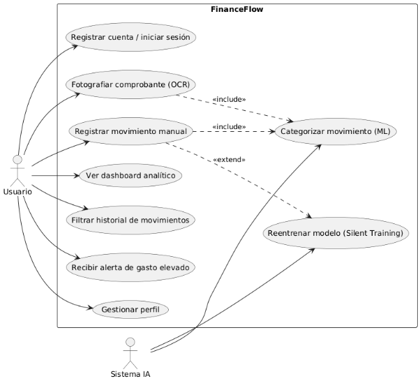

## **3.2 Vista Lógica**
### **3.2.1 Diagrama de Subsistemas (Paquetes)**
El sistema FinanceFlow se organiza en cinco subsistemas desacoplados. La dependencia entre paquetes sigue el flujo: frontend → sdk → backend → database. El paquete sdk actúa como intermediario entre el frontend y el backend, implementando el patrón adaptador con feature flags que permite la migración gradual de servicios sin interrumpir la operación. El paquete ml\_backend opera de forma autónoma como microservicio independiente, accedido directamente desde el frontend o desde el backend según el tipo de operación.

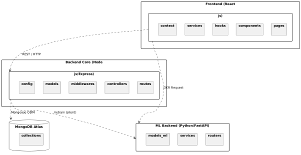
### **3.2.2 Diagrama de Secuencia (Vista de Diseño)**
Se presentan los flujos de interacción más representativos del sistema. Cada diagrama refleja la arquitectura real en capas: React → SDK/wrapper ES6 → HttpClient axios → Express Router → Controller → Service → Mongoose → MongoDB.

**Secuencia 1: Autenticación de Usuario**

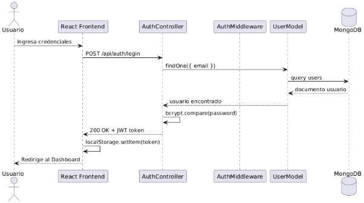

**Secuencia 2: Registro de Movimiento con OCR**

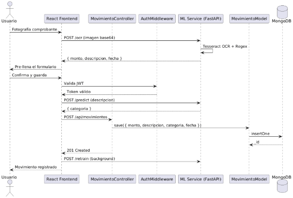

**Secuencia 3: Visualización del Dashboard**

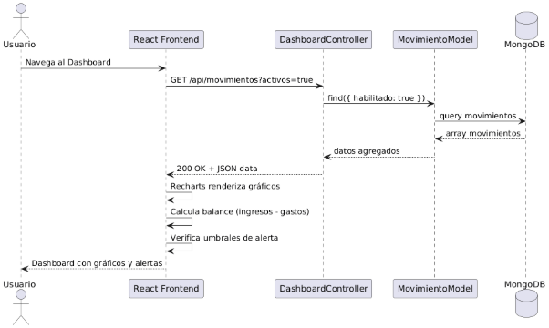
### **3.2.3 Diagrama de Colaboración (Vista de Diseño)**
El diagrama de colaboración muestra las relaciones de comunicación numeradas entre objetos durante el flujo de registro de un movimiento con categorización ML. A diferencia del diagrama de secuencia, pone énfasis en las asociaciones entre objetos más que en el orden temporal de los mensajes.

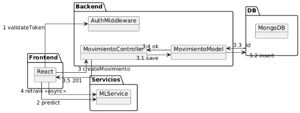
### **3.2.4 Diagrama de Objetos**
El diagrama de objetos muestra instancias concretas del sistema en tiempo de ejecución. Se representa el estado del sistema para un usuario autenticado con movimientos registrados en diferentes estados, reflejando la estructura real de las colecciones MongoDB.

**Objetos: Sesión de Usuario autenticado con movimientos**

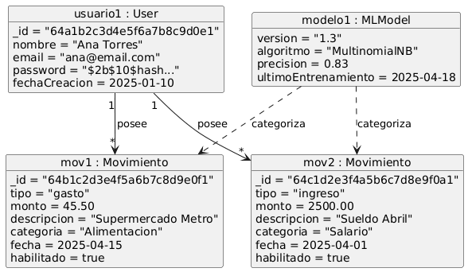
### **3.2.5 Diagrama de Clases**
El diagrama de clases presenta la estructura estática completa del sistema, incluyendo los modelos Mongoose del backend, el SDK con sus módulos y adaptadores, y los servicios del frontend. Las relaciones reflejan la arquitectura real del repositorio: los servicios ES6 del frontend delegan en los adaptadores, que a su vez instancian el SDK como implementación alternativa al servicio original.

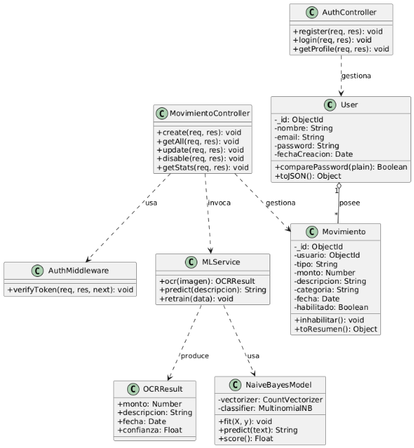
### **3.2.6 Diagrama de Base de Datos**
FinanceFlow utiliza MongoDB Atlas como base de datos NoSQL orientada a documentos. El esquema lógico se compone de tres colecciones principales: users, movimientos y logs. Las relaciones entre colecciones se implementan mediante referencias ObjectId (equivalente a Foreign Keys en bases de datos relacionales). El campo estado en movimientos implementa el borrado lógico (RN-05 del SRS), y el campo resetPasswordToken implementa el ciclo de recuperación de contraseña de un solo uso (RN-07).

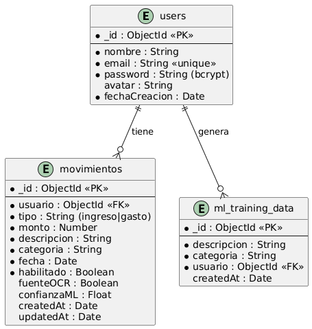

## **3.3 Vista de Implementación (Vista de Desarrollo)**
### **3.3.1 Diagrama de Arquitectura Software (Paquetes)**
La estructura física del código fuente en el repositorio KrCrimson/FinanceFlow sigue un patrón monorepo con cinco directorios principales de primer nivel. Cada directorio es un servicio autónomo con su propio archivo de dependencias y configuración de entorno. El directorio /sdk alberga la capa de abstracción que desacopla el frontend del backend, y /database contiene los esquemas Mongoose compartidos. El directorio /documentacion alberga los documentos formales del proyecto.

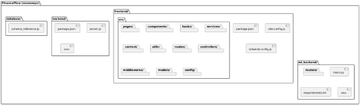

### **3.3.2 Diagrama de Arquitectura del Sistema (Componentes)**
El diagrama de componentes muestra los seis grupos de artefactos ejecutables y sus interfaces de comunicación. El sistema sigue el patrón arquitectónico de tres capas enriquecido con una capa SDK intermedia. La comunicación entre el navegador y los servicios de backend es exclusivamente HTTPS. El microservicio de IA opera como un servicio independiente que puede ser invocado directamente por el frontend (para OCR y predicción síncrona) o por el backend (para reentrenamiento asíncrono).

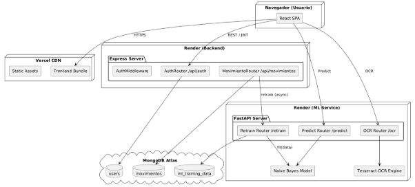

Los seis grupos de componentes y sus responsabilidades:

|**Grupo**|**Tecnología / Artefacto**|**Responsabilidad Principal**|
| :-: | :-: | :-: |
|1\. Usuario (Navegador)|Chrome / Firefox / Edge / Safari|Ejecuta el bundle React compilado. Gestiona el estado de sesión vía AuthContext y los tokens JWT en memoria de la aplicación.|
|2\. Views (Vistas)|React 18 + Tailwind CSS + React Hook Form + Zod|Páginas y componentes visuales responsivos. Valida formularios en cliente con React Hook Form y Zod antes de llamar a los servicios.|
|3\. Controllers (Controladores)|Express.js Controllers + Middlewares|Procesan solicitudes HTTP, aplican autenticación JWT (AuthMiddleware), validación de propiedad de recursos y retornan respuestas JSON estandarizadas.|
|4\. Services (Servicios IA)|FastAPI (Python) + Tesseract + Scikit-Learn|Exponen /ocr (extracción de datos de imagen), /predict (categorización ML) y /retrain (actualización incremental del modelo con partial\_fit).|
|5\. Repositories (SDK + ODM)|FinanceFlowSDK + Mongoose ODM|El SDK abstrae las llamadas HTTP con patrón adaptador y feature flags. Mongoose abstrae las operaciones MongoDB con validación de esquema.|
|6\. Models (Modelos)|Mongoose Schema + Scikit-Learn NaiveBayes|Definen la estructura y validación de datos: Usuario (auth), Movimiento (finanzas, borrado lógico), Log (auditoría) y NaiveBayes (categorización).|

## **3.4 Vista de Procesos**
### **3.4.1 Diagrama de Procesos del Sistema (Diagrama de Actividad)**
Se presentan los tres flujos de actividad más representativos del sistema. Los diagramas reflejan la arquitectura real: el frontend React maneja la lógica de presentación y validación en cliente, el SDK/wrapper delega al backend Node.js para operaciones de datos, y el microservicio Python opera en paralelo para las funciones de IA.

**Actividad 1: Registro de movimiento con OCR y categorización ML**

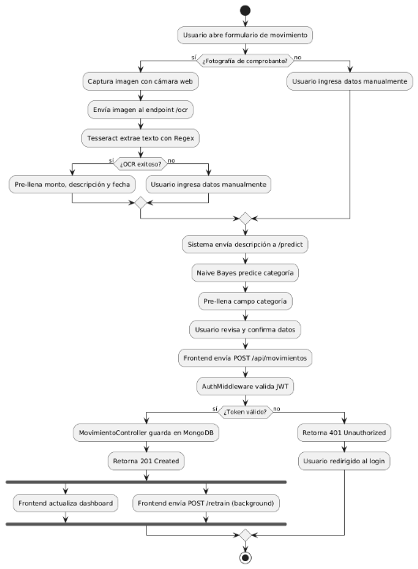

**Actividad 2: Flujo de Silent Training (reentrenamiento)**

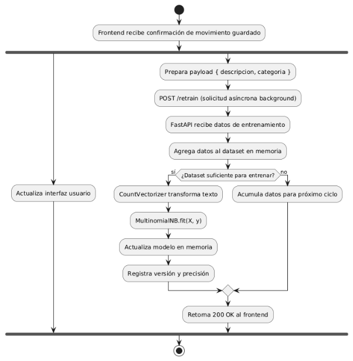

## **3.5 Vista de Despliegue (Vista Física)**
### **3.5.1 Diagrama de Despliegue**
El diagrama de despliegue muestra la asignación física de los artefactos de software a los nodos de infraestructura cloud del sistema. FinanceFlow utiliza un modelo cloud-native con tres proveedores: Vercel para el frontend (CDN con distribución global), Render para los servicios de backend (PaaS con dos instancias independientes: una Node.js y una Python), y MongoDB Atlas para la base de datos (DBaaS en cluster M0). El sistema está en producción en https://financeflow-frontend.vercel.app con 35 deployments registrados.

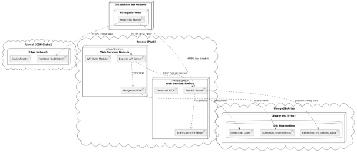

# **4. ATRIBUTOS DE CALIDAD DEL SOFTWARE**
Los escenarios de atributos de calidad describen situaciones concretas y medibles en las que el sistema debe satisfacer sus requerimientos no funcionales (RNF-01 a RNF-15 del SRS). Cada escenario sigue la estructura del modelo de Len Bass: Fuente del Estímulo → Estímulo → Entorno → Artefacto → Respuesta → Medida de Respuesta.

## **Escenario de Funcionalidad — Registro con OCR**

|**Elemento**|**Descripción**|
| :-: | :-: |
|Fuente del estímulo|Usuario autenticado con token JWT válido.|
|Estímulo|El usuario fotografía un comprobante de compra en Supermercado Metro y solicita el procesamiento OCR.|
|Entorno|Sistema en operación normal. Imagen con buena iluminación y texto legible. Conexión a Internet estable.|
|Artefacto|Microservicio FastAPI (Python): OCR Router + Tesseract Engine + NaiveBayes /predict. Backend Node.js: MovimientoController + Movimiento.save().|
|Respuesta|El sistema extrae monto (45.50), descripción ('Supermercado Metro') y fecha (2026-04-05) del comprobante, predice la categoría 'Alimentacion' con el modelo NaiveBayes y guarda el movimiento en MongoDB con estado='activo'. El Silent Training se dispara en segundo plano con partial\_fit().|
|Medida de respuesta|Movimiento registrado correctamente en ≤ 10 segundos totales (OCR ≤ 8 s + CRUD ≤ 300 ms). Precisión de extracción OCR ≥ 85% en condiciones de buena iluminación.|

## **Escenario de Usabilidad — Registro Manual sin Capacitación**

|**Elemento**|**Descripción**|
| :-: | :-: |
|Fuente del estímulo|Usuario nuevo sin experiencia previa en la plataforma.|
|Estímulo|El usuario intenta registrar su primer egreso ('Almuerzo universitario', S/ 12.50, categoría 'Alimentacion') usando el formulario manual.|
|Entorno|Sistema operativo en condiciones normales. Acceso desde navegador de escritorio (Chrome). Usuario sin capacitación.|
|Artefacto|Interfaz React 18: componente FormMovimiento con React Hook Form + Zod. Hook useMovimientos para la llamada al SDK.|
|Respuesta|El usuario completa el formulario asistido por la validación inline de React Hook Form (errores en tiempo real sin submit), la categorización automática ML pre-llena el campo categoría, y el movimiento se guarda con un solo clic en 'Guardar'.|
|Medida de respuesta|Tarea completada en ≤ 60 segundos. Tasa de completitud de tareas primarias ≥ 90% (RNF-11). Sin errores de servidor en el flujo feliz.|

## **Escenario de Rendimiento — Carga Concurrente**

|**Elemento**|**Descripción**|
| :-: | :-: |
|Fuente del estímulo|50 usuarios concurrentes autenticados accediendo al sistema en horario pico.|
|Estímulo|50 solicitudes simultáneas: 30 GET /api/movimientos?estado=activo y 20 POST /api/movimientos.|
|Entorno|Sistema en producción en Render Starter Plan (512 MB RAM, sin cold start). MongoDB Atlas M0 con índices en userId y estado.|
|Artefacto|Backend Node.js Express (server.js) con Mongoose. MongoDB Atlas Cluster M0.|
|Respuesta|El sistema procesa todas las solicitudes sin errores HTTP 5xx ni timeouts. Los índices en userId y estado garantizan búsquedas eficientes. Node.js event loop gestiona la concurrencia sin bloqueos.|
|Medida de respuesta|Latencia promedio ≤ 300 ms para el 95% de solicitudes CRUD (RNF-06). Sin degradación > 20% del tiempo de respuesta bajo carga de 100 req/s (RNF-07). Referencia: 172 ms promedio medido en stress testing con 66 tests.|

## **Escenario de Mantenibilidad — Incorporación de Nuevo Servicio al SDK**

|**Elemento**|**Descripción**|
| :-: | :-: |
|Fuente del estímulo|Desarrollador del equipo (RNF-13, RNF-14).|
|Estímulo|Se requiere agregar un módulo 'planificador' al SDK para gestionar el planificador de compras sin modificar los servicios existentes del frontend.|
|Entorno|Sistema en operación. El cambio se realiza en rama feature/planificador-sdk del repositorio.|
|Artefacto|sdk/src/modules/ (nuevo archivo planificador.js), sdk/src/adapters/ (planificador-adapter.js), frontend/src/services/planificadorService.js (wrapper ES6).|
|Respuesta|El desarrollador crea el módulo planificador siguiendo el patrón establecido (AuthModule como referencia), lo registra en FinanceFlowSDK.configure() y crea el adaptador con feature flag. Los tests existentes del SDK no requieren modificación.|
|Medida de respuesta|Nuevo módulo implementado, testeado y desplegado en ≤ 4 horas de trabajo. Principio OCP cumplido: 0 líneas modificadas en módulos existentes del SDK. Cobertura de tests ≥ 70% mantenida (RNF-14).|

## **Escenario de Rendimiento — Cold Start en Plan Gratuito**

|**Elemento**|**Descripción**|
| :-: | :-: |
|Fuente del estímulo|Usuario que accede al sistema tras más de 15 minutos de inactividad (plan Free de Render).|
|Estímulo|Primera solicitud HTTP al backend Node.js o al microservicio Python tras periodo de suspensión automática de Render.|
|Entorno|Sistema en plan gratuito de Render. Instancias suspendidas por inactividad. Cold start habilitado.|
|Artefacto|Render Web Service (Node.js) y Render Web Service (Python). Frontend React con lógica de reintentos.|
|Respuesta|El frontend detecta el tiempo de espera elevado (timeout inicial) y muestra un indicador de carga con el mensaje 'Iniciando servicio, por favor espere...'. Reintenta la solicitud automáticamente tras 5 segundos.|
|Medida de respuesta|El servicio responde en ≤ 50 segundos tras el cold start. El usuario recibe feedback visual durante toda la espera. La segunda solicitud (servicio ya activo) responde en ≤ 300 ms (RNF-06).|

## **Escenario de Usabilidad — Alerta de Gasto Elevado**

|**Elemento**|**Descripción**|
| :-: | :-: |
|Fuente del estímulo|Usuario autenticado con umbral de alerta configurado en S/ 500.00 para la categoría 'Entretenimiento'.|
|Estímulo|El usuario registra un egreso de S/ 650.00 en categoría 'Entretenimiento' (POST /api/movimientos).|
|Entorno|Sistema en operación normal. Dashboard activo en la misma sesión del navegador.|
|Artefacto|MovimientoController (verificación de umbral), DashboardPage (componente AlertaGasto), useBalance hook (recálculo en tiempo real).|
|Respuesta|Tras la confirmación del registro (HTTP 201), el hook useBalance recalcula el balance excluyendo movimientos inactivos (RN-03 del SRS). El componente AlertaGasto detecta la superación del umbral y renderiza una alerta visual en el dashboard con el mensaje 'Gasto elevado detectado en Entretenimiento'.|
|Medida de respuesta|Alerta visible en el dashboard en ≤ 2 segundos tras la confirmación del registro. Balance recalculado correctamente excluyendo movimientos con estado='inactivo'.|

## **Escenario de Funcionalidad — Borrado Lógico y Auditoría**

|**Elemento**|**Descripción**|
| :-: | :-: |
|Fuente del estímulo|Usuario autenticado que detecta un movimiento duplicado en su historial.|
|Estímulo|El usuario selecciona 'Eliminar' en el movimiento duplicado y confirma en el modal de seguridad '¿Está seguro?'.|
|Entorno|Sistema en operación normal. El movimiento tiene estado='activo' en MongoDB.|
|Artefacto|MovimientoController (endpoint PATCH /api/movimientos/:id), Movimiento.findByIdAndUpdate(), AuthMiddleware (validación de propiedad userId == JWT.userId).|
|Respuesta|El sistema cambia el campo estado='inactivo' sin eliminar el documento físicamente. El movimiento desaparece del dashboard y del cálculo de balance. El documento persiste en MongoDB para auditoría histórica. Si el userId del token no coincide con el userId del movimiento, el sistema retorna HTTP 403 Forbidden (RN-02 del SRS).|
|Medida de respuesta|Movimiento inactivado en ≤ 500 ms. Dashboard actualizado en tiempo real. El movimiento NO aparece en GET /api/movimientos?estado=activo. El documento SÍ persiste en MongoDB (borrado lógico confirmado, RN-05 del SRS).|

## **Escenario de Mantenibilidad — Logging de Errores del Sistema**

|**Elemento**|**Descripción**|
| :-: | :-: |
|Fuente del estímulo|Error no controlado en el microservicio de IA durante el proceso de reentrenamiento.|
|Estímulo|El endpoint /retrain del FastAPI lanza una excepción no capturada al intentar partial\_fit() con datos mal formateados.|
|Entorno|Sistema en operación. El Silent Training opera de forma asíncrona en segundo plano.|
|Artefacto|ErrorHandler middleware (backend Node.js), Log.create() (Mongoose model), GET /api/logs (LogsController para administrador).|
|Respuesta|El errorHandler del backend intercepta el error retornado por el microservicio Python, crea un documento Log con campos: nivel='error', mensaje, stack trace, endpoint='/retrain', método='POST', statusCode=500. El error no interrumpe la sesión del usuario (el Silent Training falla silenciosamente con try-catch). El administrador puede consultar el error via GET /api/logs (RN-12 del SRS).|
|Medida de respuesta|Error registrado en MongoDB (colección logs) en ≤ 100 ms desde la ocurrencia. El usuario no experimenta interrupción en la interfaz. El log contiene todos los campos definidos en RN-12 del SRS.|

