# Diagramas Mejorados SAD

Este archivo contiene 15 diagramas en Mermaid, alineados con la cantidad de imagenes originales ubicadas en la carpeta principal del SAD.

## 01. Modelo 4+1
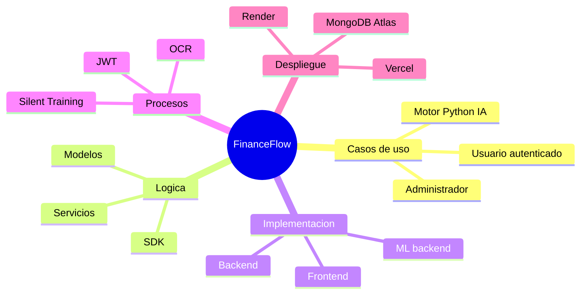

## 02. Vista de casos de uso
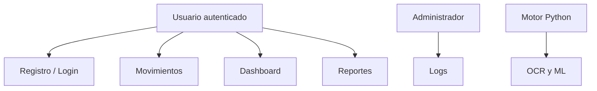

## 03. Vista logica de subsistemas
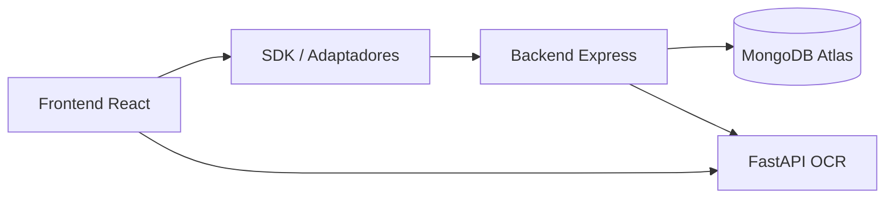

## 04. Secuencia de autenticacion
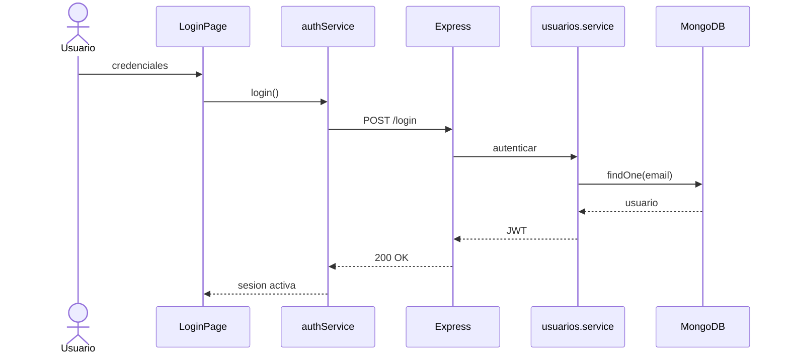

## 05. Secuencia OCR
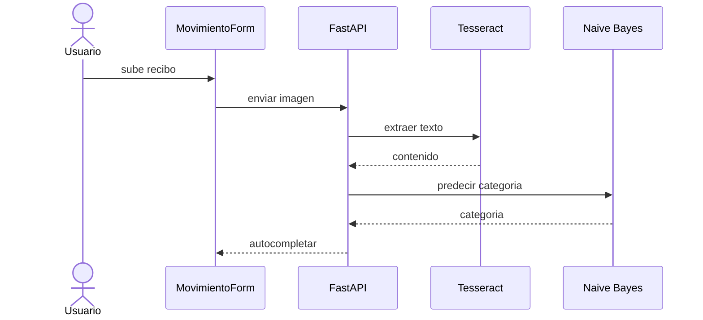

## 06. Secuencia dashboard
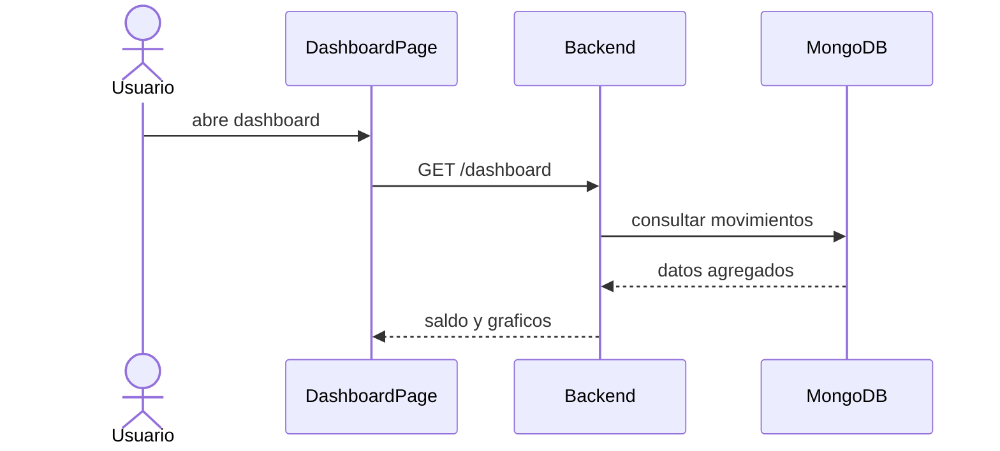

## 07. Colaboracion entre objetos
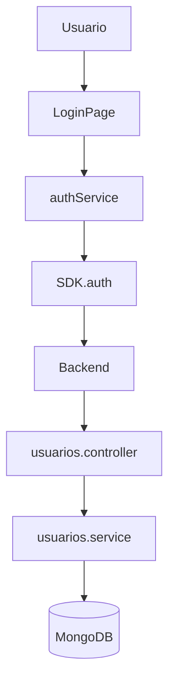

## 08. Diagrama de objetos
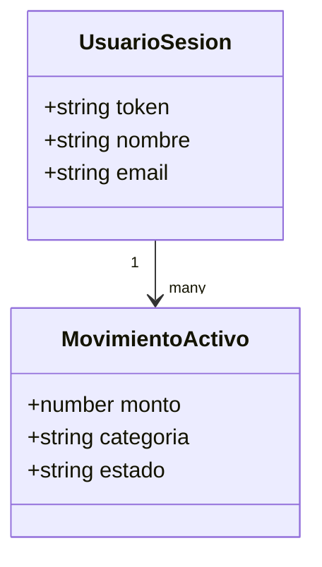

## 09. Diagrama de clases
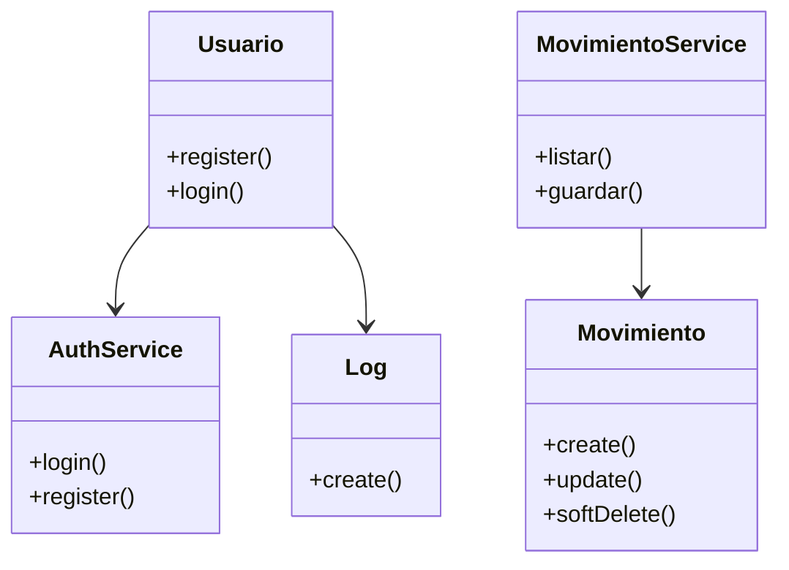

## 10. Base de datos
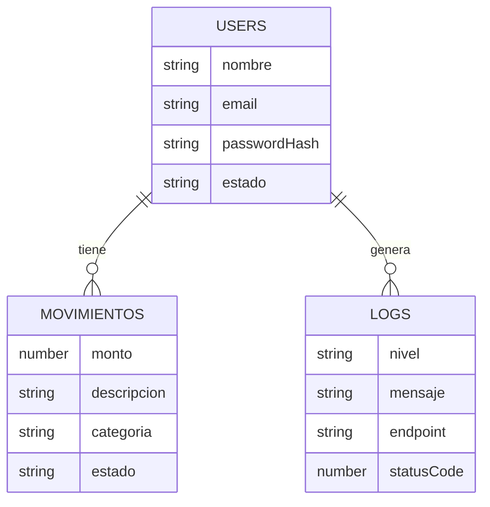

## 11. Arquitectura de software por paquetes
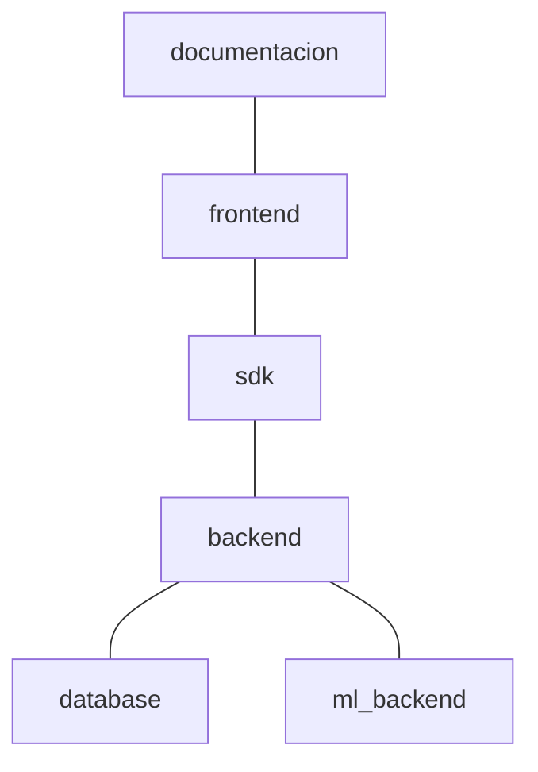

## 12. Arquitectura de componentes
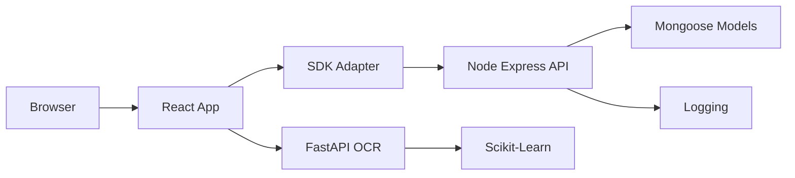

## 13. Proceso OCR y registro
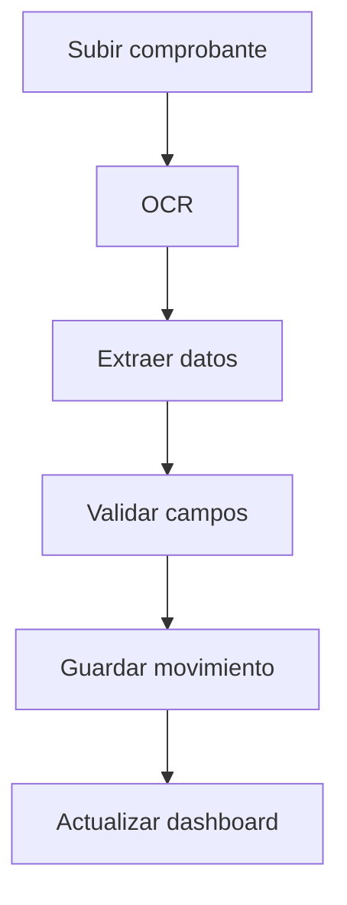

## 14. Proceso de silent training
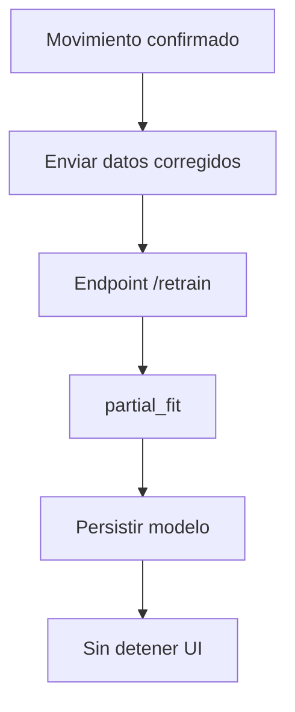

## 15. Despliegue fisico
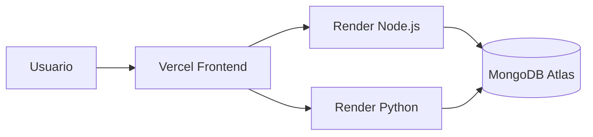
