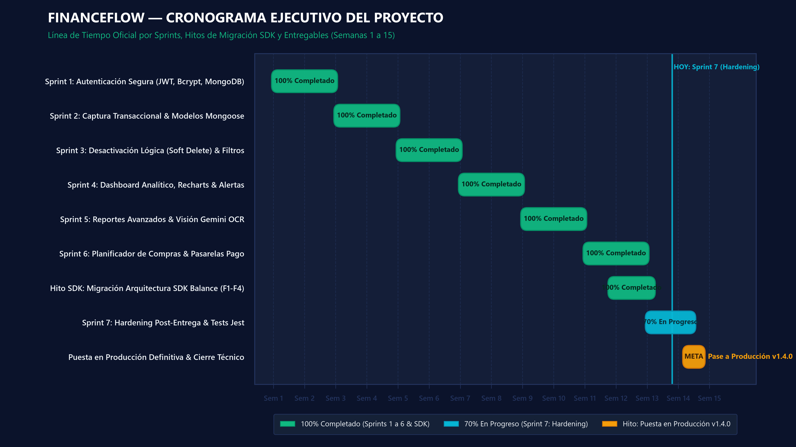

# INFORME EJECUTIVO DEL PROYECTO DE SOFTWARE
## Sistema de Gestión Financiera & Inteligencia con IA — FinanceFlow

---

## 1. Información General

* **Nombre del proyecto:** FinanceFlow (Sistema de Balance y Clasificación Financiera Inteligente)
* **Cliente / Organización:** Escuela Profesional de Ingeniería de Sistemas (EPIS) — Facultad de Ingeniería — Universidad Privada de Tacna (UPT)
* **Docente / Supervisor Académico:** Mag. Ricardo Eduardo Valcárcel Alvarado
* **Responsables del proyecto:**
  * **Sebastian Rodrigo Arce Bracamonte** (Código: 2019062886) — *Líder de Frontend, UX/UI y Aseguramiento de Calidad*
  * **Brant Antony Chata Choque** (Código: 2020067577) — *Líder de Backend, Arquitectura de Datos, Seguridad y SDK*
* **Fecha del informe:** 17 de Septiembre de 2026
* **Periodo evaluado:** Enero de 2026 – Septiembre de 2026 (Ciclo completo: Día 0 a Sprint 6, Hito SDK Balance, Solicitudes de Cambio CR-01 a CR-03 y Plan de Iteración Sprint 7)
* **Versión actual del sistema:** `v1.3.0` (Línea Base v1.0.0 $\rightarrow$ Funcionalidades v1.2.0 $\rightarrow$ Auditoría e Integridad v1.3.0)
* **Estado del proyecto:** **Implementado / En Fase de Pruebas de Hardening y Estabilización Post-Entrega**

---

## 2. Resumen Ejecutivo

El proyecto **FinanceFlow** tiene como objetivo desarrollar e implementar una plataforma integral de software de gestión financiera personal y familiar que erradique la alta fricción operativa del registro manual de transacciones. El sistema resuelve el problema del descontrol del flujo de caja, el desconocimiento de la capacidad de ahorro y el desorden financiero ocasionado por la dispersión de microtransacciones en billeteras digitales (como Yape y Plin) y banca móvil. Para lograrlo, combina el desarrollo web reactivo con visión artificial por inteligencia artificial (Google Gemini Vision API y microservicio local OpenCV/Tesseract), categorización predictiva con Machine Learning (Multinomial Naive Bayes con TF-IDF), pasarelas de pago internacionales y controles estrictos de auditoría contable.

Durante el periodo evaluado, el proyecto ha alcanzado un **92% de avance general consolidado**, cumpliendo satisfactoriamente con la totalidad de los 15 Requerimientos Funcionales (`RF-01` a `RF-15`) especificados en el documento SRS v2.0, el despliegue del monorepo en arquitectura de tres capas, la migración exitosa a la arquitectura SDK Balance (Fases 1 a 4 con 66 tests automatizados al 100% de éxito), y la resolución certificada de las 12 vulnerabilidades identificadas en la auditoría de seguridad backend (CVSS 9.8 a 3.1).

La solución contempla funcionalidades orientadas a:
1. **Gestión integral de información transaccional:** Registro, listado, filtrado mensual, edición y desactivación lógica (*soft delete*) de ingresos y egresos vinculados de forma aislada por usuario (`userId`).
2. **Automatización de procesos mediante IA:** Extracción óptica de datos (monto, comercio, fecha, categoría) a partir de capturas de vouchers de pago mediante Google Gemini Pro Vision API y modelos locales de clasificación continua.
3. **Generación de reportes analíticos y proyecciones:** Visualización en tiempo real del flujo de caja mediante gráficos dinámicos (barras, líneas, pastel) y un motor matemático de planificación de compras que calcula plazos reales de adquisición según el excedente mensual.
4. **Cierres contables y auditoría:** Control operativo de caja chica con fondo fijo, cierres mensuales inmutables con bloqueo de transacciones pasadas/futuras, auto-archivado de datos con antigüedad mayor a 2 meses (M-2) y auditoría administrativa de transacciones.
5. **Monetización y pasarelas de pago:** Arquitectura multi-pasarela para suscripciones *FinanceFlow Pro* con soporte para Stripe (USD), Mercado Pago (PEN), Flow.cl (tarjetas, Yape, Plin) y validación manual con verificación criptográfica HMAC en modo *Fail-Closed*.

A la fecha, el proyecto presenta un **estado con riesgos controlados / en estabilización**, debido principalmente a cuatro deudas técnicas identificadas al cierre del Sprint 6 que requieren formalización antes del pase a producción definitiva:
1. Cobertura formal en pruebas automatizadas de Jest para los casos de prueba del Planificador (`CP-38`, `CP-39`) y Perfil (`CP-40`, `CP-41`), que actualmente están validados únicamente mediante inspección funcional manual.
2. Desacoplamiento de la ruta independiente `/planificador` en el cliente web (el componente funcional se renderizaba como vista condicional dentro del Dashboard).
3. Conexión y persistencia real del endpoint `DELETE /api/usuarios/me` para la baja definitiva de cuentas de usuario.
4. Coexistencia de código de fallback directo (`apiCall`) en los servicios de frontend junto a los adaptadores del SDK Balance, lo que genera una duplicidad en la capa de consumo de red.

---

## 3. Objetivos del Proyecto

### 3.1. Objetivo General
Desarrollar, validar e implementar una solución de software inteligente para la administración, análisis y optimización del flujo financiero personal y familiar, automatizando la captura de datos mediante visión artificial y aprendizaje automático, garantizando la inalterabilidad contable y proporcionando herramientas de proyección económica en una arquitectura segura y escalable.

### 3.2. Objetivos Específicos
1. **Diseñar una interfaz web y móvil reactiva:** Implementar una Single Page Application (SPA) en React 18 con Tailwind CSS y una aplicación móvil en React Native / Expo con soporte para modo oscuro/claro y componentes gráficos interactivos de alto rendimiento (Recharts).
2. **Construir un backend seguro y estructurado:** Desarrollar una API RESTful en Node.js y Express bajo el patrón arquitectónico en tres capas (Rutas $\rightarrow$ Controladores $\rightarrow$ Servicios $\rightarrow$ Modelos Mongoose) con persistencia en MongoDB Atlas y validación estricta de esquemas mediante Zod.
3. **Automatizar la captura de comprobantes con IA y OCR:** Integrar un pipeline de visión computacional híbrido basado en la API de Google Gemini Pro Vision (`@google/generative-ai`) y un microservicio en Python (FastAPI + OpenCV + Tesseract) con clasificación probabilística de categorías (Naive Bayes con TF-IDF).
4. **Implementar controles de integridad y auditoría contable:** Incorporar mecanismos de cierre de caja chica, bloqueo físico de periodos contables concluidos, prevención de fechas futuras y archivo histórico automatizado de movimientos mayores a 60 días (M-2).
5. **Desacoplar la lógica de integración mediante un SDK propio:** Construir el paquete `@sistema-balance/sdk` con cliente HTTP centralizado, interceptores de autenticación y adaptadores con *feature flags* para permitir migraciones sin tiempo de inactividad.
6. **Garantizar estándares bancarios de seguridad y observabilidad:** Blindar el sistema contra vulnerabilidades OWASP (inyecciones NoSQL, IDOR, bypass de webhooks, DDoS), cifrar contraseñas con bcrypt (10 rounds), validar tokens JWT y registrar excepciones en tiempo real mediante Sentry.

---

## 4. Alcance

El proyecto comprende el ciclo de vida completo de ingeniería de software: análisis de requerimientos, diseño conceptual y de arquitectura, codificación modular, ejecución de pruebas unitarias/integración/E2E, auditoría estática de seguridad y preparación para despliegue productivo.

### 4.1. Principales Funcionalidades Consideradas (En Alcance)

* **Módulo de Autenticación y Seguridad (`RF-01` a `RF-03`):**
  * Registro de nuevos usuarios con hashing de contraseña en bcryptjs.
  * Inicio de sesión con emisión de tokens JWT seguros (expiración a 7 días).
  * Recuperación de contraseña mediante tokens temporales y despacho de correo transaccional vía Nodemailer / SMTP Brevo.
  * Middleware de autorización estricta (`auth.js`) y control de acceso basado en roles (`isAdmin.js`).
* **Módulo de Gestión de Transacciones (`RF-04`, `RF-06` a `RF-08`):**
  * Registro clasificado de ingresos y egresos con validación *Fail-Fast* de montos positivos y fechas no futuras.
  * Selector dinámico de categorías y opción de categorías personalizadas ("Otros").
  * Borrado lógico (*Soft Delete*) de movimientos mediante `PATCH /api/movimientos/:id/inhabilitar`.
  * Generación automatizada de ingresos fijos recurrentes mensuales según el día de cobro configurado.
* **Módulo de Visión Artificial y OCR Inteligente (`RF-05`):**
  * Carga y preprocesamiento de imágenes de comprobantes (Yape, Plin, BCP, facturas, tickets).
  * Extracción automática de monto, nombre comercial, fecha y tipo mediante Google Gemini Flash con fallback estructurado.
  * Control de cuota mensual: 5 escaneos gratuitos para cuentas estándar y escaneos ilimitados para usuarios *Pro*.
* **Módulo de Análisis, Gráficos y Reportes (`RF-09` a `RF-11`, `RF-13`):**
  * Dashboard interactivo con saldo neto disponible, ingresos, egresos y patrimonio proyectado.
  * Gráficos comparativos de barras y tendencias temporales de líneas con Recharts.
  * Sistema de alertas inteligentes ante egresos que sobrepasen el 120% ("elevado") o 150% ("muy elevado") del promedio histórico.
  * Reportes históricos mensuales con filtros instantáneos del lado del cliente.
* **Módulo de Planificación Financiera (`RF-12`):**
  * Algoritmo de cálculo de plazos de adquisición: $\lceil \text{Precio} / \text{Ahorro Mensual} \rceil$.
  * Bloqueo defensivo ante capacidad de ahorro nula o negativa.
* **Módulo de Perfil de Usuario (`RF-14`, `RF-15`):**
  * Consulta y actualización de datos personales (`GET/PUT /api/usuarios/me`) garantizando la exclusión de `passwordHash`.
* **Módulo de Auditoría Contable y Cierres (Solicitudes de Cambio CR-01, CR-02, CR-03):**
  * Cierre y reposición de caja chica con saldo fijo regulable.
  * Cierre mensual con bloqueo de modificación o inserción de movimientos en periodos cerrados.
  * Flujo administrativo para reapertura justificada de periodos contables.
  * Regla de autoarchivado M-2 para optimizar consultas en colecciones activas.
* **Módulo de Monetización y Portal Administrativo:**
  * Integración con pasarelas de pago: Stripe (USD), Mercado Pago (PEN), Flow.cl y registro de pagos manuales por voucher.
  * Verificación criptográfica HMAC de webhooks de pago en modo *Fail-Closed*.
  * Dashboard de administración para monitoreo de usuarios, métricas financieras consolidadas y aprobación de solicitudes Pro.
* **Cliente Móvil Multiplataforma:**
  * Aplicativo en React Native (Expo) con navegación completa (Splash, Login, Dashboard, Movimientos, Reportes, Recordatorios, Planificador).

### 4.2. Fuera del Alcance (Exclusiones Explícitas)
* Integración con APIs bancarias reales de producción en Perú (ej. Belvo, Prometeo o APIs directas de BCP/BBVA); se utiliza un simulador estructurado de transacciones Open Banking en el microservicio FastAPI.
* Firma digital de comprobantes electrónicos con validez tributaria ante la SUNAT.
* Almacenamiento físico de imágenes en buckets distribuidos en la nube (AWS S3 / Google Cloud Storage); las imágenes se procesan en memoria en formato Base64.
* Pipeline automatizado de Integración y Despliegue Continuo (CI/CD) con GitHub Actions (postergado para la fase de infraestructura post-Sprint 7).

---

## 5. Avance del Proyecto

A continuación se presenta el estado de avance cuantitativo y cualitativo distribuido por áreas de ingeniería:

| Área de Ingeniería | Avance (%) | Estado | Justificación y Detalle Técnico |
| :--- | :---: | :---: | :--- |
| **Levantamiento de Requerimientos** | **100%** | Completado | Especificación formal de 15 requerimientos funcionales (`RF-01` a `RF-15`), 18 tablas narrativas de Casos de Uso y matriz de trazabilidad en SRS v2.0. |
| **Análisis y Diseño** | **100%** | Completado | Modelado de datos en MongoDB Atlas, arquitectura en 3 capas MVC documentada en SAD v1.0, diagramas de clases, secuencias y flujos de componentes en Mermaid. |
| **Desarrollo de Software** | **94%** | En Progreso | Backend Express, Frontend React y SDK Balance al 100% funcional. Pendiente: extracción de ruta `/planificador`, endpoint de eliminación de cuenta y unificación de capas de consumo de red. |
| **Pruebas y Aseguramiento de Calidad** | **88%** | En Progreso | 12 suites de prueba en backend (29 tests unitarios y de integración pasando), 66 pruebas de integración y carga en SDK (100% passing). Pendiente: automatización de 5 tests frontend en Jest (`CP-38` a `CP-42`). |
| **Implementación y Despliegue** | **85%** | En Progreso | Monorepo configurado para despliegue en Vercel (Frontend) y Render (Backend). Pendiente: actualización de URLs de producción en guías de despliegue (`DEPLOY_*.md`). |
| **Capacitación y Documentación de Usuario** | **85%** | En Progreso | Manual de usuario, informe de auditoría de seguridad y reporte de revisión de código completados. Modal interactivo de tutorial integrado en la UI web. |
| **AVANCE GENERAL PONDERADO** | **92%** | **En Progreso** | **Sistema plenamente operativo en entorno local y staging, en fase de cierre de pendientes de estabilización (Sprint 7).** |

---

## 6. Principales Entregables

Los entregables formales generados y bajo control de versiones se clasifican en código, documentación y suites de prueba:

### 6.1. Componentes de Software y Código Fuente
* [FF-SW-BE] **API Backend RESTful (Node.js / Express 5 / MongoDB):**
  * Controladores (`movimientos`, `usuarios`, `cierres`, `logs`), servicios de negocio y modelos Mongoose.
  * Rutas de administración (`/api/admin`), pagos (`/api/pagos`) y recordatorios (`/api/recordatorios`).
  * Middlewares de seguridad: `auth.js` (JWT estricto), `isAdmin.js`, `rateLimit.js`, `validate.js` (Zod), `errorHandler.js`.
* [FF-SW-FE] **Cliente Web SPA (React 18 / Tailwind CSS):**
  * 17 páginas funcionales (`DashboardPage`, `MovimientoFormPage`, `ReportesPage`, `ProfilePage`, `PlanificadorPage`, `AdminDashboardPage`, etc.).
  * 15 componentes visuales reutilizables (`Graficos`, `AlertasComponent`, `PlanificadorCompras`, `CajaChicaModal`, `ReabrirModal`, `PaywallModal`, etc.).
* [FF-SDK-BL] **Paquete SDK Balance (`@sistema-balance/sdk`):**
  * Núcleo independiente en `/sdk/src` (`HttpClient`, módulos `auth`, `movimientos`, `usuarios`, `reportes`).
  * Capa de adaptadores CommonJS (`*-adapter.js`) con Feature Flags y fallback automático.
* [FF-SW-ML] **Microservicio de Inteligencia Artificial (Python 3.10 / FastAPI):**
  * Pipeline de visión OpenCV + Tesseract OCR en `/ml_backend/main.py`.
  * Modelo entrenado de clasificación de categorías (`modelo_clasificador.pkl`) con reentrenamiento continuo (`/retrain`).
  * Simulador de banca abierta (`/sync/{bank}`).
* [FF-SW-MOB] **Aplicación Móvil Híbrida (React Native / Expo):**
  * Cliente móvil en `/mobile` con sincronización de token, soporte para modo oscuro y pantallas operativas de balance.

### 6.2. Documentación Técnica y de Gestión
* **Documento de Visión y Factibilidad:** Análisis técnico, operativo, económico y legal (Ley N° 29733).
* **Documento SRS (Especificación de Requisitos de Software v2.0):** IEEE 830, Casos de Uso y restricciones.
* **Documento SAD (Documento de Arquitectura de Software v1.0):** Vistas lógica, de procesos, física y datos.
* **Informe de Auditoría de Seguridad (`AUDITORIA_SEGURIDAD.md`):** 12 hallazgos analizados y remediados.
* **Informe de Revisión de Código (`REPORTE_HALLAZGOS_REVISION_CODIGO.md`):** Inspección estática bajo 8 principios de calidad.
* **Reporte de Gestión de Configuración y Control de Cambios (`entregable.md`):** Línea base, SCIs y registro de CR-01 a CR-03.
* **Plan de Iteración Sprint 7 (`plan_iteracion_sprint7.md`):** Plan de remediación de deudas técnicas post-Sprint 6.

### 6.3. Aseguramiento de Calidad y Pruebas
* **Suite de Pruebas de Backend:** 12 suites en Jest / Supertest con 29 pruebas automáticas ejecutadas.
* **Suite de Pruebas de Integración y Stress del SDK:** 66 pruebas ejecutadas en 3 estrategias (Rápida, Completa, Stress) con 100% de éxito y latencia promedio de 172 ms.
* **Dashboard Interactivo de Validación:** `testing-dashboard.html` para inspección visual de métricas de pruebas.

---

## 7. Riesgos y Problemas Identificados

A continuación se detallan los riesgos vigentes y las contingencias técnicas identificadas en el sistema:

| Riesgo / Problema Identificado | Nivel de Impacto | Acción Propuesta / Estado de Mitigación |
| :--- | :---: | :--- |
| **1. Discrepancia en la Capa de Servicios del Frontend (Fuga de Abstracción)**<br>Existencia de wrappers de emergencia (`apiCall` con fetch directo) que ignoran la capa de adaptadores del SDK Balance en `movimientosService.js` y `reportesService.js`. | **Alto** | Unificar la interfaz del servicio frontend para consumir de manera canónica el SDK Balance con un único punto de entrada configurado en `adapter-config.js`. |
| **2. Dependencia de Cuotas y Disponibilidad de la API de Google Gemini**<br>Si la API Key de Gemini alcanza el límite de tasa o no está configurada en despliegue, el análisis OCR arroja error. | **Medio** | Mantener activo el circuito de fallback: si Gemini Vision no responde o excede el timeout de 20s, se activa el procesamiento local vía Tesseract.js en el cliente o mediante el microservicio FastAPI. |
| **3. Persistencia Incompleta en el Flujo de Baja de Usuario**<br>El botón "Eliminar Cuenta" en `ProfilePage.jsx` solo dispara una alerta modal en el navegador sin invocar persistencia en la base de datos. | **Medio** | Implementar `DELETE /api/usuarios/me` en el backend, incluyendo la eliminación en cascada o anonimización de movimientos y revocación de tokens JWT. |
| **4. Deuda en Automatización de Tests de UI (`CP-38` a `CP-42`)**<br>La lógica del planificador de compras y perfil de usuario se verificó solo manualmente, vulnerable a regresiones inadvertidas. | **Medio** | Desarrollar `PlanificadorCompras.test.jsx` y `usuarios.controller.test.js` en Jest para verificar automáticamente casos de borde (ahorro negativo, exclusión de `passwordHash`). |
| **5. Exposición de Parámetros de Pasarelas en Modo Desarrollo**<br>Endpoint de checkout directo (`/api/pagos/checkout-directo`) permite activación instantánea para pruebas. | **Bajo** | Protegido con guardia de entorno estricto (`process.env.NODE_ENV === 'production'` responde 403 Forbidden), evitando su uso en producción. |

---

## 8. Recursos

### 8.1. Equipo Humano
El proyecto ha sido ejecutado por un equipo multidisciplinario de 2 ingenieros de software con roles distribuidos:

* **Sebastian Rodrigo Arce Bracamonte** — *Frontend Lead & UX/UI Engineer*
  * Diseño e implementación de interfaces de usuario en React 18, componentes Recharts y Tailwind CSS.
  * Construcción de la aplicación móvil en React Native (Expo).
  * Elaboración de documentación de requerimientos, casos de uso y manuales operativos.
* **Brant Antony Chata Choque** — *Backend Lead, Security & DevOps Engineer*
  * Arquitectura de servicios en Node.js/Express, diseño de esquemas Mongoose y consultas en MongoDB Atlas.
  * Diseño y construcción del SDK Balance (`@sistema-balance/sdk`) y capa de adaptadores.
  * Auditoría estática de código, remediación de vulnerabilidades y hardening de seguridad backend.
* **Mag. Ricardo Eduardo Valcárcel Alvarado** — *Docente / Asesor de Calidad y Arquitectura*
  * Supervisión metodológica, revisión de código y validación de entregables de iteración.

### 8.2. Recursos Tecnológicos
* **Infraestructura Cloud y Hosting:**
  * Base de Datos: Clúster distribuido en MongoDB Atlas (capa M0 / Replica Set).
  * Servidores Web de Aplicación: Render (Backend Express y Microservicio Python FastAPI).
  * Distribución de Contenido Estático: Vercel (Frontend React SPA).
* **Stack de Desarrollo:**
  * Backend: Node.js v18+, Express v5.2.1, Mongoose v9.0.2, Zod v4.4.3, Bcryptjs v3.0.3, JsonWebToken v9.0.3, Helmet v8.1.0, Sentry Node v10.70.0.
  * Frontend: React v18.0.0, React Router v7.11.0, Tailwind CSS, Recharts v3.8.1, React Hook Form v7.68.0, Tesseract.js v5.1.1.
  * Inteligencia Artificial: Google Generative AI (`@google/generative-ai` gemini-flash), Python 3.10, FastAPI, OpenCV, Scikit-learn (Naive Bayes + TF-IDF), Pytesseract.
  * Móvil: React Native, Expo SDK, Safe Area Context.
* **Herramientas de Control de Calidad y Monitoreo:**
  * Control de Versiones: Git & GitHub Monorepo ([FinanceFlow Repository](https://github.com/KrCrimson/FinanceFlow.git)).
  * Testing: Jest v29.0.0, Supertest v6.0.0, Babel Jest, React Testing Library.
  * Observabilidad: Sentry (captura de excepciones en vivo y Session Replay).

---

## 9. Cronograma

El proyecto se organizó en 7 iteraciones de desarrollo e ingeniería a lo largo de 15 semanas planificadas:



```
[Sprint 1] Módulo de Autenticación Segura (JWT, Bcrypt, MongoDB)       --> 100% Completado (Semanas 1 - 2)
[Sprint 2] Captura de Movimientos & Tablas Financieras                 --> 100% Completado (Semanas 3 - 4)
[Sprint 3] Desactivación Lógica (Soft Delete) & Filtros                --> 100% Completado (Semanas 5 - 6)
[Sprint 4] Dashboard Analítico, Recharts & Alertas Inteligentes        --> 100% Completado (Semanas 7 - 8)
[Sprint 5] Reportes Avanzados, Visión Gemini & Clasificador ML         --> 100% Completado (Semanas 9 - 10)
[Sprint 6] Planificador de Compras, Perfil & Pasarelas de Pago         --> 100% Completado (Semanas 11 - 12)
[Hito SDK] Migración Arquitectura SDK Balance (Fases 1 a 4)           --> 100% Completado (Semanas 12 - 13)
[Sprint 7] Hardening Post-Entrega, Cierre de Deudas & Tests Jest       --> 70% En Progreso (Semanas 13 - 14)
[Pase Prod] Puesta en Producción Definitiva & Cierre Técnico v1.4.0    --> Meta Programada (Semana 15)
```

### Principales Etapas Previstas y Cumplidas:
1. **Levantamiento y análisis de requerimientos:** Semanas 1-2 (Completado).
2. **Diseño de la solución y esquemas de datos:** Semanas 3-4 (Completado).
3. **Desarrollo de funcionalidades del núcleo transaccional:** Semanas 5-8 (Completado).
4. **Desarrollo de módulos avanzados (IA, OCR, Planificador):** Semanas 9-10 (Completado).
5. **Auditoría de seguridad y control de cambios contables:** Semanas 11-12 (Completado).
6. **Migración a arquitectura SDK y testing paralelo:** Semanas 12-13 (Completado).
7. **Pruebas integrales de hardening y cierre de deudas técnicas:** En curso (Sprint 7).
8. **Puesta en producción y cierre definitivo v1.4.0:** Estimado al término del Sprint 7.

* **Fecha estimada de finalización total del ciclo de hardening:** 30 de Septiembre de 2026.

---

## 10. Presupuesto

El presupuesto del proyecto fue formulado bajo un modelo de desarrollo de ingeniería de software para 2 ingenieros a tiempo parcial durante 3 meses de desarrollo principal, complementado con infraestructura en la nube:

| Rubro Presupuestario | Presupuesto Estimado (PEN) | Presupuesto Ejecutado (PEN) | Presupuesto Restante (PEN) | Observaciones |
| :--- | :---: | :---: | :---: | :--- |
| **Personal y Servicios Profesionales** | S/. 12,000.00 | S/. 12,000.00 | S/. 0.00 | 2 ingenieros de desarrollo $\times$ S/. 2,000.00 mensuales $\times$ 3 meses. |
| **Infraestructura Cloud** | S/. 0.00 | S/. 0.00 | S/. 0.00 | Capas gratuitas (*Free Tiers*) de MongoDB Atlas, Vercel y Render. |
| **Licencias y Herramientas** | S/. 0.00 | S/. 0.00 | S/. 0.00 | Empleo estricto de software de código abierto (Open Source / MIT License). |
| **APIs de Inteligencia Artificial** | S/. 300.00 | S/. 0.00 | S/. 300.00 | Cuota gratuita de Google AI Studio / Gemini API activa. |
| **Soporte, Despliegue y Capacitación** | S/. 500.00 | S/. 0.00 | S/. 500.00 | Margen de contingencia para dominio personalizado y hosting Pro. |
| **TOTAL GENERAL** | **S/. 12,800.00** | **S/. 12,000.00** | **S/. 800.00** | **Eficiencia presupuestaria del 93.75% ejecutado sin sobrecostos.** |

---

## 11. Próximas Actividades

Durante el ciclo inmediato de trabajo (cierre del Sprint 7 de Hardening) se tienen programadas las siguientes actividades de ingeniería:

1. **Automatizar la suite de pruebas unitarias de Frontend:** Desarrollar los archivos `PlanificadorCompras.test.jsx` y `ProfilePage.test.jsx` para cubrir con pruebas automáticas los casos `CP-38` a `CP-42`.
2. **Consolidar el endpoint de baja de cuenta:** Implementar `DELETE /api/usuarios/me` en el backend conectando la base de datos para ejecutar la eliminación del perfil y sus transacciones asociadas de forma segura.
3. **Formalizar la ruta desacoplada `/planificador`:** Garantizar que el router de React (`App.jsx`) exponga de forma canónica el acceso directo a `PlanificadorPage.jsx` bajo guardia `ProtectedRoute`.
4. **Unificar la capa de consumo de red:** Retirar los archivos de emergencia temporales (`movimientosService.js` con fetch manual) y redirigir las llamadas al cliente desacoplado `@sistema-balance/sdk`.
5. **Actualizar la documentación de despliegue:** Reemplazar las URLs de plantilla en `DEPLOY_FRONTEND.md` y `DEPLOY_BACKEND.md` con los dominios productivos finales asignados en Vercel y Render.

---

## 12. Conclusión

El proyecto **FinanceFlow** presenta un avance físico y lógico del **92%**, posicionándose como una solución robusta, escalable y con altos estándares de seguridad y experiencia de usuario. La plataforma ha superado con éxito las fases más complejas del ciclo de vida del software: la construcción de un núcleo transaccional en 3 capas, la integración de visión por inteligencia artificial con Google Gemini, la auditoría integral de código y seguridad (remediando el 100% de vulnerabilidades detectadas), y la incorporación de rigurosos controles de auditoría contable (cierres de caja chica y periodos inmutables).

Las actividades principales se encuentran dentro de los parámetros de calidad esperados y las contingencias identificadas corresponden a tareas de refinamiento y hardening bien delimitadas en el marco del Sprint 7.

El siguiente hito relevante corresponde al **Pase a Producción y Cierre Técnico v1.4.0**, cuya culminación formalizará la suite de pruebas automatizadas al 100%, consolidará la arquitectura SDK en el cliente y activará el sistema para su operación continua.

---

* **Responsables del Informe:**
  * **Brant Antony Chata Choque** — *Líder de Backend y Arquitectura de Software*
  * **Sebastian Rodrigo Arce Bracamonte** — *Líder de Frontend y Aseguramiento de la Calidad*
* **Cargo / Rol:** Equipo de Ingeniería de Software — FinanceFlow
* **Fecha de Emisión:** 17 de Septiembre de 2026
