# 📐 Modelado UML de Análisis y Diseño para FinanceFlow

Este documento presenta el modelado formal de **Análisis** y **Diseño** del sistema **FinanceFlow** a través de la representación de **4 requerimientos específicos** de su especificación técnica (2 fáciles y 2 complejos).

Para garantizar la máxima rigurosidad académica exigida en el Desarrollo Dirigido por Modelos, cada uno de los 4 requerimientos está modelado y analizado de forma totalmente independiente mediante **6 diagramas UML estructurados por fases**:

---

### 🔄 Estructura del Pipeline de Modelado por Requerimiento

```
📦 REQUERIMIENTO
 ├── 🎨 FASE DE ANÁLISIS (Orientada al Negocio / Conceptual)
 │    ├── 1. Diagrama Entidad-Relación Conceptual (ERD Conceptual - Sin llaves ni tipos)
 │    ├── 2. Diagrama de Clases de Análisis (Dominio del negocio)
 │    └── 3. Diagrama de Secuencia de Análisis (Caja Negra / SSD)
 └── ⚙️ FASE DE DISEÑO (Orientada al Software y la Plataforma)
      ├── 4. Modelo Relacional / Físico de Base de Datos (ERD Físico - Con PK, FK y tipos)
      ├── 5. Diagrama de Clases de Diseño (Arquitectura en capas MVC Node.js/Mongoose)
      └── 6. Diagrama de Secuencia de Diseño (Paso de mensajes detallado entre objetos)
```

---

## 🟢 PARTE 1: REQUERIMIENTOS FÁCILES (Transaccionales / Lectura Básica)

---

### 1️⃣ REQUERIMIENTO FÁCIL 1: RF-08 - Botón "Guardar Movimiento"
* **Descripción del Requerimiento**: Acción que envía el payload al servidor (`POST /api/movimientos`) para asentar el registro del movimiento activo en base de datos con `estado='activo'` y asignarle el `userId` del JWT del usuario autenticado.

* **Explicación Teórica de la Transformación**:
  * **En el Análisis**: Representa la necesidad del negocio: un usuario de finanzas que registra sus transacciones lógicas sin pensar en bases de datos o código.
  * **En el Diseño**: Detalla la persistencia técnica en MongoDB. Se especifican los tipos de datos físicos de Mongoose (`ObjectId`, `Number`), la relación de claves físicas, la validación de payloads HTTP con Zod y la invocación de llamadas en la arquitectura Node/Express.

---

### 🎨 A. FASE DE ANÁLISIS (RF-08)

#### 1. Diagrama Entidad-Relación Conceptual (RF-08)
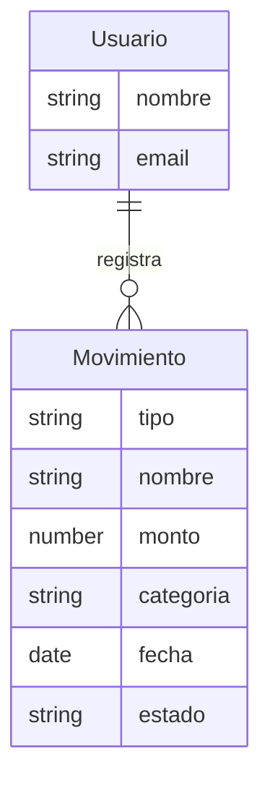
* **Explicación del Diagrama**:
  Muestra las entidades conceptuales del negocio y sus atributos semánticos. No incluye detalles técnicos de base de datos como claves primarias (`PK`), foráneas (`FK`), tipos específicos de base de datos (`ObjectId`) ni de programación. Define una relación simple de negocio: un usuario registra movimientos.

#### 2. Diagrama de Clases de Análisis (RF-08)
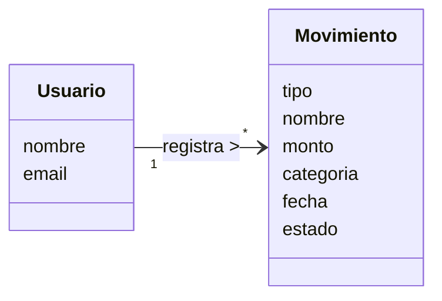
* **Explicación del Diagrama**:
  Representa las clases conceptuales de dominio y su asociación de cardinalidad de uno a muchos (`1:*`), indicando que un objeto lógico `Usuario` es el propietario y gestor de múltiples transacciones de `Movimiento`.

#### 3. Diagrama de Secuencia de Análisis (RF-08)
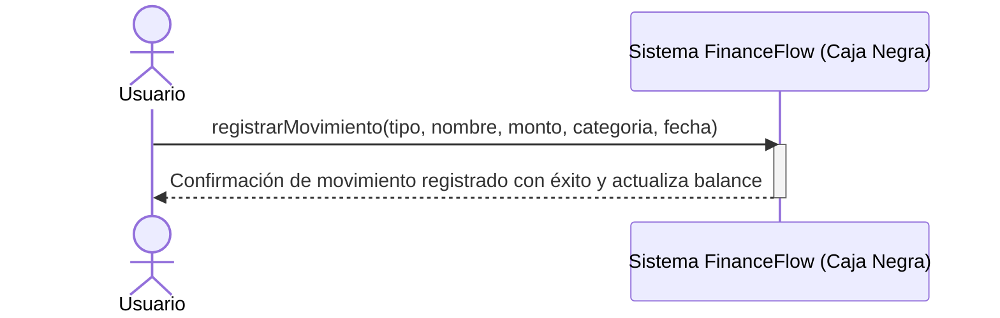
* **Explicación del Diagrama**:
  Diagrama de secuencia de caja negra del sistema (SSD). Muestra la interacción directa del actor con el límite del sistema al invocar la operación conceptual `registrarMovimiento`, abstrayendo la red, servidores y base de datos.

---

### ⚙️ B. FASE DE DISEÑO (RF-08)

#### 4. Modelo Relacional / Físico de Base de Datos (RF-08)
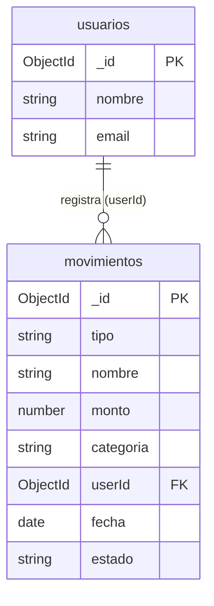
* **Explicación del Diagrama**:
  Representa el diseño de persistencia física en MongoDB. Define las claves primarias (`PK` como `_id`), las claves foráneas de relación (`FK` como `userId`), y los tipos de datos BSON específicos (`ObjectId`, `string`, `number`, `date`).

#### 5. Diagrama de Clases de Diseño (RF-08)
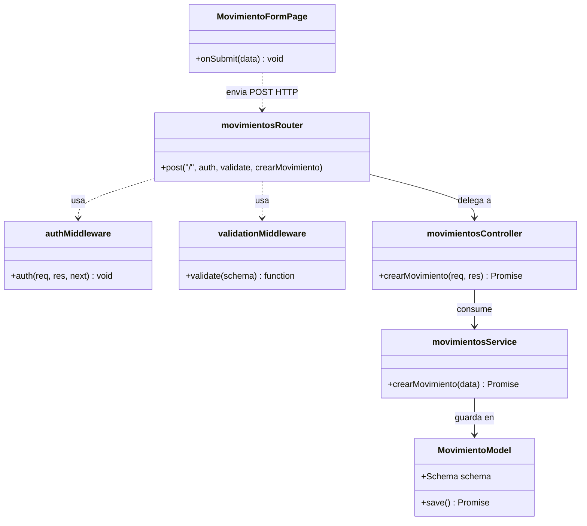
* **Explicación del Diagrama**:
  Muestra la arquitectura en capas del código. El componente React de frontend depende del enrutador de Express, el cual implementa middlewares de seguridad y validación Zod. El controlador y servicio ejecutan la lógica, y la clase `MovimientoModel` interactúa con el ODM Mongoose.

#### 6. Diagrama de Secuencia de Diseño (RF-08)
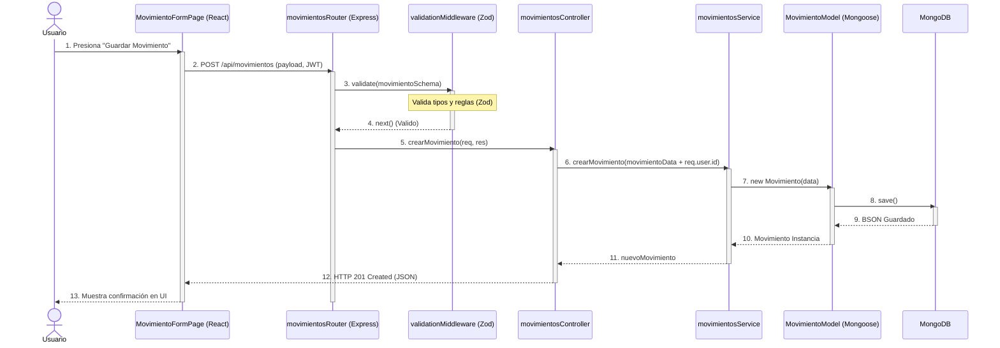
* **Explicación del Diagrama**:
  Muestra el flujo detallado de mensajes de software: el cliente React envía una llamada Axios, el backend valida el payload mediante Zod, intercepta y decodifica las cabeceras JWT para obtener el `userId`, y persiste el registro en MongoDB a través del método `.save()` de Mongoose.

---
---

### 2️⃣ REQUERIMIENTO FÁCIL 2: RF-06 - Lista de Registros
* **Descripción del Requerimiento**: Despliegue en tabla/lista de los movimientos activos del usuario. El backend retorna todos los documentos del `userId` en una petición simple; el filtrado, ordenamiento y la paginación de la información se aplican estrictamente *client-side* en el navegador.

* **Explicación Teórica de la Transformación**:
  * **En el Análisis**: Modela la lectura conceptual del historial financiero. El usuario consulta sus transacciones de forma abstracta.
  * **En el Diseño**: Detalla cómo la petición GET con JWT es autenticada, cómo Mongoose recupera los documentos activos (`estado: 'activo'`) de MongoDB, y cómo React ejecuta el filtrado y ordenamiento en memoria local del cliente.

---

### 🎨 A. FASE DE ANÁLISIS (RF-06)

#### 1. Diagrama Entidad-Relación Conceptual (RF-06)
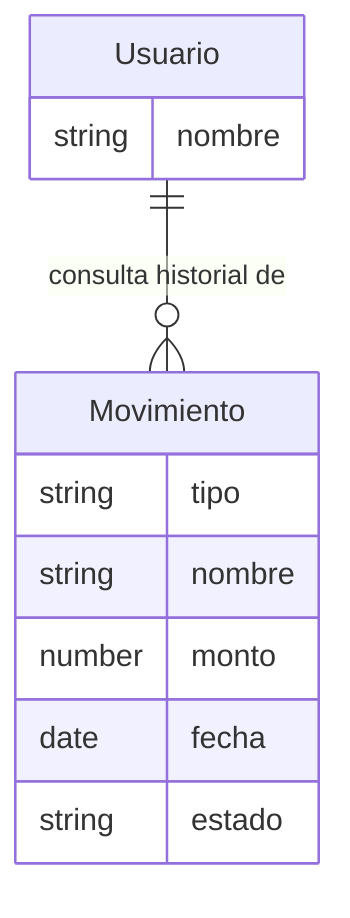
* **Explicación del Diagrama**:
  Muestra las entidades conceptuales necesarias para la lectura del historial. Atributos descriptivos lógicos sin claves primarias ni foráneas físicas.

#### 2. Diagrama de Clases de Análisis (RF-06)
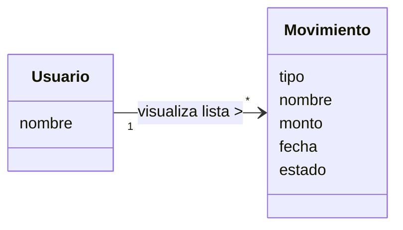
* **Explicación del Diagrama**:
  Representa conceptualmente que un objeto `Usuario` en sesión tiene la capacidad lógica de listar y leer múltiples instancias de la entidad `Movimiento`.

#### 3. Diagrama de Secuencia de Análisis (RF-06)
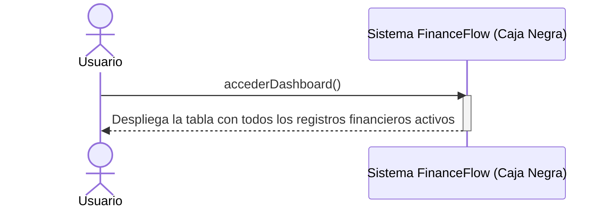
* **Explicación del Diagrama**:
  El actor solicita al sistema "caja negra" abrir el panel, y este responde retornando toda la interfaz poblada con sus datos correspondientes de transacciones.

---

### ⚙️ B. FASE DE DISEÑO (RF-06)

#### 4. Modelo Relacional / Físico de Base de Datos (RF-06)
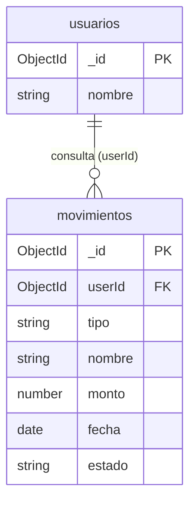
* **Explicación del Diagrama**:
  Especificación relacional detallada de lectura. Denota que la consulta física requiere cruzar indexadamente `usuarios._id` con `movimientos.userId` y filtrar lógicamente por el atributo `estado`.

#### 5. Diagrama de Clases de Diseño (RF-06)
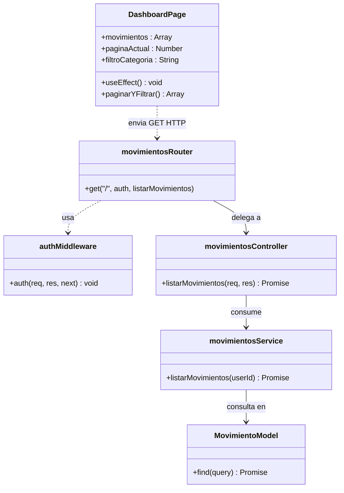
* **Explicación del Diagrama**:
  Detalla la arquitectura de código para lecturas. `DashboardPage` encapsula en su estado local de React las variables de filtrado y paginación. El backend implementa `authMiddleware` para aislar los datos a nivel de controlador.

#### 6. Diagrama de Secuencia de Diseño (RF-06)
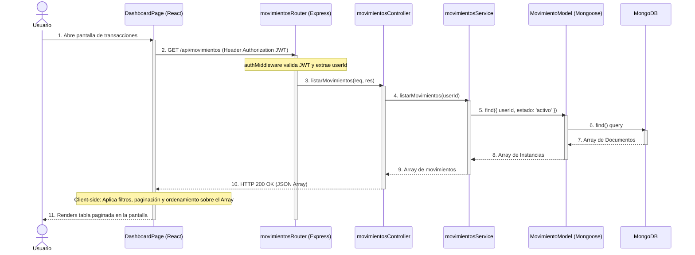
* **Explicación del Diagrama**:
  Muestra la comunicación de mensajes del sistema: la petición GET autenticada recupera el array de base de datos y React realiza el filtrado, ordenación por fecha y división de páginas sincrónicamente en memoria del cliente.

---
---

## 🔴 PARTE 2: REQUERIMIENTOS COMPLEJOS (Seguridad / Integraciones Externas)

---

### 3️⃣ REQUERIMIENTO COMPLEJO 1: RF-14 - Autenticación JWT y Protección de Rutas
* **Descripción del Requerimiento**: Sistema de seguridad que gestiona el registro, el inicio de sesión y la protección de rutas mediante JSON Web Tokens (JWT) con expiración de 7 días. La seguridad incluye encriptación de contraseñas con la librería `bcryptjs` (aplicando 10 salt rounds) e integración activa de `Helmet.js` en producción para protección de cabeceras HTTP.

* **Explicación Teórica de la Transformación**:
  * **En el Análisis**: Modela la verificación lógica de identidad. El usuario provee credenciales y el gestor de accesos decide la autorización.
  * **En el Diseño**: Especifica la arquitectura de cifrado. Muestra cómo la contraseña viaja al controlador, cómo `bcryptjs` compara el hash unidireccional almacenado y cómo la librería `jsonwebtoken` firma criptográficamente un token persistente devuelto al cliente.

---

### 🎨 A. FASE DE ANÁLISIS (RF-14)

#### 1. Diagrama Entidad-Relación Conceptual (RF-14)
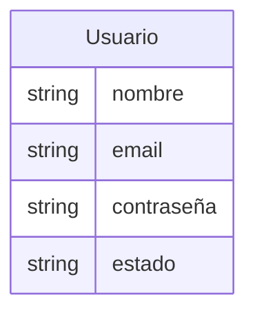
* **Explicación del Diagrama**:
  Modelado de datos puramente conceptual. Define la entidad lógica `Usuario` con sus atributos de negocio legibles, incluyendo el concepto de "contraseña" en lenguaje de negocio de usuario final.

#### 2. Diagrama de Clases de Análisis (RF-14)
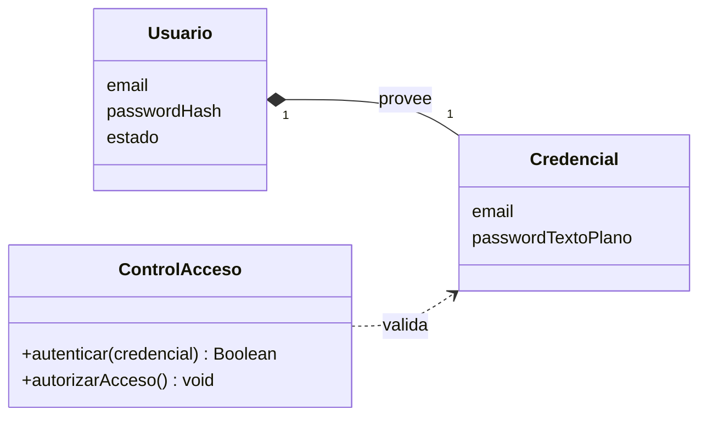
* **Explicación del Diagrama**:
  Estructura conceptual del dominio de seguridad. La clase de control conceptual `ControlAcceso` valida un objeto de negocio `Credencial` contra los datos abstractos de la entidad `Usuario`.

#### 3. Diagrama de Secuencia de Análisis (RF-14)
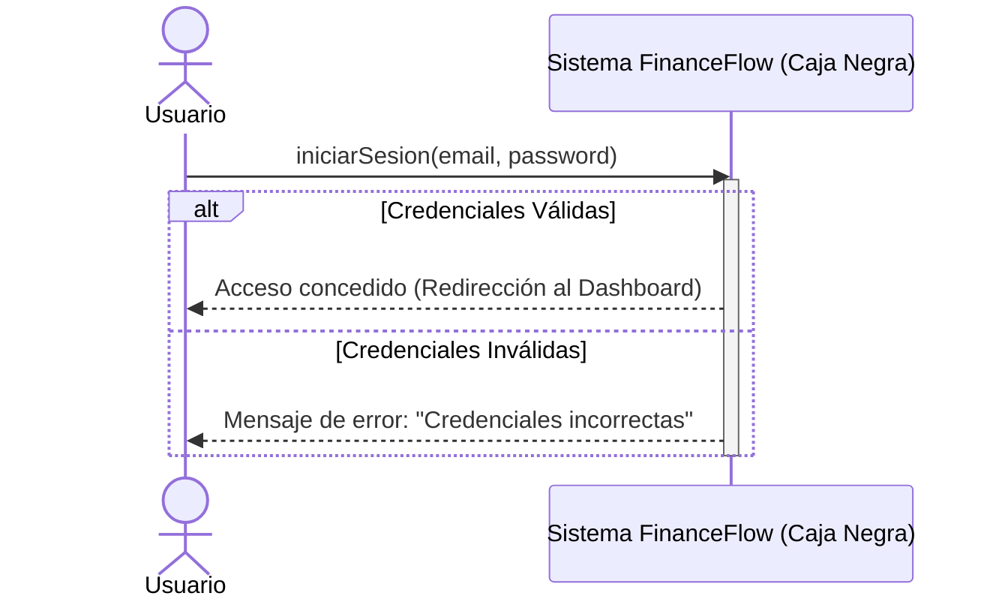
* **Explicación del Diagrama**:
  Secuencia lógica a nivel funcional (caja negra) que modela los escenarios posibles de respuesta del sistema de accesos ante el inicio de sesión.

---

### ⚙️ B. FASE DE DISEÑO (RF-14)

#### 4. Modelo Relacional / Físico de Base de Datos (RF-14)
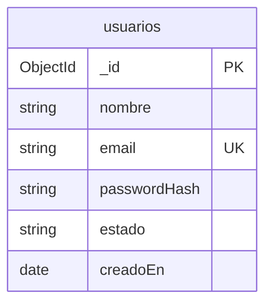
* **Explicación del Diagrama**:
  Modelo relacional físico detallado. Especifica que el email se define físicamente con índice de clave única (`UK`), la contraseña se define técnicamente como `passwordHash` (tipo `string` del hash bcrypt), y se añade un campo de control `estado`.

#### 5. Diagrama de Clases de Diseño (RF-14)
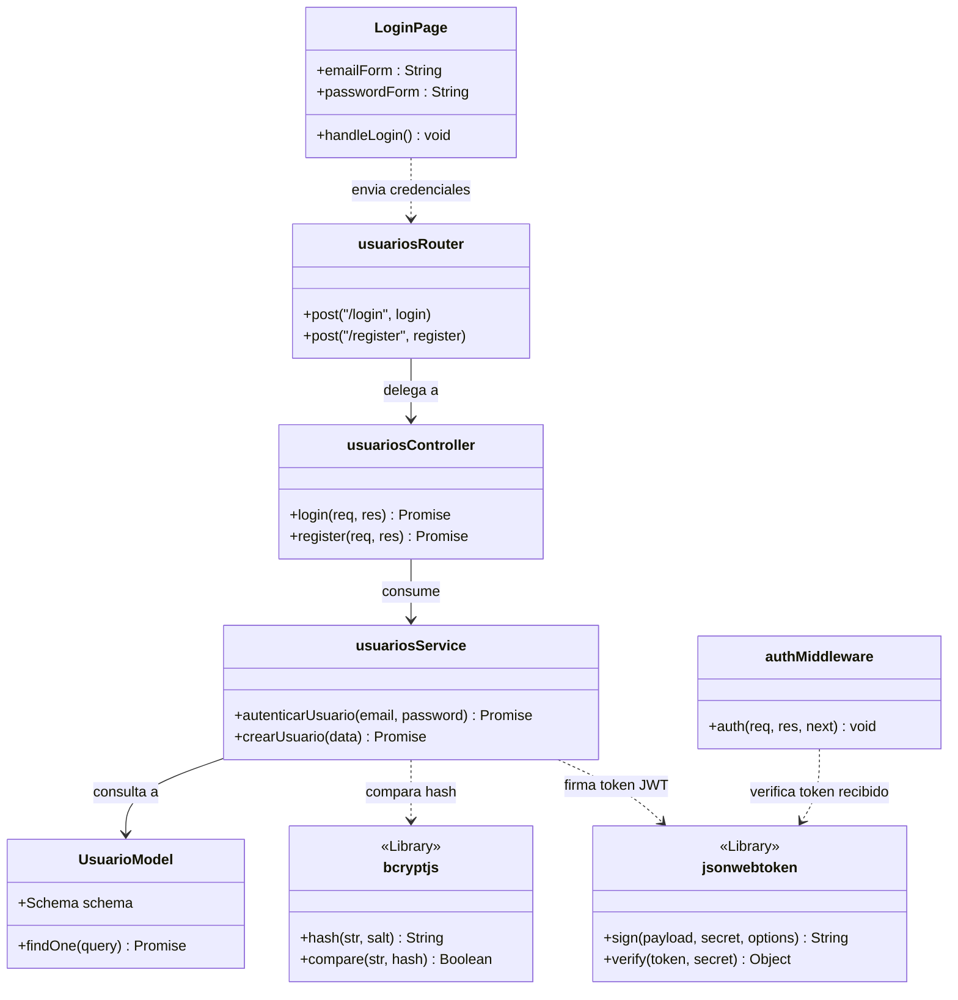
* **Explicación del Diagrama**:
  Arquitectura técnica de seguridad. Representa las dependencias hacia las librerías físicas `bcryptjs` y `jsonwebtoken`, los métodos de consulta `findOne` de Mongoose y el middleware Express `authMiddleware`.

#### 6. Diagrama de Secuencia de Diseño (RF-14)
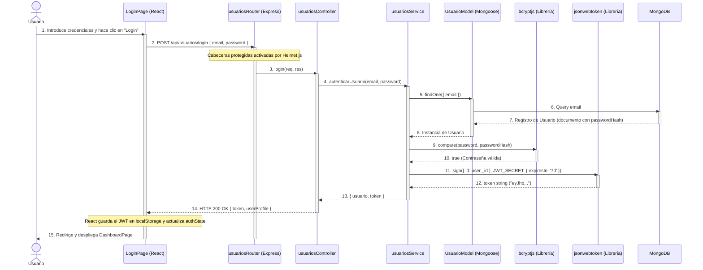
* **Explicación del Diagrama**:
  Muestra el flujo criptográfico completo del backend: recepción de credenciales, comparación de hashes en `bcryptjs`, generación de firmas JSON Web Token devueltas al cliente en formato JSON, y almacenamiento seguro en el navegador.

---
---

### 4️⃣ REQUERIMIENTO COMPLEJO 2: RF-15 - Procesamiento OCR / Escaneo de Recibos
* **Descripción del Requerimiento**: Captura y procesamiento de imágenes de recibos físicos. Permite al usuario subir una foto y enviarla al servidor del backend, el cual a su vez interactúa mediante llamadas API internas con el microservicio dedicado de Python (FastAPI). El endpoint real `POST /analyze-receipt` del microservicio ejecuta algoritmos con OpenCV para limpieza visual, Tesseract OCR para extracción de texto, y retorna los campos estructurados detectados.

* **Explicación Teórica de la Transformación**:
  * **En el Análisis**: Modela la carga lógica de un recibo. Se procesa de forma abstracta un binario para extraer los montos conceptuales.
  * **En el Diseño**: Detalla la interoperabilidad técnica multipart/form-data. El backend Node.js actúa como proxy y retransmite mediante Axios el buffer al servidor Python FastAPI, que ejecuta las librerías OpenCV y pytesseract.

---

### 🎨 A. FASE DE ANÁLISIS (RF-15)

#### 1. Diagrama Entidad-Relación Conceptual (RF-15)
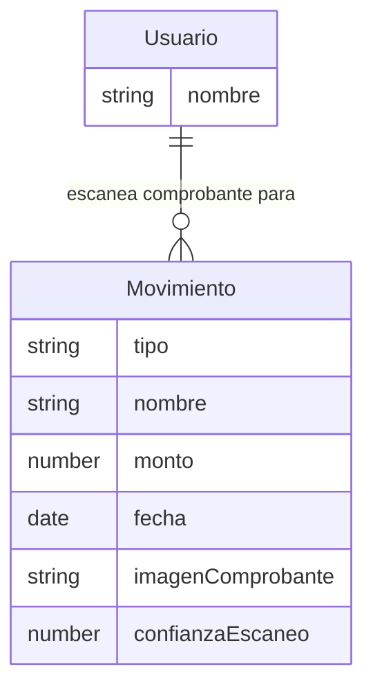
* **Explicación del Diagrama**:
  Modelado lógico de datos para la extracción de tickets. Muestra las propiedades de negocio conceptuales en la entidad `Movimiento` (`imagenComprobante`, `confianzaEscaneo`) sin tipos físicos ni llaves.

#### 2. Diagrama de Clases de Análisis (RF-15)
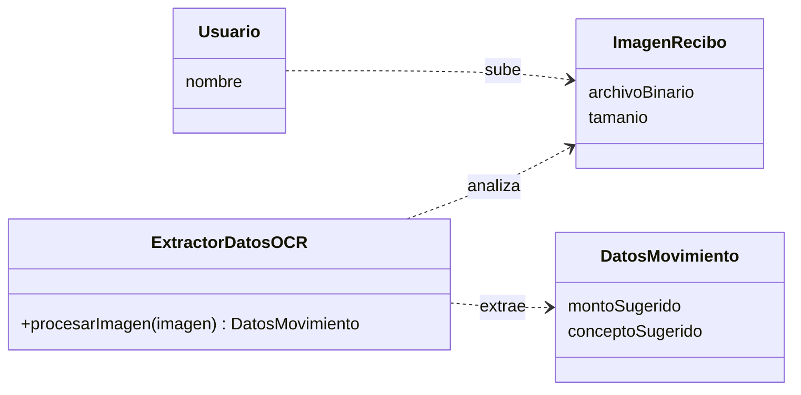
* **Explicación del Diagrama**:
  Estructura conceptual de la digitalización, modelando cómo un sistema abstracto inteligente extrae la estructura del ticket sin dependencias del servidor de Python.

#### 3. Diagrama de Secuencia de Análisis (RF-15)
```mermaid
sequenceDiagram
    actor Usuario
    participant Sistema as Sistema FinanceFlow (Caja Negra)
    
    Usuario->>Sistema: subirImagenRecibo(archivo)
    activate Sistema
    Note over Sistema: El sistema procesa la imagen y extrae el texto del comprobante
    Sistema-->>Usuario: Retorna el formulario pre-llenado (monto, concepto)
    deactivate Sistema
```
* **Explicación del Diagrama**:
  Secuencia simplificada del escáner de tickets: envío de imagen binaria y recepción de respuesta poblada en la interfaz gráfica.

---

### ⚙️ B. FASE DE DISEÑO (RF-15)

#### 4. Modelo Relacional / Físico de Base de Datos (RF-15)
```mermaid
erDiagram
    usuarios ||--o{ movimientos : "registra (userId)"

    usuarios {
        ObjectId _id PK
        string nombre
    }

    movimientos {
        ObjectId _id PK
        ObjectId userId FK
        string tipo
        string nombre
        number monto
        date fecha
        boolean escanearPorIA
        number confianzaIA
        string imagenComprobanteUrl
    }
```
* **Explicación del Diagrama**:
  Especificación relacional del escaneo en base de datos. Define detalladamente la inserción física de las columnas técnicas de IA (`escanearPorIA` como boolean, `confianzaIA` como number e `imagenComprobanteUrl` como string) en la colección de MongoDB.

#### 5. Diagrama de Clases de Diseño (RF-15)
```mermaid
classDiagram
    class MovimientoFormPage {
        +handleImageUpload(file) void
        +prellenarCampos(datos) void
    }
    class useImageToMovimiento {
        <<Custom Hook>>
        +isUploading : Boolean
        +uploadImage(file) Promise
    }
    class movimientosRouter {
        +post("/escanear", upload.single('imagen'), escanearRecibo)
    }
    class movimientosController {
        +escanearRecibo(req, res) Promise
    }
    class ocrService {
        <<Microservicio FastAPI - Python>>
        +analyze_receipt(image_file) JSON
    }
    class OpenCV {
        <<Python Library>>
        +resize(img) Object
        +threshold(img) Object
    }
    class Pytesseract {
        <<OCR Engine>>
        +image_to_string(img) String
    }
    
    MovimientoFormPage --> useImageToMovimiento : usa
    useImageToMovimiento ..> movimientosRouter : envia POST FormData
    movimientosRouter --> movimientosController : delega a
    movimientosController --> ocrService : consume via REST HTTP
    ocrService ..> OpenCV : limpia imagen
    ocrService ..> Pytesseract : lee texto
```
* **Explicación del Diagrama**:
  Estructura interna detallada del escáner. Detalla las dependencias hacia librerías como Multer (en backend Node), Axios REST para retransmisión y las librerías físicas Python (`OpenCV` y `pytesseract`) en el microservicio FastAPI.

#### 6. Diagrama de Secuencia de Diseño (RF-15)
```mermaid
sequenceDiagram
    actor Usuario
    participant FE as MovimientoFormPage (React)
    participant HK as useImageToMovimiento (Hook)
    participant RT as movimientosRouter (Express)
    participant CT as movimientosController (Node.js)
    participant PY as ocrService (FastAPI - Python)
    participant CV as OpenCV (Librería Python)
    participant TS as Pytesseract (Engine OCR)

    Usuario->>FE: 1. Selecciona imagen del comprobante
    activate FE
    FE->>HK: 2. uploadImage(file)
    activate HK
    HK->>RT: 3. POST /api/movimientos/escanear (FormData, JWT)
    activate RT
    Note over RT: Multer procesa archivo y guarda en buffer
    RT->>CT: 4. escanearRecibo(req, res)
    activate CT
    
    CT->>PY: 5. POST /analyze-receipt (File buffer en body) via Axios
    activate PY
    
    PY->>CV: 6. preprocessing(image)
    activate CV
    Note over CV: Aplica escala de grises y umbralizado Gaussiano
    CV-->>PY: 7. cleaned_image_array
    deactivate CV
    
    PY->>TS: 8. image_to_string(cleaned_image)
    activate TS
    TS-->>PY: 9. "TEXTO EXTRAIDO: TOTAL $150.00 ..."
    deactivate TS
    
    Note over PY: Parsea el texto usando expresiones regulares para extraer total
    PY-->>CT: 10. HTTP 200 OK { monto: 150.00, concepto: "Supermercado" }
    deactivate PY
    
    CT-->>RT: 11. retorna JSON de datos extraídos
    deactivate CT
    RT-->>HK: 12. HTTP 200 OK JSON { success: true, data: {...} }
    deactivate RT
    HK-->>FE: 13. actualiza campos del formulario
    deactivate HK
    FE-->>Usuario: 14. Muestra formulario con monto y concepto sugeridos
    deactivate FE
```
* **Explicación del Diagrama**:
  Ilustra el recorrido completo y detallado del archivo de imagen. Muestra la carga multipart, su retransmisión HTTP por Axios hacia FastAPI, la ejecución de la limpieza de la imagen en OpenCV, el reconocimiento óptico de caracteres con Tesseract y el parseo del total mediante expresiones regulares lógicas para retornar el JSON.

---

## 🎯 Conclusiones

1. **Separación de Análisis y Diseño (Entender el negocio vs. Programar)**:
   Dividir el trabajo en dos etapas ayuda mucho. Primero entendemos cómo funciona el negocio financiero en la vida real de forma sencilla y sin complicaciones técnicas (Fase de Análisis). Una vez que todo está claro, definimos exactamente cómo lo va a programar el desarrollador (Fase de Diseño) detallando las carpetas del código, los servicios y la base de datos física.

2. **Menos errores humanos gracias a la Automatización**:
   Al definir la estructura de la aplicación en un solo modelo central (como un archivo JSON), podemos programar un script para que cree de forma automática la base de datos, las reglas de seguridad y la propia documentación de texto. Si necesitamos hacer un cambio, solo lo modificamos en un sitio y todo lo demás se actualiza solo en un segundo, evitando olvidos y erratas al programar.

3. **Seguridad y Persistencia Diseñadas con Cuidado**:
   Hacer el diseño lógico de los datos antes de crear la base de datos real nos permite cuidar la seguridad y el orden de la información. Esto nos ayuda a definir reglas esenciales antes de escribir código, como por ejemplo: asegurar que no haya correos repetidos al registrarse, proteger las contraseñas para que se guarden encriptadas y conectar correctamente cada gasto con su respectivo usuario.

4. **Integración Sencilla entre Node.js y Python (IA)**:
   Modelar de forma detallada los flujos complejos, como el escaneo de recibos con Inteligencia Artificial, nos permite planificar perfectamente cómo se comunicará nuestra aplicación web (Node.js) con el microservicio de IA (Python). De esta forma, aseguramos que la subida del ticket, la lectura del texto y el llenado automático del formulario funcionen sin sorpresas ni errores de conexión desde el primer día.
