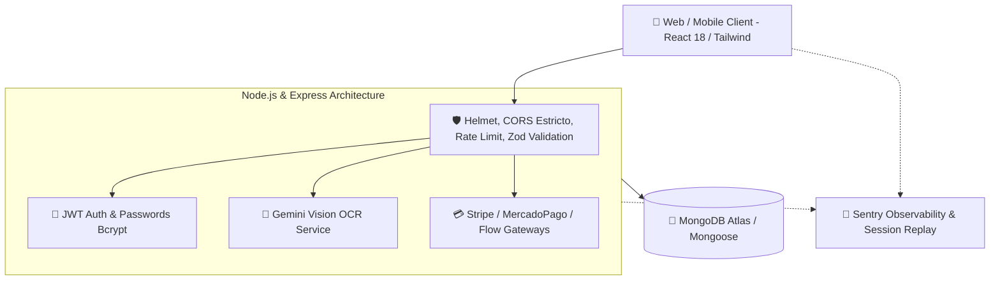

# 💎 FinanceFlow — Sistema de Gestión Financiera & Inteligencia con IA

<div align="center">


[](AUDITORIA_SEGURIDAD.md)
[](tests_README.md)
[](https://sentry.io)
[](package.json)

**La solución definitiva para el control de finanzas personales y empresariales, potenciada con Visión Artificial por IA, pasarelas de pago internacionales y seguridad de nivel bancario.**

[Explorar Módulos](#-módulos-y-características-del-producto) • [Arquitectura](#-arquitectura-tecnológica) • [Instalación Local](#-guía-de-instalación-y-ejecución-local) • [Seguridad](#-estándares-de-seguridad-y-auditoría)

</div>

---

## 🌟 ¿Qué es FinanceFlow? (Para Clientes y Usuarios)

**FinanceFlow** es una plataforma moderna e integral diseñada para simplificar la gestión del dinero, optimizar la toma de decisiones económicas y automatizar la administración contable para personas y negocios.

A diferencia de las hojas de cálculo tradicionales o aplicaciones financieras básicas, FinanceFlow combina **inteligencia artificial de última generación**, **análisis predictivo en tiempo real** y una **experiencia de usuario fluida y reactiva**.

---

## 🚀 Módulos y Características del Producto

### 1. 📊 Dashboard Financiero en Tiempo Real
* **Métricas Clave al Instante:** Visualización de ingresos totales, gastos categorizados, deuda acumulada, saldo neto disponible y patrimonio proyectado.
* **Gráficos Interactivos de Alto Rendimiento:** Comparativas mensuales, diagramas de distribución de gastos y análisis de tendencias históricas.
* **Planificador de Compras Inteligente:** Proyección de ahorro y capacidad de compra mes a mes antes de asumir nuevos compromisos financieros.

### 2. 🤖 Escaneo Inteligente de Comprobantes (OCR con Gemini AI)
* **Digitalización Automática:** Sube una foto o PDF de cualquier boleta, factura, voucher o ticket.
* **Extracción Precisa:** El motor neuronal de Visión por IA detecta automáticamente el monto, la fecha, el comercio y la categoría del gasto sin requerir tipeo manual.
* **Límites Flexibles:** 5 escaneos mensuales gratuitos con opción de acceso ilimitado para usuarios **Pro**.

### 3. 💳 Monetización & Pasarelas de Pago Multi-País (FinanceFlow Pro)
* **Integración Multi-Pasarela:**
  * 🌎 **Stripe:** Pagos globales con tarjeta de crédito/débito en USD.
  * 🇵🇪 **Mercado Pago:** Pagos en moneda local (PEN / Soles) mediante tarjetas y transferencias seguras.
  * 🇨🇱 🇵🇪 **Flow.cl:** Procesamiento directo para Yape, Plin, PagoEfectivo y tarjetas bancarias.
* **Activación Inmediata con Webhooks Seguros:** Los pagos se validan en milisegundos mediante firmas criptográficas HMAC `Fail-Closed`.

### 4. 👑 Panel de Administración Enterprise
* Dashboard exclusivo para administradores con métricas de adquisición, retención, usuarios Free vs. Pro y volumen de transacciones.
* Gestión granular de usuarios y auditoría de eventos de seguridad.

---

## 🛠️ Arquitectura Tecnológica



### Stack Tecnológico:
* **Frontend:** React 18, React Router v7, Recharts, Tailwind CSS, React Hook Form, Zod.
* **Backend:** Node.js, Express.js, MongoDB con Mongoose ODM.
* **Inteligencia Artificial:** Google Gemini Pro Vision API (`@google/generative-ai`).
* **Seguridad:** JSON Web Tokens (JWT), Bcrypt.js, Helmet, Express Rate Limit, Zod Schema Validation.
* **Observabilidad:** `@sentry/node` & `@sentry/react` (Captura de errores en tiempo real y Session Replay).
* **Testing:** Jest, Supertest, Babel (12 suites automatizadas).

---

## 💻 Guía de Instalación y Ejecución Local

Sigue estos pasos para clonar y levantar el proyecto completo en tu entorno de desarrollo local sin necesidad de publicar claves de producción.

### 📋 Prerrequisitos
* **Node.js** v18.0.0 o superior instalado ([Descargar Node.js](https://nodejs.org/)).
* **Git** instalado en tu sistema.
* Una instancia de **MongoDB** (local en `mongodb://localhost:27017` o un clúster gratuito de MongoDB Atlas).

---

### 1️⃣ Clonar el Repositorio
```bash
git clone https://github.com/tu-usuario/sistema-de-balance.git
cd "sistema-de-balance"
```

---

### 2️⃣ Configurar el Backend

1. Ingresa a la carpeta del backend e instala las dependencias:
   ```bash
   cd backend
   npm install
   ```

2. Crea tu archivo de variables de entorno `.env` en `backend/` basado en la siguiente plantilla:
   ```env
   # Entorno
   NODE_ENV=development
   PORT=3000
   
   # Base de Datos MongoDB (Local o Atlas)
   MONGODB_URI=mongodb://localhost:27017/financeflow_local
   
   # Clave Secreta para Firmar Tokens JWT (Mínimo 32 caracteres)
   JWT_SECRET=tu_clave_secreta_local_de_desarrollo_32_caracteres_minimo
   
   # Orígenes Permitidos para CORS
   FRONTEND_URL=http://localhost:3001
   CORS_ORIGIN=http://localhost:3001
   
   # (Opcional) Google Gemini API Key para probar el OCR
   GEMINI_API_KEY=tu_api_key_de_gemini_aqui
   
   # (Opcional) Observabilidad Sentry
   SENTRY_DSN=
   ```

3. Inicia el servidor backend:
   ```bash
   npm run dev
   ```
   *El backend quedará escuchando en `http://localhost:3000`*.

---

### 3️⃣ Configurar el Frontend

1. En una nueva terminal, navega a la carpeta del frontend e instala las dependencias:
   ```bash
   cd frontend
   npm install
   ```

2. Crea el archivo `.env` en `frontend/`:
   ```env
   # URL del Backend Local
   REACT_APP_API_URL=http://localhost:3000
   
   # (Opcional) Observabilidad Sentry Frontend
   REACT_APP_SENTRY_DSN=
   ```

3. Inicia la aplicación React:
   ```bash
   npm start
   ```
   *El frontend abrirá automáticamente tu navegador en `http://localhost:3001`*.

---

## 🧪 Ejecutar la Suite de Pruebas Automatizadas

El proyecto cuenta con una cobertura completa de pruebas unitarias, de integración, seguridad y E2E:

```bash
cd backend
npm test
```

**Resultado esperado:**
```text
Test Suites: 12 passed, 12 total
Tests:       29 passed, 29 total
Snapshots:   0 total
Time:        17.3 s
```

---

## 🛡️ Estándares de Seguridad y Auditoría

El sistema fue sometido a una auditoría estricta de código y arquitectura (*Source-to-Sink analysis* y análisis de penetración estática) con el **100% de los hallazgos remediados y certificados**:

| Categoría | Protección Implementada |
|---|---|
| **Autenticación** | JWT estricto sin fallbacks inseguros; hashing con bcrypt (salting dinámico). |
| **Control de Acceso (IDOR)** | Todas las consultas financieras exigen token y verifican la propiedad del usuario autenticado (`req.user.id`). |
| **Integridad de Pagos** | Webhooks de pasarelas con verificación criptográfica HMAC en modo `Fail-Closed`. |
| **Inyecciones NoSQL** | Validación centralizada de esquemas con **Zod 4** en `body`, `query` y `params`. |
| **Protección DDoS / Brute Force** | `express-rate-limit` con configuración segura `trust proxy`. |
| **Privacidad de Datos** | Middleware de logging con redacción automática `[REDACTED]` de contraseñas y tokens. |

*Para revisar el informe técnico detallado de la auditoría, consulta [AUDITORIA_SEGURIDAD.md](AUDITORIA_SEGURIDAD.md).*

---

## 📄 Licencia

Este proyecto está licenciado bajo los términos de la licencia **MIT**. Consulta el archivo `LICENSE` para más información.

<div align="center">
  <sub>Desarrollado con arquitectura escalable y disciplina de ingeniería de software.</sub>
</div>