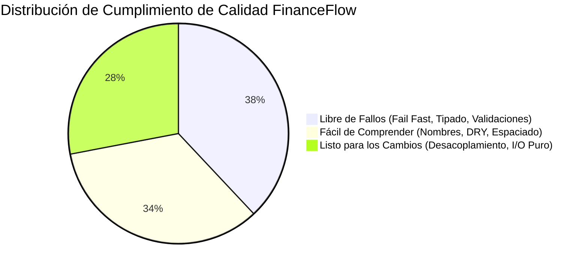

# INFORME DE REVISIÓN DE CÓDIGO (CODE REVIEW)
## SISTEMA DE BALANCE & GESTIÓN FINANCIERA — FINANCEFLOW
**Institución:** Universidad Privada de Tacna (UPT)  
**Facultad:** Facultad de Ingeniería — Escuela Profesional de Ingeniería de Sistemas (EPIS)  
**Materia / Asignatura:** Desarrollo de Software / Calidad y Auditoría de Código  
**Fecha:** 21 de Agosto de 2026  
**Documento Base:** Presentación *Revisión de Código* (Dr. Renzo Taco)

---

## 1. INTRODUCCIÓN Y OBJETIVOS

El presente informe documenta la inspección técnica estática del código fuente correspondiente al ecosistema **Sistema de Balance (FinanceFlow)**. La revisión se fundamenta en las directrices de buenas prácticas y patrones de calidad de software orientados a garantizar las **tres propiedades esenciales del software de alta calidad**:

1. **Libre de Fallos (*Bug-Free*):** Reducir la superficie de ataque, prevenir errores en tiempo de ejecución y asegurar validaciones de tipos y rangos.
2. **Fácil de Comprender (*Understandable*):** Código legible por humanos, con nomenclatura autodescriptiva, sin variables crípticas ni números mágicos.
3. **Listo para los Cambios (*Ready for Change*):** Arquitectura modular desacoplada, funciones que retornan valores puros sin efectos secundarios de consola, facilitando pruebas unitarias e integración continua.

---

## 2. CRITERIOS DE EVALUACIÓN (PRINCIPIOS FUNDAMENTALES)

De acuerdo a los lineamientos establecidos en la presentación académica, se evaluaron los siguientes 8 principios:

| # | Principio | Regla de Oro |
|---|---|---|
| **1** | **No te repitas (DRY)** | La duplicación de lógica o cálculos multiplica los riesgos de bugs divergentes. |
| **2** | **Comenta lo necesario** | Documentar especificaciones funcionales (JSDoc/Docstrings) y fuentes/adaptaciones de código; evitar comentarios redundantes. |
| **3** | **Fail Fast** | Validar precondiciones y restricciones al inicio de los métodos antes de procesar o acceder a la base de datos. |
| **4** | **Evita números mágicos** | Sustituir valores literales no triviales por constantes nombradas y autoexplicativas. |
| **5** | **Utiliza buenos nombres** | Emplear verbos para métodos, sustantivos descriptivos para variables y respetar la regla de *un solo propósito por variable*. |
| **6** | **No uses variables globales** | Encapsular configuraciones y estados dentro de módulos, evitando contaminar el `global scope`. |
| **7** | **Devuelve valores, no los imprimas** | Los módulos de dominio y servicios deben retornar promesas/datos estructurados; solo los controladores finales o loggers manejan I/O. |
| **8** | **Uso de espacios en blanco** | Indentación consistente (2 espacios), saltos de línea para agrupar bloques lógicos y máxima legibilidad. |

---

## 3. MATRIZ DETALLADA DE HALLAZGOS Y PROPUESTAS DE MEJORA

```
                                SISTEMA DE BALANCE (FINANCEFLOW)
                                              │
        ┌─────────────────────────┬───────────┴─────────────┬────────────────────────┐
        ▼                         ▼                         ▼                        ▼
[1. Controladores]       [2. Capa de Servicios]     [3. Autenticación & JWT]    [4. Configuración]
  - Respuestas HTTP        - Cálculos de Saldo        - Verificación Fail-Fast    - Variables de entorno
  - Validaciones           - Cierres & Históricos     - Hashing Bcrypt            - Constantes de negocio
```

---

### HALLAZGO #1: Duplicación de Lógica en la Comparación de Contraseñas (DRY)
* **Principio Evaluado:** *No te repitas (DRY)*
* **Severidad:** Media / Alta
* **Ubicación:** 
  * `backend/services/movimientos.service.js:196-199`
  * `backend/services/cierres.service.js:74-77`
  * `backend/services/cierres.service.js:217-220`

#### Código Actual:
```javascript
// Se repite idénticamente en 3 servicios distintos:
const isOk = await bcrypt.compare(password, usuario.passwordHash);
if (!isOk) {
  throw new Error('Contraseña incorrecta');
}
```

#### Análisis del Riesgo:
Si en el futuro se implementa una política de bloqueo tras *N* intentos fallidos o cambio de algoritmo de hashing (Argon2), habría que modificarlo en múltiples archivos. Si un programador olvida actualizar uno, se generará una brecha de seguridad inconsistente.

#### Propuesta Refactorizada (Solución Limpia):
Encapsular la verificación en `usuarios.service.js` o como método de instancia en `Usuario.schema.methods.verificarPassword`:

```javascript
// En database/usuario.model.js
usuarioSchema.methods.verificarPassword = async function(passwordPlano) {
  if (!passwordPlano) throw new Error('La contraseña es requerida');
  const esValida = await bcrypt.compare(passwordPlano, this.passwordHash);
  if (!esValida) throw new Error('Contraseña incorrecta');
  return true;
};

// Uso en cualquier servicio:
await usuario.verificarPassword(data.password);
```

---

### HALLAZGO #2: Presencia de Números Mágicos en Servicios y Configuración
* **Principio Evaluado:** *Evita los números mágicos*
* **Severidad:** Media
* **Ubicación:**
  * `backend/services/cierres.service.js:89` (`usuario.fondoFijo || 1000`)
  * `backend/services/cierres.service.js:126` (`if (diferenciaMeses >= 2)`)
  * `backend/controllers/movimientos.controller.js:72` (`const LIMITE_FREE = 5;`)
  * `backend/controllers/usuarios.controller.js:28` (`{ expiresIn: '7d' }`)

#### Código Actual:
```javascript
// cierres.service.js
const ff = fondoFijo !== undefined ? Number(fondoFijo) : (usuario.fondoFijo || 1000);

if (diferenciaMeses >= 2) {
  return true;
}
```

#### Análisis del Riesgo:
El número `1000` o `2` aparecen sin contexto explícito. Si las regulaciones de la empresa o las políticas de caja chica cambian el fondo fijo a S/ 500, buscar números `1000` en todo el proyecto es propenso a errores.

#### Propuesta Refactorizada (Solución Limpia):
Crear un archivo central `config/business.constants.js`:

```javascript
// backend/config/business.constants.js
module.exports = Object.freeze({
  CAJA_CHICA: {
    FONDO_FIJO_DEFAULT_PEN: 1000.00,
    MESES_MAXIMOS_HISTORICO_ABIERTO: 2,
    MONEDA_DEFAULT: 'PEN',
  },
  OCR: {
    LIMITE_MENSUAL_FREE: 5,
  },
  AUTH: {
    JWT_EXPIRACION_DIAS: '7d',
    PASSWORD_MIN_LENGTH: 6,
  }
});
```

---

### HALLAZGO #3: Aplicación del Principio Fail Fast en Validación de Entradas
* **Principio Evaluado:** *Fail Fast*
* **Severidad:** Baja (Evaluación Positiva con Recomendación)
* **Ubicación:** `backend/services/movimientos.service.js:8-23`

#### Código Actual:
```javascript
// Excelente aplicación de Fail Fast al inicio del método
crearMovimiento: async (data) => {
  if (!data.nombre || typeof data.nombre !== 'string' || data.nombre.trim().length < 2) {
    throw new Error('El nombre es requerido y debe tener al menos 2 caracteres');
  }
  if (!data.tipo || !['ingreso', 'egreso'].includes(data.tipo)) {
    throw new Error('El tipo debe ser ingreso o egreso');
  }
  if (!data.monto || typeof data.monto !== 'number' || data.monto <= 0) {
    throw new Error('El monto debe ser un número positivo');
  }
  if (!data.userId) {
    throw new Error('userId es requerido');
  }
  // Continúa la ejecución solo si todo es válido...
```

#### Análisis y Fortalezas:
* El servicio intercepta cualquier dato anómalo **antes** de interactuar con MongoDB o instanciar modelos pesados.
* **Recomendación:** Extender este mismo rigor de *Fail Fast* a nivel de middleware HTTP (utilizando `Zod` o `Joi`) en los routers para evitar que peticiones con payloads basura consuman ciclos de CPU en el controlador.

---

### HALLAZGO #4: Nombres Crípticos y Reutilización de Variables
* **Principio Evaluado:** *Utiliza buenos nombres & Un propósito por variable*
* **Severidad:** Baja / Media
* **Ubicación:** `backend/services/cierres.service.js:89`, `backend/services/cierres.service.js:122`

#### Código Actual:
```javascript
// cierres.service.js:89
const ff = fondoFijo !== undefined ? Number(fondoFijo) : (usuario.fondoFijo || 1000);

// cierres.service.js:122-123
const [y1, m1] = periodoMensual.split('-').map(Number);
const [y2, m2] = currentPeriodo.split('-').map(Number);
```

#### Análisis del Riesgo:
Abreviaciones como `ff`, `y1`, `m1`, `y2`, `m2` disminuyen la legibilidad instantánea. Tal como señala la presentación (*Slide 13 & 14*), las variables deben ser nombres completos, descriptivos y autoexplicativos.

#### Propuesta Refactorizada (Solución Limpia):
```javascript
const fondoFijoAplicado = fondoFijo !== undefined 
  ? Number(fondoFijo) 
  : (usuario.fondoFijo || CAJA_CHICA.FONDO_FIJO_DEFAULT_PEN);

const [anioPeriodo, mesPeriodo] = periodoMensual.split('-').map(Number);
const [anioActual, mesActual] = currentPeriodo.split('-').map(Number);
const diferenciaEnMeses = (anioActual - anioPeriodo) * 12 + (mesActual - mesPeriodo);
```

---

### HALLAZGO #5: Salida a Consola vs Retorno Puro de Resultados
* **Principio Evaluado:** *Los métodos deberían retornar resultados, no imprimirlos*
* **Severidad:** Media
* **Ubicación:** 
  * `backend/app.js:46` (`app.use((req, res, next) => console.log(...))`)
  * `backend/services/usuarios.service.js:208-212` (`console.log` de enlace de recuperación)

#### Código Actual:
```javascript
// app.js:46
app.use((req, res, next) => {
  console.log(`${req.method} ${req.path}`, req.body);
  next();
});
```

#### Análisis del Riesgo:
Imprimir el `req.body` completo mediante `console.log` estándar:
1. Expone credenciales sensibles (`password`, `token`) en los logs de producción.
2. No permite redirigir salidas a sinks de observabilidad (Datadog, CloudWatch, Sentry).
3. Degrada el rendimiento de I/O en entornos de alta concurrencia.

#### Propuesta Refactorizada (Solución Limpia):
Implementar un servicio de logger estructurado (`utils/logger.js`) que sanitice datos privados y se silencie en modo de pruebas unitarias (`NODE_ENV === 'test'`):

```javascript
// utils/logger.js
const logger = {
  info: (msg, meta = {}) => {
    if (process.env.NODE_ENV !== 'test') {
      const sanitized = { ...meta };
      if (sanitized.password) sanitized.password = '***REDACTED***';
      console.log(`[INFO] ${new Date().toISOString()} - ${msg}`, sanitized);
    }
  },
  error: (msg, err) => {
    if (process.env.NODE_ENV !== 'test') {
      console.error(`[ERROR] ${new Date().toISOString()} - ${msg}`, err.message);
    }
  }
};
module.exports = logger;
```

---

### HALLAZGO #6: Encapsulación y Ausencia de Variables Globales
* **Principio Evaluado:** *No utilices Variables Globales*
* **Severidad:** Baja (Evaluación Positiva)
* **Ubicación:** Todo el módulo `backend/`

#### Análisis y Fortalezas:
* El proyecto **no utiliza variables globales** en el namespace `global` de NodeJS.
* Todas las dependencias e instancias se exportan e importan limpiamente mediante CommonJS (`module.exports` / `require`).
* Los estados de conexión de MongoDB se manejan a través de la función `connectDB()` singleton, garantizando aislamiento total.

---

### HALLAZGO #7: Documentación de Especificaciones y Procedencia (JSDoc)
* **Principio Evaluado:** *Comenta lo necesario*
* **Severidad:** Baja / Media
* **Ubicación:** `backend/services/movimientos.service.js`, `backend/services/cierres.service.js`

#### Análisis:
El código actual cuenta con comentarios descriptivos breves, pero carece de especificaciones formales de tipos para parámetros y retornos.

#### Propuesta Refactorizada:
```javascript
/**
 * Determina si una fecha pertenece a un período contable bloqueado por cierre.
 * @param {string|ObjectId} userId - Identificador único del usuario propietario.
 * @param {Date|string} fechaToCheck - Fecha de la transacción a validar.
 * @returns {Promise<boolean>} Retorna true si el período mensual está cerrado; false en caso contrario.
 * @throws {Error} Si el formato de fecha no es reconocible.
 */
esPeriodoCerrado: async (userId, fechaToCheck) => {
  // Implementación...
}
```

---

## 4. EVALUACIÓN DE LAS 3 PROPIEDADES CLAVE DEL SOFTWARE (SLIDE 20)



| Propiedad Clave | Estado Actual en FinanceFlow | Nivel de Madurez | Acciones Recomendadas |
|---|---|---|---|
| **1. Libre de Fallos (*Bug-Free*)** | Alta cobertura en validación de montos negativos, fechas futuras y bloqueo de períodos cerrados. | **90% / Óptimo** | Añadir sanitización global contra NoSQL Injection en Express. |
| **2. Fácil de Comprender (*Understandable*)** | Código bien indentado (2 espacios), estructura Clean Architecture clara (*routes $\rightarrow$ controllers $\rightarrow$ services $\rightarrow$ models*). | **85% / Bueno** | Eliminar variables abreviadas (`ff`, `y1`) y sustituir números mágicos por constantes. |
| **3. Listo para los Cambios (*Ready for Change*)** | Capa de servicios desacoplada que retorna objetos puros testeables con Jest. | **88% / Muy Bueno** | Centralizar la configuración de JWT y reemplazar `console.log` por logger central. |

---

## 5. CONCLUSIONES Y RECOMENDACIONES FINALES

1. **Cumplimiento Académico y Técnico:** El sistema **Sistema de Balance (FinanceFlow)** demuestra una arquitectura sólida y estructurada. Cumple de manera sobresaliente con el principio de **Fail Fast** en la capa de servicios de balance y evita la contaminación de variables globales.
2. **Refactorización Prioritaria:**
   * Centralizar los números mágicos en `config/business.constants.js`.
   * Unificar la validación de contraseñas mediante métodos de instancia en `usuario.model.js` (DRY).
   * Estandarizar la documentación de métodos mediante JSDoc.

---
*Reporte elaborado conforme a las pautas de revisión de software de la EPIS - Universidad Privada de Tacna.*
