# Diagramas Mermaid para SAD FD04 - FinanceFlow (Actualizado Final - Correcciones Estrictas)

Este archivo contiene los diagramas generados estrictamente con las reglas proporcionadas (Nombres reales de los esquemas, dependencias exactas y SDK como módulo interno).

---

### 1. Diagrama de Subsistemas (Paquetes Lógicos)
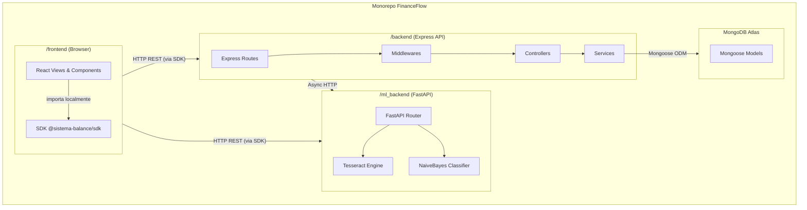

---

### 2. Secuencia 1: Autenticación de Usuario
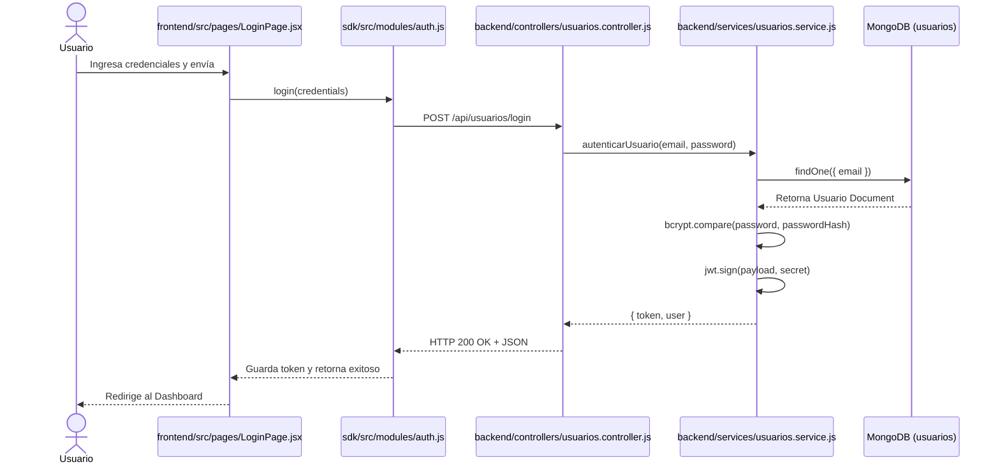

---

### 3. Secuencia 2: Visualización del Dashboard
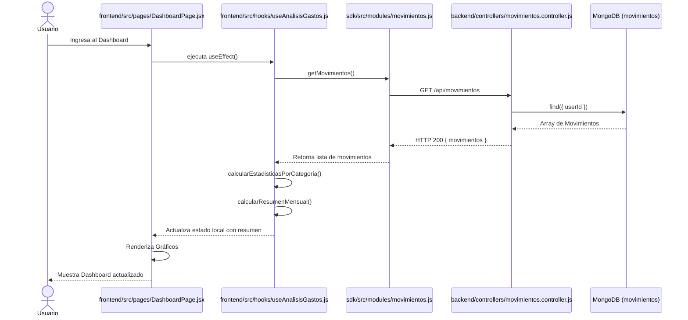

---

### 4. Secuencia 3: Cierre Mensual
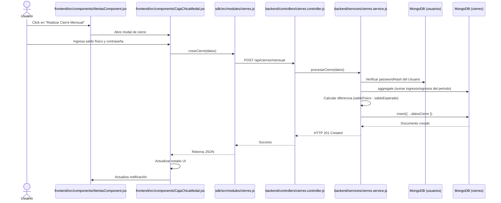

---

### 5. Diagrama de Colaboración (Vista de Diseño)
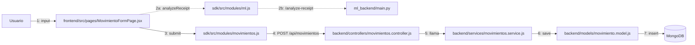

---

### 6. Diagrama de Objetos (Sesión de Usuario)
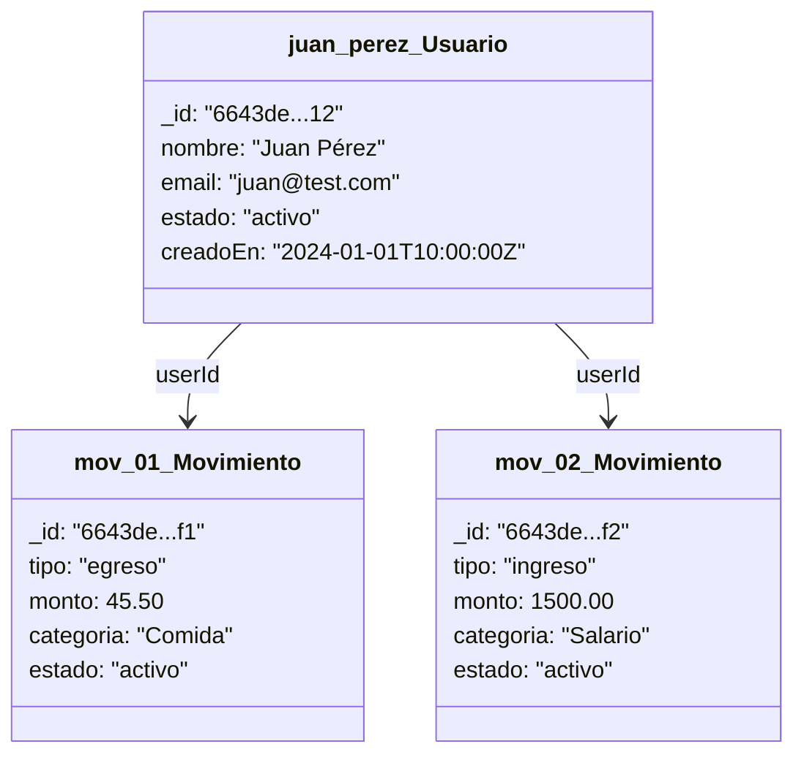

---

### 7. Diagrama de Clases
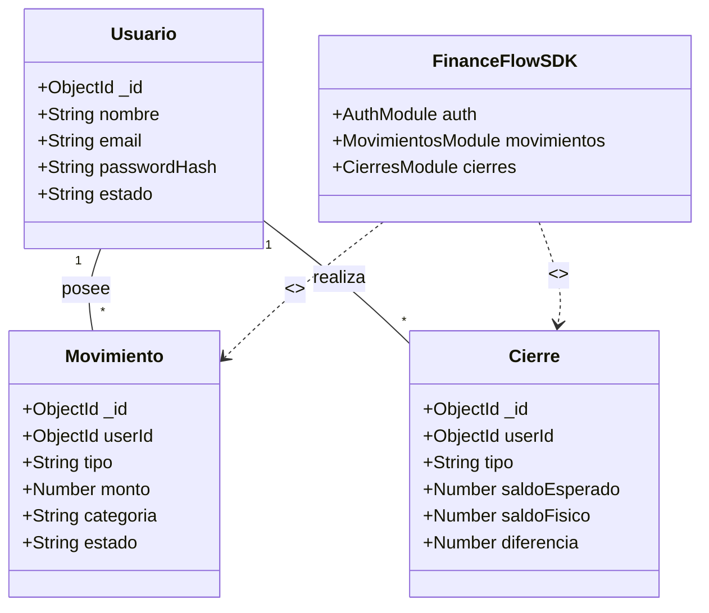

---

### 8. Diagrama de Base de Datos (Entidad-Relación)
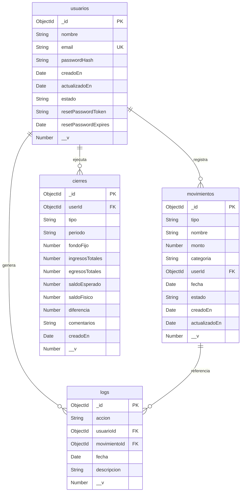

---

### 9. Diagrama de Arquitectura Software (Paquetes)
```mermaid
flowchart LR
    subgraph Repositorio ["Monorepo: FinanceFlow"]
        direction LR
        
        subgraph /sdk [workspace package]
            SDK_Core[@sistema-balance/sdk]
        end
        
        subgraph Frontend ["/frontend"]
            SPA[React SPA]
            subgraph /frontend/src/sdk [adaptador local]
                Adapter[SDK Adapter]
            end
            SPA --> Adapter
            Adapter --> SDK_Core
        end
        
        backend["/backend (Express API)"]
        ml_backend["/ml_backend (FastAPI)"]
        
        Frontend -- "HTTP REST (via SDK)" --> backend
        Frontend -. "HTTP REST (via SDK)" .-> ml_backend
        backend -. "Async HTTP" .-> ml_backend
    end
    database[("MongoDB Atlas")]
    backend -- "Mongoose ODM" --> database
```

---

### 10. Diagrama de Arquitectura del Sistema (Componentes)
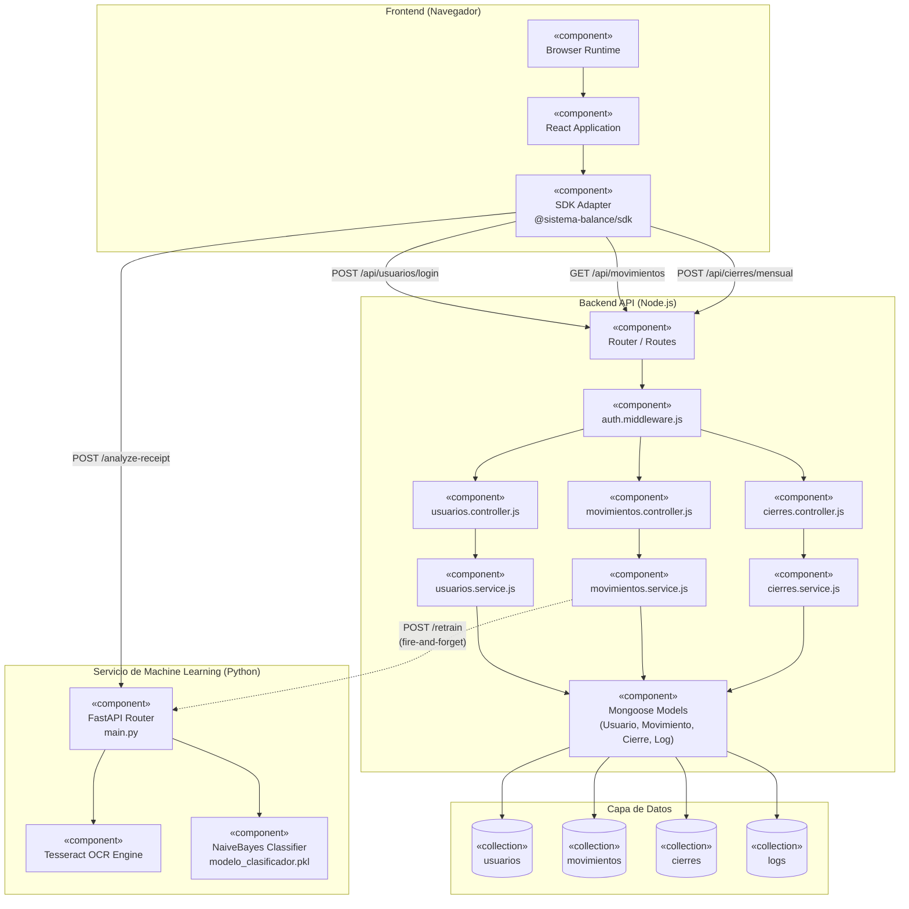

---

### 11. Actividad 1: OCR y categorización ML
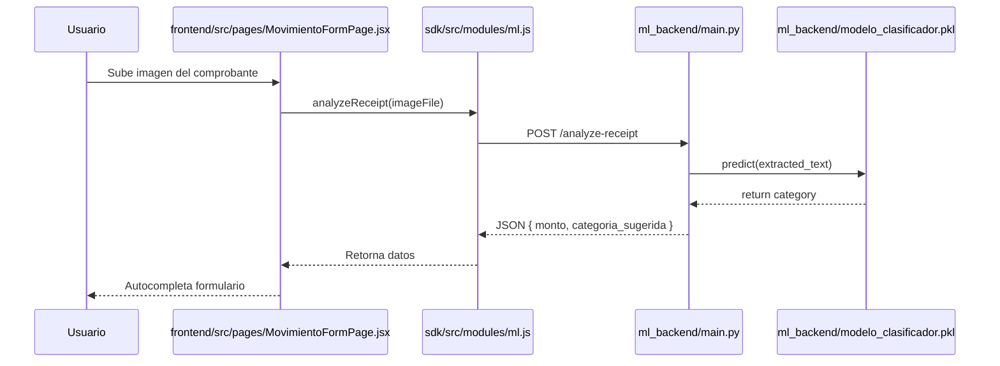

---

### 12. Actividad 2: Flujo de Silent Training
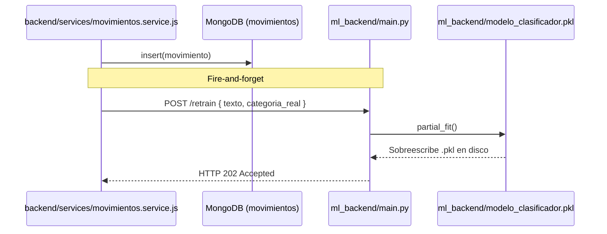

---

### 13. Diagrama de Despliegue
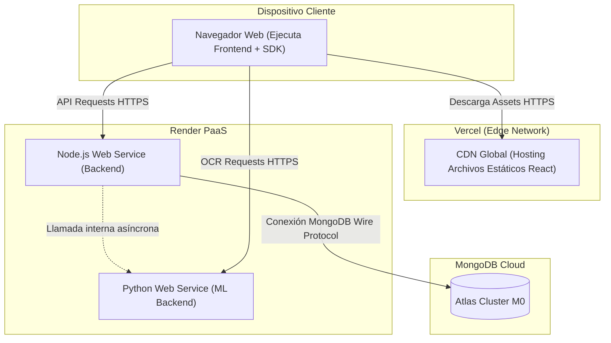
