# Diagramas UML — FinanceFlow (Mermaid)

Diagramas generados a partir del código real del repositorio (backend Express/MongoDB/Mongoose, frontend React), para los 4 requerimientos funcionales de la guía de "Especificaciones Funcionales". Cada uno se presenta en fase **Análisis (SRS)** y **Diseño (SAD)**, siguiendo el mismo criterio usado en el documento Word: Análisis = qué hace el sistema desde la perspectiva del negocio; Diseño = cómo lo hace técnicamente (archivos, rutas, funciones reales).

**Cómo usarlos:** pégalos en [Mermaid Live Editor](https://mermaid.live) para exportarlos como PNG/SVG e insertarlos en el Word como "Figura N", o si tu editor (VS Code, Obsidian, GitHub) soporta Mermaid, se renderizan directamente al ver este `.md`.

## Índice

- [RF01: Registrar Usuario](#rf01-registrar-usuario)
- [RF02: Iniciar Sesión](#rf02-iniciar-sesión)
- [RF03: Registrar Movimiento](#rf03-registrar-movimiento-ingresogasto)
- [RF04: Recuperar Contraseña](#rf04-recuperar-contraseña)

---

# RF01: Registrar Usuario

## Diagrama de Paquete — Análisis

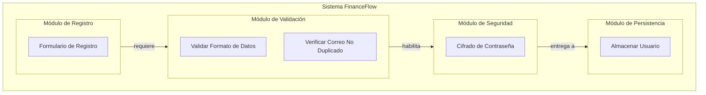

## Diagrama de Paquete — Diseño

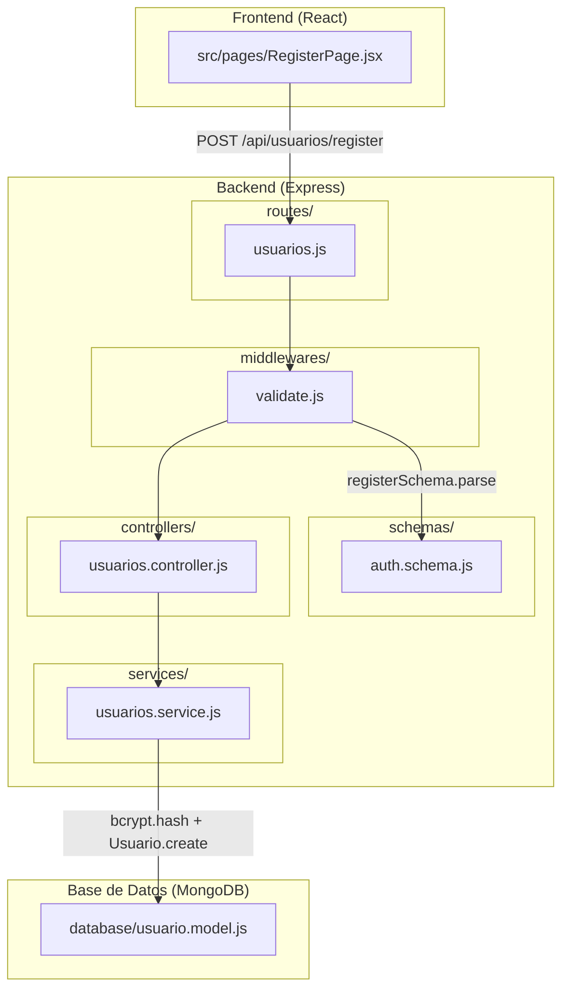

## Diagrama de Caso de Uso — Análisis

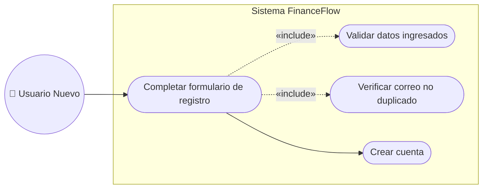

## Diagrama de Caso de Uso — Diseño

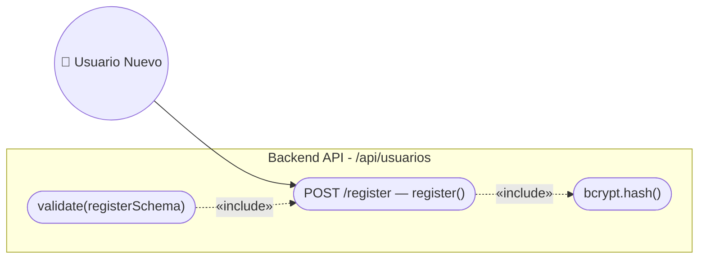

## Diagrama de Secuencia — Análisis

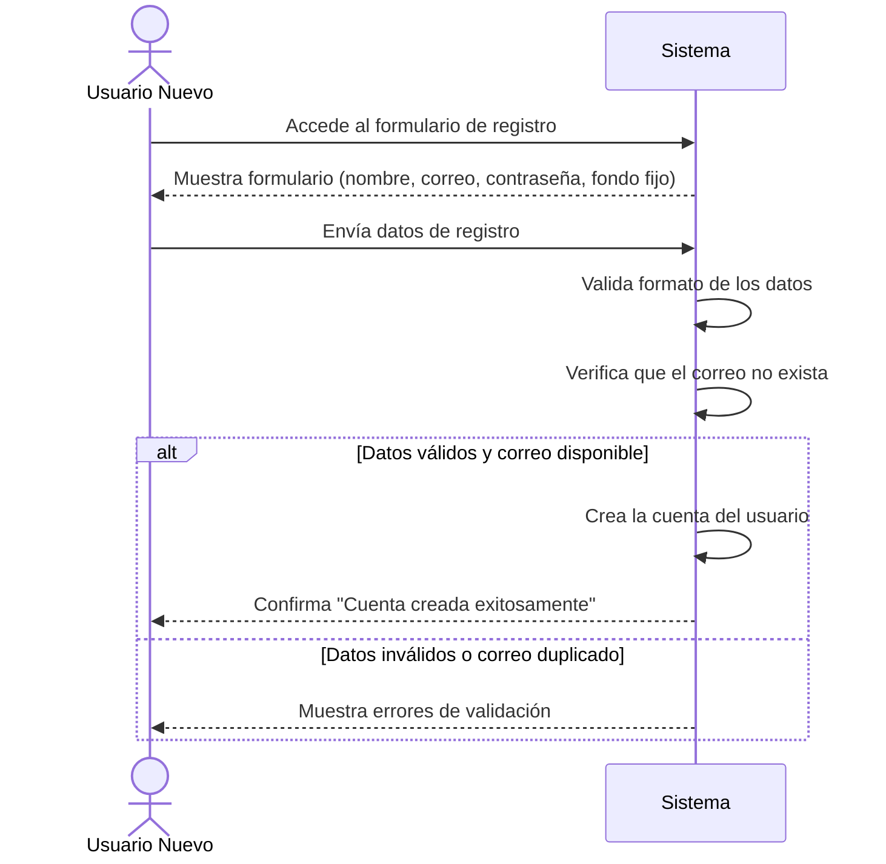

## Diagrama de Secuencia — Diseño

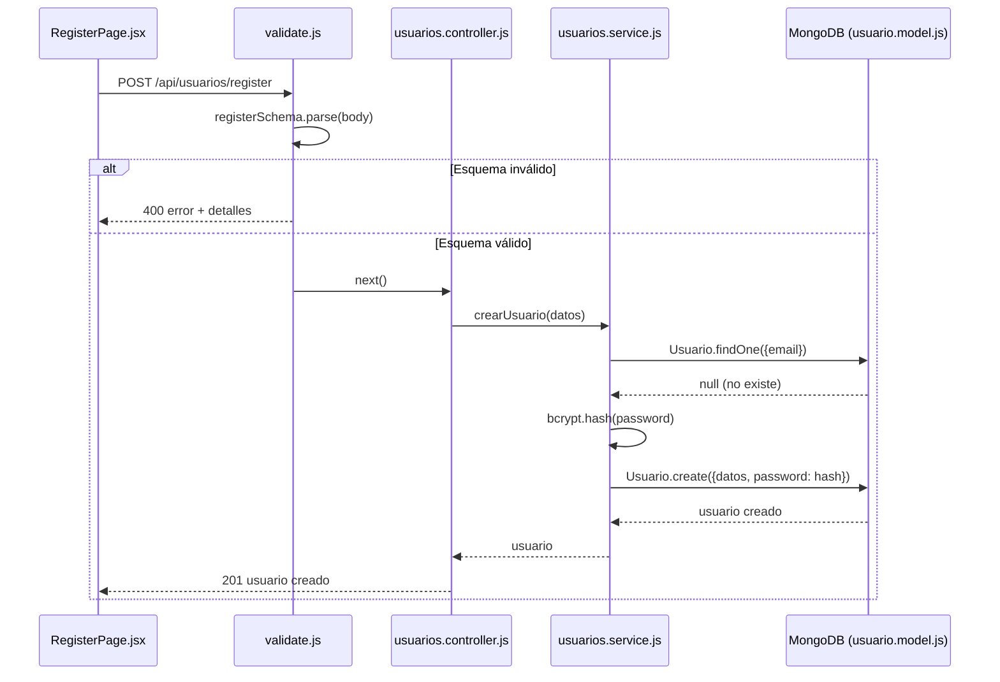

## Diagrama de Clases — Análisis

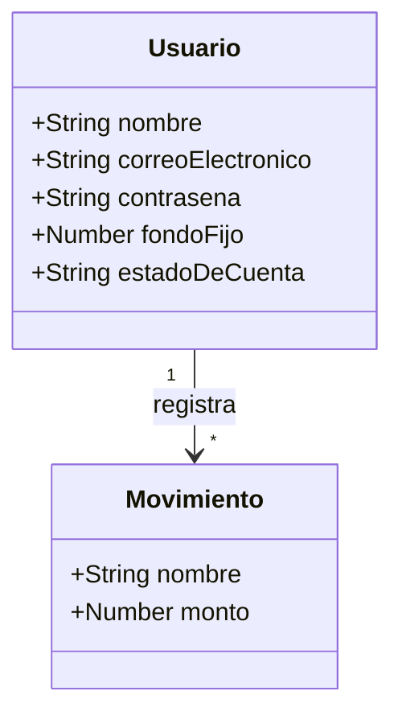

## Diagrama de Clases — Diseño

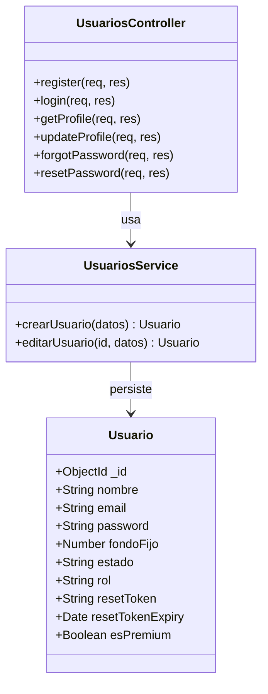

## Diagrama de Proceso — Análisis

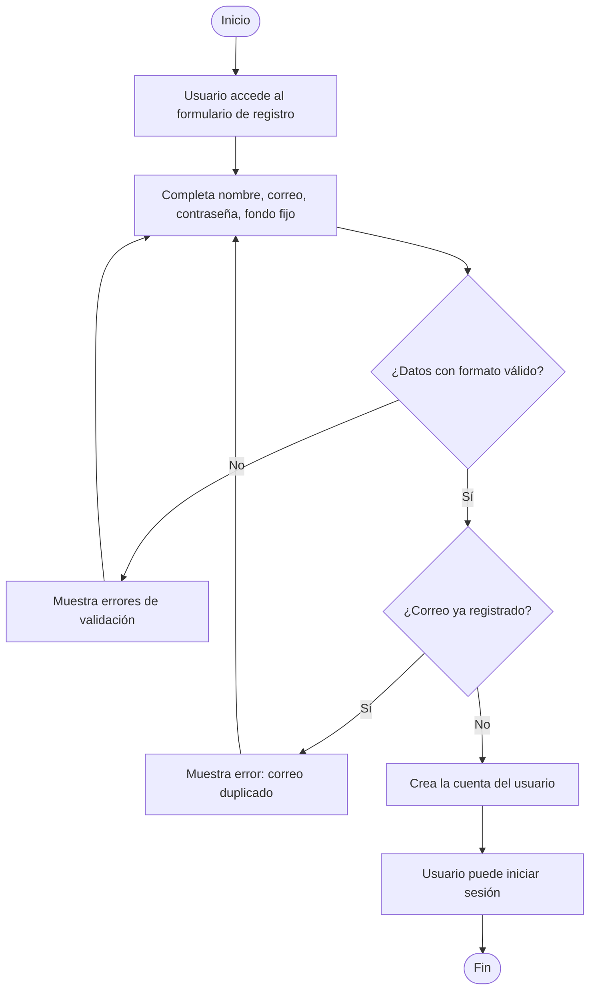

## Diagrama de Proceso — Diseño

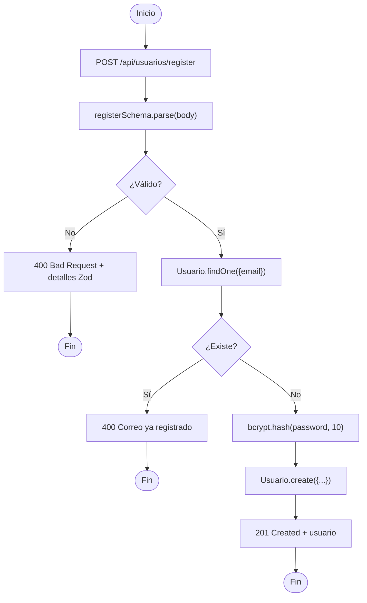

## Diagrama de Componentes — Implementación (uno por Figura)

### Figura 03 — RegisterPage.jsx

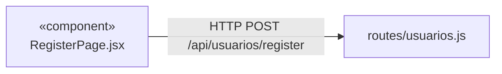

### Figura 04 — routes/usuarios.js

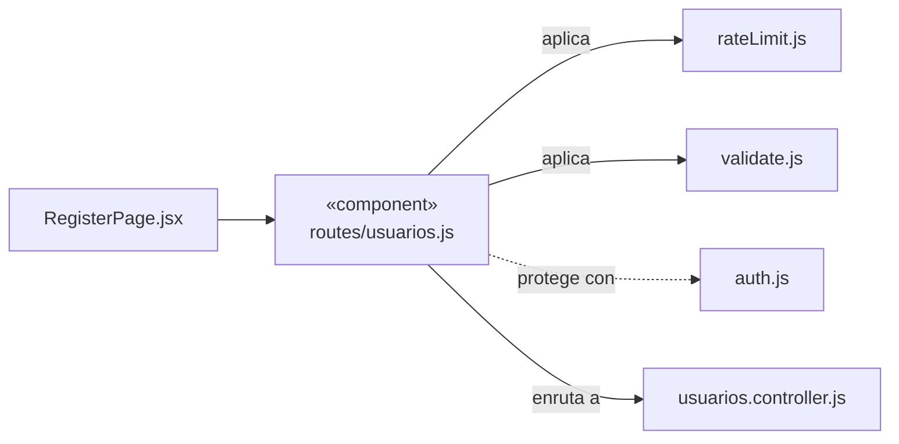

### Figura 05 — validate.js

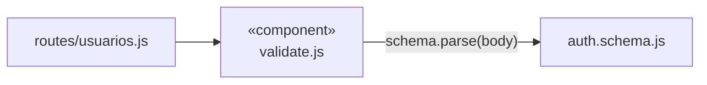

### Figura 06 — auth.schema.js

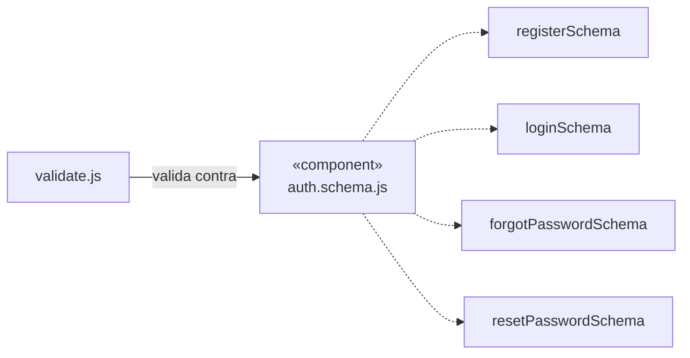

### Figura 07 — usuarios.controller.js

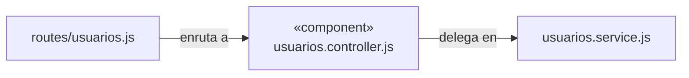

### Figura 08 — usuarios.service.js

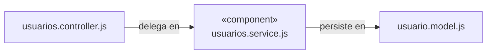

### Figura 09 — usuario.model.js

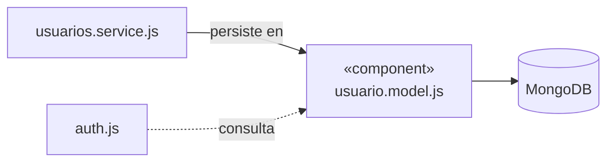

### Figura 10 — auth.js

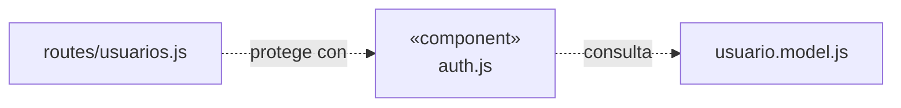

### Figura 11 — rateLimit.js

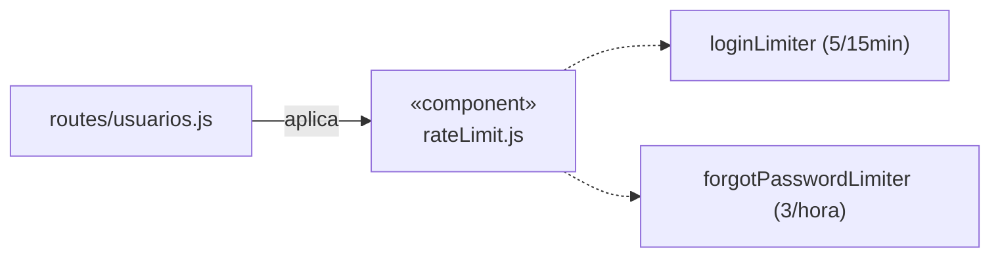

---

# RF02: Iniciar Sesión

## Diagrama de Paquete — Análisis

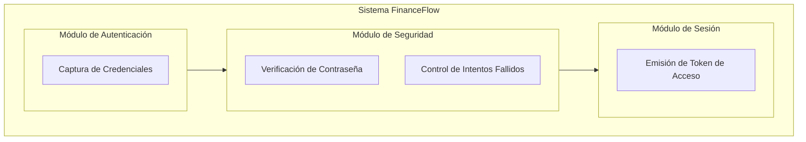

## Diagrama de Paquete — Diseño

```mermaid
flowchart TB
    subgraph FE["Frontend (React)"]
        F1["src/pages/LoginPage.jsx"]
        F2["src/hooks/useAuth.js"]
    end
    subgraph BE["Backend (Express)"]
        B1["routes/usuarios.js"]
        B2["middlewares/rateLimit.js (loginLimiter)"]
        B3["middlewares/validate.js"]
        B4["schemas/auth.schema.js"]
        B5["controllers/usuarios.controller.js"]
        B6["middlewares/auth.js (jsonwebtoken)"]
    end
    F1 --> F2
    F2 -->|"POST /api/usuarios/login"| B1
    B1 --> B2 --> B3
    B3 -->|"loginSchema"| B4
    B3 --> B5
    B5 -.->|"emite JWT consumido por"| B6
```

## Diagrama de Caso de Uso — Análisis

```mermaid
flowchart LR
    actor(("🧑 Usuario Registrado"))
    subgraph SYS["Sistema FinanceFlow"]
        UC1(["Iniciar sesión"])
        UC2(["Validar credenciales"])
        UC3(["Bloqueo por intentos excesivos"])
    end
    actor --> UC1
    UC1 -.->|"«include»"| UC2
    UC3 -.->|"«extend»"| UC1
```

## Diagrama de Caso de Uso — Diseño

```mermaid
flowchart LR
    actor(("🧑 Usuario Registrado"))
    subgraph API["Backend API - /api/usuarios"]
        UC1(["POST /login — login()"])
        UC2(["loginLimiter (5/15min)"])
        UC3(["validate(loginSchema)"])
        UC4(["jwt.sign()"])
    end
    actor --> UC1
    UC2 -.->|"«include»"| UC1
    UC3 -.->|"«include»"| UC1
    UC1 -.->|"«include»"| UC4
```

## Diagrama de Secuencia — Análisis

```mermaid
sequenceDiagram
    actor Usuario as Usuario Registrado
    participant Sistema

    Usuario->>Sistema: Ingresa correo y contraseña
    Sistema->>Sistema: Verifica límite de intentos
    alt Límite excedido
        Sistema-->>Usuario: "Demasiados intentos, intente en 15 min"
    else Dentro del límite
        Sistema->>Sistema: Valida formato
        Sistema->>Sistema: Compara contraseña
        alt Credenciales correctas
            Sistema-->>Usuario: Concede acceso (sesión activa)
        else Credenciales incorrectas
            Sistema-->>Usuario: "Credenciales inválidas"
        end
    end
```

## Diagrama de Secuencia — Diseño

```mermaid
sequenceDiagram
    participant FE as LoginPage.jsx
    participant RL as loginLimiter
    participant MW as validate.js
    participant CTRL as usuarios.controller.js
    participant DB as MongoDB (Usuario)
    participant JWT as jsonwebtoken

    FE->>RL: POST /api/usuarios/login
    RL->>RL: Verifica contador por IP
    alt Excede 5 intentos / 15 min
        RL-->>FE: 429 Demasiados intentos
    else Dentro del límite
        RL->>MW: next()
        MW->>MW: loginSchema.parse(body)
        MW->>CTRL: next()
        CTRL->>DB: Usuario.findOne({email})
        DB-->>CTRL: usuario | null
        CTRL->>CTRL: bcrypt.compare(password, usuario.password)
        alt Coincide
            CTRL->>JWT: sign({id, email, rol}, JWT_SECRET)
            JWT-->>CTRL: token
            CTRL-->>FE: 200 token + usuario
        else No coincide
            CTRL-->>FE: 401 Credenciales inválidas
        end
    end
```

## Diagrama de Clases — Análisis

```mermaid
classDiagram
    class Usuario {
        +String correoElectronico
        +String contrasena
    }
    class Sesion {
        +String token
        +Date fechaExpiracion
    }
    Usuario "1" --> "1" Sesion : genera al autenticarse
```

## Diagrama de Clases — Diseño

```mermaid
classDiagram
    class Usuario {
        +String email
        +String password
        +String rol
    }
    class UsuariosController {
        +login(req, res)
    }
    class JsonWebToken {
        <<external>>
        +sign(payload, secret, options) String
        +verify(token, secret) Object
    }
    class AuthMiddleware {
        +verificarToken(req, res, next)
    }
    UsuariosController --> Usuario : consulta
    UsuariosController --> JsonWebToken : firma token
    AuthMiddleware --> JsonWebToken : verifica token
```

## Diagrama de Proceso — Análisis

```mermaid
flowchart TD
    Start([Inicio]) --> A[Usuario ingresa credenciales]
    A --> B{¿Excede intentos permitidos?}
    B -- Sí --> C[Bloquea temporalmente]
    C --> End1([Fin])
    B -- No --> D{¿Formato válido?}
    D -- No --> E[Muestra error de formato]
    E --> A
    D -- Sí --> F{¿Contraseña coincide?}
    F -- No --> G[Muestra: credenciales inválidas]
    G --> A
    F -- Sí --> H[Concede acceso al sistema]
    H --> End2([Fin])
```

## Diagrama de Proceso — Diseño

```mermaid
flowchart TD
    Start([Inicio]) --> A["POST /api/usuarios/login"]
    A --> B["loginLimiter: contador++"]
    B --> C{"¿contador > 5 en 15 min?"}
    C -- Sí --> D["429 Too Many Requests"]
    D --> End1([Fin])
    C -- No --> E["loginSchema.parse(body)"]
    E --> F{"¿Válido?"}
    F -- No --> G["400 Bad Request"]
    G --> End2([Fin])
    F -- Sí --> H["Usuario.findOne({email})"]
    H --> I{"¿Usuario existe?"}
    I -- No --> J["401 Credenciales inválidas"]
    J --> End3([Fin])
    I -- Sí --> K["bcrypt.compare(password, hash)"]
    K --> L{"¿Coincide?"}
    L -- No --> J
    L -- Sí --> M["jwt.sign({id,email,rol})"]
    M --> N["200 OK: token + usuario"]
    N --> End4([Fin])
```

---

# RF03: Registrar Movimiento (Ingreso/Gasto)

## Diagrama de Paquete — Análisis

```mermaid
flowchart TB
    subgraph SIS["Sistema FinanceFlow"]
        subgraph MOV["Módulo de Movimientos"]
            M1[Registrar Movimiento]
        end
        subgraph AUTN["Módulo de Autenticación"]
            A1[Identificar Usuario Propietario]
        end
        subgraph CIE["Módulo de Cierres"]
            C1[Verificar Periodo No Cerrado]
        end
    end
    MOV -->|requiere| AUTN
    MOV -->|requiere| CIE
```

## Diagrama de Paquete — Diseño

```mermaid
flowchart TB
    subgraph FE["Frontend (React)"]
        F1["src/pages/MovimientoFormPage.jsx"]
        F2["src/hooks/useMovimientos.js"]
    end
    subgraph BE["Backend (Express)"]
        B1["routes/movimientos.js (auth)"]
        B2["middlewares/validate.js"]
        B3["schemas/movimiento.schema.js"]
        B4["controllers/movimientos.controller.js"]
        B5["services/movimientos.service.js"]
        B6["services/cierres.service.js"]
    end
    subgraph DB["Base de Datos (MongoDB)"]
        D1["database/movimiento.model.js"]
    end
    F1 --> F2
    F2 -->|"POST /api/movimientos"| B1
    B1 --> B2
    B2 -->|"crearMovimientoSchema"| B3
    B2 --> B4 --> B5
    B5 -->|"esPeriodoCerrado"| B6
    B5 -->|"Movimiento.create"| D1
```

## Diagrama de Caso de Uso — Análisis

```mermaid
flowchart LR
    actor(("🧑 Usuario Autenticado"))
    subgraph SYS["Sistema FinanceFlow"]
        UC1(["Registrar movimiento"])
        UC2(["Validar datos ingresados"])
        UC3(["Verificar periodo no cerrado"])
    end
    actor --> UC1
    UC1 -.->|"«include»"| UC2
    UC1 -.->|"«include»"| UC3
```

## Diagrama de Caso de Uso — Diseño

```mermaid
flowchart LR
    actor(("🧑 Usuario Autenticado"))
    subgraph API["Backend API - /api/movimientos"]
        UC1(["POST / — crearMovimiento()"])
        UC2(["auth (verificar JWT)"])
        UC3(["validate(crearMovimientoSchema)"])
        UC4(["esPeriodoCerrado()"])
    end
    actor --> UC1
    UC2 -.->|"«include»"| UC1
    UC3 -.->|"«include»"| UC1
    UC1 -.->|"«include»"| UC4
```

## Diagrama de Secuencia — Análisis

```mermaid
sequenceDiagram
    actor Usuario as Usuario Autenticado
    participant Sistema

    Usuario->>Sistema: Completa formulario de movimiento
    Sistema->>Sistema: Valida los datos ingresados
    Sistema->>Sistema: Verifica si el periodo está cerrado
    alt Periodo abierto y datos válidos
        Sistema->>Sistema: Registra el movimiento
        Sistema-->>Usuario: Actualiza saldo y confirma
    else Periodo cerrado o datos inválidos
        Sistema-->>Usuario: Muestra mensaje de error
    end
```

## Diagrama de Secuencia — Diseño

```mermaid
sequenceDiagram
    participant FE as MovimientoFormPage.jsx
    participant AUTH as auth middleware
    participant MW as validate.js
    participant CTRL as movimientos.controller.js
    participant SVC as movimientos.service.js
    participant CIE as cierres.service.js
    participant DB as MongoDB (Movimiento)

    FE->>AUTH: POST /api/movimientos (Bearer JWT + datos)
    AUTH->>AUTH: jwt.verify(token)
    alt Token inválido
        AUTH-->>FE: 401 No autorizado
    else Token válido
        AUTH->>MW: next() [req.user poblado]
        MW->>MW: crearMovimientoSchema.parse(body)
        MW->>CTRL: next()
        CTRL->>SVC: crearMovimiento({body, userId: req.user.id})
        SVC->>CIE: esPeriodoCerrado(userId, fecha)
        CIE-->>SVC: true | false
        alt Periodo cerrado
            SVC-->>CTRL: Error "Periodo cerrado"
            CTRL-->>FE: 400 Bad Request
        else Periodo abierto
            SVC->>DB: Movimiento.create({...})
            DB-->>SVC: movimiento
            SVC-->>CTRL: movimiento
            CTRL-->>FE: 201 Created
        end
    end
```

## Diagrama de Clases — Análisis

```mermaid
classDiagram
    class Movimiento {
        +String nombre
        +Number monto
        +String tipo
        +String categoria
        +Date fecha
        +String notas
    }
    class Usuario {
        +String nombre
    }
    class PeriodoContable {
        +Boolean cerrado
    }
    Usuario "1" --> "*" Movimiento : registra
    Movimiento "*" --> "1" PeriodoContable : pertenece a
```

## Diagrama de Clases — Diseño

```mermaid
classDiagram
    class Movimiento {
        +ObjectId _id
        +ObjectId userId
        +String nombre
        +Number monto
        +String tipo
        +String categoria
        +Date fecha
        +String estado
        +String notas
    }
    class MovimientosController {
        +crearMovimiento(req, res)
        +listarMovimientos(req, res)
        +editarMovimiento(req, res)
        +inhabilitarMovimiento(req, res)
        +analizarComprobante(req, res)
    }
    class MovimientosService {
        +crearMovimiento(datos) Movimiento
        +editarMovimiento(id, datos, userId) Movimiento
    }
    class CierresService {
        +esPeriodoCerrado(userId, fecha) Boolean
    }
    MovimientosController --> MovimientosService : usa
    MovimientosService --> CierresService : consulta
    MovimientosService --> Movimiento : persiste
```

## Diagrama de Proceso — Análisis

```mermaid
flowchart TD
    Start([Inicio]) --> A[Usuario accede al formulario]
    A --> B[Completa datos del movimiento]
    B --> C{¿Formato válido?}
    C -- No --> D[Muestra errores]
    D --> B
    C -- Sí --> E{¿Periodo cerrado?}
    E -- Sí --> F[Rechaza la operación]
    F --> End1([Fin])
    E -- No --> G[Registra el movimiento]
    G --> H[Actualiza saldo en el dashboard]
    H --> End2([Fin])
```

## Diagrama de Proceso — Diseño

```mermaid
flowchart TD
    Start([Inicio]) --> A["auth: verifica JWT"]
    A --> B{"¿Autenticado?"}
    B -- No --> C["401 No autorizado"]
    C --> End1([Fin])
    B -- Sí --> D["crearMovimientoSchema.parse(body)"]
    D --> E{"¿Válido? (monto>0, tipo enum)"}
    E -- No --> F["400 Bad Request"]
    F --> End2([Fin])
    E -- Sí --> G["cierresService.esPeriodoCerrado(userId, fecha)"]
    G --> H{"¿Cerrado?"}
    H -- Sí --> I["400 Periodo cerrado"]
    I --> End3([Fin])
    H -- No --> J["Movimiento.create({datos, userId})"]
    J --> K["201 Created"]
    K --> End4([Fin])
```

## Diagrama de Componentes — Implementación (uno por Figura)

### Figura 32 — MovimientoFormPage.jsx

```mermaid
flowchart LR
    C1["«component»<br/>MovimientoFormPage.jsx"]
    C2["useMovimientos.js"]
    C3["routes/movimientos.js"]
    C1 --> C2
    C2 -->|"HTTP POST /api/movimientos"| C3
```

### Figura 33 — movimientos.controller.js y movimientos.service.js

```mermaid
flowchart LR
    C1["routes/movimientos.js"]
    C2["«component»<br/>movimientos.controller.js"]
    C3["«component»<br/>movimientos.service.js"]
    C4["cierres.service.js"]
    C5["movimiento.model.js"]
    C1 -->|"enruta a"| C2
    C2 -->|"delega en"| C3
    C3 -->|"consulta"| C4
    C3 -->|"persiste en"| C5
```

### Figura 34 — movimiento.schema.js

```mermaid
flowchart LR
    C1["validate.js"]
    C2["«component»<br/>movimiento.schema.js"]
    C1 -->|"valida contra"| C2
    C2 -.-> D1["crearMovimientoSchema"]
```

### Figura 35 — movimiento.model.js

```mermaid
flowchart LR
    C1["movimientos.service.js"]
    C2["«component»<br/>movimiento.model.js"]
    C3[("MongoDB")]
    C1 -->|"persiste en"| C2
    C2 --> C3
```

---

# RF04: Recuperar Contraseña

## Diagrama de Paquete — Análisis

```mermaid
flowchart TB
    subgraph SIS["Sistema FinanceFlow"]
        subgraph REC["Módulo de Recuperación"]
            R1[Solicitud de Recuperación]
            R2[Token Temporal]
        end
        subgraph NOT["Módulo de Notificaciones"]
            N1[Envío de Correo]
        end
        subgraph USU["Módulo de Usuarios"]
            U1[Actualizar Contraseña]
        end
    end
    REC --> NOT
    REC --> USU
```

## Diagrama de Paquete — Diseño

```mermaid
flowchart TB
    subgraph FE["Frontend (React)"]
        F1["src/pages/ForgotPasswordPage.jsx"]
        F2["src/pages/ResetPasswordPage.jsx"]
    end
    subgraph BE["Backend (Express)"]
        B1["middlewares/rateLimit.js (forgotPasswordLimiter)"]
        B2["schemas/auth.schema.js"]
        B3["controllers/usuarios.controller.js"]
        B4["nodemailer (servicio de correo)"]
    end
    subgraph DB["Base de Datos (MongoDB)"]
        D1["usuario.model.js (resetToken, resetTokenExpiry)"]
    end
    F1 -->|"POST /forgot-password"| B1
    B1 --> B2 --> B3
    B3 -->|"envía enlace"| B4
    B3 -->|"guarda token"| D1
    F2 -->|"POST /reset-password"| B3
```

## Diagrama de Caso de Uso — Análisis

```mermaid
flowchart LR
    actor(("🧑 Usuario"))
    subgraph SYS["Sistema FinanceFlow"]
        UC1(["Solicitar recuperación"])
        UC2(["Enviar correo con enlace temporal"])
        UC3(["Restablecer contraseña"])
        UC4(["Verificar validez del token"])
    end
    actor --> UC1
    actor --> UC3
    UC1 -.->|"«include»"| UC2
    UC3 -.->|"«include»"| UC4
```

## Diagrama de Caso de Uso — Diseño

```mermaid
flowchart LR
    actor(("🧑 Usuario"))
    sistemaCorreo(("📧 Servidor SMTP"))
    subgraph API["Backend API - /api/usuarios"]
        UC1(["POST /forgot-password"])
        UC2(["POST /verify-reset-token"])
        UC3(["POST /reset-password"])
    end
    actor --> UC1
    actor --> UC2
    actor --> UC3
    UC1 -->|"nodemailer"| sistemaCorreo
```

## Diagrama de Secuencia — Análisis

```mermaid
sequenceDiagram
    actor Usuario
    participant Sistema
    participant Correo as Correo Electrónico

    Usuario->>Sistema: Solicita recuperación (correo)
    Sistema->>Sistema: Genera token temporal
    Sistema->>Correo: Envía enlace de recuperación
    Correo-->>Usuario: Recibe correo
    Usuario->>Sistema: Hace clic en el enlace
    Sistema->>Sistema: Valida vigencia del token
    alt Token válido
        Usuario->>Sistema: Ingresa nueva contraseña
        Sistema-->>Usuario: Confirma cambio exitoso
    else Token expirado o inválido
        Sistema-->>Usuario: Muestra error, ofrece reenviar
    end
```

## Diagrama de Secuencia — Diseño

```mermaid
sequenceDiagram
    participant FE1 as ForgotPasswordPage.jsx
    participant RL as forgotPasswordLimiter
    participant CTRL as usuarios.controller.js
    participant DB as MongoDB (Usuario)
    participant Mail as nodemailer
    participant FE2 as ResetPasswordPage.jsx

    FE1->>RL: POST /forgot-password (correo)
    RL->>RL: Verifica contador (3/hora)
    RL->>CTRL: forgotPassword(req, res)
    CTRL->>DB: Usuario.findOne({correo})
    alt Usuario existe
        CTRL->>CTRL: crypto.randomBytes() genera token
        CTRL->>DB: guarda resetToken + resetTokenExpiry
        CTRL->>Mail: enviarCorreoRecuperacion(correo, token)
    end
    CTRL-->>FE1: 200 mensaje genérico

    FE2->>CTRL: POST /verify-reset-token (token)
    CTRL->>DB: busca usuario con ese token
    CTRL->>CTRL: verifica resetTokenExpiry > Date.now()
    CTRL-->>FE2: token válido | inválido

    FE2->>CTRL: POST /reset-password (token, nuevaPassword)
    CTRL->>CTRL: bcrypt.hash(nuevaPassword)
    CTRL->>DB: actualiza password, limpia resetToken
    CTRL-->>FE2: 200 Contraseña actualizada
```

## Diagrama de Clases — Análisis

```mermaid
classDiagram
    class Usuario {
        +String correoElectronico
    }
    class TokenDeRecuperacion {
        +String valor
        +Date fechaExpiracion
    }
    Usuario "1" --> "0..1" TokenDeRecuperacion : posee temporalmente
```

## Diagrama de Clases — Diseño

```mermaid
classDiagram
    class Usuario {
        +String email
        +String password
        +String resetToken
        +Date resetTokenExpiry
    }
    class UsuariosController {
        +forgotPassword(req, res)
        +verifyResetToken(req, res)
        +resetPassword(req, res)
    }
    class MailService {
        <<nodemailer>>
        +enviarCorreoRecuperacion(destino, token)
    }
    UsuariosController --> Usuario : lee/actualiza
    UsuariosController --> MailService : usa
```

## Diagrama de Proceso — Análisis

```mermaid
flowchart TD
    Start([Inicio]) --> A[Usuario solicita recuperación]
    A --> B{¿Correo existe?}
    B -- No --> C[Responde mensaje genérico]
    C --> End1([Fin])
    B -- Sí --> D[Genera y envía token]
    D --> E[Usuario abre el enlace]
    E --> F{¿Token válido y vigente?}
    F -- No --> G[Muestra error, ofrece reenviar]
    G --> End2([Fin])
    F -- Sí --> H[Usuario define nueva contraseña]
    H --> I[Confirma actualización]
    I --> End3([Fin])
```

## Diagrama de Proceso — Diseño

```mermaid
flowchart TD
    Start([Inicio]) --> A["forgotPasswordLimiter: contador++"]
    A --> B{"¿contador > 3/hora?"}
    B -- Sí --> C["429 Too Many Requests"]
    C --> End1([Fin])
    B -- No --> D["Usuario.findOne({correo})"]
    D --> E{"¿Existe?"}
    E -- No --> F["200 mensaje genérico (no revela)"]
    F --> End2([Fin])
    E -- Sí --> G["crypto.randomBytes() + expiry"]
    G --> H["guarda resetToken en BD"]
    H --> I["nodemailer envía enlace"]
    I --> J["200 mensaje genérico"]
    J --> K["POST /reset-password (token, nueva)"]
    K --> L{"¿resetTokenExpiry > now?"}
    L -- No --> M["400 Token expirado"]
    M --> End3([Fin])
    L -- Sí --> N["bcrypt.hash(nuevaPassword)"]
    N --> O["actualiza password, limpia token"]
    O --> P["200 Contraseña actualizada"]
    P --> End4([Fin])
```
