# Diseño de API y Casos de Uso

## Endpoints REST Principales

### Movimientos (Ingresos/Egresos)
- `GET /api/movimientos` — Listar todos los movimientos (activos/inactivos, con filtros opcionales)
- `POST /api/movimientos` — Crear un nuevo movimiento
- `PUT /api/movimientos/:id` — Editar un movimiento existente
- `PATCH /api/movimientos/:id/estado` — Inhabilitar (desactivar) un movimiento

### Reportes
- `GET /api/reportes/totales` — Obtener totales de ingresos, egresos y balance
- `GET /api/reportes?fechaInicio&fechaFin` — Reporte filtrado por rango de fechas

### Usuarios (para autenticación y control de acceso)
- `POST /api/usuarios` — Registrar usuario
- `POST /api/login` — Iniciar sesión
- `GET /api/usuarios/me` — Obtener datos del usuario autenticado

### Logs (auditoría)
- `GET /api/logs` — Listar logs del sistema (opcional, solo admin)

## Catálogo de Casos de Uso del Sistema

A continuación se enlistan exhaustivamente los Casos de Uso (CU) del sistema, abarcando desde la capa de autenticación hasta la innovación con Inteligencia Artificial.

| ID | Nombre del Caso de Uso | Actor(es) | Descripción Corta |
| :--- | :--- | :--- | :--- |
| **CU-01** | Registrar Usuario (Sign Up) | Usuario No Registrado | Permite a una persona nueva crear una cuenta segura en la plataforma. |
| **CU-02** | Iniciar Sesión (Login JWT) | Usuario Registrado | Valida las credenciales y otorga acceso seguro al sistema. |
| **CU-03** | Registrar Movimiento Manual | Usuario Autenticado | Permite registrar a mano los datos de un ingreso o egreso (monto, fecha, nombre, categoría). |
| **CU-04** | Escanear Recibo (Motor IA) | Usuario Autenticado, Motor Python | Extrae datos del recibo fotográfico usando OCR y predice la categoría de gasto usando ML. |
| **CU-05** | Visualizar Dashboard Analítico | Usuario Autenticado | Muestra el resumen de saldo, gráficos de barras de ingresos vs egresos, y gráfico de pastel de categorías. |
| **CU-06** | Modificar Movimiento (Update) | Usuario Autenticado | Permite corregir datos ingresados accidentalmente en el historial. |
| **CU-07** | Inhabilitar Movimiento (Delete) | Usuario Autenticado | Oculta un movimiento mediante borrado lógico (estado inactivo) sin afectar auditorías. |
| **CU-08** | Filtrar y Analizar Reportes | Usuario Autenticado | Filtra el historial de movimientos por rango de fechas o categorías específicas. |
| **CU-09** | Reentrenar Clasificador IA | Sistema Frontend, Motor Python | (*Automático*) Envía correcciones y nuevos datos de transacciones al modelo para su auto-mejora. |
| **CU-10** | Cerrar Sesión (Logout) | Usuario Autenticado | Destruye el token de sesión y protege los datos financieros del dispositivo. |
| **CU-11** | Recuperar/Restablecer Contraseña | Usuario No Autenticado | Permite al usuario restablecer el acceso a su cuenta al olvidar su clave. |
| **CU-12** | Consultar/Editar Perfil | Usuario Autenticado | Permite visualizar los datos personales, métricas básicas de uso y actualizar configuraciones. |
| **CU-13** | Visualizar Auditoría (Logs) | Administrador | Permite a los administradores visualizar el historial técnico de acciones en el sistema. |

## Notas
- Todos los endpoints de la API están protegidos por middleware de JWT (`/api/movimientos`, `/api/reportes`).
- El endpoint de reentrenamiento (`/retrain`) opera desde React de manera asíncrona (CU-09).

---

## Narrativas de Casos de Uso

A continuación se detalla la narrativa estructurada para cada uno de los Casos de Uso del sistema.

### CU-01: Registrar Usuario (Sign Up)

**Diagrama de Caso de Uso:**
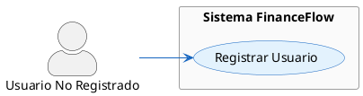

| Campo | Detalle |
| :--- | :--- |
| **Identificador** | CU-01 |
| **Nombre** | Registrar Usuario (Sign Up) |
| **Actor Principal** | Usuario No Registrado |
| **Precondición** | El usuario tiene acceso a la pantalla de registro y conexión a internet. |
| **Postcondición** | El sistema crea una cuenta vinculada a un correo único, almacena la contraseña de forma encriptada (hashed) y lo redirige a Iniciar Sesión. |
| **Flujo Principal** | |
| **ACTOR** | **SISTEMA** |
| 1. Ingresa a la pantalla de registro y llena el formulario con nombre, correo y contraseña. | |
| 2. Presiona "Registrarse". | |
| | 3. Valida el formato del correo, asegura que la contraseña cumpla los criterios mínimos y revisa si el correo ya existe. |
| | 4. Encripta la contraseña, guarda el registro en la BD (MongoDB) y retorna un mensaje de éxito. |
| | 5. Redirige al actor a la pantalla de Login. |
| **Excepción 1: Correo Duplicado** | |
| **ACTOR** | **SISTEMA** |
| 1. Proporciona un correo electrónico que ya pertenece a otro usuario registrado. | |
| | 2. Detecta la anomalía al consultar la BD. |
| | 3. Cancela la creación y retorna el mensaje: "El correo ya está en uso". |
| 4. Corrige el correo e intenta nuevamente. | |

---

### CU-02: Iniciar Sesión (Login JWT)

**Diagrama de Caso de Uso:**
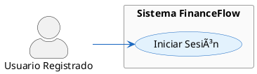

| Campo | Detalle |
| :--- | :--- |
| **Identificador** | CU-02 |
| **Nombre** | Iniciar Sesión (Login JWT) |
| **Actor Principal** | Usuario Registrado |
| **Precondición** | El usuario ya posee una cuenta en el sistema. |
| **Postcondición** | El usuario queda autenticado y recibe un token JWT validado para acceder al sistema. |
| **Flujo Principal** | |
| **ACTOR** | **SISTEMA** |
| 1. Ingresa su correo y contraseña en la pantalla de Login y presiona "Ingresar". | |
| | 2. Busca al usuario en la BD por su correo. |
| | 3. Compara el *hash* de la contraseña proporcionada con la almacenada. |
| | 4. Genera un token JWT firmado, actualiza el estado global (Context/Redux/AsyncStorage) y almacena la sesión. |
| | 5. Redirige a la pantalla principal "Dashboard". |
| **Excepción 1: Credenciales Inválidas** | |
| **ACTOR** | **SISTEMA** |
| 1. Introduce una contraseña incorrecta o un correo que no existe. | |
| | 2. Verifica que las credenciales no coinciden. |
| | 3. Retorna un error genérico (por seguridad): "Credenciales inválidas". |
| 4. Corrige el error en el formulario y reintenta. | |

---

### CU-03: Registrar Movimiento Manual

**Diagrama de Caso de Uso:**

| Campo | Detalle |
| :--- | :--- |
| **Identificador** | CU-03 |
| **Nombre** | Registrar Movimiento Manual |
| **Actor Principal** | Usuario Autenticado |
| **Precondición** | El usuario tiene una sesión activa y se encuentra en la vista "Nuevo Movimiento". |
| **Postcondición** | El movimiento financiero (Ingreso o Egreso) queda asentado en la base de datos y afecta el balance global. |
| **Flujo Principal** | |
| **ACTOR** | **SISTEMA** |
| 1. Llena los campos: Monto, Nombre (concepto), Categoría, Tipo (Ingreso/Egreso) y Fecha. | |
| 2. Selecciona "Guardar movimiento". | |
| | 3. Valida que el monto sea un número válido y que no haya campos requeridos vacíos. |
| | 4. Asigna el usuario actual (ID del token) como propietario del registro y guarda en BD. |
| | 5. Actualiza la lista de movimientos y recalcula el balance. Muestra mensaje de éxito. |
| **Excepción 1: Campos obligatorios omitidos** | |
| **ACTOR** | **SISTEMA** |
| 1. Intenta guardar dejando el campo "Monto" vacío. | |
| | 2. El Frontend detecta la falta en el formulario. |
| | 3. Bloquea la petición a la API y marca de rojo el campo con el mensaje "El monto es obligatorio". |
| 4. Completa el campo y vuelve a presionar guardar. | |

---

### CU-04: Escanear Recibo (Motor IA)

**Diagrama de Caso de Uso:**
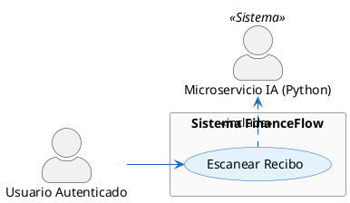

| Campo | Detalle |
| :--- | :--- |
| **Identificador** | CU-04 |
| **Nombre** | Escanear Recibo (Motor IA) |
| **Actor Principal** | Usuario Autenticado |
| **Precondición** | El usuario debe estar autenticado en la plataforma y contar con un comprobante de pago legible. |
| **Postcondición** | El formulario de movimientos se autocompleta con datos procesados mediante OCR y algoritmos Naive Bayes. |
| **Flujo Principal** | |
| **ACTOR** | **SISTEMA** |
| 1. Selecciona "Escanear (Automático)" en la interfaz y provee una foto de un recibo. | |
| | 2. Captura la imagen, la convierte y la despacha al servidor Python de IA. |
| | 3. El servidor IA lee el texto (Tesseract OCR), extrae monto/fecha con Regex y deduce la categoría con Machine Learning. |
| | 4. El servidor Node.js/Frontend recibe los datos deducidos y autocompleta el formulario. |
| 5. Revisa que todo coincida, y presiona "Guardar". | |
| | 6. Registra exitosamente el movimiento financiero en MongoDB. |
| **Excepción 1: Imagen ilegible / ilegítima** | |
| **ACTOR** | **SISTEMA** |
| 1. Sube una foto completamente oscura, borrosa o que no es un recibo. | |
| | 2. El OCR falla al no detectar coincidencias de montos ni texto legible. |
| | 3. El sistema limpia la carga y advierte al usuario: "No pudimos procesar la imagen de forma automatizada". |
| 4. Procede a ingresar los datos mecánicamente usando el CU-03. | |

---

### CU-05: Visualizar Dashboard Analítico

**Diagrama de Caso de Uso:**
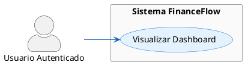

| Campo | Detalle |
| :--- | :--- |
| **Identificador** | CU-05 |
| **Nombre** | Visualizar Dashboard Analítico |
| **Actor Principal** | Usuario Autenticado |
| **Precondición** | El usuario inicia sesión y tiene registros previos cargados. |
| **Postcondición** | Se visualizan los indicadores matemáticos de la salud financiera del usuario. |
| **Flujo Principal** | |
| **ACTOR** | **SISTEMA** |
| 1. Ingresa a la pantalla principal o pulsa el ícono "Inicio". | |
| | 2. Extrae todos los movimientos asociados al ID y mes vigente del usuario. |
| | 3. Realiza la sumatoria total de ingresos, resta los egresos para indicar el saldo y procesa arreglos de datos por categoría. |
| | 4. Renderiza los componentes gráficos (React Recharts / React Native Chart Kit) desplegando curvas de gasto y pasteles de distribución. |

*(No aplican flujos alternativos complejos. Si no hay registros, el sistema renderiza el gráfico en ceros informando "No hay datos en este ciclo").*

---

### CU-06: Modificar Movimiento (Update)

**Diagrama de Caso de Uso:**

| Campo | Detalle |
| :--- | :--- |
| **Identificador** | CU-06 |
| **Nombre** | Modificar Movimiento (Update) |
| **Actor Principal** | Usuario Autenticado |
| **Precondición** | Existe un movimiento erróneo o impreciso previamente guardado en el sistema. |
| **Postcondición** | Los valores exactos del movimiento son actualizados reflejándose íntegramente en los cálculos métricos. |
| **Flujo Principal** | |
| **ACTOR** | **SISTEMA** |
| 1. Entra a "Historial/Reportes" y presiona el botón "Editar" en un gasto específico. | |
| | 2. Carga en pantalla el formulario poblando los `inputs` con los datos anteriores. |
| 3. Cambia un valor erróneo (p. ej. altera de 50.00 a 500.00) y pulsa "Actualizar". | |
| | 4. Lanza petición al endpoint `PUT /api/movimientos/:id` validando que pertenezca al actor activo. |
| | 5. Sobrescribe la entidad de MongoDB y propaga los nuevos datos recalcuales en la UI. |
| **Excepción 1: Alterar registro ajeno (Intento de Hacking)** | |
| **ACTOR** | **SISTEMA** |
| 1. Realiza una petición manual (vía Postman) a la API alterando el ID de un movimiento que pertenece a otro usuario. | |
| | 2. El controlador intercepta el request comprobando si el `userId` concuerda con el JWT del solicitante. |
| | 3. Identifica la intrusión y revoca con un estatus `403 Forbidden: No autorizado para acceder a este recurso`. |
| 4. Es denegado y la operación se cancela irremediablemente. | |

---

### CU-07: Inhabilitar Movimiento (Delete)

**Diagrama de Caso de Uso:**
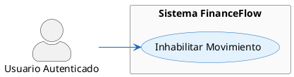

| Campo | Detalle |
| :--- | :--- |
| **Identificador** | CU-07 |
| **Nombre** | Inhabilitar Movimiento (Delete) |
| **Actor Principal** | Usuario Autenticado |
| **Precondición** | El usuario identifica un registro falso, duplicado o indeseado que debe removerse. |
| **Postcondición** | El elemento deja de contarse en los balances matemáticos y desaparece la UI visible, mutando su atributo a estado inactivo (Borrado lógico). |
| **Flujo Principal** | |
| **ACTOR** | **SISTEMA** |
| 1. Selecciona el ícono "Eliminar" colindante al registro. | |
| | 2. Levanta un elemento emergente (Modal/Alert) solicitando confirmación de "Seguridad: ¿Está seguro?". |
| 3. Aprueba presionando "Sí, eliminar". | |
| | 4. Contacta la base de datos cambiando el atributo `status=false` sin eliminar el objeto físico (Borrado suave). |
| | 5. Refresca la tabla filtrando por elementos activos. |
| **Flujo Alternativo 1: Cancelación de Borrado** | |
| **ACTOR** | **SISTEMA** |
| 1. Selecciona eliminar por accidente. | |
| | 2. Muestra modal "¿Estás seguro?". |
| 3. Detiene la acción y presiona "Cancelar". | |
| | 4. Destruye el modal y aborta la comunicación con la API. |

---

### CU-08: Filtrar y Analizar Reportes

**Diagrama de Caso de Uso:**
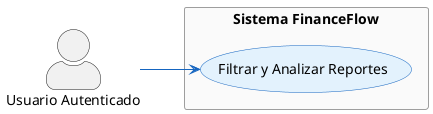

| Campo | Detalle |
| :--- | :--- |
| **Identificador** | CU-08 |
| **Nombre** | Filtrar y Analizar Reportes |
| **Actor Principal** | Usuario Autenticado |
| **Precondición** | Tener movimientos documentados en múltiples temporalidades (meses/años distintos). |
| **Postcondición** | Se visualizan los indicadores financieros cerrados exclusivamente a los atributos restringidos. |
| **Flujo Principal** | |
| **ACTOR** | **SISTEMA** |
| 1. Accede a la pestaña "Reportes". | |
| | 2. Plasma la totalidad de movimientos históricos e interfaz de controles calendarios. |
| 3. Selecciona en el calendario de filtros las fechas "Marzo 1 al Marzo 31" y pulsa "Aplicar Filtro". | |
| | 4. Recupera solo aquellas transacciones (Queries paramétricos) constreñidas a ese huso temporal y redibuja la tabla. |

---

### CU-09: Reentrenar Clasificador IA (Silent Training)

**Diagrama de Caso de Uso:**
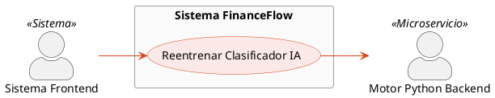

| Campo | Detalle |
| :--- | :--- |
| **Identificador** | CU-09 |
| **Nombre** | Reentrenar Clasificador IA |
| **Actor Principal** | Sistema Frontend (React/Web) |
| **Precondición** | El usuario ha escaneado un comprobante (CU-04), corregido cualquier error del sistema y asentado su guardado. |  
| **Postcondición** | El microservicio de Python absorbe estadísticas nuevas volviéndose progresivamente más asertivo (Inteligencia adaptativa). |
| **Flujo Principal** | |
| **ACTOR** | **SISTEMA** |
| 1. Una vez guardado un elemento de origen AI en MongoDB, lanza paralelamente un Payload con los metadatos verificados cruzados (Nombre comercio vs. Categoría asignada final). | |
| | 2. El Servidor IA (endpoint `/retrain`) recibe el arreglo, y provee directamente las variables verificadas al vectorizador `Scikit-Learn`. |
| | 3. Carga el viejo modelo estático, inyecta la nueva lógica (`clf.partial_fit`) alterando su desviación estadística, y exporta el nuevo modelo prentrenado como default. |
| 4. Finaliza la petición ignorando los retornos sin trabar a nivel usuario el hilo de ejecución principal web (`Silent Worker`). | |

*(No hay excepciones en este CU, un fallo en el reentrenamiento asíncrono no detiene a la plataforma en absoluto, sólo se aborta la tarea IA silenciosamente mediante código try-catch).*

---

### CU-10: Cerrar Sesión (Logout)

**Diagrama de Caso de Uso:**
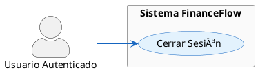

| Campo | Detalle |
| :--- | :--- |
| **Identificador** | CU-10 |
| **Nombre** | Cerrar Sesión (Logout) |
| **Actor Principal** | Usuario Autenticado |
| **Precondición** | El usuario mantiene una sesión activa validada por un JWT token en curso en la App/Web. |
| **Postcondición** | Se liquida la credencial de autenticación forzando el abandono al ecosistema privado de la App. |
| **Flujo Principal** | |
| **ACTOR** | **SISTEMA** |
| 1. Interactúa con su foto de perfil y despliega el menú contextual dictando "Cerrar Sesión". | |
| | 2. El Frontend destruye programáticamente la variable local `token` de los almacenamientos locales (`localStorage` o `AsyncStorage`) y limpia el contexto global de usuario `Context`. |
| | 3. Expulsa la ruta dirigiéndolo inexcusablemente a la vista abierta `/login`. |

---

### CU-11: Recuperar/Restablecer Contraseña

**Diagrama de Caso de Uso:**
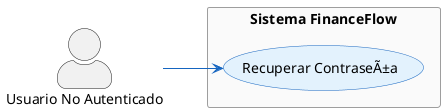

| Campo | Detalle |
| :--- | :--- |
| **Identificador** | CU-11 |
| **Nombre** | Recuperar/Restablecer Contraseña |
| **Actor Principal** | Usuario No Autenticado |
| **Precondición** | Extravío de credencial personal limitando el abordaje clásico. |
| **Postcondición** | El usuario consigue asentar una nueva contraseña posibilitándole transitar al Login de manera efectiva. |
| **Flujo Principal** | |
| **ACTOR** | **SISTEMA** |
| 1. Pulsa "Olvidé mi contraseña" en el Formulario Login. | |
| | 2. Renderiza la UI requiriendo el correo vinculado de alta primaria. |
| 3. Ingresa su email corporativo/personal, pulsa "Restablecer". | |
| | 4. (Simulación local o mediante email) Autentica el correo, encripta el token y admite cambio de pass a la cuenta de MongoDB vinculada. |
| 5. Procesa mediante un Link las instrucciones y forja la contraseña nueva. | |
| | 6. Actualiza el `Hash` y deniega token antiguos obligando a reiniciar sesión al Actor mediante su password reciente. |
| **Excepción 1: Mal escrito o correo no registrado** | |
| **ACTOR** | **SISTEMA** |
| 1. Pide reset de clave en un correo inventado. | |
| | 2. No empareja a ningún `User` preexistente en la validación. |
| | 3. Lanza error: "Usuario no encontrado en los registros", o un mensaje aséptico "Si existes, enviamos correo" (por seguridad preventiva). |
| 4. Sale al menú inicial asumiendo culpa. | |

---

### CU-12: Consultar/Editar Perfil

**Diagrama de Caso de Uso:**
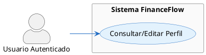

| Campo | Detalle |
| :--- | :--- |
| **Identificador** | CU-12 |
| **Nombre** | Consultar/Editar Perfil |
| **Actor Principal** | Usuario Autenticado |
| **Precondición** | Acceder a la sección /profile del Sistema. |
| **Postcondición** | Cambios en el avatar natural u ortográficos de nombres operan perpetuamente en el Backend. |
| **Flujo Principal** | |
| **ACTOR** | **SISTEMA** |
| 1. Accede al link `/profile`. | |
| | 2. El Sistema recupera información intrínseca desprovista sobre contraseñas, listando correos, fechas altas e interacciones numéricas de transacciones (metadato general). |
| 3. Ejecuta alteraciones al input de 'Nombre Completo' dictaminando 'Guardar Cambios'. | |
| | 4. Contacta la base de MongoDB (Colección: `Users`) y modifica el JSON subyacente. Refresca token con data moderna. |

---

### CU-13: Visualizar Auditoría (Logs)

**Diagrama de Caso de Uso:**
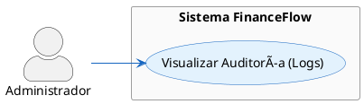

| Campo | Detalle |
| :--- | :--- |
| **Identificador** | CU-13 |
| **Nombre** | Visualizar Auditoría (Logs) |
| **Actor Principal** | Administrador (Software Master) |
| **Precondición** | Ser titular del rol `admin` y constar de panel directivo o endpoint protegido. |
| **Postcondición** | Visualización y lectura técnica pura del accionar (Errores en IA, Logins fallidos, Inserción de base de datos) originado en el macro entorno global. |
| **Flujo Principal** | |
| **ACTOR** | **SISTEMA** |
| 1. Efectúa petición autenticada de alto rol (GET `/api/logs`). | |
| | 2. Invoca el controlador `logs.controller.js` mapeando colecciones completas estáticas y temporizadas en BD. |
| | 3. Retorna array JSON listando en milisegundos las tareas del ecosistema. |
| 4. Interpreta los logs para control y monitorización perimetral de fallos no tratados de otros componentes. | |
