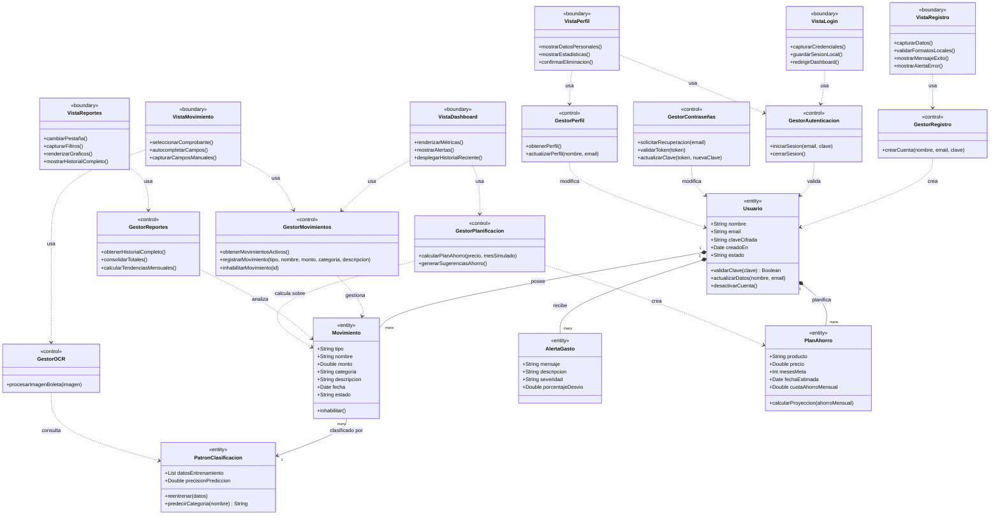

# Diagrama de Clases (Fase de Análisis) — FinanceFlow

Este documento contiene la especificación y el **Diagrama de Clases Conceptual** (Modelo de Dominio) para el sistema **FinanceFlow** en su **Fase de Análisis**.

El diagrama está estructurado formalmente bajo el patrón **BCE (Boundary-Control-Entity)**, el cual clasifica todas las clases del sistema en tres categorías lógicas de negocio:
1. **`<<boundary>>` (Borde/Interfaz):** Clases que representan las pantallas y fronteras de interacción con los usuarios.
2. **`<<control>>` (Gestores/Controladores):** Clases lógicas encargadas de coordinar y ejecutar las reglas de negocio y los flujos de los casos de uso.
3. **`<<entity>>` (Entidades del Dominio):** Clases persistentes que modelan los datos centrales del negocio del sistema.

---

### **Diagrama de Clases en Mermaid**

---

### **Descripción Narrativa de las Clases y Asociaciones**

Este modelo de clases conceptuales de análisis detalla los tres grandes componentes lógicos del sistema FinanceFlow:

1. **La Capa de Borde (Boundary):**
   * Está compuesta por las clases visuales (`VistaRegistro`, `VistaLogin`, `VistaDashboard`, `VistaMovimiento`, `VistaReportes` y `VistaPerfil`). Su rol es estrictamente interactivo: capturan las intenciones del usuario, ejecutan validaciones locales inmediatas sobre los formatos y renderizan la información procesada. No realizan cálculos de negocio ni persisten datos directamente.

2. **La Capa de Control (Controllers):**
   * Actúa como el cerebro dinámico del sistema. Clases como `GestorMovimientos` y `GestorPlanificacion` son responsables de recibir los comandos de las interfaces, coordinar las acciones, realizar los cómputos financieros (como la viabilidad de ahorro) y persistir o modificar las entidades correspondientes. Por ejemplo, el `GestorOCR` coordina el análisis de la imagen y consulta al `PatronClasificacion` para deducir de manera inteligente la categoría sugerida.

3. **La Capa de Entidad (Entities):**
   * Representa los datos reales y persistentes que sustentan el negocio.
   * **`Usuario`**: Almacena los datos personales, auditorías y estados de cuenta, rigiendo las relaciones jerárquicas del dominio.
   * **`Movimiento`**: Modela cada ingreso y egreso del usuario con montos, fechas, descripciones y categorías.
   * **`AlertaGasto`**: Almacena de forma persistente los hallazgos de anomalías de consumo generados al contrastar los egresos del usuario contra sus promedios históricos.
   * **`PlanAhorro`**: Estructura de forma persistente las cotizaciones y proyecciones de compra deseadas por el usuario.
   * **`PatronClasificacion`**: Modela las configuraciones matemáticas y la base de datos de entrenamiento del motor inteligente que permite clasificar los textos en categorías reales de gasto.

#### **Relaciones y Multiplicidades Clave:**
* **Composición (`1` a `many`):** Un usuario real es el dueño exclusivo de sus registros financieros. Por ello, la clase `Usuario` tiene una relación de composición fuerte con las entidades `Movimiento`, `PlanAhorro` y `AlertaGasto`. Si un usuario elimina su cuenta, todos estos registros dependientes desaparecen con él.
* **Uso y Consulta:** El `Movimiento` es clasificado dinámicamente mediante las reglas del `PatronClasificacion`, permitiendo mantener un modelo vivo de categorización en segundo plano. Las interfaces de borde (`Vista`) delegan toda su lógica a las clases de control (`Gestores`), las cuales a su vez interactúan con las entidades del negocio (`Entities`).
