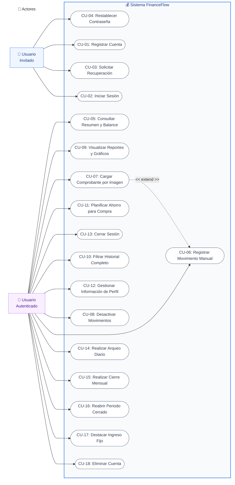
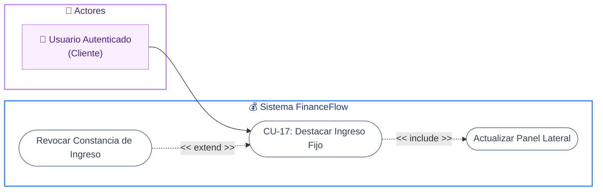
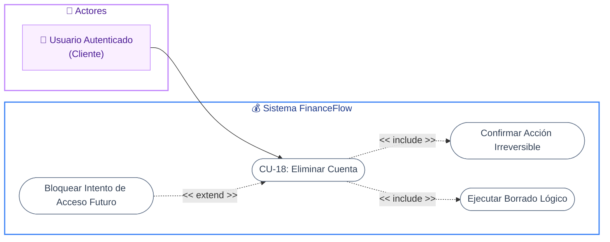

# Diagramas de Casos de Uso (Mermaid - Estilo Personalizado)

A continuación se presentan los diagramas de caso de uso con el diseño visual solicitado (Subgrafo de Actores, Subgrafo del Sistema, nodos estilo píldora y uso de iconos/emojis).

### Diagrama General del Sistema



---


### CU-14: Realizar Arqueo Diario

```mermaid
flowchart LR
    %% Estilos
    classDef actorNode fill:#faefff,stroke:#c084fc,stroke-width:1px,color:#4c1d95
    classDef useCaseNode fill:#ffffff,stroke:#64748b,stroke-width:1px,color:#334155

    subgraph Actores [👤 Actores]
        U[👤 Usuario Autenticado <br/>(Cliente)]:::actorNode
    end
    
    subgraph Sistema [💰 Sistema FinanceFlow]
        direction TB
        CU14([CU-14: Realizar Arqueo Diario]):::useCaseNode
        INC1([Ingresar Dinero Físico]):::useCaseNode
        EXT1([Mostrar Alerta de Campo Vacío]):::useCaseNode
        EXT2([Manejar Falla de Conexión]):::useCaseNode
    end

    U --> CU14
    CU14 -.->|"<< include >>"| INC1
    EXT1 -.->|"<< extend >>"| CU14
    EXT2 -.->|"<< extend >>"| CU14

    style Actores fill:transparent,stroke:#c084fc,stroke-width:2px,color:#4c1d95,stroke-dasharray: 0
    style Sistema fill:transparent,stroke:#3b82f6,stroke-width:2px,color:#1e3a8a,stroke-dasharray: 0
```

---

### CU-15: Realizar Cierre Mensual

```mermaid
flowchart LR
    %% Estilos
    classDef actorNode fill:#faefff,stroke:#c084fc,stroke-width:1px,color:#4c1d95
    classDef useCaseNode fill:#ffffff,stroke:#64748b,stroke-width:1px,color:#334155

    subgraph Actores [👤 Actores]
        U[👤 Usuario Autenticado <br/>(Cliente)]:::actorNode
    end
    
    subgraph Sistema [💰 Sistema FinanceFlow]
        direction TB
        CU15([CU-15: Realizar Cierre Mensual]):::useCaseNode
        INC1([Autenticar mediante Contraseña]):::useCaseNode
        EXT1([Rechazar Contraseña Incorrecta]):::useCaseNode
    end

    U --> CU15
    CU15 -.->|"<< include >>"| INC1
    EXT1 -.->|"<< extend >>"| CU15

    style Actores fill:transparent,stroke:#c084fc,stroke-width:2px,color:#4c1d95,stroke-dasharray: 0
    style Sistema fill:transparent,stroke:#3b82f6,stroke-width:2px,color:#1e3a8a,stroke-dasharray: 0
```

---

### CU-16: Reabrir Periodo Cerrado

```mermaid
flowchart LR
    %% Estilos
    classDef actorNode fill:#faefff,stroke:#c084fc,stroke-width:1px,color:#4c1d95
    classDef useCaseNode fill:#ffffff,stroke:#64748b,stroke-width:1px,color:#334155

    subgraph Actores [👤 Actores]
        U[👤 Usuario Autenticado <br/>(Cliente)]:::actorNode
    end
    
    subgraph Sistema [💰 Sistema FinanceFlow]
        direction TB
        CU16([CU-16: Reabrir Periodo Cerrado]):::useCaseNode
        INC1([Autenticar mediante Contraseña]):::useCaseNode
        EXT1([Cancelar Operación de Seguridad]):::useCaseNode
    end

    U --> CU16
    CU16 -.->|"<< include >>"| INC1
    EXT1 -.->|"<< extend >>"| CU16

    style Actores fill:transparent,stroke:#c084fc,stroke-width:2px,color:#4c1d95,stroke-dasharray: 0
    style Sistema fill:transparent,stroke:#3b82f6,stroke-width:2px,color:#1e3a8a,stroke-dasharray: 0
```

---

### CU-17: Destacar Ingreso Fijo



---

### CU-18: Eliminar Cuenta


