# Diagramas de Secuencia (Fase de Análisis) — FinanceFlow

Este documento contiene las especificaciones lógicas y los **Diagramas de Secuencia** para todos los casos de uso confirmados del sistema **FinanceFlow**. 

Al corresponder a la **Fase de Análisis**, todos los diagramas han sido diseñados de forma conceptual y agnóstica a la tecnología física de base de datos o frameworks. Para ello, se utiliza el patrón formal **BCE (Boundary-Control-Entity)** o **Borde-Control-Entidad** representado mediante la sintaxis correcta y validada de Mermaid:
* **Vista (Borde/Boundary):** Interfaz visual o frontera de interacción directa con el Actor.
* **Gestor (Control/Controlador):** Módulo encargado de gestionar las reglas del negocio y coordinar el caso de uso.
* **Entidad (Entity/Entidad):** Representa los objetos de datos del negocio en el dominio.

---

### **CU-01: Registrar Cuenta**

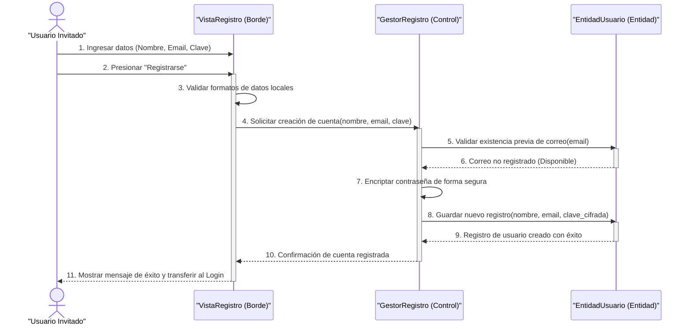

* **Excepción 1: Datos inválidos en formulario:** Si la validación en el paso `3` falla, `VistaRegistro` interrumpe el flujo, muestra los errores en color rojo e impide la ejecución del paso `4`.
* **Excepción 2: Correo electrónico ya registrado:** Si en el paso `6` la `EntidadUsuario` determina que el correo ya existe, retorna un error de conflicto al `GestorRegistro`. Este desiste de guardar los datos, e informa a la `VistaRegistro` para que muestre la alerta al Actor en el correo.

---

### **CU-02: Iniciar Sesión**

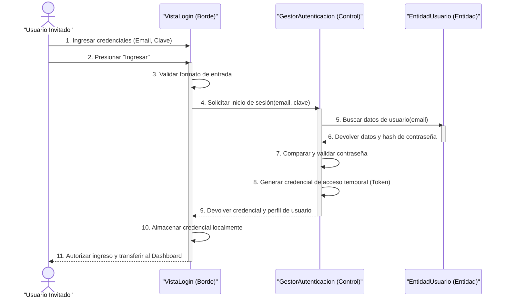

* **Excepción 1: Error de formato en los campos:** Si en el paso `3` la validación de entrada falla (correo mal estructurado o clave muy corta), la `VistaLogin` detiene el proceso y muestra los errores directamente sin enviar datos al Gestor.
* **Excepción 2: Credenciales incorrectas:** Si en el paso `6` el usuario no es encontrado, o en el paso `7` la contraseña comparada no es correcta, el `GestorAutenticacion` desiste del inicio de sesión, responde un fallo genérico por seguridad, e instruye a la `VistaLogin` a alertar al Actor.

---

### **CU-03: Solicitar Recuperación**

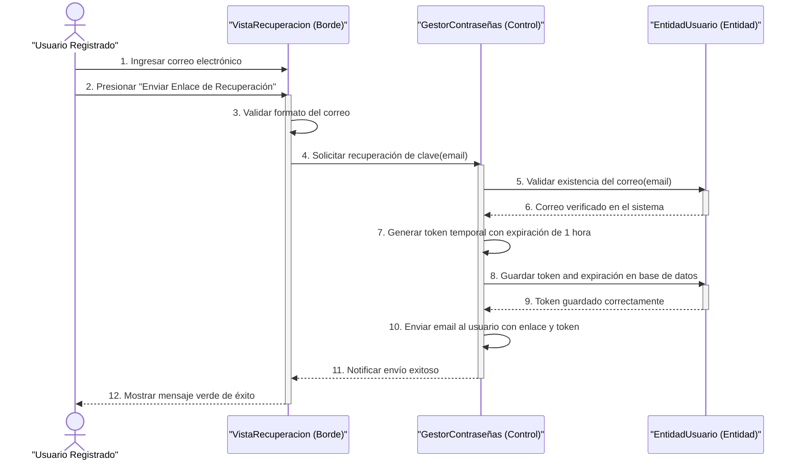

* **Excepción 1: Formato de correo inválido:** Si en el paso `3` no se detecta estructura de correo, la `VistaRecuperacion` interrumpe la ejecución localmente y despliega la advertencia.
* **Excepción 2: Correo electrónico no registrado:** Si en el paso `6` la entidad responde que no existe ese registro, el `GestorContraseñas` detiene el flujo y responde una alerta que se visualiza en la vista.

---

### **CU-04: Restablecer Contraseña**

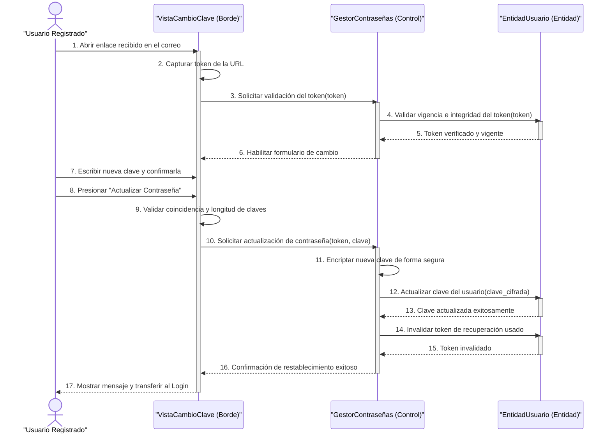

* **Excepción 1: Token inválido o expirado:** Si en el paso `5` el token no coincide o ha expirado, el `GestorContraseñas` deniega la validación e instruye a la `VistaCambioClave` a bloquear el formulario y renderizar la pantalla de error.
* **Excepción 2: Contraseñas no coinciden o cortas:** Si la validación local en el paso `9` falla, la vista detiene el envío informando del error bajo los inputs.

---

### **CU-05: Consultar Resumen y Balance**

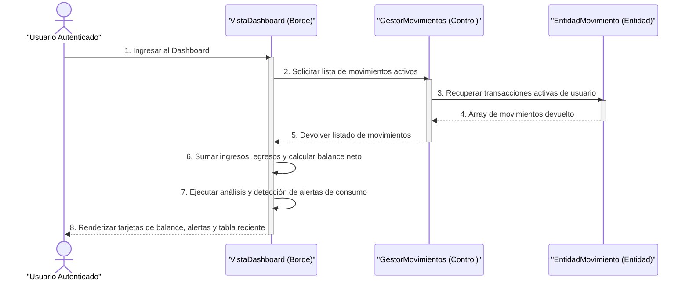

* **Excepción 1: Pérdida de conexión o sesión expirada:** Si el paso `2` falla debido a una caída de comunicación o token JWT vencido, la vista captura el error y plasma la advertencia en rojo.
* **Excepción 2: Ausencia absoluta de transacciones registradas:** Si en el paso `5` el listado de movimientos es de tamaño cero, el frontend dibuja en pantalla el contenedor especial de estado vacío con la llamada a la acción.

---

### **CU-06: Registrar Movimiento Manual**

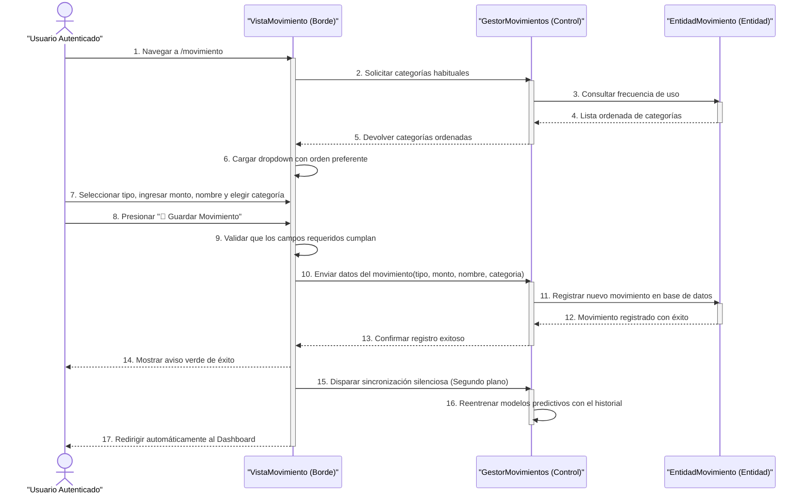

* **Excepción 1: Omisión de campos obligatorios en el formulario:** Si en el paso `9` la validación de la interfaz encuentra errores, la `VistaMovimiento` bloquea el envío y muestra la alerta en rojo.
* **Excepción 2: Error al guardar en base de datos:** Si el paso `11` falla por indisponibilidad, el Gestor responde un error de servidor y la vista desactiva la pantalla de progreso mostrando el aviso rojo.

---

### **CU-07: Cargar Comprobante por Imagen**

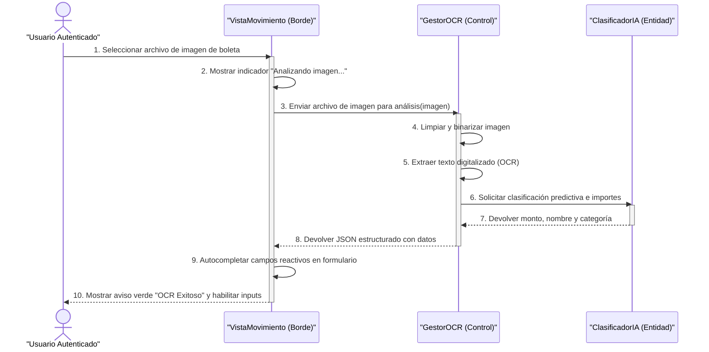

* **Excepción 1: El sistema no logra deducir importes (Imagen borrosa):** Si en el paso `7` el motor predictivo no halla importes válidos, el `GestorOCR` devuelve campos vacíos y la vista avisa con una tarjeta naranja para que el Actor complete la información a mano.
* **Excepción 2: Formato de archivo incompatible:** Si en el paso `1` el Actor sube un formato no admitido, la vista detecta el error en el paso `2` y detiene el flujo localmente informando de la incompatibilidad.

---

### **CU-08: Desactivar Movimientos**

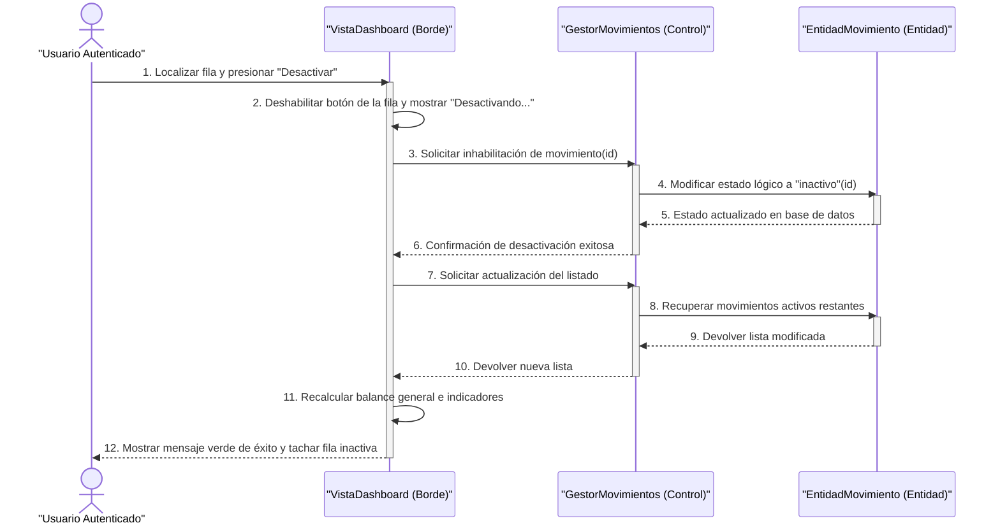

* **Excepción 1: Falla de red o sesión expirada al desactivar:** Si en el paso `3` la llamada al Gestor falla por vencimiento de sesión o red caída, la vista captura el error, reactiva el botón de desactivación y despliega la advertencia en rojo.

---

### **CU-09: Visualizar Reportes y Gráficos**

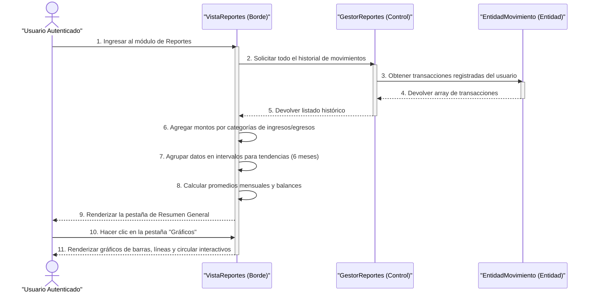

* **Excepción 1: Falta de datos de transacciones en la cuenta:** Si el listado retornado en el paso `5` es vacío, la `VistaReportes` frena el renderizado de gráficos en el paso `6` y presenta en pantalla la vista especial de estado vacío con el botón para agregar un movimiento.

---

### **CU-10: Filtrar Historial Completo**

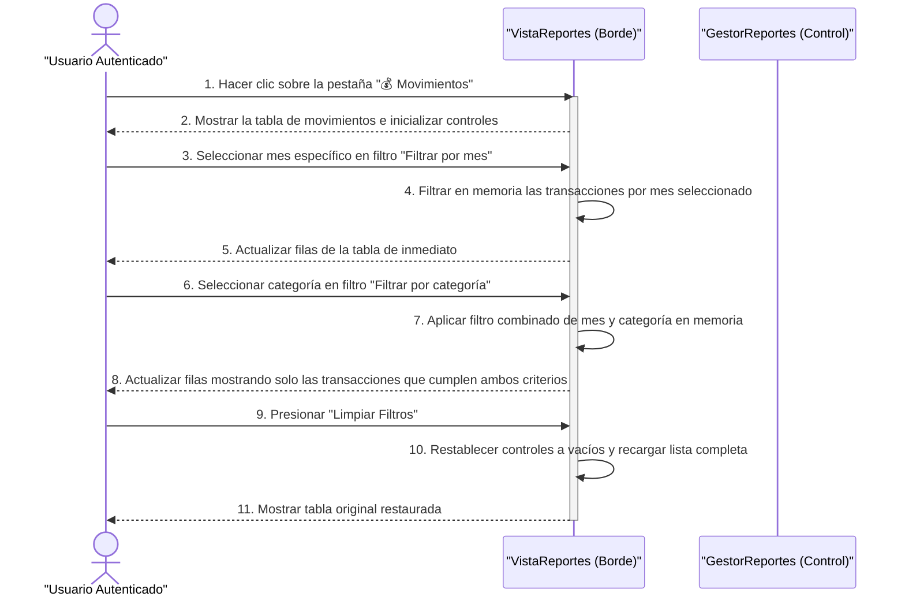

* **Excepción 1: Filtros sin resultados:** Si al aplicar los filtros en memoria en los pasos `4` o `7` el listado de resultados queda vacío, la `VistaReportes` oculta la tabla y muestra el recuadro gris explicativo indicando: `"No hay movimientos - Con los filtros aplicados no se encontraron resultados"`.

---

### **CU-11: Planificar Ahorro para Compra**

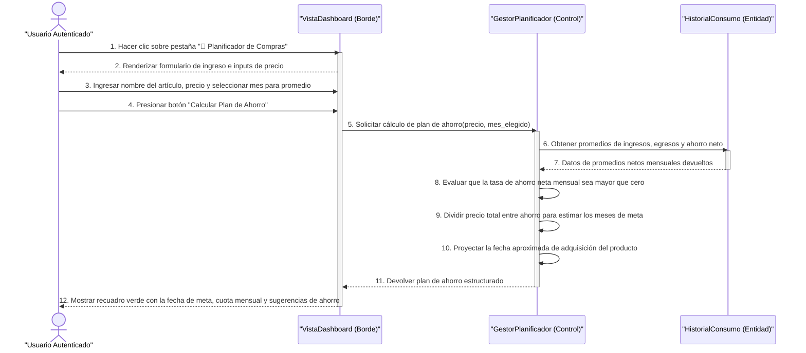

* **Excepción 1: Capacidad de ahorro nula o negativa:** Si en el paso `8` el `GestorPlanificador` calcula que el saldo de ahorro neto mensual es menor o igual a cero, interrumpe la división para evitar valores nulos, responde con un fallo de inviabilidad y la vista dibuja una tarjeta en rojo alertando: `"No es posible con el ahorro actual"`.
* **Excepción 2: Entrada de precio vacía o errónea:** Si la validación local en la vista en el paso `4` detecta un precio nulo o menor a cero, detiene la solicitud de red al Gestor y muestra una alerta roja: `"Por favor ingresa un precio válido"`.

---

### **CU-12: Gestionar Información de Perfil**

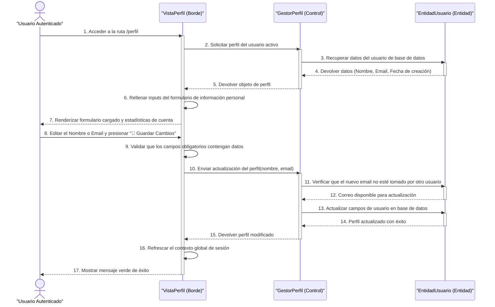

* **Excepción 1: Omisión de datos obligatorios en perfil:** Si en el paso `9` la vista detecta campos vacíos en el formulario, detiene la llamada al Gestor y alerta al Actor que todos los campos son requeridos.
* **Excepción 2: Correo electrónico tomado por otra cuenta:** Si en el paso `12` el Gestor detecta que el nuevo email ya pertenece a otro registro diferente, rechaza la edición y retorna un conflicto al frontend. La vista despliega el mensaje de error en rojo.

---

### **CU-13: Cerrar Sesión**

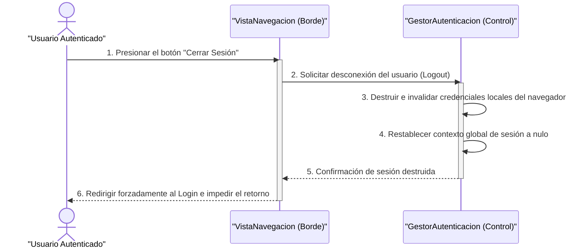
