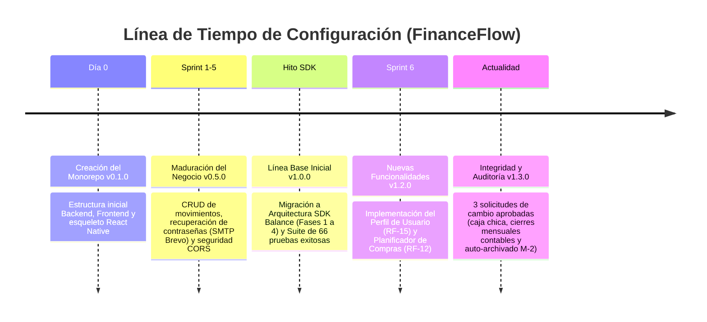

# Reporte de Gestión de Configuración de Software: FinanceFlow
## Historial Cronológico, Línea Base Inicial y Control de Cambios (Desde el Día 0)

---

## 1. Historial de Configuración y Evolución Cronológica (Desde el Día 0)

Para entender cómo el sistema llegó a su estado actual, a continuación se describe paso a paso la evolución de la configuración de software de **FinanceFlow**, comenzando desde la inicialización del proyecto:

### Paso 1: Día 0 - Creación e Inicialización del Repositorio (Versión `v0.1.0`)
* **Hito de Configuración**: Creación de la estructura del espacio de trabajo como un monorepo para soportar múltiples plataformas.
* **Acciones ejecutadas**:
  * Inicialización del control de versiones Git.
  * Creación de los directorios raíz: `/backend` (API Node.js), `/frontend` (React SPA) y `/mobile` (cliente híbrido React Native).
  * Creación del archivo de especificación inicial de requerimientos (`/documentacion/requerimientos.md`) y del plan de desarrollo general (`/plan.md`).
  * Estructuración del archivo `.gitignore` para omitir dependencias locales (`node_modules`) y variables de entorno sensibles (`.env`).

### Paso 2: Fase de Maduración y Control de Errores (Versiones `v0.2.0` a `v0.5.0`)
* **Hito de Configuración**: Habilitación de funcionalidades transversales de red, comunicación y seguridad.
* **Acciones ejecutadas**:
  * Integración de la base de datos MongoDB y esquematización inicial del modelo físico (`/documentacion/modelo_mongodb.md`).
  * Robustecimiento del flujo de autenticación del usuario, introduciendo el cifrado de contraseñas con bcrypt y tokens JWT.
  * Integración de la API de Brevo para el envío real de correos electrónicos en flujos de recuperación de contraseñas.
  * Configuración dinámica de CORS para autorizar subdominios temporales e interactivos hospedados en la nube (Vercel).

### Paso 3: Hito de Migración de Arquitectura - SDK Balance (Línea Base Inicial `v1.0.0`)
* **Hito de Configuración**: Desacoplamiento de la lógica de negocio del frontend mediante una arquitectura orientada a SDK.
* **Acciones ejecutadas**:
  * **Fase 1**: Creación de `/sdk` como paquete autónomo para unificar el consumo de endpoints y control de tokens de seguridad.
  * **Fase 2**: Introducción de la capa de adaptadores (`/frontend/src/services/*-adapter.js`) con Feature Flags para habilitar una transición híbrida transparente para el usuario final.
  * **Fase 3**: Refactorización de imports reales del frontend hacia la nueva interfaz del SDK.
  * **Fase 4 (Estabilización)**: Ejecución de una suite exhaustiva de 66 pruebas de integración y carga (estrés), verificando la total equivalencia en el consumo de datos y estableciendo de forma definitiva la **Línea Base Inicial (v1.0.0)**.

### Paso 4: Sprint 6 - Integración de Perfil de Usuario y Planificador (Versiones `v1.1.0` a `v1.2.0`)
* **Hito de Configuración**: Inclusión de lógica funcional basada en datos históricos.
* **Acciones ejecutadas**:
  * Creación de la página `/perfil` (`ProfilePage.jsx`) acoplada al endpoint seguro `/api/usuarios/me`, omitiendo deliberadamente la exposición del `passwordHash` en el retorno de la base de datos.
  * Diseño e integración del componente reactivo `PlanificadorCompras.jsx` para el cálculo automático de plazos de adquisición según la capacidad real de ahorro mensual de los usuarios.

### Paso 5: Estado Actual - Cierres de Auditoría e Integridad de Datos (Versión `v1.3.0`)
* **Hito de Configuración**: Implementación de controles y restricciones estrictas para auditorías contables.
* **Acciones ejecutadas**:
  * Procesamiento e integración de las 3 Solicitudes de Cambio (CR-01, CR-02 y CR-03) enfocadas en asegurar la inalterabilidad de registros contables y el rendimiento del almacenamiento de datos.

---

## 2. Identificación de Elementos de Configuración (Línea Base Inicial)

A continuación, se detalla la tabla de los 4 elementos de configuración de software (SCIs) principales bajo control de versiones que constituyen el núcleo del sistema actual:

| Código | Elemento | Versión | Responsable | Descripción de Control |
| :--- | :--- | :--- | :--- | :--- |
| **FF-SW-BE** | Código Fuente - Backend (Node.js / Express / MongoDB) | 1.3.0 | Brant Antony Chata Choque | Controla endpoints REST, esquemas de base de datos y la lógica de seguridad / cifrado del sistema. |
| **FF-SW-FE** | Código Fuente - Frontend (React / Tailwind CSS) | 1.3.0 | Sebastian Arce Bracamonte | Controla la interfaz gráfica, componentes dinámicos de visualización y rutas de navegación del cliente web. |
| **FF-SDK-BL** | SDK Balance (Lógica de HttpClient, Auth, Movimientos y Reportes) | 1.0.0 | Brant Antony Chata Choque | Paquete desacoplado para homogeneizar y centralizar el consumo del backend, evitando duplicidades lógicas. |
| **FF-DOC-SYS** | Documentación de Sistema (SRS, SAD, Casos de Uso y Reportes de Sprint) | 1.2.0 | Sebastian Arce Bracamonte | Controla los planos conceptuales del sistema, diagramas de clases, de secuencia y los reportes formales de desarrollo. |

---

## 3. Registro de Solicitudes de Cambio (CR) e Impacto

Se detallan las tres modificaciones implementadas sobre la línea base del sistema para alcanzar el estado de producción final:

### 📄 CR-01: Cierre de caja chica, rediseño de filtros y limpieza de perfil
* **Identificador**: `CR-FF-001` (Ref: Commit `2a0e5dc`)
* **Descripción del Cambio**: Desarrollo e integración del flujo del cierre operativo de caja chica; rediseño de la interfaz de filtros mensuales en el listado de transacciones; depuración de componentes inactivos en el perfil del usuario autenticado.
* **Archivos Afectados**:
  * `frontend/src/pages/ProfilePage.jsx`
  * `frontend/src/components/PlanificadorCompras.jsx`
  * Controladores y esquemas lógicos en `/backend/controllers`
* **Evaluación de Impacto**:
  * *Usabilidad (Alto)*: Mejora sustancialmente la experiencia del usuario al limpiar el perfil de opciones que no están en uso y provee filtros más limpios e intuitivos para el análisis financiero.
  * *Estructura de Datos (Medio)*: Requiere que la base de datos MongoDB persista el estado de cierre de los saldos de caja chica para evitar discrepancias operativas.

### 📄 CR-02: Revisiones diarias, cierres mensuales y reapertura de periodos
* **Identificador**: `CR-FF-002` (Ref: Commit `28cb1ca`)
* **Descripción del Cambio**: Implementación de controles contables obligatorios: auditorías de revisión diarias, bloqueo físico de transacciones mediante cierres mensuales fijos y flujo administrativo para la reapertura autorizada de periodos contables.
* **Archivos Afectados**:
  * `/backend/services/closures.service.js` (Lógica de cierres)
  * `/backend/routes/closures.js`
  * `/frontend/src/hooks/useAnalisisGastos.js`
* **Evaluación de Impacto**:
  * *Integridad de Datos (Crítico/Alto)*: Asegura que ningún usuario (ni siquiera administradores sin permisos de reapertura) modifique, añada o elimine movimientos financieros de meses que ya han sido revisados y cerrados contablemente. Garantiza consistencia absoluta de auditoría.
  * *Lógica de Negocio (Medio)*: Afecta los algoritmos de cálculo de ahorro del planificador al tener que ignorar o procesar adecuadamente periodos archivados o bloqueados.

### 📄 CR-03: Auto-archivado M-2, bloqueo de fechas futuras y restricción dinámica de calendario
* **Identificador**: `CR-FF-003` (Ref: Commit `a120f9b`)
* **Descripción del Cambio**: Automatización para el traslado a historial (auto-archivado M-2) de datos financieros con una antigüedad mayor a dos meses; validación del lado de servidor y cliente para bloquear transacciones en el futuro; ajuste dinámico de rangos permitidos (min/max) en el control del calendario.
* **Archivos Afectados**:
  * `/backend/controllers/movimientos.controller.js`
  * `/frontend/src/components/MovimientoForm.jsx`
  * Lógica interna de base de datos para migración silenciosa.
* **Evaluación de Impacto**:
  * *Rendimiento (Alto)*: Incrementa la velocidad de carga de reportes activos en el dashboard al segregar físicamente los movimientos antiguos de la tabla de transacciones de uso diario en MongoDB.
  * *Consistencia Temporal (Alto)*: Evita errores operativos comunes donde los usuarios registraban gastos en fechas futuras accidentales, desvirtuando los cálculos de metas de ahorro.

---

## 4. Estado de Versión del Sistema

El número de versión actual del sistema es **`1.3.0`**, el cual ha evolucionado bajo el siguiente patrón de versionado semántico:

1. **Línea Base Inicial (`v1.0.0`)**: Hito que representa el sistema completamente estable, migrado y validado con la suite de 66 pruebas automáticas paralelas del SDK.
2. **Implementación de Requerimientos del Sprint 6 (`v1.2.0`)**: Inclusión de las dos grandes funcionalidades funcionales: Perfil de usuario (`v1.1.0`) y Planificador matemático de compras (`v1.2.0`).
3. **Paquete de Auditoría Contable y Rendimiento (`v1.3.0`)**: La integración de las tres solicitudes de cambio (`CR-01`, `CR-02` y `CR-03`) que cierran la brecha operativa actual del sistema.
