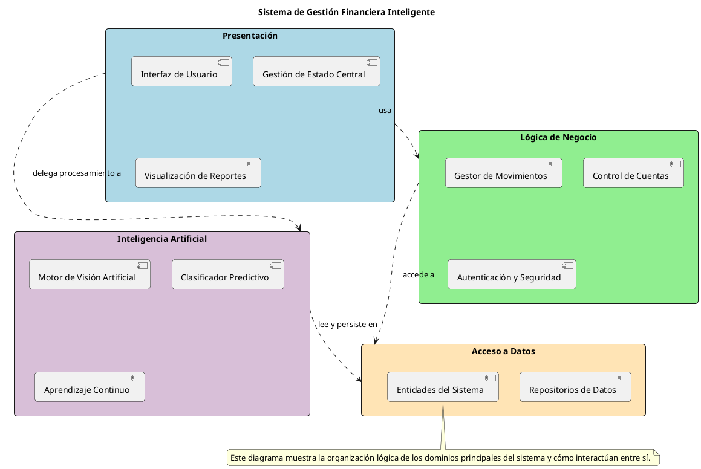
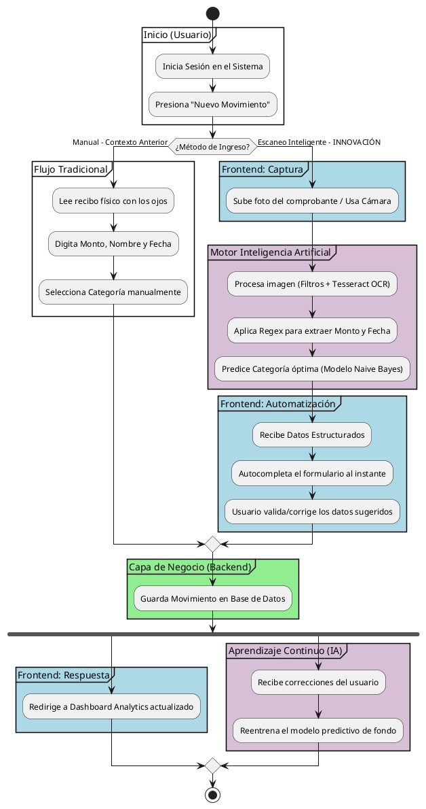
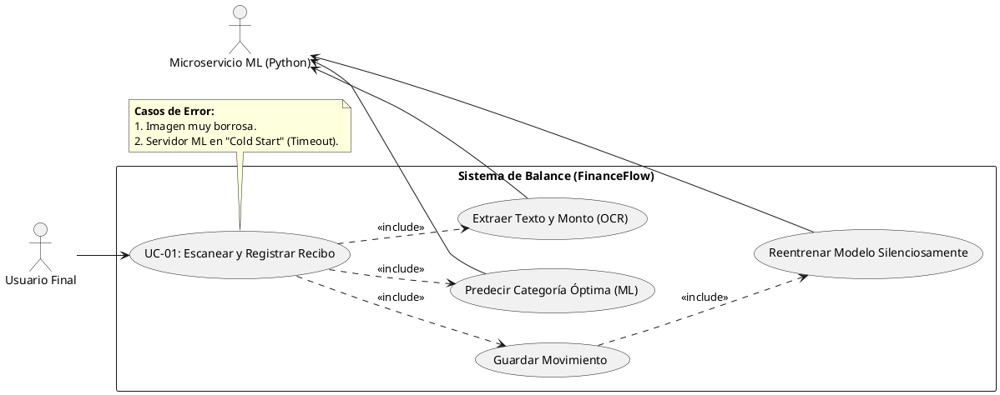

# Documento de Requerimientos y Análisis del Sistema (FinanceFlow)

## 1. Análisis de Requerimientos (Cuestionamiento del Proyecto)

En la siguiente tabla se responden todas las cuestiones fundamentales para la viabilidad, estrategia y desarrollo del sistema de gestión financiera impulsado por Inteligencia Artificial, ajustadas estrictamente al formato solicitado (Cuestión, Acción, Objetivo).

| Cuestión | Acción | Objetivo |
| :--- | :--- | :--- |
| **Que** | Desarrollar un sistema integral de gestión financiera con tecnología de reconocimiento de imágenes (OCR). | Automatizar la lectura y clasificación de ingresos y egresos de forma inteligente. |
| **Por qué** | Excluir el registro manual tradicional y la pérdida de comprobantes en formato de papel. | Fomentar la disciplina en el control del presupuesto personal a través de la facilidad tecnológica y evitar que el usuario se rinda. |
| **Para que** | Convertir una foto en datos financieros estructurados y analizarlos en un panel (dashboard). | Que el usuario obtenga reportes instantáneos precisos y alertas automáticas sin tener que tipear datos manualmente. |
| **Cuanto** | Ejecutar el desarrollo y prueba de los microservicios, IA y frontend en fases de iteración corta (~4 meses). | Lograr un Producto Mínimo Viable (MVP) productivo de alta calidad con IA funcional y tiempo de respuesta en segundos. |
| **Donde** | En servidores y bases de datos Cloud como Render y MongoDB Atlas operando como servicios REST. | Habilitar alta disponibilidad 24/7 y sincronización en tiempo real entre múltiples dispositivos del usuario. |
| **Como** | Usando el motor Python con Tesseract OCR y un pipeline de Scikit-Learn. | Procesar texto de imágenes complejas mediante Machine Learning predictivo para identificar el monto, fecha y nombre. |
| **Cuando** | Al instante mismo de realizar la compra o el pago, subiendo la foto en tiempo real. | Agilizar la toma de decisiones presupuestales justo en el momento crítico de la transacción. |
| **A quienes** | A jóvenes profesionales, estudiantes o personas que gestionan presupuestos domésticos de manera constante. | Proveerles un seguimiento inteligente de alta precisión que entienda sus hábitos y patrones de vida diarios. |
| **Quienes** | El programador/equipo de desarrollo liderando la estructura Backend, Frontend y Data Science (IA). | Construir, probar y desplegar una plataforma sólida garantizando escalabilidad y seguridad de datos. |
| **Con que** | Stack tecnológico completo: React, NodeJS, Express, MongoDB, Python y algoritmos Naive Bayes. | Procesar cantidades dinámicas de datos de manera asíncrona, manteniendo el sistema rápido sin bloqueos en la interfaz. |
| **Como** | Reentrenando el motor de IA de fondo (Background) cada vez que el usuario confirma un gasto en la plataforma. | Aumentar la exactitud del sistema cada día de forma silenciosa para que la app se vuelva experta en cada persona (*Continuous Learning*). |

---

## 2. Diagrama de Paquetes UML

El diagrama de paquetes refleja la agrupación puramente lógica de las clases y módulos de software (namespaces), omitiendo detalles físicos de despliegue (como nodos o tipos de bases de datos) y protocolos de red.

**[ ESTRUCTURA LÓGICA DE PAQUETES ]**

*   📦 **Paquete: Presentación**
    *   *Contiene:* Interfaz de Usuario, Gestión de Estado Central, Visualización de Reportes.
*   📦 **Paquete: Lógica de Negocio**
    *   *Contiene:* Gestor de Movimientos, Control de Cuentas, Autenticación y Seguridad.
*   📦 **Paquete: Inteligencia Artificial** `<- [Innovación]`
    *   *Contiene:* Motor de Visión Artificial, Clasificador Predictivo, Aprendizaje Continuo.
*   📦 **Paquete: Acceso a Datos**
    *   *Contiene:* Repositorios de Datos, Entidades del Sistema.

**Código PlantUML del Diagrama de Paquetes:**

---

## 3. Diagrama de Proceso Principal (Contexto e Innovación)

Este es el proceso estructural ("Happy Path") de cómo el usuario interactúa, evidenciando dónde entra el factor innovador respecto a un sistema ordinario.

**(Contexto Anterior - Flujo Tradicional):**
`1. Iniciar sesión` ➡️ `2. Ir a "Nuevo Movimiento"` ➡️ `3. Leer el recibo de papel con los ojos` ➡️ `4. Tipear manualmente: Fecha, Monto, Descripción, elegir Categoría` ➡️ `5. Guardar en Base de Datos.`

**(Proceso Principal Actual - Con Innovación de IA):**
1.  **[Inicio]**: Usuario ingresa a la aplicación web.
2.  **[Decisión]**: El usuario hace clic en "Agregar Movimiento".
3.  **[ACCIÓN INNOVADORA - CAPTURA]**: El usuario presiona *"Escanear Recibo (IA)"* y sube una foto de su comprobante (o cámara web).
4.  **[ACCIÓN INNOVADORA - PROCESAMIENTO ML]**:
    *   El frontend envía la imagen al **Paquete de IA (Python)**.
    *   El motor *Tesseract OCR* extrae el texto del comprobante y usa Regex para buscar el Monto y Fecha.
    *   El modelo *Scikit-Learn* clasifica el comercio y sugiere la categoría (ej. "McDonalds" -> "Comida").
5.  **[Automatización]**: El frontend recibe los datos y **autocompleta** el formulario.
6.  **[Revisión Humana]**: El usuario verifica que la IA no se equivocó, puede corregir algo si lo desea.
7.  **[Persistencia]**: Al presionar "Guardar", se almacena en el Backend de Node.js (MongoDB).
8.  **[ACCIÓN INNOVADORA - RETRAIN]**: De fondo (Background), sin interrumpir al usuario, React envía los datos validados al endpoint `/retrain` de Python para que la IA corrija sus sesgos y sea más inteligente la próxima vez (*Silent Continuous Learning*).

**Código PlantUML del Diagrama de Proceso Principal:**

---

## 4. Caso de Uso: "Escaneo y Categorización Inteligente de Recibos"

Este es el requerimiento más innovador, ya que suplanta innovador e importante del sistema, ya que democratiza el uso de Visión Computacional para el usuario ordinario.

### 4.1. Diagrama de Caso de Uso (Representación Estructural)

*   **Actor principal:** Usuario Final.
*   **Actor secundario:** Sistema ML (Python).
*   **Caso de Uso Central:** `(UC-01) Escanear y Registrar Recibo`.
*   **Relaciones (`<<include>>`):**
    *   `(UC-01)` *include* `(Extraer Texto y Monto - OCR)`.
    *   `(UC-01)` *include* `(Predecir Categoría Óptima - ML)`.
    *   `(UC-01)` *include* `(Reentrenar Modelo de manera silenciosa)`.

**Código PlantUML del Diagrama de Caso de Uso:**

### 4.2. Narrativa del Caso de Uso

| Campo | Detalle |
| :--- | :--- |
| **ID:** | RF-001 |
| **Nombre:** | Escanear y Registrar Recibo inteligente (OCR y ML) |
| **Actor(es):** | Usuario Final, Microservicio ML (IA Python) |
| **Objetivo:** | Automatizar la extracción de datos financieros (monto, fecha) y categorizar el gasto directamente desde una imagen usando Inteligencia Artificial. |
| **Pre-condiciones:** | El usuario debe estar autenticado en la plataforma, tener conexión a internet y contar con una fotografía legible de un comprobante de pago. |
| **Post-condiciones:** | El movimiento se guarda en la base de datos y el modelo predictivo de IA se reentrena en segundo plano con los datos validados. |

#### Secuencia de Eventos y Manejo de Errores

| ACTOR | SISTEMA |
| :--- | :--- |
| 1. El usuario interactúa con la aplicación web presionando el botón "Escanear Recibo (IA)" y adjuntando una foto del comprobante. | |
| | 2. El sistema muestra un indicador visual ("Analizando con IA...") y hace un envío directo de la imagen al microservicio en Python. |
| | 3. El motor OCR (Tesseract) extrae el texto del comprobante y el algoritmo predictivo (Naive Bayes) clasifica la categoría de gasto según el nombre del comercio. |
| | 4. El sistema autocompleta el formulario web en pantalla con los datos extraídos (Monto, Fecha, Categoría sugerida y Descripción). |
| 5. El usuario aprueba los datos sugeridos, hace correcciones manuales si hubo errores ópticos, y pulsa "Guardar Movimiento". | |
| | 6. El sistema almacena el registro definitivo en la Base de Datos (MongoDB). |
| | 7. El sistema ejecuta de forma paralela y silenciosa un envío de los datos finales validados hacia el endpoint de Machine Learning para "Reentrenar" al modelo (*Continuous Learning*). |
| | 8. El sistema redirige a la pantalla principal actualizando el Dashboard y gráficas. |
| 9. Fin de caso de uso. | |

#### Excepciones / Flujos Alternativos

##### Excepción 1: Imagen Baja Calidad

| ACTOR | SISTEMA |
| :--- | :--- |
| | 1. Si la imagen está demasiado borrosa o arrugada y el OCR falla, el backend de IA retorna los campos vacíos. |
| | 2. El sistema notifica al usuario: *"La imagen era de baja calidad. Autocompletamos lo que pudimos, por favor completa el resto manualmente"*. |
| 3. El usuario completa los datos manualmente. | |
| 4. El caso de uso retoma en el paso 5 del flujo principal. | |

##### Excepción 2: Servidor IA Apagado

| ACTOR | SISTEMA |
| :--- | :--- |
| | 1. Si la petición demora demasiado o causa un *Network Error* (debido a Cold Start o hibernación). |
| | 2. El sistema intercepta el fallo y evita el colapso mostrando: *"El servidor de IA está despertando... Render suele demorar 50s en reiniciar. ¡Intenta de nuevo en un minuto!"*. |
| 3. El usuario decide esperar o ingresar el movimiento manualmente. | |
| 4. El caso de uso reinicia en el paso 1, o se finaliza manual. | |

##### Excepción 3: Predicción IA Errónea

| ACTOR | SISTEMA |
| :--- | :--- |
| | 1. Si el sistema predice una categoría errónea para un gasto. |
| 2. El usuario la corrige manualmente en el paso 5 del flujo principal. | |
| | 3. El sistema absorbe este error y al ejecutar el paso 7 de *Continuous Learning*, el modelo ajusta sus parámetros estadísticos corrigiendo el sesgo futuro automáticamente. |
| 4. El caso de uso continúa normalmente. | |