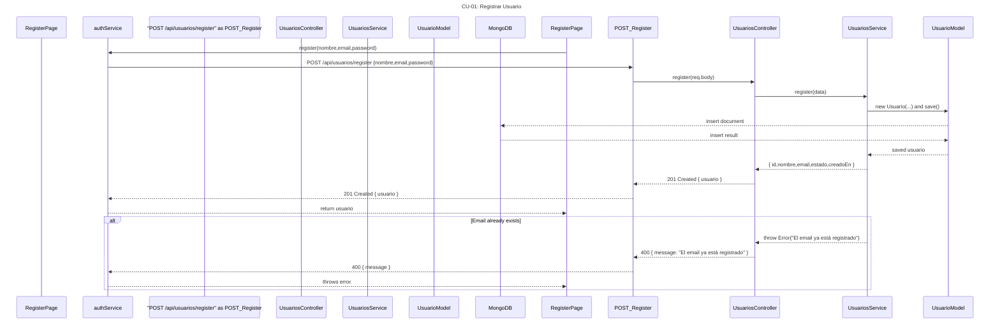
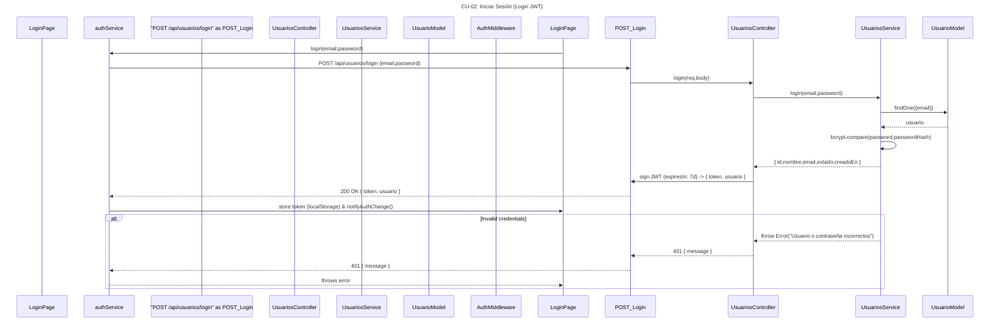
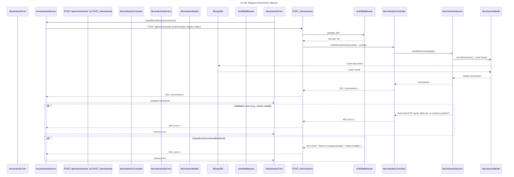
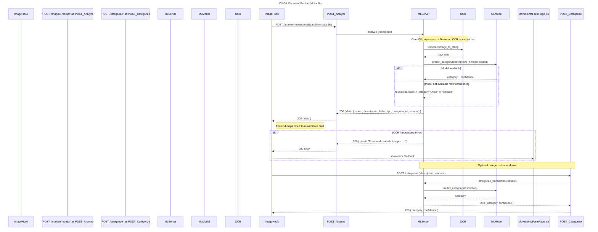
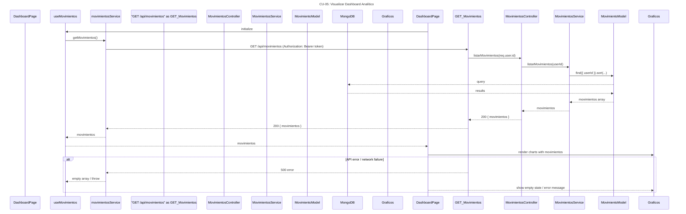
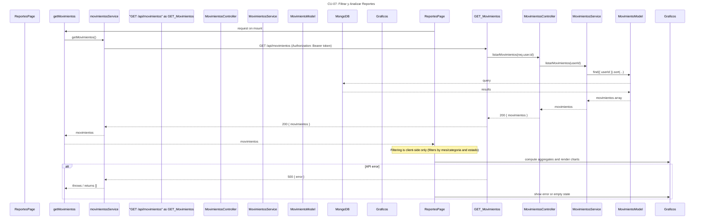
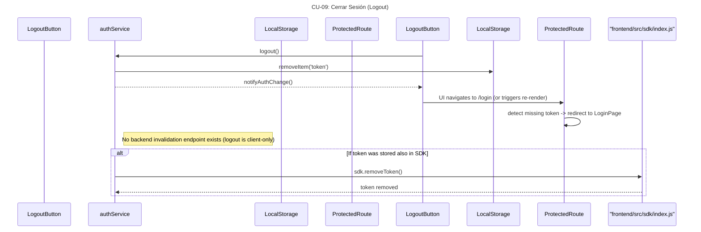
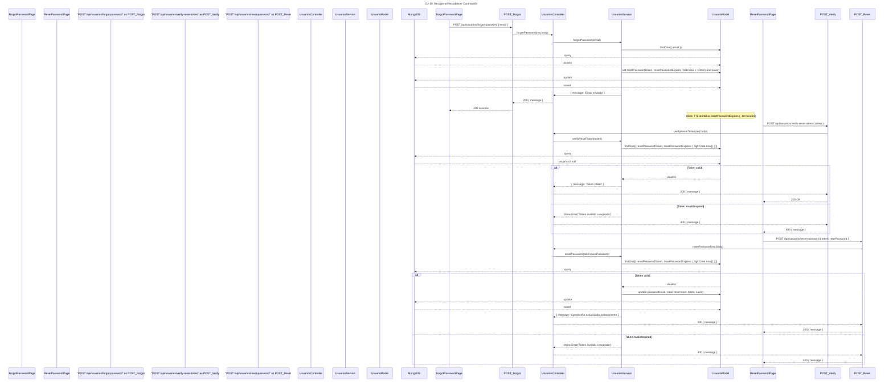
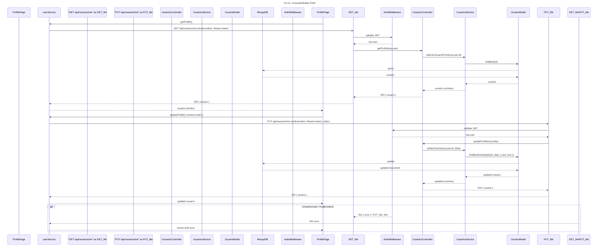
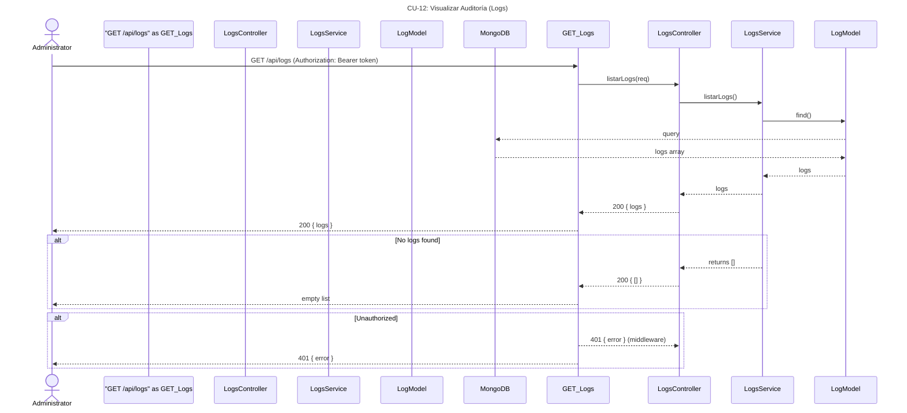

# Diagramas de Secuencia - Casos de Uso

**Fecha:** 20 de mayo de 2026

---

## CU-01: Registrar Usuario



---

## CU-02: Iniciar Sesión (Login JWT)



---

## CU-03: Registrar Movimiento Manual



---

## CU-04: Escanear Recibo (Motor IA)



---

## CU-05: Visualizar Dashboard Analítico



---

## CU-06: Inhabilitar Movimiento (Borrado Lógico)

```mermaid
sequenceDiagram
title CU-06: Inhabilitar Movimiento (Borrado Lógico)
participant ReportesPage
participant movimientosService
participant "PATCH /api/movimientos/:id/inhabilitar" as PATCH_Inhabilitar
participant "backend/middlewares/auth.js" as AuthMiddleware
participant "movimientos.controller.js" as MovimientosController
participant "movimientos.service.js" as MovimientosService
participant "movimiento.model.js" as MovimientoModel
participant MongoDB

ReportesPage ->> movimientosService: inhabilitarMovimiento(id)
movimientosService ->> PATCH_Inhabilitar: PATCH /api/movimientos/:id/inhabilitar (Authorization: Bearer token)
PATCH_Inhabilitar ->> AuthMiddleware: validate JWT
AuthMiddleware -->> PATCH_Inhabilitar: req.user
PATCH_Inhabilitar ->> MovimientosController: inhabilitarMovimiento(req.params.id)
MovimientosController ->> MovimientosService: inhabilitarMovimiento(id)
MovimientosService ->> MovimientoModel: findByIdAndUpdate(id, { estado: 'inactivo' }, { new: true })
MovimientoModel -->> MongoDB: update
MongoDB -->> MovimientoModel: updated document
MovimientoModel -->> MovimientosService: updated movimiento
MovimientosService -->> MovimientosController: movimiento
MovimientosController -->> PATCH_Inhabilitar: 200 { movimiento }
PATCH_Inhabilitar -->> movimientosService: 200 { movimiento }
movimientosService -->> ReportesPage: updated movimiento

alt Movimiento not found
  MovimientosService -->> MovimientosController: throw Error("Movimiento no encontrado")
  MovimientosController -->> PATCH_Inhabilitar: 400 { error }
  PATCH_Inhabilitar -->> movimientosService: 400 { error }
  movimientosService -->> ReportesPage: shows error
end

alt Unauthorized
  AuthMiddleware -->> PATCH_Inhabilitar: 401 { error }
  PATCH_Inhabilitar -->> movimientosService: 401 { error }
  movimientosService -->> ReportesPage: shows auth error
end
```

---

## CU-07: Filtrar y Analizar Reportes



---

## CU-08: Reentrenar Clasificador IA

```mermaid
sequenceDiagram
title CU-08: Reentrenar Clasificador IA
participant "train_model.py" as TrainScript
participant "POST /retrain" as POST_Retrain
participant "ml_backend/main.py" as MLServer
participant "modelo_clasificador.pkl" as MLModel
participant "joblib" as Joblib
participant "pandas" as Pandas

Note over POST_Retrain,MLServer: /retrain accepts JSON { data: [ { descripcion,categoria }, ... ] }
TrainScript ->> POST_Retrain: POST /retrain { data: [...] }
POST_Retrain ->> MLServer: retrain_model(payload)
Note over MLServer: Converts payload -> pd.DataFrame; fits TF-IDF + MultinomialNB pipeline
MLServer ->> Pandas: pd.DataFrame(...)
MLServer ->> MLServer: make_pipeline(...) and new_model.fit(...)
MLServer ->> Joblib: joblib.dump(new_model, modelo_clasificador.pkl)
Joblib -->> MLServer: file written
MLServer -->> POST_Retrain: 200 { status: "success", message }
POST_Retrain -->> TrainScript: 200 { status, message }

Note right of MLServer: /retrain is synchronous/blocking (training happens during request)

alt Training error (e.g., bad data)
  MLServer -->> POST_Retrain: 500 { detail: "Error al reentrenar: ..." }
  POST_Retrain -->> TrainScript: 500 error
end
```

---

## CU-09: Cerrar Sesión (Logout)



---

## CU-10: Recuperar/Restablecer Contraseña



---

## CU-11: Consultar/Editar Perfil



---

## CU-12: Visualizar Auditoría (Logs)



---

**Notas Generales:**

- Todos los diagramas incluyen los nombres reales de archivos del repositorio
- Las rutas de API reflejan los endpoints implementados en `backend/routes/`
- Los flujos de error (alt/else) muestran comportamientos excepcionales
- Los participantes corresponden a componentes, servicios y capas arquitectónicas reales
- Las invocaciones usan sintaxis compatible con Mermaid sequenceDiagram
