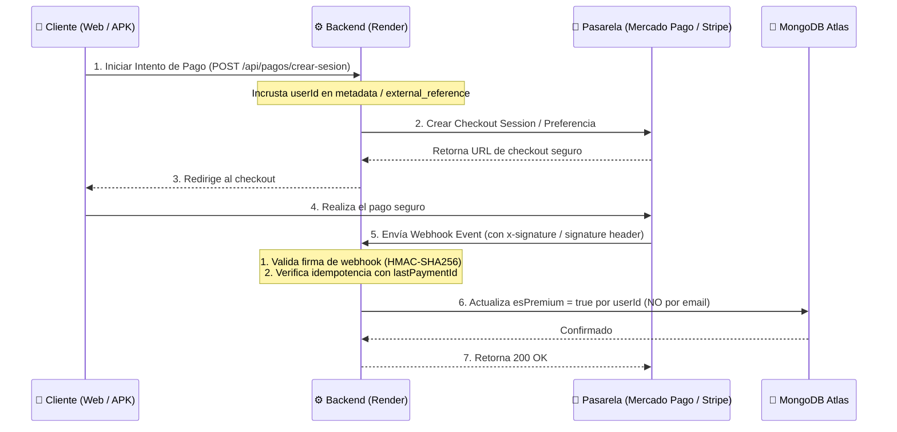

# 💳 Plan de Integración: Mercado Pago & Stripe (Producción Asegurada)

Este documento detalla la arquitectura, flujos de datos y cambios de código requeridos para conectar pasarelas de pago reales a **FinanceFlow**, incorporando validaciones de seguridad avanzadas, mapeo seguro por ID de usuario, prevención de duplicados (idempotencia) y cumplimiento de políticas de tiendas.

---

## 🗺️ Arquitectura de Flujo de Pago Seguro



---

## 🛠️ Configuración de Entorno (.env)

```env
# MERCADO PAGO CONFIG (PEN)
MERCADO_PAGO_PUBLIC_KEY=APP_USR-...
MERCADO_PAGO_ACCESS_TOKEN=APP_USR-...
MERCADO_PAGO_WEBHOOK_SECRET=tu_clave_secreta_webhook_mp

# STRIPE CONFIG (USD)
STRIPE_PUBLIC_KEY=pk_live_...
STRIPE_SECRET_KEY=sk_live_...
STRIPE_WEBHOOK_SECRET=whsec_...
```

---

## 📝 Especificación de Cambios por Componentes

### 1. Backend (`backend/`)

#### ⚙️ Endpoints de Checkout Seguro (`backend/routes/pagos.router.js`)
* **Modelo de Monetización Unificado:** Se establece como **Pago Único** (por ejemplo, acceso anual o de por vida) para mantener consistencia absoluta entre Stripe y Mercado Pago.
* **Mapeo Seguro por ID de Usuario:** Se utiliza el `userId` obtenido del token JWT (`req.user.id`) en lugar de depender del correo electrónico.

```javascript
const express = require('express');
const router = express.Router();
const crypto = require('crypto');
const stripe = require('stripe')(process.env.STRIPE_SECRET_KEY);
const { MercadoPagoConfig, Preference } = require('mercadopago');
const auth = require('../middlewares/auth');
const Usuario = require('../database/usuario.model');

const mpClient = new MercadoPagoConfig({ accessToken: process.env.MERCADO_PAGO_ACCESS_TOKEN });

// 1. Stripe Checkout Session (Pago Único / Unificado)
router.post("/crear-checkout-stripe", auth, async (req, res) => {
  try {
    const userId = req.user.id;
    const usuario = await Usuario.findById(userId);

    const session = await stripe.checkout.sessions.create({
      payment_method_types: ['card'],
      line_items: [{
        price_data: {
          currency: 'usd',
          product_data: { name: 'FinanceFlow Pro - Acceso Vitalicio' },
          unit_amount: 1990, // $19.90 USD
        },
        quantity: 1,
      }],
      mode: 'payment', // 'payment' para cobro único, NO 'subscription'
      success_url: `${process.env.FRONTEND_URL}/dashboard?payment=success`,
      cancel_url: `${process.env.FRONTEND_URL}/dashboard?payment=cancel`,
      customer_email: usuario.email,
      metadata: { userId }, // Mapeo seguro por ID
    });

    res.json({ success: true, url: session.url });
  } catch (err) {
    res.status(500).json({ success: false, error: err.message });
  }
});

// 2. Mercado Pago Preferencia (Pago Único)
router.post("/crear-preferencia-mp", auth, async (req, res) => {
  try {
    const userId = req.user.id;
    const preference = new Preference(mpClient);

    const result = await preference.create({
      body: {
        items: [{
          title: 'FinanceFlow Pro - Acceso Vitalicio',
          quantity: 1,
          unit_price: 19.90, // S/. 19.90 PEN
          currency_id: 'PEN'
        }],
        external_reference: userId, // Mapeo seguro por ID
        back_urls: {
          success: `${process.env.FRONTEND_URL}/dashboard`,
          failure: `${process.env.FRONTEND_URL}/dashboard`
        },
        notification_url: `${process.env.BACKEND_URL}/api/pagos/webhook-mercadopago`
      }
    });

    res.json({ success: true, url: result.init_point });
  } catch (err) {
    res.status(500).json({ success: false, error: err.message });
  }
});
```

#### 🛡️ Procesamiento Seguro e Idempotente de Webhooks
* **Validación de Firmas HMAC-SHA256:** Evita suplantaciones de pago.
* **Control de Idempotencia:** Utiliza un campo `lastPaymentId` en la colección de usuarios para evitar procesar eventos duplicados de la pasarela.

```javascript
// Webhook Mercado Pago con Verificación de Firma y Consulta Directa
router.post("/webhook-mercadopago", express.raw({ type: 'application/json' }), async (req, res) => {
  const xSignature = req.headers['x-signature'];
  const xRequestId = req.headers['x-request-id'];
  const { 'data.id': dataId } = req.query;

  if (!xSignature || !dataId) {
    return res.status(400).send('Firma ausente o incompleta');
  }

  // Extraer ts y v1 de la cabecera
  const parts = xSignature.split(',');
  const ts = parts.find(p => p.startsWith('ts='))?.split('=')[1];
  const v1 = parts.find(p => p.startsWith('v1='))?.split('=')[1];

  const manifest = `id:${dataId};request-id:${xRequestId};ts:${ts};`;
  const expectedSignature = crypto
    .createHmac('sha256', process.env.MERCADO_PAGO_WEBHOOK_SECRET)
    .update(manifest)
    .digest('hex');

  if (expectedSignature !== v1) {
    console.warn('⚠️ Intento de bypass detectado: Firma de Mercado Pago inválida');
    return res.status(401).send('Signature mismatch');
  }

  // Consulta directa a la API de MP para verificar el estado real (Previene inyección)
  const response = await fetch(`https://api.mercadopago.com/v1/payments/${dataId}`, {
    headers: { 'Authorization': `Bearer ${process.env.MERCADO_PAGO_ACCESS_TOKEN}` }
  });
  if (!response.ok) return res.status(500).send('Error consultando pago');
  
  const payment = await response.json();
  if (payment.status !== 'approved') {
    return res.json({ received: true });
  }

  const userId = payment.external_reference;
  const paymentId = payment.id.toString();

  // Buscar usuario y verificar que no se haya procesado el pago antes (Idempotencia)
  const usuario = await Usuario.findById(userId);
  if (usuario && usuario.lastPaymentId !== paymentId) {
    usuario.esPremium = true;
    usuario.planTipo = 'pro';
    usuario.lastPaymentId = paymentId;
    await usuario.save();
    console.log(`✅ Plan Pro activado de manera segura e idempotente para usuario: ${userId}`);
  }

  res.json({ received: true });
});

// Webhook Stripe con Verificación de Firma e Idempotencia
router.post("/webhook-stripe", express.raw({ type: 'application/json' }), async (req, res) => {
  const sig = req.headers['stripe-signature'];
  let event;

  try {
    event = stripe.webhooks.constructEvent(req.body, sig, process.env.STRIPE_WEBHOOK_SECRET);
  } catch (err) {
    return res.status(400).send(`Webhook Error: ${err.message}`);
  }

  if (event.type === 'checkout.session.completed') {
    const session = event.data.object;
    const userId = session.metadata.userId;
    const paymentId = session.id;

    const usuario = await Usuario.findById(userId);
    if (usuario && usuario.lastPaymentId !== paymentId) {
      usuario.esPremium = true;
      usuario.planTipo = 'pro';
      usuario.lastPaymentId = paymentId;
      await usuario.save();
    }
  }

  res.json({ received: true });
});
```

---

## 📱 Cumplimiento de Políticas de Tiendas (Google Play / App Store)

> [!WARNING]
> **Google Play Billing & App Store Guidelines:**
> Si FinanceFlow vende funciones digitales directamente dentro del APK (como el acceso premium Pro), las políticas de Google Play requieren usar **Google Play Billing** nativo en lugar de WebViews de Mercado Pago o Stripe.
> 
> **Mitigación Recomendada:**
> Para el APK en producción distribuido por tiendas:
> 1. Mostrar la pasarela de Mercado Pago / Stripe **exclusivamente en la plataforma Web**.
> 2. En la app móvil, indicar al usuario que puede adquirir su suscripción Pro ingresando a la versión web desde su ordenador, manteniendo sincronizado su plan en el APK automáticamente al iniciar sesión. Esto evita penalizaciones o rechazos de la tienda.
